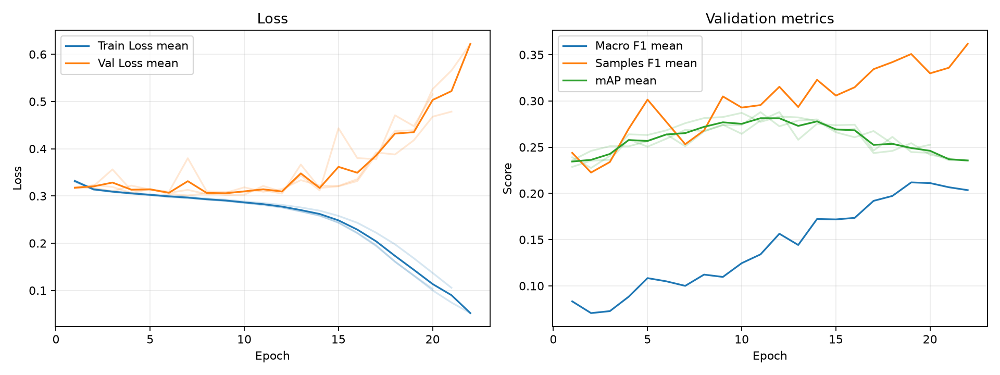

# Baseline 実験分析レポート

作成日: 2026-06-28

## 技術サマリ

この実験は、シリーズ単位で分割したアニメ作品 11,199 件を対象に、カバー画像だけから 19 ジャンルを予測するマルチラベル分類の基準モデルである。モデルは ImageNet 事前学習なしの ResNet18、損失は重みなし `BCEWithLogitsLoss`、主評価指標は validation mAP とした。test split はモデル選択に使用していない。

- **ランキング性能は単純ベースラインを明確に上回った。** 3 seed の validation mAP は **0.2876 ± 0.0005** で、train のジャンル出現率を全作品へ一律に出す単純ベースラインの 0.1269 より **+0.1607** 高い。seed 間の範囲は 0.2871–0.2880 であり、今回の条件では再現性も高い。
- **一方、0.5 固定しきい値でのラベル決定は保守的すぎる。** 正解は平均 2.411 ジャンル/作品だが、予測は平均 0.990 ジャンル/作品に留まる。Macro F1 は 0.1515、ジャンル平均 Recall は 0.1324、19 ジャンル中 5 ジャンルで F1 が 0 だった。
- **少数ジャンルの性能不足が支配的である。** validation support と AP の Spearman 相関は 0.854 であり、データ量の少ないジャンルほど順位付け性能も低い傾向が強い。重みなし BCE とデータ拡張なしの構成では、クラス不均衡を十分に扱えていない。
- **学習後半は過学習している。** mAP の best epoch は seed ごとに 10–12 だが、early stopping 時点の最終 mAP は best checkpoint より平均 0.0456、相対値で 15.8%低い。mAP 基準の checkpoint 保存は有効だが、正則化・データ拡張・事前学習の導入余地が大きい。

**判断:** このモデルは、画像を使う学習モデルの**実験用ベースラインとして採用**する。ただし、0.5 固定しきい値の分類器を実用モデルとして採用する段階ではない。次の比較実験では、まず ImageNet 事前学習とデータ拡張で mAP を改善し、その後に不均衡対策と validation 上のしきい値設計を分離して評価する。

## 1. 実験の目的と比較基準

目的は、カバー画像にジャンルを識別できる情報が含まれるかを、再現可能な最小構成で確認することである。主比較には `simple-baseline` を使う。この比較対象は train split のジャンル出現率を、すべての validation 作品に同じ予測スコアとして割り当てる。個々の画像を見ないため、画像モデルが学習すべき最低基準になる。

| 項目 | 定義 |
| --- | --- |
| 予測対象 | 1作品につき 19 ジャンルの有無 |
| 主評価 split | validation、1,121 件 |
| 主評価指標 | クラス別 AP の単純平均である mAP |
| 補助指標 | Macro F1、Samples F1、Hamming Loss、ジャンル別 AP / Precision / Recall / F1 |
| ラベル決定 | sigmoid 確率 0.5 以上を陽性 |
| seed | 42、43、44 |
| 比較対象 | `simple-baseline` の train prevalence |
| test の扱い | 最終モデル選定まで未使用 |

mAP は各ジャンル内で正例を上位に並べる能力を測り、0.5 というしきい値には依存しない。一方、F1 と Hamming Loss は 0.5 で二値化した結果である。このため、本レポートでは「スコアの順位付け性能」と「最終的なラベル選択性能」を分けて解釈する。

## 2. データセットと分割

### 2.1 データ規模

データは AniList の関連情報から作成した `SeriesGroup` 単位で train / validation / test に分割されている。同一シリーズの作品が複数 split に入らないため、続編や派生作品によるシリーズリークを抑えた評価である。分割時のリーク検査は `passed` である。

| split | 作品数 | 割合 | シリーズグループ数 | 平均正解ジャンル数/作品 |
| --- | ---: | ---: | ---: | ---: |
| train | 8,957 | 79.98% | 5,153 | 2.478 |
| validation | 1,121 | 10.01% | 617 | 2.411 |
| test | 1,121 | 10.01% | 677 | 2.459 |
| 合計 | 11,199 | 100% | 6,447 | - |

validation の全作品には少なくとも 1 個の正解ジャンルがある。したがって、Samples F1 が 0 になる作品は「正解ラベル自体がない」のではなく、モデルが正解を拾えていないか、何も予測していない作品である。

### 2.2 ジャンル不均衡

validation support は最多の `Comedy` 487 件から最少の `Thriller` 18 件まで **27.1 倍**の差がある。Macro F1 と mAP は各ジャンルを同じ重みで平均するため、この不均衡下では少数ジャンルの性能が全体値へ直接影響する。

| ジャンル | train | validation | test |
| --- | ---: | ---: | ---: |
| Comedy | 3,848 | 487 | 485 |
| Action | 2,452 | 305 | 326 |
| Fantasy | 2,107 | 274 | 271 |
| Drama | 1,689 | 222 | 203 |
| Slice of Life | 1,629 | 195 | 219 |
| Romance | 1,574 | 167 | 199 |
| Adventure | 1,530 | 175 | 173 |
| Sci-Fi | 1,414 | 157 | 188 |
| Hentai | 1,142 | 137 | 144 |
| Supernatural | 1,106 | 133 | 122 |
| Ecchi | 645 | 80 | 81 |
| Mystery | 591 | 70 | 57 |
| Mecha | 520 | 49 | 65 |
| Music | 479 | 58 | 45 |
| Sports | 437 | 61 | 53 |
| Psychological | 339 | 54 | 48 |
| Horror | 270 | 39 | 25 |
| Mahou Shoujo | 269 | 22 | 37 |
| Thriller | 156 | 18 | 15 |

## 3. モデルと学習方法

### 3.1 モデル仕様

| 項目 | 設定 |
| --- | --- |
| backbone | torchvision ResNet18 |
| 事前学習 | なし（`weights=None`） |
| 出力層 | 19 次元の線形層 |
| 入力 | RGB、224 × 224 |
| 正規化 | ImageNet mean / std |
| train augmentation | なし |
| 損失 | 重みなし `BCEWithLogitsLoss` |
| optimizer | Adam |
| learning rate | 1e-3 |
| batch size | 64 |
| 最大 epoch | 100 |
| scheduler / weight decay | なし / なし |

スクラッチ学習なのに ImageNet の mean / std を使用している点は、直ちに誤りではないが最適性は未検証である。また、画像のリサイズ以外にランダム変換がないため、train 画像を記憶しやすい構成になっている。

### 3.2 checkpoint と early stopping

validation mAP がそれまでの best より `min_delta=0.001` を超えて改善したときに checkpoint を保存する。10 epoch 改善しなければ停止する。実験比較に使う分析値は、各 seed の best checkpoint を再読込して validation 全件を推論した結果である。

| seed | best epoch | best mAP | 実行 epoch 数 | 最終 epoch mAP | best からの低下 |
| ---: | ---: | ---: | ---: | ---: | ---: |
| 42 | 10 | 0.2871 | 20 | 0.2526 | -0.0345 |
| 43 | 12 | 0.2880 | 22 | 0.2356 | -0.0524 |
| 44 | 11 | 0.2879 | 21 | 0.2380 | -0.0499 |

## 4. 主結果: mAP は安定して単純基準を上回る

### 4.1 全体指標

| 手法 | validation mAP | Macro F1 | Samples F1 | Hamming Loss | 予測ジャンル数/作品 |
| --- | ---: | ---: | ---: | ---: | ---: |
| ResNet18、0.5固定（3 seed平均） | **0.2876 ± 0.0005** | 0.1515 ± 0.0209 | 0.3237 ± 0.0212 | **0.1209 ± 0.0001** | 0.990 ± 0.128 |
| train prevalence | 0.1269 | 0.0000 | 0.0000 | 0.1269 | 0.000 |

ResNet18 の mAP は単純基準より 0.1607 高く、約 2.27 倍である。3 seed の標準偏差 0.0005 に対して改善幅は十分大きく、少なくとも今回の seed 変動では説明できない。画像を使うことで、正例を相対的に上位へ並べる情報を学習できたと判断できる。

Hamming Loss も 0.0060 改善したが、この差は強い根拠として扱わない。ラベルの大半が陰性であるため、`train prevalence` のように何も陽性予測しない手法でも Hamming Loss は低く見えるからである。

### 4.2 seed 間の安定性

| seed | mAP | Macro F1 | Samples F1 | Hamming Loss | 予測ジャンル数/作品 |
| ---: | ---: | ---: | ---: | ---: | ---: |
| 42 | 0.2871 | 0.1534 | 0.3131 | 0.1209 | 0.966 |
| 43 | 0.2880 | 0.1714 | 0.3480 | 0.1210 | 1.128 |
| 44 | 0.2879 | 0.1297 | 0.3099 | 0.1209 | 0.877 |

mAP は安定している一方、Macro F1 と予測ジャンル数は比較的大きく変動した。これは順位付け自体よりも、出力確率が 0.5 を超えるかどうかが seed に敏感であることを示す。したがって、次のモデル比較では mAP を主指標のまま維持し、しきい値依存指標は別軸で扱うべきである。

## 5. 学習曲線: epoch 10–12 以降で過学習

3 seed の個別曲線を薄線、同じ epoch に到達した seed の平均を濃線で示す。seed ごとに early stopping の終了 epoch が異なるため、後半の平均は全3 seedの平均ではない点に注意が必要である。



train loss は継続して低下する一方、validation loss は概ね epoch 10 前後から上昇し、mAP も 10–12 付近の最大値から低下する。3 seed の最終 epoch では、best checkpoint に比べて mAP が平均 0.0456（15.8%）低い。これはスクラッチ学習、データ拡張なし、weight decay なしという構成と整合する過学習パターンである。ただし、各要因の寄与はこの実験単独では分離できない。

## 6. ジャンル別分析: 頻出クラスに性能が集中

| ジャンル | support | 陽性予測数 | Precision | Recall | F1 | AP |
| --- | ---: | ---: | ---: | ---: | ---: | ---: |
| Hentai | 137 | 168.0 | 0.6687 | 0.7956 | **0.7186** | **0.8246** |
| Comedy | 487 | 381.0 | 0.6525 | 0.5086 | 0.5686 | 0.6652 |
| Action | 305 | 279.0 | 0.5367 | 0.4896 | 0.5095 | 0.5237 |
| Fantasy | 274 | 34.3 | 0.5934 | 0.0681 | 0.1141 | 0.4174 |
| Slice of Life | 195 | 57.3 | 0.4682 | 0.1299 | 0.1974 | 0.3495 |
| Adventure | 175 | 74.0 | 0.4437 | 0.1695 | 0.2238 | 0.3206 |
| Drama | 222 | 12.7 | 0.4595 | 0.0225 | 0.0390 | 0.3132 |
| Sci-Fi | 157 | 31.0 | 0.3638 | 0.0722 | 0.1196 | 0.2914 |
| Mecha | 49 | 12.0 | 0.6146 | 0.0952 | 0.1298 | 0.2793 |
| Romance | 167 | 42.7 | 0.3743 | 0.0858 | 0.1289 | 0.2726 |
| Sports | 61 | 5.7 | 0.2333 | 0.0219 | 0.0369 | 0.1920 |
| Ecchi | 80 | 5.7 | 0.1778 | 0.0208 | 0.0368 | 0.1732 |
| Music | 58 | 0.3 | 0.3333 | 0.0057 | 0.0113 | 0.1729 |
| Supernatural | 133 | 0.7 | 0.0000 | 0.0000 | 0.0000 | 0.1609 |
| Mystery | 70 | 0.0 | 0.0000 | 0.0000 | 0.0000 | 0.1428 |
| Psychological | 54 | 0.0 | 0.0000 | 0.0000 | 0.0000 | 0.1349 |
| Horror | 39 | 0.0 | 0.0000 | 0.0000 | 0.0000 | 0.1250 |
| Mahou Shoujo | 22 | 6.0 | 0.0833 | 0.0303 | 0.0434 | 0.0694 |
| Thriller | 18 | 0.0 | 0.0000 | 0.0000 | 0.0000 | 0.0368 |

値は3 seedの平均であり、`陽性予測数` が小数になるのは seed 間平均のためである。

### 6.1 0.5 しきい値は Recall を強く抑えている

正解ラベルは平均 2.411 個/作品あるのに対し、陽性予測は 0.990 個/作品で、正解数の 41.1%に相当する。ジャンル平均 Recall は 0.1324、中央値は 0.0303 であり、全体として見逃しが多い。`Mystery`、`Psychological`、`Horror`、`Thriller` は全 seed で陽性予測が 0 件、`Supernatural` も平均 0.7 件を予測したが正解できず、計 5 ジャンルで F1 が 0 だった。

一方、これらのうち `Mystery`、`Psychological`、`Horror`、`Supernatural` は AP が 0 より明確に高い。完全に情報がないとは限らず、確率順位には弱い信号があるが 0.5 を超えるほど校正されていない可能性がある。ジャンル別しきい値は F1 を改善しうるが、同じ validation データでしきい値を選んで性能を報告すると過大評価になるため、比較方法を事前に固定する必要がある。

### 6.2 データ量と AP の関係が強い

validation support と AP の相関は Pearson 0.723、Spearman 0.854 である。因果関係を証明する値ではないが、「件数の多いジャンルほど高い AP を得る」という単調な傾向が強い。特に support 18–80 件の少数ジャンルの多くが AP 0.20 未満に集中しているため、クラス不均衡対策は次の実験で直接検証すべき仮説である。

`Hentai` は support 137 件でも AP 0.8246 と突出しており、件数だけでは説明できない。画像上の視覚特徴が他ジャンルより識別しやすい、またはデータ分布が異なる可能性がある。逆に `Drama` は support 222 件でも AP 0.3132、F1 0.0390 であり、抽象的なジャンルほどカバー画像だけでは識別しにくい可能性がある。

## 7. この結果から言えること・言えないこと

### 言えること

- シリーズリークを避けた validation split 上で、ResNet18 はジャンル頻度だけの基準より高いランキング性能を示した。
- 3 seed の mAP 差は小さく、今回の学習設定における基準値として再利用できる。
- 0.5 固定しきい値では、予測ラベル数と Recall が不足している。
- 学習後半では train と validation の挙動が乖離し、best checkpoint の利用が必要である。

### 言えないこと

- test split を評価していないため、最終的な汎化性能はまだ確定していない。
- 単一の構成しか比較していないため、過学習や少数ジャンル性能の原因を、事前学習・拡張・損失関数など個別要因へ帰属できない。
- validation 1 split と 3 seed の結果であり、データ分割そのものを変えた場合の不確実性は測っていない。
- AP と support の相関は、データ量を増やせば必ず同じだけ改善するという因果効果を意味しない。

## 8. 制約と再現上の注意

- seed は Python と PyTorch に設定しているが、完全な決定論を強制していない。ハードウェアや PyTorch バージョンが変わると厳密一致しない可能性がある。
- 実行環境は MPS だった。`torch.compile` は MPS では無効化されるため、設定値が `true` でもこの実行では使用されていない。
- DataLoader の `num_workers=0`、ローカル画像キャッシュ利用である。キャッシュに画像がない場合はネットワーク取得が発生する実装になっている。
- 画像は縦横比を維持せず 224 × 224 にリサイズする。歪みが性能へ与える影響は未検証である。
- early stopping の集計曲線は、終了した seed が後半 epoch の平均から除外される。後半の平均曲線を同一 cohort の時系列として解釈してはいけない。
- `simple-baseline` は全作品に同じスコアを出すため、mAP は実質的にジャンル prevalence の平均である。強い学習済みモデルとの比較ではなく、「画像を使う意味があるか」の最低基準である。

## 9. 推奨する次の実験

優先順位は、主指標 mAP の改善と原因切り分けを先に行い、しきい値最適化を後段へ分離する。

1. **ImageNet 事前学習 + train augmentation を検証する。** `weights=ResNet18_Weights.DEFAULT`、`RandomResizedCrop`、`HorizontalFlip` を導入し、現 baseline と同じ3 seed・validation mAPで比較する。最も直接的に特徴学習と過学習を改善できる候補である。
2. **正則化を独立に比較する。** AdamW + weight decay、learning-rate scheduler を追加し、best epoch 後の mAP 低下と validation loss の乖離が縮小するか確認する。
3. **不均衡対策を比較する。** `pos_weight` 付き BCE、focal loss、class-balanced loss のいずれかを一度に1要因ずつ追加し、mAPだけでなく少数ジャンル AP と Macro F1 を確認する。
4. **ラベル決定戦略を別実験として評価する。** 0.5固定、ジャンル別しきい値、top-k、予測ラベル数制約を比較する。しきい値は validation 内で tuning/evaluation を分けるか、nested cross-validation 相当の手順を使い、同一データへの過適合を避ける。
5. **採用候補を確定してから test を一度だけ評価する。** validation でモデル構成としきい値方針を固定した後、3 seed の checkpoint を test split で評価し、最終値を報告する。

## 10. 追加で確認すべき問い

- `Hentai` の高 AP は画像特徴によるものか、画像ソースや前処理に由来するデータ上の手掛かりによるものか。
- `Drama` や `Supernatural` のような抽象ジャンルは、画像単独でどこまで予測可能か。タイトル・概要などのテキストを加えたマルチモーダルモデルが必要か。
- 少数ジャンルの AP は、損失重み付けと追加データのどちらに強く反応するか。
- validation の確率分布は seed 間でどの程度校正が異なるか。mAP が同じでも 0.5 超えの件数が変わる原因は何か。

## 11. 再現方法と成果物

```bash
uv run python experiments/baseline/run_exp.py
uv run python experiments/baseline/analyze.py
```

`make_report.py` は既定で自動生成テンプレートを `README.md` に書き出すため、実行すると本レポートを上書きする。自動レポートも必要な場合は、`uv run python experiments/baseline/make_report.py --output experiments/baseline/report_auto.md` のように出力先を分けること。

| ファイル | 内容 |
| --- | --- |
| `experiments/baseline/config.yaml` | seed、学習設定、比較対象 |
| `experiments/baseline/run_exp.py` | データ読込、前処理、学習、early stopping |
| `experiments/baseline/model.py` | ResNet18 モデル定義 |
| `experiments/baseline/outputs/seed_*/metrics.csv` | epoch ごとの学習ログ |
| `experiments/baseline/analysis/analysis_summary.json` | 集計結果と分析条件 |
| `experiments/baseline/analysis/overall_model_metrics.csv` | 3 seed の全体指標 |
| `experiments/baseline/analysis/seed_overall_model_metrics.csv` | seed 別の全体指標 |
| `experiments/baseline/analysis/genre_metrics_validation_threshold_0.5.csv` | ジャンル別3 seed集計 |
| `experiments/baseline/analysis/learning_curves.png` | 3 seed の学習曲線 |
| `data/series_split_outputs/split_summary.json` | 分割規模、ジャンル数、リーク検査結果 |
| `experiments/simple-baseline/analysis/overall_model_metrics.csv` | 単純ベースライン結果 |

数値は上記保存済み成果物から再集計した。追加集計として、split 別の平均正解ラベル数、support と AP/F1 の Pearson・Spearman 相関、best epoch と最終 epoch の差を算出した。レポート中の `±` は3 seed間の標本標準偏差であり、母平均の信頼区間ではない。
