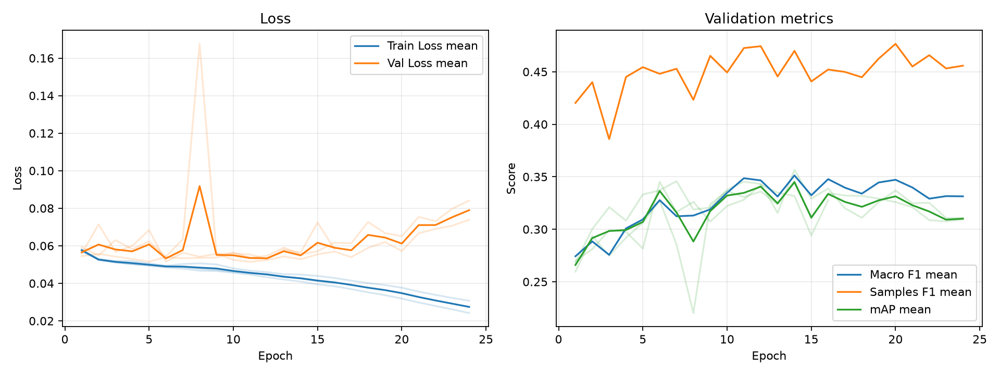

# 実験レポート: exp_asl

作成日: 2026-07-02

## 1. 共有用サマリ

### 1.1 この実験の位置づけ

- 何を改善しようとしたか: TODO
- ベースラインまたは直前実験から変えたこと: TODO
- 主評価指標 mAP の結果をどう判断するか: TODO
- 何がダメだったか / まだ残っている問題: TODO

### 1.2 自動要約

- 主評価指標の validation mAP は 0.3493 です（標準比較: validation split, 0.5 固定しきい値）。
- 補助指標は Macro F1=0.3495, Samples F1=0.4779, Hamming Loss=0.2085 です。
- 閾値最適化は行っていません。実験比較の主指標は、閾値に依存しない validation mAP です。
- この実験の validation mAP は 0.3493 です。
- 主比較 `exp_bce` の validation mAP は 0.3500 で、今回との差は -0.0007 です。
- 同じ実験グループで 3 件の seed 結果を集計しました。
- validation mAP は平均 0.3493、標準偏差 0.0063 です。

### 1.3 採用判断

- 採用判断: TODO（採用 / 条件付き採用 / 不採用 / 保留）
- 判断理由: TODO
- 次に試すこと: TODO

## 2. 他実験との比較

`config.yaml` で明示した主比較と参考実験だけを、validation mAP を中心に比較します。test split は最終モデル選定後まで使いません。

| 実験 | 役割 | method | validation mAP | mAP 標準偏差 | 今回との差 | Macro F1 | Samples F1 | Hamming Loss | 予測ジャンル数/作品 |
| --- | --- | --- | --- | --- | --- | --- | --- | --- | --- |
| exp_asl | 今回 | 0.5 固定 | 0.3493 | 0.0063 | - | 0.3495 | 0.4779 | 0.2085 | 4.8472 |
| exp_bce | 主比較 | 0.5 固定 | 0.3500 | 0.0035 | -0.0007 | 0.2458 | 0.4156 | 0.1193 | 1.4686 |
| baseline | 参考 | 0.5 固定 | 0.2876 | 0.0005 | +0.0617 | 0.1515 | 0.3237 | 0.1209 | 0.9905 |

### 2.1 複数 seed 集計

seed 集計グループ: `exp_asl`

| 指標 | runs | 平均 | 標準偏差 | 最小 | 最大 |
| --- | --- | --- | --- | --- | --- |
| validation mAP | 3 | 0.3493 | 0.0063 | 0.3452 | 0.3566 |
| Macro F1 | 3 | 0.3495 | 0.0097 | 0.3400 | 0.3595 |
| Samples F1 | 3 | 0.4779 | 0.0030 | 0.4750 | 0.4809 |
| Hamming Loss | 3 | 0.2085 | 0.0098 | 0.1977 | 0.2170 |
| 予測ジャンル数/作品 | 3 | 4.8472 | 0.2774 | 4.5281 | 5.0312 |

#### seed 別結果

| 実験 | seed | best epoch | epochs ran | early stopped | validation mAP | Macro F1 | Samples F1 | Hamming Loss | 予測ジャンル数/作品 |
| --- | --- | --- | --- | --- | --- | --- | --- | --- | --- |
| exp_asl | 42 | 14 | 24 | True | 0.3462 | 0.3595 | 0.4750 | 0.2170 | 5.0312 |
| exp_asl | 43 | 14 | 24 | True | 0.3566 | 0.3489 | 0.4778 | 0.1977 | 4.5281 |
| exp_asl | 44 | 6 | 16 | True | 0.3452 | 0.3400 | 0.4809 | 0.2108 | 4.9822 |

## 3. 実験の目的と変更

### 3.1 背景

TODO: ベースラインまたは前回実験にどの問題があったかを書く。

### 3.2 仮説

TODO: なぜ今回の変更で mAP が改善すると考えたかを書く。

### 3.3 検証した変更

| 種類 | 内容 | mAP 改善につながると考えた理由 |
|---|---|---|
| モデル / loss / augmentation / threshold など | TODO | TODO |

### 3.4 比較条件

- 主比較: `exp_bce`
- 参考実験: `baseline`
- 変えたもの: TODO
- 変えていないもの: TODO
- 主評価指標: validation mAP
- 補助指標: Macro F1, Samples F1, Hamming Loss, ジャンル別 AP/F1
- test split: 最終モデル選定後まで使用しない

### 3.5 主な設定

| 項目 | 値 |
| --- | --- |
| seed | 42 |
| seeds | 42, 43, 44 |
| device | auto |
| comparison | {"primary": "exp_bce", "references": ["baseline"]} |
| epochs | 50 |
| early_stopping | {"enabled": true, "monitor": "mAP", "mode": "max", "patience": 10, "min_delta": 0.001, "min_epochs": 10} |
| batch_size | 64 |
| learning_rate | 0.0010 |
| num_workers | 4 |
| image_size | 224 |
| compile | True |
| max_train_samples |  |
| max_val_samples |  |
| output_dir | outputs |
| best_model_name | best_model.pth |
| metrics_name | metrics.csv |

### 3.6 再現コマンド

```bash
uv run python experiments/exp_asl/run_exp.py
uv run python experiments/exp_asl/analyze.py
uv run python experiments/exp_asl/make_report.py
```

## 4. 学習ログ

### 4.1 代表 epoch

| seed | 観点 | Epoch | Train Loss | Val Loss | Macro F1 | Samples F1 | Hamming Loss | mAP |
| --- | --- | --- | --- | --- | --- | --- | --- | --- |
| 42 | 最終 | 24 | 0.0307 | 0.0739 | 0.3233 | 0.4631 | 0.2022 | 0.3094 |
| 42 | Val Loss 最小 | 11 | 0.0468 | 0.0515 | 0.3491 | 0.4720 | 0.2288 | 0.3306 |
| 42 | mAP 最大 | 14 | 0.0447 | 0.0528 | 0.3595 | 0.4750 | 0.2170 | 0.3462 |
| 42 | Macro F1 最大 | 14 | 0.0447 | 0.0528 | 0.3595 | 0.4750 | 0.2170 | 0.3462 |
| 42 | Samples F1 最大 | 12 | 0.0460 | 0.0524 | 0.3434 | 0.4917 | 0.2048 | 0.3360 |
| 43 | 最終 | 24 | 0.0242 | 0.0841 | 0.3394 | 0.4485 | 0.2048 | 0.3107 |
| 43 | Val Loss 最小 | 5 | 0.0494 | 0.0516 | 0.3517 | 0.4831 | 0.2059 | 0.3331 |
| 43 | mAP 最大 | 14 | 0.0410 | 0.0555 | 0.3489 | 0.4778 | 0.1977 | 0.3566 |
| 43 | Macro F1 最大 | 20 | 0.0319 | 0.0651 | 0.3601 | 0.4870 | 0.1960 | 0.3369 |
| 43 | Samples F1 最大 | 7 | 0.0479 | 0.0534 | 0.3468 | 0.4933 | 0.1796 | 0.3458 |
| 44 | 最終 | 16 | 0.0402 | 0.0583 | 0.3446 | 0.4446 | 0.2390 | 0.3277 |
| 44 | Val Loss 最小 | 6 | 0.0492 | 0.0515 | 0.3400 | 0.4809 | 0.2108 | 0.3452 |
| 44 | mAP 最大 | 6 | 0.0492 | 0.0515 | 0.3400 | 0.4809 | 0.2108 | 0.3452 |
| 44 | Macro F1 最大 | 11 | 0.0454 | 0.0554 | 0.3479 | 0.4673 | 0.2075 | 0.3282 |
| 44 | Samples F1 最大 | 6 | 0.0492 | 0.0515 | 0.3400 | 0.4809 | 0.2108 | 0.3452 |

### 4.2 学習曲線



### 4.3 読み取りメモ

- Train Loss と Val Loss の差が開く場合は、過学習を疑う。
- 主評価指標は mAP。mAP 最大 epoch と最終 epoch の差を見る。
- F1 はしきい値で 0/1 にした後の補助指標。mAP が改善していても F1 が悪い場合は threshold 設計を疑う。
- Hamming Loss は低いほど良いが、何も予測しないモデルでも低く見える場合がある。

## 5. 全体評価

| split | method | Macro F1 | macro_f1_std | Samples F1 | samples_f1_std | Hamming Loss | hamming_loss_std | mAP | mAP_std | 予測ジャンル数/作品 | predicted_labels_per_item_std |
| --- | --- | --- | --- | --- | --- | --- | --- | --- | --- | --- | --- |
| validation | 0.5 固定 | 0.3495 | 0.0097 | 0.4779 | 0.0030 | 0.2085 | 0.0098 | 0.3493 | 0.0063 | 4.8472 | 0.2774 |

### 5.1 mAP 中心の読み取り

- validation mAP が比較対象より上がったか: TODO
- validation mAP の改善幅は、偶然や seed 差より十分大きそうか: TODO
- mAP は上がったが補助指標が悪化した場合、その悪化を許容できるか: TODO

## 6. ジャンル別結果

### 6.1 主比較 `exp_bce` とのジャンル別 AP 差分

| genre | 件数 | 比較AP | 現AP | AP差分 | 比較F1 | 現F1 | F1差分 | 比較Recall | 現Recall | Recall差分 | 比較Precision | 現Precision | Precision差分 |
| --- | --- | --- | --- | --- | --- | --- | --- | --- | --- | --- | --- | --- | --- |
| Mecha | 49 | 0.4437 | 0.4826 | 0.0389 | 0.2667 | 0.4013 | 0.1346 | 0.1837 | 0.5714 | 0.3878 | 0.5833 | 0.4050 | -0.1784 |
| Romance | 167 | 0.3308 | 0.3679 | 0.0371 | 0.3022 | 0.3569 | 0.0547 | 0.3054 | 0.6986 | 0.3932 | 0.3609 | 0.2428 | -0.1181 |
| Ecchi | 80 | 0.1735 | 0.2049 | 0.0315 | 0.1262 | 0.2544 | 0.1282 | 0.1458 | 0.4583 | 0.3125 | 0.2324 | 0.1828 | -0.0496 |
| Mystery | 70 | 0.1491 | 0.1792 | 0.0301 | 0 | 0.2464 | 0.2464 | 0 | 0.3810 | 0.3810 | 0 | 0.2034 | 0.2034 |
| Slice of Life | 195 | 0.3922 | 0.4134 | 0.0212 | 0.2278 | 0.4282 | 0.2004 | 0.1692 | 0.7658 | 0.5966 | 0.4467 | 0.3005 | -0.1462 |
| Horror | 39 | 0.1648 | 0.1801 | 0.0153 | 0.0839 | 0.1888 | 0.1049 | 0.0513 | 0.2479 | 0.1966 | 0.2778 | 0.1686 | -0.1091 |
| Sci-Fi | 157 | 0.3439 | 0.3578 | 0.0139 | 0.1840 | 0.3772 | 0.1931 | 0.1104 | 0.6900 | 0.5796 | 0.5788 | 0.2662 | -0.3126 |
| Hentai | 137 | 0.9182 | 0.9277 | 0.0095 | 0.8161 | 0.7251 | -0.0910 | 0.8881 | 0.9489 | 0.0608 | 0.7590 | 0.5910 | -0.1680 |
| Drama | 222 | 0.3435 | 0.3524 | 0.0089 | 0.1914 | 0.4154 | 0.2240 | 0.1306 | 0.6562 | 0.5255 | 0.3808 | 0.3268 | -0.0539 |
| Comedy | 487 | 0.7170 | 0.7219 | 0.0049 | 0.6361 | 0.6820 | 0.0459 | 0.5907 | 0.9172 | 0.3265 | 0.6991 | 0.5437 | -0.1554 |
| Adventure | 175 | 0.3453 | 0.3499 | 0.0047 | 0.2993 | 0.3949 | 0.0955 | 0.2724 | 0.5581 | 0.2857 | 0.3773 | 0.3072 | -0.0701 |
| Supernatural | 133 | 0.2089 | 0.2129 | 0.0039 | 0.0611 | 0.2801 | 0.2191 | 0.0351 | 0.4486 | 0.4135 | 0.6000 | 0.2075 | -0.3925 |
| Psychological | 54 | 0.1573 | 0.1369 | -0.0204 | 0 | 0.1828 | 0.1828 | 0 | 0.2037 | 0.2037 | 0 | 0.1782 | 0.1782 |
| Action | 305 | 0.6029 | 0.5804 | -0.0225 | 0.5787 | 0.6030 | 0.0244 | 0.5923 | 0.7913 | 0.1989 | 0.5690 | 0.4886 | -0.0805 |
| Music | 58 | 0.2621 | 0.2389 | -0.0232 | 0.0970 | 0.2566 | 0.1596 | 0.0517 | 0.4080 | 0.3563 | 1 | 0.1950 | -0.8050 |
| Thriller | 18 | 0.1038 | 0.0750 | -0.0288 | 0 | 0.0908 | 0.0908 | 0 | 0.1296 | 0.1296 | 0 | 0.0750 | 0.0750 |
| Mahou Shoujo | 22 | 0.0832 | 0.0533 | -0.0299 | 0.0238 | 0.0167 | -0.0071 | 0.0152 | 0.0152 | 0 | 0.0556 | 0.0185 | -0.0370 |
| Fantasy | 274 | 0.5163 | 0.4816 | -0.0347 | 0.4099 | 0.4745 | 0.0646 | 0.3236 | 0.7117 | 0.3881 | 0.5704 | 0.3592 | -0.2112 |
| Sports | 61 | 0.3937 | 0.3207 | -0.0730 | 0.3652 | 0.2649 | -0.1003 | 0.2732 | 0.3169 | 0.0437 | 0.6211 | 0.4420 | -0.1791 |

### 6.2 AP が高いジャンル

| genre | 件数 | 陽性予測数 | Precision | Recall | F1 | AP |
| --- | --- | --- | --- | --- | --- | --- |
| Hentai | 137 | 223 | 0.5910 | 0.9489 | 0.7251 | 0.9277 |
| Comedy | 487 | 823 | 0.5437 | 0.9172 | 0.6820 | 0.7219 |
| Action | 305 | 496 | 0.4886 | 0.7913 | 0.6030 | 0.5804 |
| Mecha | 49 | 113.667 | 0.4050 | 0.5714 | 0.4013 | 0.4826 |
| Fantasy | 274 | 548 | 0.3592 | 0.7117 | 0.4745 | 0.4816 |
| Slice of Life | 195 | 506.333 | 0.3005 | 0.7658 | 0.4282 | 0.4134 |
| Romance | 167 | 493 | 0.2428 | 0.6986 | 0.3569 | 0.3679 |
| Sci-Fi | 157 | 423 | 0.2662 | 0.6900 | 0.3772 | 0.3578 |

### 6.3 F1 が低いジャンル

| genre | 件数 | 陽性予測数 | Precision | Recall | F1 | AP |
| --- | --- | --- | --- | --- | --- | --- |
| Mahou Shoujo | 22 | 15 | 0.0185 | 0.0152 | 0.0167 | 0.0533 |
| Thriller | 18 | 37.3333 | 0.0750 | 0.1296 | 0.0908 | 0.0750 |
| Psychological | 54 | 64.3333 | 0.1782 | 0.2037 | 0.1828 | 0.1369 |
| Horror | 39 | 67 | 0.1686 | 0.2479 | 0.1888 | 0.1801 |
| Mystery | 70 | 137.667 | 0.2034 | 0.3810 | 0.2464 | 0.1792 |
| Ecchi | 80 | 210.333 | 0.1828 | 0.4583 | 0.2544 | 0.2049 |
| Music | 58 | 128 | 0.1950 | 0.4080 | 0.2566 | 0.2389 |
| Sports | 61 | 65 | 0.4420 | 0.3169 | 0.2649 | 0.3207 |

### 6.4 考察の観点

- AP が高いジャンルは、モデルが順位付けできているジャンル。mAP 改善に寄与している可能性が高い。
- AP が低いジャンルは、特徴量・データ量・ラベルの曖昧さなどを疑う。
- AP は高いのに F1 が低いジャンルは、しきい値調整で改善する可能性がある。
- Precision が低いジャンルは、関係ない作品にもそのジャンルを付けすぎている。
- Recall が低いジャンルは、本当はそのジャンルの作品を見逃している。
- 件数が少ないジャンルは、少数の正解/不正解で指標が大きく動く。

## 7. 人が書く考察

### 7.1 何を改善しようとして、改善できたか

TODO

### 7.2 何がダメだったか / 想定と違ったか

TODO

### 7.3 原因仮説

| 仮説ID | 観察した結果 | 原因仮説 | 次の確認方法 |
|---|---|---|---|
| H1 | TODO | TODO | TODO |
| H2 | TODO | TODO | TODO |

### 7.4 他メンバーに共有したい注意点

TODO

### 7.5 次に試すこと

TODO

## 8. 生成元ファイル

| ファイル | 用途 |
| --- | --- |
| experiments/exp_asl/config.yaml | 実験設定 |
| experiments/exp_asl/outputs/seed_42/metrics.csv | epoch ごとの学習ログ (seed=42) |
| experiments/exp_asl/outputs/seed_43/metrics.csv | epoch ごとの学習ログ (seed=43) |
| experiments/exp_asl/outputs/seed_44/metrics.csv | epoch ごとの学習ログ (seed=44) |
| experiments/exp_asl/analysis/overall_model_metrics.csv | validation の全体指標 |
| experiments/exp_asl/analysis/genre_metrics_validation_threshold_0.5.csv | validation のジャンル別指標 |

### 8.1 analysis ディレクトリ内のファイル

- `analysis_summary.json`
- `genre_metrics_validation_threshold_0.5.csv`
- `learning_curves.png`
- `learning_curves.svg`
- `overall_model_metrics.csv`
- `seed_genre_metrics_validation_threshold_0.5.csv`
- `seed_overall_model_metrics.csv`
