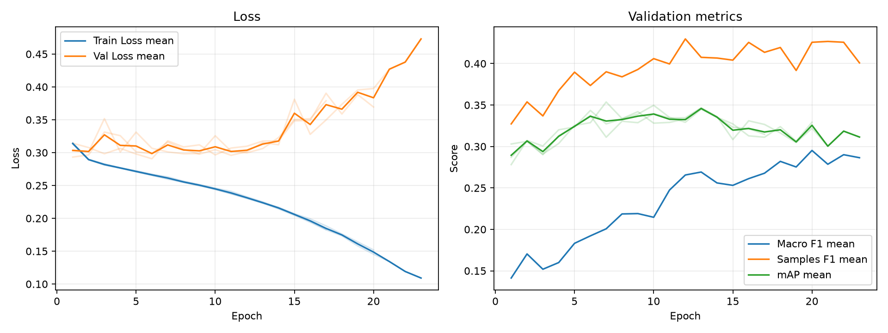

# 実験レポート: exp_bce

作成日: 2026-06-29

## 1. 共有用サマリ

### 1.1 この実験の位置づけ

- 何を改善しようとしたか: TODO
- ベースラインまたは直前実験から変えたこと: TODO
- 主評価指標 mAP の結果をどう判断するか: TODO
- 何がダメだったか / まだ残っている問題: TODO

### 1.2 自動要約

- 主評価指標の validation mAP は 0.3500 です（標準比較: validation split, 0.5 固定しきい値）。
- 補助指標は Macro F1=0.2458, Samples F1=0.4156, Hamming Loss=0.1193 です。
- 閾値最適化は行っていません。実験比較の主指標は、閾値に依存しない validation mAP です。
- この実験の validation mAP は 0.3500 です。
- 比較結果を読めなかった実験: `baseline`。
- 同じ実験グループで 3 件の seed 結果を集計しました。
- validation mAP は平均 0.3500、標準偏差 0.0035 です。

### 1.3 採用判断

- 採用判断: TODO（採用 / 条件付き採用 / 不採用 / 保留）
- 判断理由: TODO
- 次に試すこと: TODO

## 2. 他実験との比較

`config.yaml` で明示した主比較と参考実験だけを、validation mAP を中心に比較します。test split は最終モデル選定後まで使いません。

| 実験 | 役割 | method | validation mAP | mAP 標準偏差 | 今回との差 | Macro F1 | Samples F1 | Hamming Loss | 予測ジャンル数/作品 |
| --- | --- | --- | --- | --- | --- | --- | --- | --- | --- |
| exp_bce | 今回 | 0.5 固定 | 0.3500 | 0.0035 | - | 0.2458 | 0.4156 | 0.1193 | 1.4686 |

### 2.1 複数 seed 集計

seed 集計グループ: `exp_bce`

| 指標 | runs | 平均 | 標準偏差 | 最小 | 最大 |
| --- | --- | --- | --- | --- | --- |
| validation mAP | 3 | 0.3500 | 0.0035 | 0.3467 | 0.3537 |
| Macro F1 | 3 | 0.2458 | 0.0140 | 0.2299 | 0.2562 |
| Samples F1 | 3 | 0.4156 | 0.0173 | 0.3974 | 0.4317 |
| Hamming Loss | 3 | 0.1193 | 0.0041 | 0.1159 | 0.1239 |
| 予測ジャンル数/作品 | 3 | 1.4686 | 0.0535 | 1.4309 | 1.5299 |

#### seed 別結果

| 実験 | seed | best epoch | epochs ran | early stopped | validation mAP | Macro F1 | Samples F1 | Hamming Loss | 予測ジャンル数/作品 |
| --- | --- | --- | --- | --- | --- | --- | --- | --- | --- |
| exp_bce | 42 | 7 | 17 | True | 0.3537 | 0.2299 | 0.4178 | 0.1182 | 1.4309 |
| exp_bce | 43 | 10 | 20 | True | 0.3497 | 0.2512 | 0.4317 | 0.1159 | 1.4451 |
| exp_bce | 44 | 13 | 23 | True | 0.3467 | 0.2562 | 0.3974 | 0.1239 | 1.5299 |

## 3. 実験の目的と変更

### 3.1 背景

TODO: ベースラインまたは前回実験にどの問題があったかを書く。

### 3.2 仮説

TODO: なぜ今回の変更で mAP が改善すると考えたかを書く。

### 3.3 検証した変更

| 種類 | 内容 | mAP 改善につながると考えた理由 |
|---|---|---|
| モデル / loss / augmentation / threshold など | TODO | TODO |

### 3.4 比較条件

- 主比較: `baseline`
- 参考実験: なし
- 変えたもの: TODO
- 変えていないもの: TODO
- 主評価指標: validation mAP
- 補助指標: Macro F1, Samples F1, Hamming Loss, ジャンル別 AP/F1
- test split: 最終モデル選定後まで使用しない

### 3.5 主な設定

| 項目 | 値 |
| --- | --- |
| seed | 42 |
| seeds | 42, 43, 44 |
| device | auto |
| comparison | {"primary": "baseline", "references": []} |
| epochs | 50 |
| early_stopping | {"enabled": true, "monitor": "mAP", "mode": "max", "patience": 10, "min_delta": 0.001, "min_epochs": 10} |
| batch_size | 64 |
| learning_rate | 0.0010 |
| num_workers | 4 |
| image_size | 224 |
| compile | True |
| max_train_samples |  |
| max_val_samples |  |
| output_dir | outputs |
| best_model_name | best_model.pth |
| metrics_name | metrics.csv |

### 3.6 再現コマンド

```bash
uv run python experiments/exp_bce/run_exp.py
uv run python experiments/exp_bce/analyze.py
uv run python experiments/exp_bce/make_report.py
```

## 4. 学習ログ

### 4.1 代表 epoch

| seed | 観点 | Epoch | Train Loss | Val Loss | Macro F1 | Samples F1 | Hamming Loss | mAP |
| --- | --- | --- | --- | --- | --- | --- | --- | --- |
| 42 | 最終 | 17 | 0.1831 | 0.3789 | 0.2644 | 0.4028 | 0.1336 | 0.3147 |
| 42 | Val Loss 最小 | 8 | 0.2550 | 0.2982 | 0.2247 | 0.4137 | 0.1180 | 0.3336 |
| 42 | mAP 最大 | 7 | 0.2596 | 0.3011 | 0.2299 | 0.4178 | 0.1182 | 0.3537 |
| 42 | Macro F1 最大 | 13 | 0.2233 | 0.3062 | 0.2740 | 0.4196 | 0.1202 | 0.3459 |
| 42 | Samples F1 最大 | 16 | 0.1954 | 0.3516 | 0.2582 | 0.4275 | 0.1240 | 0.3214 |
| 43 | 最終 | 20 | 0.1518 | 0.3694 | 0.3152 | 0.4352 | 0.1357 | 0.3292 |
| 43 | Val Loss 最小 | 6 | 0.2671 | 0.2906 | 0.2284 | 0.4208 | 0.1135 | 0.3435 |
| 43 | mAP 最大 | 10 | 0.2460 | 0.2965 | 0.2512 | 0.4317 | 0.1159 | 0.3497 |
| 43 | Macro F1 最大 | 20 | 0.1518 | 0.3694 | 0.3152 | 0.4352 | 0.1357 | 0.3292 |
| 43 | Samples F1 最大 | 20 | 0.1518 | 0.3694 | 0.3152 | 0.4352 | 0.1357 | 0.3292 |
| 44 | 最終 | 23 | 0.1091 | 0.4730 | 0.2865 | 0.4008 | 0.1372 | 0.3114 |
| 44 | Val Loss 最小 | 1 | 0.3141 | 0.2932 | 0.1456 | 0.3257 | 0.1147 | 0.3030 |
| 44 | mAP 最大 | 13 | 0.2231 | 0.3153 | 0.2562 | 0.3974 | 0.1239 | 0.3467 |
| 44 | Macro F1 最大 | 22 | 0.1191 | 0.4378 | 0.2901 | 0.4257 | 0.1274 | 0.3185 |
| 44 | Samples F1 最大 | 12 | 0.2312 | 0.3015 | 0.2810 | 0.4570 | 0.1222 | 0.3347 |

### 4.2 学習曲線



### 4.3 読み取りメモ

- Train Loss と Val Loss の差が開く場合は、過学習を疑う。
- 主評価指標は mAP。mAP 最大 epoch と最終 epoch の差を見る。
- F1 はしきい値で 0/1 にした後の補助指標。mAP が改善していても F1 が悪い場合は threshold 設計を疑う。
- Hamming Loss は低いほど良いが、何も予測しないモデルでも低く見える場合がある。

## 5. 全体評価

| split | method | Macro F1 | macro_f1_std | Samples F1 | samples_f1_std | Hamming Loss | hamming_loss_std | mAP | mAP_std | 予測ジャンル数/作品 | predicted_labels_per_item_std |
| --- | --- | --- | --- | --- | --- | --- | --- | --- | --- | --- | --- |
| validation | 0.5 固定 | 0.2458 | 0.0140 | 0.4156 | 0.0173 | 0.1193 | 0.0041 | 0.3500 | 0.0035 | 1.4686 | 0.0535 |

### 5.1 mAP 中心の読み取り

- validation mAP が比較対象より上がったか: TODO
- validation mAP の改善幅は、偶然や seed 差より十分大きそうか: TODO
- mAP は上がったが補助指標が悪化した場合、その悪化を許容できるか: TODO

## 6. ジャンル別結果

### 6.1 主比較 `baseline` とのジャンル別 AP 差分

_該当するデータが見つかりませんでした。_

### 6.2 AP が高いジャンル

| genre | 件数 | 陽性予測数 | Precision | Recall | F1 | AP |
| --- | --- | --- | --- | --- | --- | --- |
| Hentai | 137 | 161.667 | 0.7590 | 0.8881 | 0.8161 | 0.9182 |
| Comedy | 487 | 414.333 | 0.6991 | 0.5907 | 0.6361 | 0.7170 |
| Action | 305 | 318 | 0.5690 | 0.5923 | 0.5787 | 0.6029 |
| Fantasy | 274 | 156 | 0.5704 | 0.3236 | 0.4099 | 0.5163 |
| Mecha | 49 | 14.6667 | 0.5833 | 0.1837 | 0.2667 | 0.4437 |
| Sports | 61 | 28.3333 | 0.6211 | 0.2732 | 0.3652 | 0.3937 |
| Slice of Life | 195 | 74 | 0.4467 | 0.1692 | 0.2278 | 0.3922 |
| Adventure | 175 | 130 | 0.3773 | 0.2724 | 0.2993 | 0.3453 |

### 6.3 F1 が低いジャンル

| genre | 件数 | 陽性予測数 | Precision | Recall | F1 | AP |
| --- | --- | --- | --- | --- | --- | --- |
| Thriller | 18 | 0 | 0 | 0 | 0 | 0.1038 |
| Psychological | 54 | 0.6667 | 0 | 0 | 0 | 0.1573 |
| Mystery | 70 | 3 | 0 | 0 | 0 | 0.1491 |
| Mahou Shoujo | 22 | 3.6667 | 0.0556 | 0.0152 | 0.0238 | 0.0832 |
| Supernatural | 133 | 12.6667 | 0.6000 | 0.0351 | 0.0611 | 0.2089 |
| Horror | 39 | 4.3333 | 0.2778 | 0.0513 | 0.0839 | 0.1648 |
| Music | 58 | 3 | 1 | 0.0517 | 0.0970 | 0.2621 |
| Ecchi | 80 | 64 | 0.2324 | 0.1458 | 0.1262 | 0.1735 |

### 6.4 考察の観点

- AP が高いジャンルは、モデルが順位付けできているジャンル。mAP 改善に寄与している可能性が高い。
- AP が低いジャンルは、特徴量・データ量・ラベルの曖昧さなどを疑う。
- AP は高いのに F1 が低いジャンルは、しきい値調整で改善する可能性がある。
- Precision が低いジャンルは、関係ない作品にもそのジャンルを付けすぎている。
- Recall が低いジャンルは、本当はそのジャンルの作品を見逃している。
- 件数が少ないジャンルは、少数の正解/不正解で指標が大きく動く。

## 7. 人が書く考察

### 7.1 何を改善しようとして、改善できたか

TODO

### 7.2 何がダメだったか / 想定と違ったか

TODO

### 7.3 原因仮説

| 仮説ID | 観察した結果 | 原因仮説 | 次の確認方法 |
|---|---|---|---|
| H1 | TODO | TODO | TODO |
| H2 | TODO | TODO | TODO |

### 7.4 他メンバーに共有したい注意点

TODO

### 7.5 次に試すこと

TODO

## 8. 生成元ファイル

| ファイル | 用途 |
| --- | --- |
| experiments/exp_bce/config.yaml | 実験設定 |
| experiments/exp_bce/outputs/seed_42/metrics.csv | epoch ごとの学習ログ (seed=42) |
| experiments/exp_bce/outputs/seed_43/metrics.csv | epoch ごとの学習ログ (seed=43) |
| experiments/exp_bce/outputs/seed_44/metrics.csv | epoch ごとの学習ログ (seed=44) |
| experiments/exp_bce/analysis/overall_model_metrics.csv | validation の全体指標 |
| experiments/exp_bce/analysis/genre_metrics_validation_threshold_0.5.csv | validation のジャンル別指標 |

### 8.1 analysis ディレクトリ内のファイル

- `analysis_summary.json`
- `genre_metrics_validation_threshold_0.5.csv`
- `learning_curves.png`
- `learning_curves.svg`
- `overall_model_metrics.csv`
- `seed_genre_metrics_validation_threshold_0.5.csv`
- `seed_overall_model_metrics.csv`
