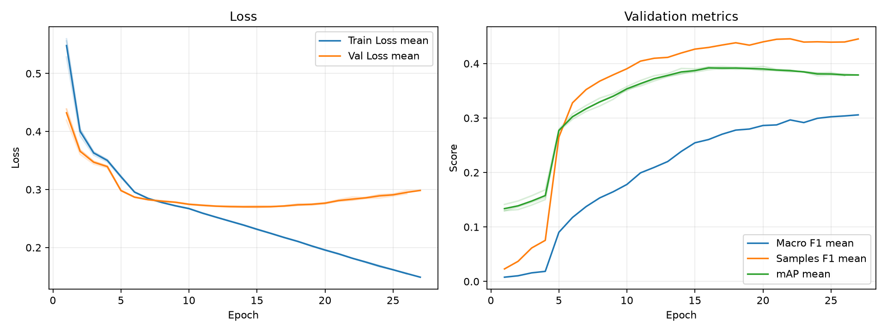

# 実験レポート: exp_gradual-unfreeze_resnet101

作成日: 2026-07-03

## 1. 共有用サマリ

### 1.1 この実験の位置づけ

- 何を改善しようとしたか: 「強力なバックボーン（ResNet101）が2〜3エポックで訓練データを一瞬で丸暗記（過学習）してしまう問題」を抑制し、事前学習重みの知識を破壊せずにアニメ画像の特徴量へ適応させること。
- ベースラインまたは直前実験から変えたこと: 最初から全層を同時に解凍するのではなく、出力層に近い上位層からエポックの経過に合わせて段階的にパラメータを解凍していく「段階的解凍（Gradual Unfreeze）」を導入した。
- 主評価指標 mAP の結果をどう判断するか: 主比較である Freeze環境（exp_freeze_resnet101）から +0.0466、参考である全層解凍環境（exp_unfreeze_resnet101）からも +0.0115 の明確なスコア向上が確認され、予測の順位付け性能において本グループ最高スコア（0.3927）を達成。過学習を遅らせつつ、表現力を引き出す仮説が正しかったと判断する。
- 何がダメだったか / まだ残っている問題: mAP（順位付けの精度）は大幅に向上したものの、固定しきい値（0.5）のままでは Macro F1 が 0.2644 と依然として低い。

### 1.2 自動要約

- 主評価指標の validation mAP は 0.3927 です（標準比較: validation split, 0.5 固定しきい値）。
- 補助指標は Macro F1=0.2644, Samples F1=0.4315, Hamming Loss=0.1085 です。
- 閾値最適化は行っていません。実験比較の主指標は、閾値に依存しない validation mAP です。
- この実験の validation mAP は 0.3927 です。
- 主比較 `exp_freeze_resnet101` の validation mAP は 0.3461 で、今回との差は +0.0466 です。
- 比較結果を読めなかった実験: `exp_gradual-unfreeze_resnet18`。
- 同じ実験グループで 3 件の seed 結果を集計しました。
- validation mAP は平均 0.3927、標準偏差 0.0016 です。

### 1.3 採用判断

- 採用判断: 採用（採用 / 条件付き採用 / 不採用 / 保留）
- 判断理由: 全層解凍に伴う急激な破滅的忘却と過学習を、段階的解凍によって綺麗に制御できることが3種のseed平均（標準偏差0.0016と極めて安定）からも証明されたため。mAP自体は確実に向上している。
- 次に試すこと: 損失関数

## 2. 他実験との比較

`config.yaml` で明示した主比較と参考実験だけを、validation mAP を中心に比較します。test split は最終モデル選定後まで使いません。

| 実験 | 役割 | method | validation mAP | mAP 標準偏差 | 今回との差 | Macro F1 | Samples F1 | Hamming Loss | 予測ジャンル数/作品 |
| --- | --- | --- | --- | --- | --- | --- | --- | --- | --- |
| exp_gradual-unfreeze_resnet101 | 今回 | 0.5 固定 | 0.3927 | 0.0016 | - | 0.2644 | 0.4315 | 0.1085 | 1.2804 |
| exp_freeze_resnet101 | 主比較 | 0.5 固定 | 0.3461 | 0.0008 | +0.0466 | 0.2022 | 0.3726 | 0.1138 | 1.0511 |
| exp_unfreeze_resnet101 | 参考 | 0.5 固定 | 0.3812 | 0.0086 | +0.0115 | 0.2374 | 0.4287 | 0.1096 | 1.2528 |
| exp_partial_freeze_resnet101 | 参考 | 0.5 固定 | 0.3921 | 0.0034 | +0.0006 | 0.2725 | 0.4174 | 0.1112 | 1.2682 |
| baseline | 参考 | 0.5 固定 | 0.2876 | 0.0005 | +0.1051 | 0.1515 | 0.3237 | 0.1209 | 0.9905 |

### 2.1 複数 seed 集計

seed 集計グループ: `exp_gradual-unfreeze_resnet101`

| 指標 | runs | 平均 | 標準偏差 | 最小 | 最大 |
| --- | --- | --- | --- | --- | --- |
| validation mAP | 3 | 0.3927 | 0.0016 | 0.3909 | 0.3940 |
| Macro F1 | 3 | 0.2644 | 0.0024 | 0.2617 | 0.2662 |
| Samples F1 | 3 | 0.4315 | 0.0072 | 0.4238 | 0.4381 |
| Hamming Loss | 3 | 0.1085 | 0.0005 | 0.1079 | 0.1088 |
| 予測ジャンル数/作品 | 3 | 1.2804 | 0.0168 | 1.2658 | 1.2988 |

#### seed 別結果

| 実験 | seed | best epoch | epochs ran | early stopped | validation mAP | Macro F1 | Samples F1 | Hamming Loss | 予測ジャンル数/作品 |
| --- | --- | --- | --- | --- | --- | --- | --- | --- | --- |
| exp_gradual-unfreeze_resnet101 | 42 |  |  |  | 0.3909 | 0.2662 | 0.4326 | 0.1088 | 1.2988 |
| exp_gradual-unfreeze_resnet101 | 43 |  |  |  | 0.3933 | 0.2653 | 0.4238 | 0.1088 | 1.2658 |
| exp_gradual-unfreeze_resnet101 | 44 |  |  |  | 0.3940 | 0.2617 | 0.4381 | 0.1079 | 1.2765 |

## 3. 実験の目的と変更

### 3.1 背景

これまでの実験において、事前学習重みを固定する「特徴抽出（Freeze環境）」ではImageNet（実写）の知識に縛られてアニメの画風に汎化できず、スコアが頭打ち（mAP: 0.3461）になっていた。一方で、一気に全層を解凍する「ファインチューニング（Unfreeze環境）」では、ResNet101の表現力が強すぎるあまり、数エポックで訓練データを丸暗記して過学習を起こし、検証データ（Validation）への汎化性能が十分に引き出せないというジレンマが発生していた。

### 3.2 仮説

初期の学習フェーズでは下位層（一般的なエッジなどを捉える層）をフリーズして事前学習の汎用的な知識を守り、学習が進むにつれて段階的に下位層まで解凍を広げていく（Gradual Unfreeze）ことで、バックボーンの急激な破壊（破滅的忘却）を防げる。これにより、モデル全体のパラメータが暴走することなく、じわじわと「アニメ専用の眼」へと微調整され、検証データに対する汎化mAPが向上すると考えた。

### 3.3 検証した変更

| 種類 | 内容 | mAP 改善につながると考えた理由 |
|---|---|---|
| 学習スケジューラ | 段階的解凍（Gradual Unfreeze）の導入 |.  下位層の事前学習知識を保護しながら、モデルの表現力を安全にタスクへ適応させ、急激な過学習を抑制するため|

### 3.4 比較条件

- 主比較: `exp_freeze_resnet101`
- 参考実験: `exp_unfreeze_resnet101`, `exp_partial_freeze_resnet101`, `baseline`
- 変えたもの: パラメータの解凍スケジュール, 学習率
- 変えていないもの: モデルアーキテクチャ（ResNet101）、損失関数（BCE）、最適化手法（Adam）、入力画像サイズ（224）
- 主評価指標: validation mAP
- 補助指標: Macro F1, Samples F1, Hamming Loss, ジャンル別 AP/F1
- test split: 最終モデル選定後まで使用しない

### 3.5 主な設定

| 項目 | 値 |
| --- | --- |
| seed | 42 |
| seeds | 42, 43, 44 |
| device | auto |
| comparison | {"primary": "exp_freeze_resnet101", "references": ["exp_unfreeze_resnet101", "exp_partial_freeze_resnet101", "baseline"]} |
| epochs | 50 |
| early_stopping | {"enabled": true, "monitor": "mAP", "mode": "max", "patience": 10, "min_delta": 0.001, "min_epochs": 20} |
| batch_size | 64 |
| learning_rate | 1e-5 |
| num_workers | 2 |
| image_size | 224 |
| compile | True |
| max_train_samples |  |
| max_val_samples |  |
| output_dir | outputs |
| best_model_name | best_model.pth |
| metrics_name | metrics.csv |

### 3.6 再現コマンド

```bash
uv run python experiments/exp_gradual-unfreeze_resnet101/run_exp.py
uv run python experiments/exp_gradual-unfreeze_resnet101/analyze.py
uv run python experiments/exp_gradual-unfreeze_resnet101/make_report.py
```

## 4. 学習ログ

### 4.1 代表 epoch

_該当するデータが見つかりませんでした。_

### 4.2 学習曲線



### 4.3 読み取りメモ

- Train Loss と Val Loss の差が開く場合は、過学習を疑う。
- 主評価指標は mAP。mAP 最大 epoch と最終 epoch の差を見る。
- F1 はしきい値で 0/1 にした後の補助指標。mAP が改善していても F1 が悪い場合は threshold 設計を疑う。
- Hamming Loss は低いほど良いが、何も予測しないモデルでも低く見える場合がある。

## 5. 全体評価

| split | method | Macro F1 | macro_f1_std | Samples F1 | samples_f1_std | Hamming Loss | hamming_loss_std | mAP | mAP_std | 予測ジャンル数/作品 | predicted_labels_per_item_std |
| --- | --- | --- | --- | --- | --- | --- | --- | --- | --- | --- | --- |
| validation | 0.5 固定 | 0.2644 | 0.0024 | 0.4315 | 0.0072 | 0.1085 | 0.0005 | 0.3927 | 0.0016 | 1.2804 | 0.0168 |

### 5.1 mAP 中心の読み取り

- validation mAP が比較対象より上がったか: 主比較（Freeze）に対して +0.0466、前回の全解凍（Unfreeze）に対しても +0.0115 上昇しており、明確に改善された。
- validation mAP の改善幅は、偶然や seed 差より十分大きそうか: 今回の3つのseedにおける標準偏差は 0.0016（最小0.3909, 最大0.3940）であり、比較対象との差（+0.0115〜+0.0466）はこのブレの範囲を遥かに上回っている。よって、段階的解凍による効果は統計的に有意であると判断できる。
- mAP は上がったが補助指標が悪化した場合、その悪化を許容できるか: Macro F1（0.2644）は、Freeze環境（0.2022）やUnfreeze環境（0.2374）よりも改善しているため、悪化はしていない。

## 6. ジャンル別結果

### 6.1 主比較 `exp_freeze_resnet101` とのジャンル別 AP 差分

| genre | 件数 | 比較AP | 現AP | AP差分 | 比較F1 | 現F1 | F1差分 | 比較Recall | 現Recall | Recall差分 | 比較Precision | 現Precision | Precision差分 |
| --- | --- | --- | --- | --- | --- | --- | --- | --- | --- | --- | --- | --- | --- |
| Adventure | 175 | 0.3165 | 0.4057 | 0.0893 | 0.1533 | 0.2623 | 0.1090 | 0.0971 | 0.1790 | 0.0819 | 0.3821 | 0.4959 | 0.1138 |
| Music | 58 | 0.1731 | 0.2533 | 0.0802 | 0.0108 | 0.0663 | 0.0556 | 0.0057 | 0.0345 | 0.0287 | 0.0833 | 1 | 0.9167 |
| Ecchi | 80 | 0.1782 | 0.2577 | 0.0795 | 0.0763 | 0.1184 | 0.0422 | 0.0458 | 0.0667 | 0.0208 | 0.3036 | 0.5563 | 0.2527 |
| Hentai | 137 | 0.8506 | 0.9225 | 0.0718 | 0.7599 | 0.8439 | 0.0840 | 0.7835 | 0.7956 | 0.0122 | 0.7460 | 0.8984 | 0.1524 |
| Thriller | 18 | 0.0780 | 0.1431 | 0.0651 | 0 | 0 | 0 | 0 | 0 | 0 | 0 | 0 | 0 |
| Mahou Shoujo | 22 | 0.0699 | 0.1339 | 0.0640 | 0.0404 | 0.0533 | 0.0129 | 0.0303 | 0.0303 | 0 | 0.0606 | 0.2222 | 0.1616 |
| Fantasy | 274 | 0.4960 | 0.5448 | 0.0488 | 0.1977 | 0.3664 | 0.1686 | 0.1217 | 0.2543 | 0.1326 | 0.6963 | 0.6568 | -0.0395 |
| Romance | 167 | 0.4106 | 0.4584 | 0.0479 | 0.2650 | 0.4181 | 0.1531 | 0.1756 | 0.3413 | 0.1657 | 0.6039 | 0.5396 | -0.0643 |
| Sports | 61 | 0.4443 | 0.4903 | 0.0461 | 0.2590 | 0.1736 | -0.0854 | 0.1530 | 0.0984 | -0.0546 | 0.9221 | 0.9333 | 0.0113 |
| Drama | 222 | 0.3568 | 0.3991 | 0.0423 | 0.1535 | 0.2294 | 0.0758 | 0.0946 | 0.1532 | 0.0586 | 0.4141 | 0.4584 | 0.0442 |
| Psychological | 54 | 0.1060 | 0.1461 | 0.0401 | 0 | 0 | 0 | 0 | 0 | 0 | 0 | 0 | 0 |
| Mystery | 70 | 0.1590 | 0.1957 | 0.0366 | 0.0275 | 0.0278 | 0.0003 | 0.0143 | 0.0143 | 0 | 0.3889 | 0.6111 | 0.2222 |
| Action | 305 | 0.5978 | 0.6335 | 0.0357 | 0.5151 | 0.5651 | 0.0501 | 0.4339 | 0.5169 | 0.0831 | 0.6371 | 0.6238 | -0.0134 |
| Comedy | 487 | 0.7076 | 0.7372 | 0.0296 | 0.6374 | 0.6714 | 0.0339 | 0.6140 | 0.6550 | 0.0411 | 0.6794 | 0.6896 | 0.0102 |
| Slice of Life | 195 | 0.4165 | 0.4452 | 0.0287 | 0.2708 | 0.3953 | 0.1245 | 0.2017 | 0.3162 | 0.1145 | 0.5124 | 0.5271 | 0.0147 |
| Horror | 39 | 0.1231 | 0.1509 | 0.0278 | 0 | 0 | 0 | 0 | 0 | 0 | 0 | 0 | 0 |
| Supernatural | 133 | 0.2146 | 0.2407 | 0.0261 | 0.0224 | 0.0597 | 0.0373 | 0.0125 | 0.0326 | 0.0201 | 0.1111 | 0.3580 | 0.2469 |
| Sci-Fi | 157 | 0.3785 | 0.4017 | 0.0232 | 0.2569 | 0.3448 | 0.0879 | 0.1762 | 0.2527 | 0.0764 | 0.5666 | 0.5455 | -0.0211 |
| Mecha | 49 | 0.4989 | 0.5015 | 0.0026 | 0.1958 | 0.4279 | 0.2320 | 0.1156 | 0.3129 | 0.1973 | 0.8419 | 0.6765 | -0.1653 |

### 6.2 AP が高いジャンル

| genre | 件数 | 陽性予測数 | Precision | Recall | F1 | AP |
| --- | --- | --- | --- | --- | --- | --- |
| Hentai | 137 | 121.333 | 0.8984 | 0.7956 | 0.8439 | 0.9225 |
| Comedy | 487 | 463 | 0.6896 | 0.6550 | 0.6714 | 0.7372 |
| Action | 305 | 253 | 0.6238 | 0.5169 | 0.5651 | 0.6335 |
| Fantasy | 274 | 106.333 | 0.6568 | 0.2543 | 0.3664 | 0.5448 |
| Mecha | 49 | 22.6667 | 0.6765 | 0.3129 | 0.4279 | 0.5015 |
| Sports | 61 | 6.6667 | 0.9333 | 0.0984 | 0.1736 | 0.4903 |
| Romance | 167 | 105.667 | 0.5396 | 0.3413 | 0.4181 | 0.4584 |
| Slice of Life | 195 | 117 | 0.5271 | 0.3162 | 0.3953 | 0.4452 |

### 6.3 F1 が低いジャンル

| genre | 件数 | 陽性予測数 | Precision | Recall | F1 | AP |
| --- | --- | --- | --- | --- | --- | --- |
| Thriller | 18 | 0 | 0 | 0 | 0 | 0.1431 |
| Horror | 39 | 1 | 0 | 0 | 0 | 0.1509 |
| Psychological | 54 | 0 | 0 | 0 | 0 | 0.1461 |
| Mystery | 70 | 2 | 0.6111 | 0.0143 | 0.0278 | 0.1957 |
| Mahou Shoujo | 22 | 2.3333 | 0.2222 | 0.0303 | 0.0533 | 0.1339 |
| Supernatural | 133 | 12 | 0.3580 | 0.0326 | 0.0597 | 0.2407 |
| Music | 58 | 2 | 1 | 0.0345 | 0.0663 | 0.2533 |
| Ecchi | 80 | 10 | 0.5563 | 0.0667 | 0.1184 | 0.2577 |

### 6.4 考察の観点

- AP が高いジャンルは、モデルが順位付けできているジャンル。mAP 改善に寄与している可能性が高い。
- AP が低いジャンルは、特徴量・データ量・ラベルの曖昧さなどを疑う。
- AP は高いのに F1 が低いジャンルは、しきい値調整で改善する可能性がある。
- Precision が低いジャンルは、関係ない作品にもそのジャンルを付けすぎている。
- Recall が低いジャンルは、本当はそのジャンルの作品を見逃している。
- 件数が少ないジャンルは、少数の正解/不正解で指標が大きく動く。


## 8. 生成元ファイル

| ファイル | 用途 |
| --- | --- |
| experiments/exp_gradual-unfreeze_resnet101/config.yaml | 実験設定 |
| 未生成 | epoch ごとの学習ログ |
| experiments/exp_gradual-unfreeze_resnet101/analysis/overall_model_metrics.csv | validation の全体指標 |
| experiments/exp_gradual-unfreeze_resnet101/analysis/genre_metrics_validation_threshold_0.5.csv | validation のジャンル別指標 |

### 8.1 analysis ディレクトリ内のファイル

- `analysis_summary.json`
- `genre_metrics_validation_threshold_0.5.csv`
- `learning_curves.png`
- `learning_curves.svg`
- `overall_model_metrics.csv`
- `seed_genre_metrics_validation_threshold_0.5.csv`
- `seed_overall_model_metrics.csv`
