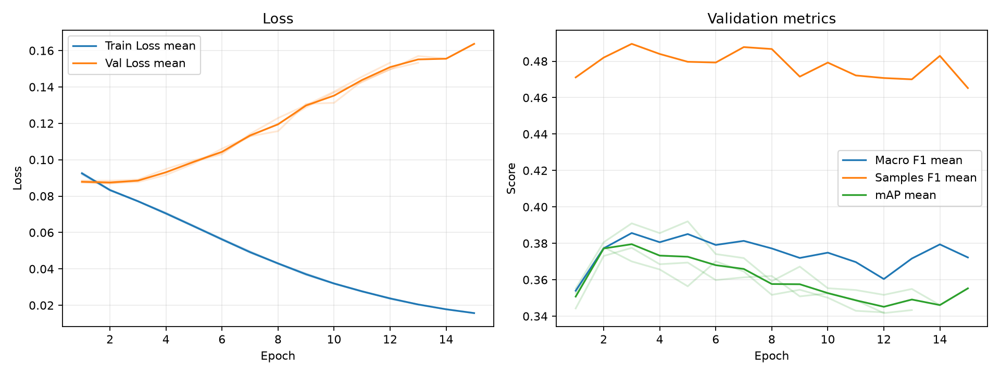

# 実験レポート: exp_resnet101_asl

作成日: 2026-07-06

## 1. 共有用サマリ

### 1.1 この実験の位置づけ

- 何を改善しようとしたか: 何を改善しようとしたか: 圧倒的に陰性ラベル（0）が多い多ラベル分類において、通常のBCEでは陰性ロスに学習が埋もれてしまい、少数ジャンルへの予測感度（Recall）が壊滅する問題を解決すること。
- ベースラインまたは直前実験から変えたこと: 損失関数を単純な正例重み付けの exp_resnet101_weighted_bce から、イージーな陰性サンプル（背景や無関係なラベル）のロスをダイナミックに削ぎ落とす Asymmetric Loss (ASL) に変更した。
- 主評価指標 mAP の結果をどう判断するか: Epoch 3時点で最高mAP（約0.38）に到達した後は過学習によりスコアが失速し続けている。ポテンシャルはあるが、最適化の制御に失敗したと判断する。
- 何がダメだったか / まだ残っている問題: Epoch 3以降、Train Lossが下がり続ける一方でVal Lossが右肩上がりに急上昇しており、致命的な過学習（過剰適合）が起きている。その結果、モデルの出力確率のキャリブレーションが崩壊し、0.5固定しきい値では1作品あたり平均 5.1374 ジャンルも予測してしまう過剰予測状態に陥った。
### 1.2 自動要約

- 主評価指標の validation mAP は 0.3825 です（標準比較: validation split, 0.5 固定しきい値）。
- 補助指標は Macro F1=0.3903, Samples F1=0.4935, Hamming Loss=0.2091 です。
- 閾値最適化は行っていません。実験比較の主指標は、閾値に依存しない validation mAP です。
- この実験の validation mAP は 0.3825 です。
- 主比較 `exp_resnet101_weighted_bce` の validation mAP は 0.3938 で、今回との差は -0.0113 です。
- 同じ実験グループで 3 件の seed 結果を集計しました。
- validation mAP は平均 0.3825、標準偏差 0.0083 です。

### 1.3 採用判断

- 採用判断: 条件付き採用。（採用 / 条件付き採用 / 不採用 / 保留）
- 判断理由: mAPは微減したものの、これまでの課題であったマイナージャンルのF1/Recallを強引に引き上げるパワー（Macro F1: 0.3903と全実験中トップクラス）が確認されたため。
- 次に試すこと:段階的解凍を取り入れ、ImageNetの事前学習した知識が一瞬で破壊されるのを防ぎ、早期過学習を止める。

## 2. 他実験との比較

`config.yaml` で明示した主比較と参考実験だけを、validation mAP を中心に比較します。test split は最終モデル選定後まで使いません。

| 実験 | 役割 | method | validation mAP | mAP 標準偏差 | 今回との差 | Macro F1 | Samples F1 | Hamming Loss | 予測ジャンル数/作品 |
| --- | --- | --- | --- | --- | --- | --- | --- | --- | --- |
| exp_resnet101_asl | 今回 | 0.5 固定 | 0.3825 | 0.0083 | - | 0.3903 | 0.4935 | 0.2091 | 5.1374 |
| exp_resnet101_weighted_bce | 主比較 | 0.5 固定 | 0.3938 | 0.0073 | -0.0113 | 0.3981 | 0.5067 | 0.1329 | 2.6001 |
| exp_resnet101_bce | 参考 | 0.5 固定 | 0.3895 | 0.0071 | -0.0070 | 0.2734 | 0.4355 | 0.1110 | 1.3610 |
| exp_resnet101_dbl | 参考 | 0.5 固定 | 0.3611 | 0.0059 | +0.0214 | 0.1878 | 0.3736 | 0.1111 | 0.9762 |
| baseline | 参考 | 0.5 固定 | 0.2876 | 0.0005 | +0.0948 | 0.1515 | 0.3237 | 0.1209 | 0.9905 |

### 2.1 複数 seed 集計

seed 集計グループ: `exp_resnet101_asl`

| 指標 | runs | 平均 | 標準偏差 | 最小 | 最大 |
| --- | --- | --- | --- | --- | --- |
| validation mAP | 3 | 0.3825 | 0.0083 | 0.3775 | 0.3921 |
| Macro F1 | 3 | 0.3903 | 0.0115 | 0.3801 | 0.4027 |
| Samples F1 | 3 | 0.4935 | 0.0063 | 0.4892 | 0.5007 |
| Hamming Loss | 3 | 0.2091 | 0.0087 | 0.2022 | 0.2189 |
| 予測ジャンル数/作品 | 3 | 5.1374 | 0.2839 | 4.8947 | 5.4496 |

#### seed 別結果

| 実験 | seed | best epoch | epochs ran | early stopped | validation mAP | Macro F1 | Samples F1 | Hamming Loss | 予測ジャンル数/作品 |
| --- | --- | --- | --- | --- | --- | --- | --- | --- | --- |
| exp_resnet101_asl | 42 |  |  |  | 0.3775 | 0.3881 | 0.5007 | 0.2063 | 5.0678 |
| exp_resnet101_asl | 43 |  |  |  | 0.3921 | 0.4027 | 0.4905 | 0.2022 | 4.8947 |
| exp_resnet101_asl | 44 |  |  |  | 0.3779 | 0.3801 | 0.4892 | 0.2189 | 5.4496 |

## 3. 実験の目的と変更

### 3.1 背景

多ラベルアニメジャンル予測において、データセット内の「ジャンルが付与されていない（0である）膨大な陰性サンプル」がロスの大半を占めてしまい、モデルが少数ジャンルに対して確率を低く出力しすぎる問題があった。今回はASLの非対称 focusing 特性を利用してこの海の底に沈んだ少数ポジティブ信号を引き上げることを目指した。
### 3.2 仮説

ASLを導入し、陽性（1）のロスはそのまま保持しつつ、確信度の高い（簡単な）陰性サンプルのロスのみを非対称に削ぎ落とす（Asymmetric Focusing）ことで、モデルは陰性サンプルの海に惑わされることなく、少数ジャンル特有のポジティブな特徴抽出に集中できるようになり、結果として検証データのmAPおよびF1が大きく改善すると考えた。
### 3.3 検証した変更

| 種類 | 内容 | mAP 改善につながると考えた理由 |
|---|---|---|
| loss  |  Asymmetric Lossへの変更 | 確実な陰性サンプルのロスを除外し、モデルが少数ジャンルのポジティブ特徴量に対して敏感に反応できるようにするため。 |

### 3.4 比較条件

- 主比較: `exp_resnet101_weighted_bce`
- 参考実験: `exp_resnet101_bce`, `exp_resnet101_dbl`, `baseline`
- 変えたもの: 損失関数
- 変えていないもの: モデル（ResNet101）、学習率（5e-5）、エポック数（50）、バッチサイズ（64）、画像サイズ（224）
- 主評価指標: validation mAP
- 補助指標: Macro F1, Samples F1, Hamming Loss, ジャンル別 AP/F1
- test split: 最終モデル選定後まで使用しない

### 3.5 主な設定

| 項目 | 値 |
| --- | --- |
| seed | 42 |
| seeds | 42, 43, 44 |
| device | auto |
| comparison | {"primary": "exp_resnet101_weighted_bce", "references": ["exp_resnet101_bce", "exp_resnet101_dbl", "baseline"]} |
| epochs | 50 |
| early_stopping | {"enabled": true, "monitor": "mAP", "mode": "max", "patience": 10, "min_delta": 0.001, "min_epochs": 10} |
| batch_size | 64 |
| learning_rate | 5e-5 |
| num_workers | 2 |
| image_size | 224 |
| compile | True |
| max_train_samples |  |
| max_val_samples |  |
| output_dir | outputs |
| best_model_name | best_model.pth |
| metrics_name | metrics.csv |

### 3.6 再現コマンド

```bash
uv run python experiments/exp_resnet101_asl/run_exp.py
uv run python experiments/exp_resnet101_asl/analyze.py
uv run python experiments/exp_resnet101_asl/make_report.py
```

## 4. 学習ログ

### 4.1 代表 epoch

_該当するデータが見つかりませんでした。_

### 4.2 学習曲線



### 4.3 読み取りメモ

- Train Loss と Val Loss の差が開く場合は、過学習を疑う。
- 主評価指標は mAP。mAP 最大 epoch と最終 epoch の差を見る。
- F1 はしきい値で 0/1 にした後の補助指標。mAP が改善していても F1 が悪い場合は threshold 設計を疑う。
- Hamming Loss は低いほど良いが、何も予測しないモデルでも低く見える場合がある。

## 5. 全体評価

| split | method | Macro F1 | macro_f1_std | Samples F1 | samples_f1_std | Hamming Loss | hamming_loss_std | mAP | mAP_std | 予測ジャンル数/作品 | predicted_labels_per_item_std |
| --- | --- | --- | --- | --- | --- | --- | --- | --- | --- | --- | --- |
| validation | 0.5 固定 | 0.3903 | 0.0115 | 0.4935 | 0.0063 | 0.2091 | 0.0087 | 0.3825 | 0.0083 | 5.1374 | 0.2839 |

### 5.1 mAP 中心の読み取り

- validation mAP が比較対象より上がったか: validation mAP が比較対象より上がったか: 最終結果としては上がらなかった（-0.0113）。しかし、グラフから分かる通りEpoch 3時点の「過学習前」であれば、weighted_bce とほぼ同等、あるいはそれを超える瞬間風速を出している。
- validation mAP の改善幅は、偶然や seed 差より十分大きそうか: 
- mAP は上がったが補助指標が悪化した場合、その悪化を許容できるか: mAP は上がったが補助指標が悪化した場合、その悪化を許容できるか: 今回はMacro F1（0.3903）とSamples F1（0.4935）が非常に高く見えるが、これはEpoch 3以降にモデルが過学習を起こし、確率出力を不当に高くした結果、固定しきい値0.5を強引に突破してRecallを稼いだ「見かけ上の高スコア」である。Hamming Loss（0.2091）の著しい悪化がその代償であり、許容できない。

## 6. ジャンル別結果

### 6.1 主比較 `exp_resnet101_weighted_bce` とのジャンル別 AP 差分

| genre | 件数 | 比較AP | 現AP | AP差分 | 比較F1 | 現F1 | F1差分 | 比較Recall | 現Recall | Recall差分 | 比較Precision | 現Precision | Precision差分 |
| --- | --- | --- | --- | --- | --- | --- | --- | --- | --- | --- | --- | --- | --- |
| Adventure | 175 | 0.3984 | 0.4271 | 0.0287 | 0.4159 | 0.4210 | 0.0051 | 0.4762 | 0.7371 | 0.2610 | 0.3861 | 0.3003 | -0.0858 |
| Psychological | 54 | 0.1293 | 0.1507 | 0.0214 | 0.1502 | 0.1921 | 0.0419 | 0.1420 | 0.2531 | 0.1111 | 0.1619 | 0.1551 | -0.0069 |
| Thriller | 18 | 0.0906 | 0.1103 | 0.0197 | 0.1374 | 0.1208 | -0.0166 | 0.1481 | 0.1296 | -0.0185 | 0.1299 | 0.1158 | -0.0141 |
| Drama | 222 | 0.3713 | 0.3862 | 0.0150 | 0.4335 | 0.4345 | 0.0010 | 0.5210 | 0.7492 | 0.2282 | 0.3717 | 0.3069 | -0.0648 |
| Fantasy | 274 | 0.5259 | 0.5309 | 0.0050 | 0.5082 | 0.5099 | 0.0017 | 0.4757 | 0.8394 | 0.3637 | 0.5607 | 0.3698 | -0.1909 |
| Hentai | 137 | 0.9134 | 0.9121 | -0.0013 | 0.8590 | 0.7721 | -0.0869 | 0.8978 | 0.9538 | 0.0560 | 0.8236 | 0.6491 | -0.1745 |
| Romance | 167 | 0.4259 | 0.4180 | -0.0079 | 0.4349 | 0.3846 | -0.0503 | 0.5170 | 0.7445 | 0.2275 | 0.3798 | 0.2614 | -0.1185 |
| Mystery | 70 | 0.2034 | 0.1930 | -0.0104 | 0.2496 | 0.2494 | -0.0002 | 0.2857 | 0.4905 | 0.2048 | 0.2262 | 0.1708 | -0.0554 |
| Slice of Life | 195 | 0.4422 | 0.4303 | -0.0119 | 0.4495 | 0.4732 | 0.0237 | 0.4530 | 0.7162 | 0.2632 | 0.4494 | 0.3545 | -0.0949 |
| Mecha | 49 | 0.5005 | 0.4876 | -0.0129 | 0.4699 | 0.4697 | -0.0002 | 0.5374 | 0.6463 | 0.1088 | 0.4527 | 0.3865 | -0.0663 |
| Horror | 39 | 0.1912 | 0.1683 | -0.0229 | 0.2418 | 0.2382 | -0.0036 | 0.2222 | 0.3162 | 0.0940 | 0.2660 | 0.1958 | -0.0702 |
| Music | 58 | 0.2962 | 0.2728 | -0.0234 | 0.3160 | 0.2656 | -0.0503 | 0.2644 | 0.3448 | 0.0805 | 0.4079 | 0.2237 | -0.1842 |
| Sports | 61 | 0.4847 | 0.4584 | -0.0264 | 0.4793 | 0.4215 | -0.0578 | 0.5191 | 0.5738 | 0.0546 | 0.4613 | 0.3349 | -0.1264 |
| Ecchi | 80 | 0.2542 | 0.2279 | -0.0264 | 0.2545 | 0.2789 | 0.0244 | 0.2458 | 0.5000 | 0.2542 | 0.2658 | 0.1938 | -0.0720 |
| Supernatural | 133 | 0.2648 | 0.2380 | -0.0268 | 0.2548 | 0.3078 | 0.0530 | 0.2356 | 0.5614 | 0.3258 | 0.2843 | 0.2146 | -0.0696 |
| Sci-Fi | 157 | 0.4147 | 0.3872 | -0.0275 | 0.3949 | 0.4095 | 0.0146 | 0.3864 | 0.6667 | 0.2803 | 0.4286 | 0.2971 | -0.1315 |
| Comedy | 487 | 0.7538 | 0.7195 | -0.0344 | 0.6785 | 0.6679 | -0.0106 | 0.6872 | 0.9452 | 0.2580 | 0.6709 | 0.5166 | -0.1543 |
| Action | 305 | 0.6287 | 0.5924 | -0.0364 | 0.6075 | 0.5890 | -0.0185 | 0.6634 | 0.8098 | 0.1464 | 0.5615 | 0.4651 | -0.0964 |
| Mahou Shoujo | 22 | 0.1935 | 0.1567 | -0.0368 | 0.2279 | 0.2103 | -0.0175 | 0.2424 | 0.3636 | 0.1212 | 0.2203 | 0.1562 | -0.0641 |

### 6.2 AP が高いジャンル

| genre | 件数 | 陽性予測数 | Precision | Recall | F1 | AP |
| --- | --- | --- | --- | --- | --- | --- |
| Hentai | 137 | 201.667 | 0.6491 | 0.9538 | 0.7721 | 0.9121 |
| Comedy | 487 | 891.333 | 0.5166 | 0.9452 | 0.6679 | 0.7195 |
| Action | 305 | 533 | 0.4651 | 0.8098 | 0.5890 | 0.5924 |
| Fantasy | 274 | 631.333 | 0.3698 | 0.8394 | 0.5099 | 0.5309 |
| Mecha | 49 | 88.6667 | 0.3865 | 0.6463 | 0.4697 | 0.4876 |
| Sports | 61 | 106 | 0.3349 | 0.5738 | 0.4215 | 0.4584 |
| Slice of Life | 195 | 396.333 | 0.3545 | 0.7162 | 0.4732 | 0.4303 |
| Adventure | 175 | 444.333 | 0.3003 | 0.7371 | 0.4210 | 0.4271 |

### 6.3 F1 が低いジャンル

| genre | 件数 | 陽性予測数 | Precision | Recall | F1 | AP |
| --- | --- | --- | --- | --- | --- | --- |
| Thriller | 18 | 19 | 0.1158 | 0.1296 | 0.1208 | 0.1103 |
| Psychological | 54 | 88 | 0.1551 | 0.2531 | 0.1921 | 0.1507 |
| Mahou Shoujo | 22 | 58.3333 | 0.1562 | 0.3636 | 0.2103 | 0.1567 |
| Horror | 39 | 65.6667 | 0.1958 | 0.3162 | 0.2382 | 0.1683 |
| Mystery | 70 | 202 | 0.1708 | 0.4905 | 0.2494 | 0.1930 |
| Music | 58 | 92.6667 | 0.2237 | 0.3448 | 0.2656 | 0.2728 |
| Ecchi | 80 | 209.333 | 0.1938 | 0.5000 | 0.2789 | 0.2279 |
| Supernatural | 133 | 349.667 | 0.2146 | 0.5614 | 0.3078 | 0.2380 |

### 6.4 考察の観点

- AP が高いジャンルは、モデルが順位付けできているジャンル。mAP 改善に寄与している可能性が高い。
- AP が低いジャンルは、特徴量・データ量・ラベルの曖昧さなどを疑う。
- AP は高いのに F1 が低いジャンルは、しきい値調整で改善する可能性がある。
- Precision が低いジャンルは、関係ない作品にもそのジャンルを付けすぎている。
- Recall が低いジャンルは、本当はそのジャンルの作品を見逃している。
- 件数が少ないジャンルは、少数の正解/不正解で指標が大きく動く。

## 8. 生成元ファイル

| ファイル | 用途 |
| --- | --- |
| experiments/exp_resnet101_asl/config.yaml | 実験設定 |
| 未生成 | epoch ごとの学習ログ |
| experiments/exp_resnet101_asl/analysis/overall_model_metrics.csv | validation の全体指標 |
| experiments/exp_resnet101_asl/analysis/genre_metrics_validation_threshold_0.5.csv | validation のジャンル別指標 |

### 8.1 analysis ディレクトリ内のファイル

- `analysis_summary.json`
- `genre_metrics_validation_threshold_0.5.csv`
- `learning_curves.png`
- `learning_curves.svg`
- `overall_model_metrics.csv`
- `seed_genre_metrics_validation_threshold_0.5.csv`
- `seed_overall_model_metrics.csv`
