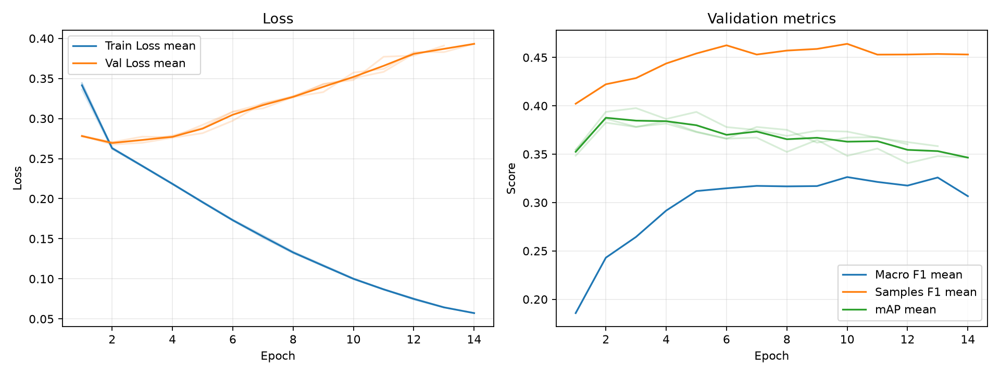

# 実験レポート: exp_resnet101_bce

作成日: 2026-07-03

## 1. 共有用サマリ

### 1.1 この実験の位置づけ

- 何を改善しようとしたか: TODO
- ベースラインまたは直前実験から変えたこと: TODO
- 主評価指標 mAP の結果をどう判断するか: TODO
- 何がダメだったか / まだ残っている問題: TODO

### 1.2 自動要約

- 主評価指標の validation mAP は 0.3895 です（標準比較: validation split, 0.5 固定しきい値）。
- 補助指標は Macro F1=0.2734, Samples F1=0.4355, Hamming Loss=0.1110 です。
- 閾値最適化は行っていません。実験比較の主指標は、閾値に依存しない validation mAP です。
- この実験の validation mAP は 0.3895 です。
- 主比較 `exp_bce` の validation mAP は 0.3500 で、今回との差は +0.0395 です。
- 同じ実験グループで 3 件の seed 結果を集計しました。
- validation mAP は平均 0.3895、標準偏差 0.0071 です。

### 1.3 採用判断

- 採用判断: TODO（採用 / 条件付き採用 / 不採用 / 保留）
- 判断理由: TODO
- 次に試すこと: TODO

## 2. 他実験との比較

`config.yaml` で明示した主比較と参考実験だけを、validation mAP を中心に比較します。test split は最終モデル選定後まで使いません。

| 実験 | 役割 | method | validation mAP | mAP 標準偏差 | 今回との差 | Macro F1 | Samples F1 | Hamming Loss | 予測ジャンル数/作品 |
| --- | --- | --- | --- | --- | --- | --- | --- | --- | --- |
| exp_resnet101_bce | 今回 | 0.5 固定 | 0.3895 | 0.0071 | - | 0.2734 | 0.4355 | 0.1110 | 1.3610 |
| exp_bce | 主比較 | 0.5 固定 | 0.3500 | 0.0035 | +0.0395 | 0.2458 | 0.4156 | 0.1193 | 1.4686 |
| baseline | 参考 | 0.5 固定 | 0.2876 | 0.0005 | +0.1019 | 0.1515 | 0.3237 | 0.1209 | 0.9905 |

### 2.1 複数 seed 集計

seed 集計グループ: `exp_resnet101_bce`

| 指標 | runs | 平均 | 標準偏差 | 最小 | 最大 |
| --- | --- | --- | --- | --- | --- |
| validation mAP | 3 | 0.3895 | 0.0071 | 0.3843 | 0.3976 |
| Macro F1 | 3 | 0.2734 | 0.0301 | 0.2394 | 0.2969 |
| Samples F1 | 3 | 0.4355 | 0.0143 | 0.4192 | 0.4459 |
| Hamming Loss | 3 | 0.1110 | 0.0024 | 0.1089 | 0.1137 |
| 予測ジャンル数/作品 | 3 | 1.3610 | 0.1666 | 1.1829 | 1.5129 |

#### seed 別結果

| 実験 | seed | best epoch | epochs ran | early stopped | validation mAP | Macro F1 | Samples F1 | Hamming Loss | 予測ジャンル数/作品 |
| --- | --- | --- | --- | --- | --- | --- | --- | --- | --- |
| exp_resnet101_bce | 42 | 2 | 12 | True | 0.3866 | 0.2394 | 0.4192 | 0.1103 | 1.1829 |
| exp_resnet101_bce | 43 | 3 | 13 | True | 0.3976 | 0.2838 | 0.4459 | 0.1089 | 1.3872 |
| exp_resnet101_bce | 44 | 4 | 14 | True | 0.3843 | 0.2969 | 0.4414 | 0.1137 | 1.5129 |

## 3. 実験の目的と変更

### 3.1 背景

TODO: ベースラインまたは前回実験にどの問題があったかを書く。

### 3.2 仮説

TODO: なぜ今回の変更で mAP が改善すると考えたかを書く。

### 3.3 検証した変更

| 種類 | 内容 | mAP 改善につながると考えた理由 |
|---|---|---|
| モデル / loss / augmentation / threshold など | TODO | TODO |

### 3.4 比較条件

- 主比較: `exp_bce`
- 参考実験: `baseline`
- 変えたもの: TODO
- 変えていないもの: TODO
- 主評価指標: validation mAP
- 補助指標: Macro F1, Samples F1, Hamming Loss, ジャンル別 AP/F1
- test split: 最終モデル選定後まで使用しない

### 3.5 主な設定

| 項目 | 値 |
| --- | --- |
| seed | 42 |
| seeds | 42, 43, 44 |
| device | auto |
| comparison | {"primary": "exp_bce", "references": ["baseline"]} |
| epochs | 50 |
| early_stopping | {"enabled": true, "monitor": "mAP", "mode": "max", "patience": 10, "min_delta": 0.001, "min_epochs": 10} |
| batch_size | 64 |
| learning_rate | 5e-5 |
| num_workers | 2 |
| image_size | 224 |
| compile | True |
| max_train_samples |  |
| max_val_samples |  |
| output_dir | outputs |
| best_model_name | best_model.pth |
| metrics_name | metrics.csv |

### 3.6 再現コマンド

```bash
uv run python experiments/exp_resnet101_bce/run_exp.py
uv run python experiments/exp_resnet101_bce/analyze.py
uv run python experiments/exp_resnet101_bce/make_report.py
```

## 4. 学習ログ

### 4.1 代表 epoch

| seed | 観点 | Epoch | Train Loss | Val Loss | Macro F1 | Samples F1 | Hamming Loss | mAP |
| --- | --- | --- | --- | --- | --- | --- | --- | --- |
| 42 | 最終 | 12 | 0.0751 | 0.3809 | 0.3252 | 0.4697 | 0.1236 | 0.3602 |
| 42 | Val Loss 最小 | 2 | 0.2635 | 0.2705 | 0.2394 | 0.4192 | 0.1103 | 0.3866 |
| 42 | mAP 最大 | 2 | 0.2635 | 0.2705 | 0.2394 | 0.4192 | 0.1103 | 0.3866 |
| 42 | Macro F1 最大 | 10 | 0.0998 | 0.3504 | 0.3350 | 0.4625 | 0.1195 | 0.3672 |
| 42 | Samples F1 最大 | 12 | 0.0751 | 0.3809 | 0.3252 | 0.4697 | 0.1236 | 0.3602 |
| 43 | 最終 | 13 | 0.0642 | 0.3910 | 0.3378 | 0.4458 | 0.1249 | 0.3583 |
| 43 | Val Loss 最小 | 2 | 0.2620 | 0.2676 | 0.2495 | 0.4242 | 0.1083 | 0.3937 |
| 43 | mAP 最大 | 3 | 0.2404 | 0.2698 | 0.2838 | 0.4459 | 0.1089 | 0.3976 |
| 43 | Macro F1 最大 | 13 | 0.0642 | 0.3910 | 0.3378 | 0.4458 | 0.1249 | 0.3583 |
| 43 | Samples F1 最大 | 8 | 0.1320 | 0.3264 | 0.3247 | 0.4702 | 0.1133 | 0.3689 |
| 44 | 最終 | 14 | 0.0572 | 0.3932 | 0.3066 | 0.4531 | 0.1246 | 0.3465 |
| 44 | Val Loss 最小 | 2 | 0.2635 | 0.2704 | 0.2402 | 0.4235 | 0.1100 | 0.3826 |
| 44 | mAP 最大 | 4 | 0.2185 | 0.2788 | 0.2969 | 0.4414 | 0.1137 | 0.3843 |
| 44 | Macro F1 最大 | 6 | 0.1739 | 0.3086 | 0.3207 | 0.4752 | 0.1186 | 0.3661 |
| 44 | Samples F1 最大 | 6 | 0.1739 | 0.3086 | 0.3207 | 0.4752 | 0.1186 | 0.3661 |

### 4.2 学習曲線



### 4.3 読み取りメモ

- Train Loss と Val Loss の差が開く場合は、過学習を疑う。
- 主評価指標は mAP。mAP 最大 epoch と最終 epoch の差を見る。
- F1 はしきい値で 0/1 にした後の補助指標。mAP が改善していても F1 が悪い場合は threshold 設計を疑う。
- Hamming Loss は低いほど良いが、何も予測しないモデルでも低く見える場合がある。

## 5. 全体評価

| split | method | Macro F1 | macro_f1_std | Samples F1 | samples_f1_std | Hamming Loss | hamming_loss_std | mAP | mAP_std | 予測ジャンル数/作品 | predicted_labels_per_item_std |
| --- | --- | --- | --- | --- | --- | --- | --- | --- | --- | --- | --- |
| validation | 0.5 固定 | 0.2734 | 0.0301 | 0.4355 | 0.0143 | 0.1110 | 0.0024 | 0.3895 | 0.0071 | 1.3610 | 0.1666 |

### 5.1 mAP 中心の読み取り

- validation mAP が比較対象より上がったか: TODO
- validation mAP の改善幅は、偶然や seed 差より十分大きそうか: TODO
- mAP は上がったが補助指標が悪化した場合、その悪化を許容できるか: TODO

## 6. ジャンル別結果

### 6.1 主比較 `exp_bce` とのジャンル別 AP 差分

| genre | 件数 | 比較AP | 現AP | AP差分 | 比較F1 | 現F1 | F1差分 | 比較Recall | 現Recall | Recall差分 | 比較Precision | 現Precision | Precision差分 |
| --- | --- | --- | --- | --- | --- | --- | --- | --- | --- | --- | --- | --- | --- |
| Ecchi | 80 | 0.1735 | 0.2661 | 0.0926 | 0.1262 | 0.1080 | -0.0182 | 0.1458 | 0.0667 | -0.0792 | 0.2324 | 0.3664 | 0.1340 |
| Romance | 167 | 0.3308 | 0.4221 | 0.0913 | 0.3022 | 0.3951 | 0.0930 | 0.3054 | 0.3433 | 0.0379 | 0.3609 | 0.5340 | 0.1731 |
| Mecha | 49 | 0.4437 | 0.5140 | 0.0703 | 0.2667 | 0.3856 | 0.1189 | 0.1837 | 0.2789 | 0.0952 | 0.5833 | 0.6937 | 0.1103 |
| Sports | 61 | 0.3937 | 0.4617 | 0.0681 | 0.3652 | 0.2970 | -0.0683 | 0.2732 | 0.1803 | -0.0929 | 0.6211 | 0.8434 | 0.2223 |
| Adventure | 175 | 0.3453 | 0.4101 | 0.0649 | 0.2993 | 0.2948 | -0.0045 | 0.2724 | 0.2133 | -0.0590 | 0.3773 | 0.5050 | 0.1277 |
| Mahou Shoujo | 22 | 0.0832 | 0.1465 | 0.0633 | 0.0238 | 0.0790 | 0.0552 | 0.0152 | 0.0455 | 0.0303 | 0.0556 | 0.3056 | 0.2500 |
| Supernatural | 133 | 0.2089 | 0.2672 | 0.0582 | 0.0611 | 0.0939 | 0.0329 | 0.0351 | 0.0551 | 0.0201 | 0.6000 | 0.4223 | -0.1777 |
| Sci-Fi | 157 | 0.3439 | 0.3989 | 0.0549 | 0.1840 | 0.2926 | 0.1086 | 0.1104 | 0.2123 | 0.1019 | 0.5788 | 0.5607 | -0.0181 |
| Slice of Life | 195 | 0.3922 | 0.4295 | 0.0373 | 0.2278 | 0.3517 | 0.1238 | 0.1692 | 0.2752 | 0.1060 | 0.4467 | 0.5000 | 0.0533 |
| Action | 305 | 0.6029 | 0.6363 | 0.0334 | 0.5787 | 0.5782 | -0.0005 | 0.5923 | 0.5443 | -0.0481 | 0.5690 | 0.6247 | 0.0557 |
| Mystery | 70 | 0.1491 | 0.1787 | 0.0296 | 0 | 0.0081 | 0.0081 | 0 | 0.0048 | 0.0048 | 0 | 0.0278 | 0.0278 |
| Fantasy | 274 | 0.5163 | 0.5434 | 0.0271 | 0.4099 | 0.3873 | -0.0226 | 0.3236 | 0.2944 | -0.0292 | 0.5704 | 0.6204 | 0.0501 |
| Comedy | 487 | 0.7170 | 0.7428 | 0.0258 | 0.6361 | 0.6533 | 0.0171 | 0.5907 | 0.6277 | 0.0370 | 0.6991 | 0.6815 | -0.0176 |
| Drama | 222 | 0.3435 | 0.3642 | 0.0208 | 0.1914 | 0.2491 | 0.0577 | 0.1306 | 0.1877 | 0.0571 | 0.3808 | 0.4019 | 0.0211 |
| Thriller | 18 | 0.1038 | 0.1179 | 0.0141 | 0 | 0 | 0 | 0 | 0 | 0 | 0 | 0 | 0 |
| Music | 58 | 0.2621 | 0.2715 | 0.0093 | 0.0970 | 0.1274 | 0.0304 | 0.0517 | 0.0747 | 0.0230 | 1 | 0.8444 | -0.1556 |
| Hentai | 137 | 0.9182 | 0.9246 | 0.0064 | 0.8161 | 0.8505 | 0.0344 | 0.8881 | 0.8248 | -0.0633 | 0.7590 | 0.8787 | 0.1196 |
| Horror | 39 | 0.1648 | 0.1700 | 0.0051 | 0.0839 | 0.0303 | -0.0536 | 0.0513 | 0.0171 | -0.0342 | 0.2778 | 0.1333 | -0.1444 |
| Psychological | 54 | 0.1573 | 0.1355 | -0.0218 | 0 | 0.0119 | 0.0119 | 0 | 0.0062 | 0.0062 | 0 | 0.1667 | 0.1667 |

### 6.2 AP が高いジャンル

| genre | 件数 | 陽性予測数 | Precision | Recall | F1 | AP |
| --- | --- | --- | --- | --- | --- | --- |
| Hentai | 137 | 128.667 | 0.8787 | 0.8248 | 0.8505 | 0.9246 |
| Comedy | 487 | 448.667 | 0.6815 | 0.6277 | 0.6533 | 0.7428 |
| Action | 305 | 266.667 | 0.6247 | 0.5443 | 0.5782 | 0.6363 |
| Fantasy | 274 | 134 | 0.6204 | 0.2944 | 0.3873 | 0.5434 |
| Mecha | 49 | 19.6667 | 0.6937 | 0.2789 | 0.3856 | 0.5140 |
| Sports | 61 | 13 | 0.8434 | 0.1803 | 0.2970 | 0.4617 |
| Slice of Life | 195 | 108 | 0.5000 | 0.2752 | 0.3517 | 0.4295 |
| Romance | 167 | 116.667 | 0.5340 | 0.3433 | 0.3951 | 0.4221 |

### 6.3 F1 が低いジャンル

| genre | 件数 | 陽性予測数 | Precision | Recall | F1 | AP |
| --- | --- | --- | --- | --- | --- | --- |
| Thriller | 18 | 0 | 0 | 0 | 0 | 0.1179 |
| Mystery | 70 | 4.6667 | 0.0278 | 0.0048 | 0.0081 | 0.1787 |
| Psychological | 54 | 0.6667 | 0.1667 | 0.0062 | 0.0119 | 0.1355 |
| Horror | 39 | 2 | 0.1333 | 0.0171 | 0.0303 | 0.1700 |
| Mahou Shoujo | 22 | 3.3333 | 0.3056 | 0.0455 | 0.0790 | 0.1465 |
| Supernatural | 133 | 20 | 0.4223 | 0.0551 | 0.0939 | 0.2672 |
| Ecchi | 80 | 12.6667 | 0.3664 | 0.0667 | 0.1080 | 0.2661 |
| Music | 58 | 6.6667 | 0.8444 | 0.0747 | 0.1274 | 0.2715 |

### 6.4 考察の観点

- AP が高いジャンルは、モデルが順位付けできているジャンル。mAP 改善に寄与している可能性が高い。
- AP が低いジャンルは、特徴量・データ量・ラベルの曖昧さなどを疑う。
- AP は高いのに F1 が低いジャンルは、しきい値調整で改善する可能性がある。
- Precision が低いジャンルは、関係ない作品にもそのジャンルを付けすぎている。
- Recall が低いジャンルは、本当はそのジャンルの作品を見逃している。
- 件数が少ないジャンルは、少数の正解/不正解で指標が大きく動く。

## 7. 人が書く考察

### 7.1 何を改善しようとして、改善できたか

TODO

### 7.2 何がダメだったか / 想定と違ったか

TODO

### 7.3 原因仮説

| 仮説ID | 観察した結果 | 原因仮説 | 次の確認方法 |
|---|---|---|---|
| H1 | TODO | TODO | TODO |
| H2 | TODO | TODO | TODO |

### 7.4 他メンバーに共有したい注意点

TODO

### 7.5 次に試すこと

TODO

## 8. 生成元ファイル

| ファイル | 用途 |
| --- | --- |
| experiments/exp_resnet101_bce/config.yaml | 実験設定 |
| experiments/exp_resnet101_bce/outputs/seed_42/metrics.csv | epoch ごとの学習ログ (seed=42) |
| experiments/exp_resnet101_bce/outputs/seed_43/metrics.csv | epoch ごとの学習ログ (seed=43) |
| experiments/exp_resnet101_bce/outputs/seed_44/metrics.csv | epoch ごとの学習ログ (seed=44) |
| experiments/exp_resnet101_bce/analysis/overall_model_metrics.csv | validation の全体指標 |
| experiments/exp_resnet101_bce/analysis/genre_metrics_validation_threshold_0.5.csv | validation のジャンル別指標 |

### 8.1 analysis ディレクトリ内のファイル

- `analysis_summary.json`
- `genre_metrics_validation_threshold_0.5.csv`
- `learning_curves.png`
- `learning_curves.svg`
- `overall_model_metrics.csv`
- `seed_genre_metrics_validation_threshold_0.5.csv`
- `seed_overall_model_metrics.csv`
