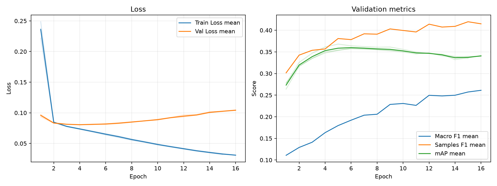

# 実験レポート: exp_resnet101_dbl

作成日: 2026-07-04

## 1. 共有用サマリ

### 1.1 この実験の位置づけ

- 何を改善しようとしたか: TODO
- ベースラインまたは直前実験から変えたこと: TODO
- 主評価指標 mAP の結果をどう判断するか: TODO
- 何がダメだったか / まだ残っている問題: TODO

### 1.2 自動要約

- 主評価指標の validation mAP は 0.3611 です（標準比較: validation split, 0.5 固定しきい値）。
- 補助指標は Macro F1=0.1878, Samples F1=0.3736, Hamming Loss=0.1111 です。
- 閾値最適化は行っていません。実験比較の主指標は、閾値に依存しない validation mAP です。
- この実験の validation mAP は 0.3611 です。
- 主比較 `exp_resnet101_bce` の validation mAP は 0.3895 で、今回との差は -0.0284 です。
- 同じ実験グループで 3 件の seed 結果を集計しました。
- validation mAP は平均 0.3611、標準偏差 0.0059 です。

### 1.3 採用判断

- 採用判断: TODO（採用 / 条件付き採用 / 不採用 / 保留）
- 判断理由: TODO
- 次に試すこと: TODO

## 2. 他実験との比較

`config.yaml` で明示した主比較と参考実験だけを、validation mAP を中心に比較します。test split は最終モデル選定後まで使いません。

| 実験 | 役割 | method | validation mAP | mAP 標準偏差 | 今回との差 | Macro F1 | Samples F1 | Hamming Loss | 予測ジャンル数/作品 |
| --- | --- | --- | --- | --- | --- | --- | --- | --- | --- |
| exp_resnet101_dbl | 今回 | 0.5 固定 | 0.3611 | 0.0059 | - | 0.1878 | 0.3736 | 0.1111 | 0.9762 |
| exp_resnet101_bce | 主比較 | 0.5 固定 | 0.3895 | 0.0071 | -0.0284 | 0.2734 | 0.4355 | 0.1110 | 1.3610 |
| exp_resnet101_asl | 参考 | 0.5 固定 | 0.3825 | 0.0083 | -0.0214 | 0.3903 | 0.4935 | 0.2091 | 5.1374 |
| exp_resnet101_weighted_bce | 参考 | 0.5 固定 | 0.3938 | 0.0073 | -0.0327 | 0.3981 | 0.5067 | 0.1329 | 2.6001 |
| baseline | 参考 | 0.5 固定 | 0.2876 | 0.0005 | +0.0735 | 0.1515 | 0.3237 | 0.1209 | 0.9905 |

### 2.1 複数 seed 集計

seed 集計グループ: `exp_resnet101_dbl`

| 指標 | runs | 平均 | 標準偏差 | 最小 | 最大 |
| --- | --- | --- | --- | --- | --- |
| validation mAP | 3 | 0.3611 | 0.0059 | 0.3574 | 0.3680 |
| Macro F1 | 3 | 0.1878 | 0.0030 | 0.1844 | 0.1899 |
| Samples F1 | 3 | 0.3736 | 0.0101 | 0.3619 | 0.3796 |
| Hamming Loss | 3 | 0.1111 | 0.0005 | 0.1106 | 0.1114 |
| 予測ジャンル数/作品 | 3 | 0.9762 | 0.0263 | 0.9492 | 1.0018 |

#### seed 別結果

| 実験 | seed | best epoch | epochs ran | early stopped | validation mAP | Macro F1 | Samples F1 | Hamming Loss | 予測ジャンル数/作品 |
| --- | --- | --- | --- | --- | --- | --- | --- | --- | --- |
| exp_resnet101_dbl | 42 |  |  |  | 0.3580 | 0.1890 | 0.3619 | 0.1114 | 0.9492 |
| exp_resnet101_dbl | 43 |  |  |  | 0.3680 | 0.1899 | 0.3796 | 0.1113 | 1.0018 |
| exp_resnet101_dbl | 44 |  |  |  | 0.3574 | 0.1844 | 0.3793 | 0.1106 | 0.9777 |

## 3. 実験の目的と変更

### 3.1 背景

TODO: ベースラインまたは前回実験にどの問題があったかを書く。

### 3.2 仮説

TODO: なぜ今回の変更で mAP が改善すると考えたかを書く。

### 3.3 検証した変更

| 種類 | 内容 | mAP 改善につながると考えた理由 |
|---|---|---|
| モデル / loss / augmentation / threshold など | TODO | TODO |

### 3.4 比較条件

- 主比較: `exp_resnet101_bce`
- 参考実験: `exp_resnet101_asl`, `exp_resnet101_weighted_bce`, `baseline`
- 変えたもの: TODO
- 変えていないもの: TODO
- 主評価指標: validation mAP
- 補助指標: Macro F1, Samples F1, Hamming Loss, ジャンル別 AP/F1
- test split: 最終モデル選定後まで使用しない

### 3.5 主な設定

| 項目 | 値 |
| --- | --- |
| seed | 42 |
| seeds | 42, 43, 44 |
| device | auto |
| comparison | {"primary": "exp_resnet101_bce", "references": ["exp_resnet101_asl", "exp_resnet101_weighted_bce", "baseline"]} |
| epochs | 50 |
| early_stopping | {"enabled": true, "monitor": "mAP", "mode": "max", "patience": 10, "min_delta": 0.001, "min_epochs": 10} |
| batch_size | 64 |
| learning_rate | 5e-5 |
| num_workers | 2 |
| image_size | 224 |
| compile | True |
| max_train_samples |  |
| max_val_samples |  |
| output_dir | outputs |
| best_model_name | best_model.pth |
| metrics_name | metrics.csv |

### 3.6 再現コマンド

```bash
uv run python experiments/exp_resnet101_dbl/run_exp.py
uv run python experiments/exp_resnet101_dbl/analyze.py
uv run python experiments/exp_resnet101_dbl/make_report.py
```

## 4. 学習ログ

### 4.1 代表 epoch

_該当するデータが見つかりませんでした。_

### 4.2 学習曲線



### 4.3 読み取りメモ

- Train Loss と Val Loss の差が開く場合は、過学習を疑う。
- 主評価指標は mAP。mAP 最大 epoch と最終 epoch の差を見る。
- F1 はしきい値で 0/1 にした後の補助指標。mAP が改善していても F1 が悪い場合は threshold 設計を疑う。
- Hamming Loss は低いほど良いが、何も予測しないモデルでも低く見える場合がある。

## 5. 全体評価

| split | method | Macro F1 | macro_f1_std | Samples F1 | samples_f1_std | Hamming Loss | hamming_loss_std | mAP | mAP_std | 予測ジャンル数/作品 | predicted_labels_per_item_std |
| --- | --- | --- | --- | --- | --- | --- | --- | --- | --- | --- | --- |
| validation | 0.5 固定 | 0.1878 | 0.0030 | 0.3736 | 0.0101 | 0.1111 | 0.0005 | 0.3611 | 0.0059 | 0.9762 | 0.0263 |

### 5.1 mAP 中心の読み取り

- validation mAP が比較対象より上がったか: TODO
- validation mAP の改善幅は、偶然や seed 差より十分大きそうか: TODO
- mAP は上がったが補助指標が悪化した場合、その悪化を許容できるか: TODO

## 6. ジャンル別結果

### 6.1 主比較 `exp_resnet101_bce` とのジャンル別 AP 差分

| genre | 件数 | 比較AP | 現AP | AP差分 | 比較F1 | 現F1 | F1差分 | 比較Recall | 現Recall | Recall差分 | 比較Precision | 現Precision | Precision差分 |
| --- | --- | --- | --- | --- | --- | --- | --- | --- | --- | --- | --- | --- | --- |
| Supernatural | 133 | 0.2672 | 0.2791 | 0.0119 | 0.0939 | 0.0196 | -0.0743 | 0.0551 | 0.0100 | -0.0451 | 0.4223 | 0.5000 | 0.0777 |
| Horror | 39 | 0.1700 | 0.1677 | -0.0023 | 0.0303 | 0.0477 | 0.0174 | 0.0171 | 0.0256 | 0.0085 | 0.1333 | 0.5000 | 0.3667 |
| Sci-Fi | 157 | 0.3989 | 0.3937 | -0.0051 | 0.2926 | 0.2002 | -0.0924 | 0.2123 | 0.1189 | -0.0934 | 0.5607 | 0.6374 | 0.0767 |
| Hentai | 137 | 0.9246 | 0.9187 | -0.0058 | 0.8505 | 0.7995 | -0.0510 | 0.8248 | 0.7202 | -0.1046 | 0.8787 | 0.8999 | 0.0213 |
| Drama | 222 | 0.3642 | 0.3532 | -0.0110 | 0.2491 | 0.1439 | -0.1052 | 0.1877 | 0.0841 | -0.1036 | 0.4019 | 0.5089 | 0.1069 |
| Comedy | 487 | 0.7428 | 0.7308 | -0.0120 | 0.6533 | 0.6696 | 0.0163 | 0.6277 | 0.6913 | 0.0637 | 0.6815 | 0.6503 | -0.0312 |
| Slice of Life | 195 | 0.4295 | 0.4163 | -0.0131 | 0.3517 | 0.2813 | -0.0704 | 0.2752 | 0.1880 | -0.0872 | 0.5000 | 0.5652 | 0.0651 |
| Music | 58 | 0.2715 | 0.2565 | -0.0150 | 0.1274 | 0.0113 | -0.1161 | 0.0747 | 0.0057 | -0.0690 | 0.8444 | 0.3333 | -0.5111 |
| Mystery | 70 | 0.1787 | 0.1634 | -0.0153 | 0.0081 | 0 | -0.0081 | 0.0048 | 0 | -0.0048 | 0.0278 | 0 | -0.0278 |
| Ecchi | 80 | 0.2661 | 0.2446 | -0.0215 | 0.1080 | 0.0159 | -0.0921 | 0.0667 | 0.0083 | -0.0583 | 0.3664 | 0.1667 | -0.1997 |
| Mecha | 49 | 0.5140 | 0.4916 | -0.0224 | 0.3856 | 0.2558 | -0.1298 | 0.2789 | 0.1565 | -0.1224 | 0.6937 | 0.7310 | 0.0373 |
| Psychological | 54 | 0.1355 | 0.1123 | -0.0231 | 0.0119 | 0 | -0.0119 | 0.0062 | 0 | -0.0062 | 0.1667 | 0 | -0.1667 |
| Action | 305 | 0.6363 | 0.6084 | -0.0279 | 0.5782 | 0.5086 | -0.0696 | 0.5443 | 0.4219 | -0.1224 | 0.6247 | 0.6463 | 0.0216 |
| Romance | 167 | 0.4221 | 0.3900 | -0.0321 | 0.3951 | 0.2039 | -0.1912 | 0.3433 | 0.1218 | -0.2216 | 0.5340 | 0.6324 | 0.0984 |
| Mahou Shoujo | 22 | 0.1465 | 0.1055 | -0.0409 | 0.0790 | 0.0256 | -0.0533 | 0.0455 | 0.0152 | -0.0303 | 0.3056 | 0.0833 | -0.2222 |
| Thriller | 18 | 0.1179 | 0.0618 | -0.0561 | 0 | 0 | 0 | 0 | 0 | 0 | 0 | 0 | 0 |
| Fantasy | 274 | 0.5434 | 0.4786 | -0.0649 | 0.3873 | 0.1792 | -0.2081 | 0.2944 | 0.1058 | -0.1886 | 0.6204 | 0.6127 | -0.0078 |
| Adventure | 175 | 0.4101 | 0.3443 | -0.0659 | 0.2948 | 0.1390 | -0.1558 | 0.2133 | 0.0838 | -0.1295 | 0.5050 | 0.4392 | -0.0658 |
| Sports | 61 | 0.4617 | 0.3452 | -0.1165 | 0.2970 | 0.0663 | -0.2307 | 0.1803 | 0.0383 | -0.1421 | 0.8434 | 0.5152 | -0.3283 |

### 6.2 AP が高いジャンル

| genre | 件数 | 陽性予測数 | Precision | Recall | F1 | AP |
| --- | --- | --- | --- | --- | --- | --- |
| Hentai | 137 | 109.667 | 0.8999 | 0.7202 | 0.7995 | 0.9187 |
| Comedy | 487 | 518.333 | 0.6503 | 0.6913 | 0.6696 | 0.7308 |
| Action | 305 | 199.333 | 0.6463 | 0.4219 | 0.5086 | 0.6084 |
| Mecha | 49 | 10.6667 | 0.7310 | 0.1565 | 0.2558 | 0.4916 |
| Fantasy | 274 | 47.6667 | 0.6127 | 0.1058 | 0.1792 | 0.4786 |
| Slice of Life | 195 | 65.3333 | 0.5652 | 0.1880 | 0.2813 | 0.4163 |
| Sci-Fi | 157 | 29.3333 | 0.6374 | 0.1189 | 0.2002 | 0.3937 |
| Romance | 167 | 32.3333 | 0.6324 | 0.1218 | 0.2039 | 0.3900 |

### 6.3 F1 が低いジャンル

| genre | 件数 | 陽性予測数 | Precision | Recall | F1 | AP |
| --- | --- | --- | --- | --- | --- | --- |
| Thriller | 18 | 0.3333 | 0 | 0 | 0 | 0.0618 |
| Psychological | 54 | 0 | 0 | 0 | 0 | 0.1123 |
| Mystery | 70 | 0 | 0 | 0 | 0 | 0.1634 |
| Music | 58 | 0.6667 | 0.3333 | 0.0057 | 0.0113 | 0.2565 |
| Ecchi | 80 | 1.3333 | 0.1667 | 0.0083 | 0.0159 | 0.2446 |
| Supernatural | 133 | 1.6667 | 0.5000 | 0.0100 | 0.0196 | 0.2791 |
| Mahou Shoujo | 22 | 1.6667 | 0.0833 | 0.0152 | 0.0256 | 0.1055 |
| Horror | 39 | 1.6667 | 0.5000 | 0.0256 | 0.0477 | 0.1677 |

### 6.4 考察の観点

- AP が高いジャンルは、モデルが順位付けできているジャンル。mAP 改善に寄与している可能性が高い。
- AP が低いジャンルは、特徴量・データ量・ラベルの曖昧さなどを疑う。
- AP は高いのに F1 が低いジャンルは、しきい値調整で改善する可能性がある。
- Precision が低いジャンルは、関係ない作品にもそのジャンルを付けすぎている。
- Recall が低いジャンルは、本当はそのジャンルの作品を見逃している。
- 件数が少ないジャンルは、少数の正解/不正解で指標が大きく動く。

## 7. 人が書く考察

### 7.1 何を改善しようとして、改善できたか

TODO

### 7.2 何がダメだったか / 想定と違ったか

TODO

### 7.3 原因仮説

| 仮説ID | 観察した結果 | 原因仮説 | 次の確認方法 |
|---|---|---|---|
| H1 | TODO | TODO | TODO |
| H2 | TODO | TODO | TODO |

### 7.4 他メンバーに共有したい注意点

TODO

### 7.5 次に試すこと

TODO

## 8. 生成元ファイル

| ファイル | 用途 |
| --- | --- |
| experiments/exp_resnet101_dbl/config.yaml | 実験設定 |
| 未生成 | epoch ごとの学習ログ |
| experiments/exp_resnet101_dbl/analysis/overall_model_metrics.csv | validation の全体指標 |
| experiments/exp_resnet101_dbl/analysis/genre_metrics_validation_threshold_0.5.csv | validation のジャンル別指標 |

### 8.1 analysis ディレクトリ内のファイル

- `analysis_summary.json`
- `genre_metrics_validation_threshold_0.5.csv`
- `learning_curves.png`
- `learning_curves.svg`
- `overall_model_metrics.csv`
- `seed_genre_metrics_validation_threshold_0.5.csv`
- `seed_overall_model_metrics.csv`
