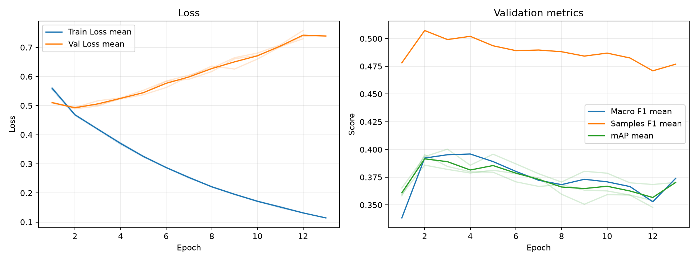

# 実験レポート: exp_resnet101_weighted_bce

作成日: 2026-07-03

## 1. 共有用サマリ

### 1.1 この実験の位置づけ

- 何を改善しようとしたか: TODO
- ベースラインまたは直前実験から変えたこと: TODO
- 主評価指標 mAP の結果をどう判断するか: TODO
- 何がダメだったか / まだ残っている問題: TODO

### 1.2 自動要約

- 主評価指標の validation mAP は 0.3938 です（標準比較: validation split, 0.5 固定しきい値）。
- 補助指標は Macro F1=0.3981, Samples F1=0.5067, Hamming Loss=0.1329 です。
- 閾値最適化は行っていません。実験比較の主指標は、閾値に依存しない validation mAP です。
- この実験の validation mAP は 0.3938 です。
- 主比較 `exp_resnet101_bce` の validation mAP は 0.3895 で、今回との差は +0.0043 です。
- 同じ実験グループで 3 件の seed 結果を集計しました。
- validation mAP は平均 0.3938、標準偏差 0.0073 です。

### 1.3 採用判断

- 採用判断: TODO（採用 / 条件付き採用 / 不採用 / 保留）
- 判断理由: TODO
- 次に試すこと: TODO

## 2. 他実験との比較

`config.yaml` で明示した主比較と参考実験だけを、validation mAP を中心に比較します。test split は最終モデル選定後まで使いません。

| 実験 | 役割 | method | validation mAP | mAP 標準偏差 | 今回との差 | Macro F1 | Samples F1 | Hamming Loss | 予測ジャンル数/作品 |
| --- | --- | --- | --- | --- | --- | --- | --- | --- | --- |
| exp_resnet101_weighted_bce | 今回 | 0.5 固定 | 0.3938 | 0.0073 | - | 0.3981 | 0.5067 | 0.1329 | 2.6001 |
| exp_resnet101_bce | 主比較 | 0.5 固定 | 0.3895 | 0.0071 | +0.0043 | 0.2734 | 0.4355 | 0.1110 | 1.3610 |
| exp_weighted_bce | 参考 | 0.5 固定 | 0.3398 | 0.0017 | +0.0540 | 0.3318 | 0.4665 | 0.1417 | 2.5305 |

### 2.1 複数 seed 集計

seed 集計グループ: `exp_resnet101_weighted_bce`

| 指標 | runs | 平均 | 標準偏差 | 最小 | 最大 |
| --- | --- | --- | --- | --- | --- |
| validation mAP | 3 | 0.3938 | 0.0073 | 0.3859 | 0.4003 |
| Macro F1 | 3 | 0.3981 | 0.0051 | 0.3923 | 0.4021 |
| Samples F1 | 3 | 0.5067 | 0.0013 | 0.5052 | 0.5077 |
| Hamming Loss | 3 | 0.1329 | 0.0026 | 0.1303 | 0.1355 |
| 予測ジャンル数/作品 | 3 | 2.6001 | 0.0937 | 2.4951 | 2.6753 |

#### seed 別結果

| 実験 | seed | best epoch | epochs ran | early stopped | validation mAP | Macro F1 | Samples F1 | Hamming Loss | 予測ジャンル数/作品 |
| --- | --- | --- | --- | --- | --- | --- | --- | --- | --- |
| exp_resnet101_weighted_bce | 42 | 2 | 12 | True | 0.3859 | 0.3923 | 0.5072 | 0.1303 | 2.4951 |
| exp_resnet101_weighted_bce | 43 | 3 | 13 | True | 0.4003 | 0.4021 | 0.5052 | 0.1355 | 2.6753 |
| exp_resnet101_weighted_bce | 44 | 2 | 12 | True | 0.3952 | 0.3997 | 0.5077 | 0.1329 | 2.6298 |

## 3. 実験の目的と変更

### 3.1 背景

TODO: ベースラインまたは前回実験にどの問題があったかを書く。

### 3.2 仮説

TODO: なぜ今回の変更で mAP が改善すると考えたかを書く。

### 3.3 検証した変更

| 種類 | 内容 | mAP 改善につながると考えた理由 |
|---|---|---|
| モデル / loss / augmentation / threshold など | TODO | TODO |

### 3.4 比較条件

- 主比較: `exp_resnet101_bce`
- 参考実験: `exp_weighted_bce`
- 変えたもの: TODO
- 変えていないもの: TODO
- 主評価指標: validation mAP
- 補助指標: Macro F1, Samples F1, Hamming Loss, ジャンル別 AP/F1
- test split: 最終モデル選定後まで使用しない

### 3.5 主な設定

| 項目 | 値 |
| --- | --- |
| seed | 42 |
| seeds | 42, 43, 44 |
| device | auto |
| comparison | {"primary": "exp_resnet101_bce", "references": ["exp_weighted_bce"]} |
| epochs | 50 |
| early_stopping | {"enabled": true, "monitor": "mAP", "mode": "max", "patience": 10, "min_delta": 0.001, "min_epochs": 10} |
| batch_size | 64 |
| learning_rate | 5e-5 |
| num_workers | 2 |
| image_size | 224 |
| compile | True |
| max_train_samples |  |
| max_val_samples |  |
| output_dir | outputs |
| best_model_name | best_model.pth |
| metrics_name | metrics.csv |

### 3.6 再現コマンド

```bash
uv run python experiments/exp_resnet101_weighted_bce/run_exp.py
uv run python experiments/exp_resnet101_weighted_bce/analyze.py
uv run python experiments/exp_resnet101_weighted_bce/make_report.py
```

## 4. 学習ログ

### 4.1 代表 epoch

| seed | 観点 | Epoch | Train Loss | Val Loss | Macro F1 | Samples F1 | Hamming Loss | mAP |
| --- | --- | --- | --- | --- | --- | --- | --- | --- |
| 42 | 最終 | 12 | 0.1316 | 0.7581 | 0.3497 | 0.4762 | 0.1373 | 0.3539 |
| 42 | Val Loss 最小 | 2 | 0.4692 | 0.4936 | 0.3923 | 0.5072 | 0.1303 | 0.3859 |
| 42 | mAP 最大 | 2 | 0.4692 | 0.4936 | 0.3923 | 0.5072 | 0.1303 | 0.3859 |
| 42 | Macro F1 最大 | 4 | 0.3724 | 0.5266 | 0.3935 | 0.5051 | 0.1345 | 0.3788 |
| 42 | Samples F1 最大 | 2 | 0.4692 | 0.4936 | 0.3923 | 0.5072 | 0.1303 | 0.3859 |
| 43 | 最終 | 13 | 0.1142 | 0.7392 | 0.3739 | 0.4769 | 0.1307 | 0.3703 |
| 43 | Val Loss 最小 | 2 | 0.4665 | 0.4949 | 0.3847 | 0.5069 | 0.1282 | 0.3936 |
| 43 | mAP 最大 | 3 | 0.4175 | 0.5029 | 0.4021 | 0.5052 | 0.1355 | 0.4003 |
| 43 | Macro F1 最大 | 5 | 0.3237 | 0.5374 | 0.4089 | 0.5016 | 0.1376 | 0.3958 |
| 43 | Samples F1 最大 | 2 | 0.4665 | 0.4949 | 0.3847 | 0.5069 | 0.1282 | 0.3936 |
| 44 | 最終 | 12 | 0.1316 | 0.7297 | 0.3412 | 0.4629 | 0.1405 | 0.3478 |
| 44 | Val Loss 最小 | 2 | 0.4698 | 0.4892 | 0.3997 | 0.5077 | 0.1329 | 0.3952 |
| 44 | mAP 最大 | 2 | 0.4698 | 0.4892 | 0.3997 | 0.5077 | 0.1329 | 0.3952 |
| 44 | Macro F1 最大 | 3 | 0.4207 | 0.4985 | 0.4066 | 0.5000 | 0.1370 | 0.3847 |
| 44 | Samples F1 最大 | 2 | 0.4698 | 0.4892 | 0.3997 | 0.5077 | 0.1329 | 0.3952 |

### 4.2 学習曲線



### 4.3 読み取りメモ

- Train Loss と Val Loss の差が開く場合は、過学習を疑う。
- 主評価指標は mAP。mAP 最大 epoch と最終 epoch の差を見る。
- F1 はしきい値で 0/1 にした後の補助指標。mAP が改善していても F1 が悪い場合は threshold 設計を疑う。
- Hamming Loss は低いほど良いが、何も予測しないモデルでも低く見える場合がある。

## 5. 全体評価

| split | method | Macro F1 | macro_f1_std | Samples F1 | samples_f1_std | Hamming Loss | hamming_loss_std | mAP | mAP_std | 予測ジャンル数/作品 | predicted_labels_per_item_std |
| --- | --- | --- | --- | --- | --- | --- | --- | --- | --- | --- | --- |
| validation | 0.5 固定 | 0.3981 | 0.0051 | 0.5067 | 0.0013 | 0.1329 | 0.0026 | 0.3938 | 0.0073 | 2.6001 | 0.0937 |

### 5.1 mAP 中心の読み取り

- validation mAP が比較対象より上がったか: TODO
- validation mAP の改善幅は、偶然や seed 差より十分大きそうか: TODO
- mAP は上がったが補助指標が悪化した場合、その悪化を許容できるか: TODO

## 6. ジャンル別結果

### 6.1 主比較 `exp_resnet101_bce` とのジャンル別 AP 差分

| genre | 件数 | 比較AP | 現AP | AP差分 | 比較F1 | 現F1 | F1差分 | 比較Recall | 現Recall | Recall差分 | 比較Precision | 現Precision | Precision差分 |
| --- | --- | --- | --- | --- | --- | --- | --- | --- | --- | --- | --- | --- | --- |
| Mahou Shoujo | 22 | 0.1465 | 0.1935 | 0.0470 | 0.0790 | 0.2279 | 0.1489 | 0.0455 | 0.2424 | 0.1970 | 0.3056 | 0.2203 | -0.0852 |
| Music | 58 | 0.2715 | 0.2962 | 0.0247 | 0.1274 | 0.3160 | 0.1886 | 0.0747 | 0.2644 | 0.1897 | 0.8444 | 0.4079 | -0.4366 |
| Mystery | 70 | 0.1787 | 0.2034 | 0.0247 | 0.0081 | 0.2496 | 0.2415 | 0.0048 | 0.2857 | 0.2810 | 0.0278 | 0.2262 | 0.1984 |
| Sports | 61 | 0.4617 | 0.4847 | 0.0230 | 0.2970 | 0.4793 | 0.1823 | 0.1803 | 0.5191 | 0.3388 | 0.8434 | 0.4613 | -0.3821 |
| Horror | 39 | 0.1700 | 0.1912 | 0.0212 | 0.0303 | 0.2418 | 0.2115 | 0.0171 | 0.2222 | 0.2051 | 0.1333 | 0.2660 | 0.1326 |
| Sci-Fi | 157 | 0.3989 | 0.4147 | 0.0158 | 0.2926 | 0.3949 | 0.1022 | 0.2123 | 0.3864 | 0.1741 | 0.5607 | 0.4286 | -0.1321 |
| Slice of Life | 195 | 0.4295 | 0.4422 | 0.0127 | 0.3517 | 0.4495 | 0.0979 | 0.2752 | 0.4530 | 0.1778 | 0.5000 | 0.4494 | -0.0506 |
| Comedy | 487 | 0.7428 | 0.7538 | 0.0110 | 0.6533 | 0.6785 | 0.0252 | 0.6277 | 0.6872 | 0.0595 | 0.6815 | 0.6709 | -0.0106 |
| Drama | 222 | 0.3642 | 0.3713 | 0.0070 | 0.2491 | 0.4335 | 0.1844 | 0.1877 | 0.5210 | 0.3333 | 0.4019 | 0.3717 | -0.0302 |
| Romance | 167 | 0.4221 | 0.4259 | 0.0037 | 0.3951 | 0.4349 | 0.0398 | 0.3433 | 0.5170 | 0.1737 | 0.5340 | 0.3798 | -0.1542 |
| Supernatural | 133 | 0.2672 | 0.2648 | -0.0023 | 0.0939 | 0.2548 | 0.1609 | 0.0551 | 0.2356 | 0.1805 | 0.4223 | 0.2843 | -0.1381 |
| Psychological | 54 | 0.1355 | 0.1293 | -0.0062 | 0.0119 | 0.1502 | 0.1383 | 0.0062 | 0.1420 | 0.1358 | 0.1667 | 0.1619 | -0.0047 |
| Action | 305 | 0.6363 | 0.6287 | -0.0075 | 0.5782 | 0.6075 | 0.0293 | 0.5443 | 0.6634 | 0.1191 | 0.6247 | 0.5615 | -0.0631 |
| Hentai | 137 | 0.9246 | 0.9134 | -0.0112 | 0.8505 | 0.8590 | 0.0084 | 0.8248 | 0.8978 | 0.0730 | 0.8787 | 0.8236 | -0.0551 |
| Adventure | 175 | 0.4101 | 0.3984 | -0.0117 | 0.2948 | 0.4159 | 0.1211 | 0.2133 | 0.4762 | 0.2629 | 0.5050 | 0.3861 | -0.1189 |
| Ecchi | 80 | 0.2661 | 0.2542 | -0.0119 | 0.1080 | 0.2545 | 0.1465 | 0.0667 | 0.2458 | 0.1792 | 0.3664 | 0.2658 | -0.1006 |
| Mecha | 49 | 0.5140 | 0.5005 | -0.0135 | 0.3856 | 0.4699 | 0.0844 | 0.2789 | 0.5374 | 0.2585 | 0.6937 | 0.4527 | -0.2409 |
| Fantasy | 274 | 0.5434 | 0.5259 | -0.0175 | 0.3873 | 0.5082 | 0.1209 | 0.2944 | 0.4757 | 0.1813 | 0.6204 | 0.5607 | -0.0597 |
| Thriller | 18 | 0.1179 | 0.0906 | -0.0273 | 0 | 0.1374 | 0.1374 | 0 | 0.1481 | 0.1481 | 0 | 0.1299 | 0.1299 |

### 6.2 AP が高いジャンル

| genre | 件数 | 陽性予測数 | Precision | Recall | F1 | AP |
| --- | --- | --- | --- | --- | --- | --- |
| Hentai | 137 | 149.333 | 0.8236 | 0.8978 | 0.8590 | 0.9134 |
| Comedy | 487 | 499 | 0.6709 | 0.6872 | 0.6785 | 0.7538 |
| Action | 305 | 360.667 | 0.5615 | 0.6634 | 0.6075 | 0.6287 |
| Fantasy | 274 | 235 | 0.5607 | 0.4757 | 0.5082 | 0.5259 |
| Mecha | 49 | 63.6667 | 0.4527 | 0.5374 | 0.4699 | 0.5005 |
| Sports | 61 | 71.6667 | 0.4613 | 0.5191 | 0.4793 | 0.4847 |
| Slice of Life | 195 | 197 | 0.4494 | 0.4530 | 0.4495 | 0.4422 |
| Romance | 167 | 229 | 0.3798 | 0.5170 | 0.4349 | 0.4259 |

### 6.3 F1 が低いジャンル

| genre | 件数 | 陽性予測数 | Precision | Recall | F1 | AP |
| --- | --- | --- | --- | --- | --- | --- |
| Thriller | 18 | 21.6667 | 0.1299 | 0.1481 | 0.1374 | 0.0906 |
| Psychological | 54 | 46.6667 | 0.1619 | 0.1420 | 0.1502 | 0.1293 |
| Mahou Shoujo | 22 | 23.6667 | 0.2203 | 0.2424 | 0.2279 | 0.1935 |
| Horror | 39 | 32.6667 | 0.2660 | 0.2222 | 0.2418 | 0.1912 |
| Mystery | 70 | 88.6667 | 0.2262 | 0.2857 | 0.2496 | 0.2034 |
| Ecchi | 80 | 73 | 0.2658 | 0.2458 | 0.2545 | 0.2542 |
| Supernatural | 133 | 109.333 | 0.2843 | 0.2356 | 0.2548 | 0.2648 |
| Music | 58 | 37.6667 | 0.4079 | 0.2644 | 0.3160 | 0.2962 |

### 6.4 考察の観点

- AP が高いジャンルは、モデルが順位付けできているジャンル。mAP 改善に寄与している可能性が高い。
- AP が低いジャンルは、特徴量・データ量・ラベルの曖昧さなどを疑う。
- AP は高いのに F1 が低いジャンルは、しきい値調整で改善する可能性がある。
- Precision が低いジャンルは、関係ない作品にもそのジャンルを付けすぎている。
- Recall が低いジャンルは、本当はそのジャンルの作品を見逃している。
- 件数が少ないジャンルは、少数の正解/不正解で指標が大きく動く。

## 7. 人が書く考察

### 7.1 何を改善しようとして、改善できたか

TODO

### 7.2 何がダメだったか / 想定と違ったか

TODO

### 7.3 原因仮説

| 仮説ID | 観察した結果 | 原因仮説 | 次の確認方法 |
|---|---|---|---|
| H1 | TODO | TODO | TODO |
| H2 | TODO | TODO | TODO |

### 7.4 他メンバーに共有したい注意点

TODO

### 7.5 次に試すこと

TODO

## 8. 生成元ファイル

| ファイル | 用途 |
| --- | --- |
| experiments/exp_resnet101_weighted_bce/config.yaml | 実験設定 |
| experiments/exp_resnet101_weighted_bce/outputs/seed_42/metrics.csv | epoch ごとの学習ログ (seed=42) |
| experiments/exp_resnet101_weighted_bce/outputs/seed_43/metrics.csv | epoch ごとの学習ログ (seed=43) |
| experiments/exp_resnet101_weighted_bce/outputs/seed_44/metrics.csv | epoch ごとの学習ログ (seed=44) |
| experiments/exp_resnet101_weighted_bce/analysis/overall_model_metrics.csv | validation の全体指標 |
| experiments/exp_resnet101_weighted_bce/analysis/genre_metrics_validation_threshold_0.5.csv | validation のジャンル別指標 |

### 8.1 analysis ディレクトリ内のファイル

- `analysis_summary.json`
- `genre_metrics_validation_threshold_0.5.csv`
- `learning_curves.png`
- `learning_curves.svg`
- `overall_model_metrics.csv`
- `seed_genre_metrics_validation_threshold_0.5.csv`
- `seed_overall_model_metrics.csv`
