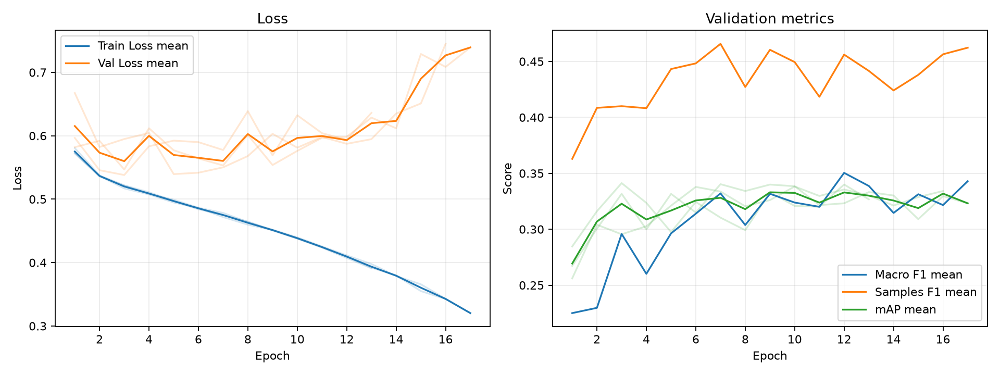

# 実験レポート: exp_weighted_bce

作成日: 2026-07-02

## 1. 共有用サマリ

### 1.1 この実験の位置づけ

- 何を改善しようとしたか: TODO
- ベースラインまたは直前実験から変えたこと: TODO
- 主評価指標 mAP の結果をどう判断するか: TODO
- 何がダメだったか / まだ残っている問題: TODO

### 1.2 自動要約

- 主評価指標の validation mAP は 0.3398 です（標準比較: validation split, 0.5 固定しきい値）。
- 補助指標は Macro F1=0.3318, Samples F1=0.4665, Hamming Loss=0.1417 です。
- 閾値最適化は行っていません。実験比較の主指標は、閾値に依存しない validation mAP です。
- この実験の validation mAP は 0.3398 です。
- 主比較 `exp_bce` の validation mAP は 0.3500 で、今回との差は -0.0102 です。
- 同じ実験グループで 3 件の seed 結果を集計しました。
- validation mAP は平均 0.3398、標準偏差 0.0017 です。

### 1.3 採用判断

- 採用判断: TODO（採用 / 条件付き採用 / 不採用 / 保留）
- 判断理由: TODO
- 次に試すこと: TODO

## 2. 他実験との比較

`config.yaml` で明示した主比較と参考実験だけを、validation mAP を中心に比較します。test split は最終モデル選定後まで使いません。

| 実験 | 役割 | method | validation mAP | mAP 標準偏差 | 今回との差 | Macro F1 | Samples F1 | Hamming Loss | 予測ジャンル数/作品 |
| --- | --- | --- | --- | --- | --- | --- | --- | --- | --- |
| exp_weighted_bce | 今回 | 0.5 固定 | 0.3398 | 0.0017 | - | 0.3318 | 0.4665 | 0.1417 | 2.5305 |
| exp_bce | 主比較 | 0.5 固定 | 0.3500 | 0.0035 | -0.0102 | 0.2458 | 0.4156 | 0.1193 | 1.4686 |
| exp_asl | 参考 | 0.5 固定 | 0.3493 | 0.0063 | -0.0095 | 0.3495 | 0.4779 | 0.2085 | 4.8472 |

### 2.1 複数 seed 集計

seed 集計グループ: `exp_weighted_bce`

| 指標 | runs | 平均 | 標準偏差 | 最小 | 最大 |
| --- | --- | --- | --- | --- | --- |
| validation mAP | 3 | 0.3398 | 0.0017 | 0.3379 | 0.3412 |
| Macro F1 | 3 | 0.3318 | 0.0168 | 0.3126 | 0.3437 |
| Samples F1 | 3 | 0.4665 | 0.0186 | 0.4493 | 0.4862 |
| Hamming Loss | 3 | 0.1417 | 0.0106 | 0.1320 | 0.1531 |
| 予測ジャンル数/作品 | 3 | 2.5305 | 0.4161 | 2.0919 | 2.9197 |

#### seed 別結果

| 実験 | seed | best epoch | epochs ran | early stopped | validation mAP | Macro F1 | Samples F1 | Hamming Loss | 予測ジャンル数/作品 |
| --- | --- | --- | --- | --- | --- | --- | --- | --- | --- |
| exp_weighted_bce | 42 | 7 | 17 | True | 0.3403 | 0.3437 | 0.4862 | 0.1401 | 2.5798 |
| exp_weighted_bce | 43 | 6 | 16 | True | 0.3379 | 0.3391 | 0.4639 | 0.1531 | 2.9197 |
| exp_weighted_bce | 44 | 3 | 13 | True | 0.3412 | 0.3126 | 0.4493 | 0.1320 | 2.0919 |

## 3. 実験の目的と変更

### 3.1 背景

TODO: ベースラインまたは前回実験にどの問題があったかを書く。

### 3.2 仮説

TODO: なぜ今回の変更で mAP が改善すると考えたかを書く。

### 3.3 検証した変更

| 種類 | 内容 | mAP 改善につながると考えた理由 |
|---|---|---|
| モデル / loss / augmentation / threshold など | TODO | TODO |

### 3.4 比較条件

- 主比較: `exp_bce`
- 参考実験: `exp_asl`
- 変えたもの: TODO
- 変えていないもの: TODO
- 主評価指標: validation mAP
- 補助指標: Macro F1, Samples F1, Hamming Loss, ジャンル別 AP/F1
- test split: 最終モデル選定後まで使用しない

### 3.5 主な設定

| 項目 | 値 |
| --- | --- |
| seed | 42 |
| seeds | 42, 43, 44 |
| device | auto |
| comparison | {"primary": "exp_bce", "references": ["exp_asl"]} |
| epochs | 50 |
| early_stopping | {"enabled": true, "monitor": "mAP", "mode": "max", "patience": 10, "min_delta": 0.001, "min_epochs": 10} |
| batch_size | 64 |
| learning_rate | 0.0010 |
| num_workers | 2 |
| image_size | 224 |
| compile | True |
| max_train_samples |  |
| max_val_samples |  |
| output_dir | outputs |
| best_model_name | best_model.pth |
| metrics_name | metrics.csv |

### 3.6 再現コマンド

```bash
uv run python experiments/exp_weighted_bce/run_exp.py
uv run python experiments/exp_weighted_bce/analyze.py
uv run python experiments/exp_weighted_bce/make_report.py
```

## 4. 学習ログ

### 4.1 代表 epoch

| seed | 観点 | Epoch | Train Loss | Val Loss | Macro F1 | Samples F1 | Hamming Loss | mAP |
| --- | --- | --- | --- | --- | --- | --- | --- | --- |
| 42 | 最終 | 17 | 0.3204 | 0.7393 | 0.3430 | 0.4623 | 0.1490 | 0.3232 |
| 42 | Val Loss 最小 | 3 | 0.5218 | 0.5468 | 0.3424 | 0.4416 | 0.1722 | 0.3317 |
| 42 | mAP 最大 | 7 | 0.4751 | 0.5533 | 0.3437 | 0.4862 | 0.1401 | 0.3403 |
| 42 | Macro F1 最大 | 13 | 0.3920 | 0.6287 | 0.3466 | 0.4427 | 0.1603 | 0.3332 |
| 42 | Samples F1 最大 | 7 | 0.4751 | 0.5533 | 0.3437 | 0.4862 | 0.1401 | 0.3403 |
| 43 | 最終 | 16 | 0.3428 | 0.7450 | 0.3092 | 0.4469 | 0.1486 | 0.3342 |
| 43 | Val Loss 最小 | 5 | 0.4992 | 0.5396 | 0.3132 | 0.4279 | 0.1440 | 0.3211 |
| 43 | mAP 最大 | 10 | 0.4398 | 0.5813 | 0.3356 | 0.4760 | 0.1539 | 0.3382 |
| 43 | Macro F1 最大 | 12 | 0.4114 | 0.5873 | 0.3498 | 0.4280 | 0.1832 | 0.3356 |
| 43 | Samples F1 最大 | 10 | 0.4398 | 0.5813 | 0.3356 | 0.4760 | 0.1539 | 0.3382 |
| 44 | 最終 | 13 | 0.3910 | 0.6361 | 0.3297 | 0.4447 | 0.1539 | 0.3267 |
| 44 | Val Loss 最小 | 3 | 0.5170 | 0.5381 | 0.3126 | 0.4493 | 0.1320 | 0.3412 |
| 44 | mAP 最大 | 3 | 0.5170 | 0.5381 | 0.3126 | 0.4493 | 0.1320 | 0.3412 |
| 44 | Macro F1 最大 | 12 | 0.4074 | 0.5936 | 0.3642 | 0.4876 | 0.1554 | 0.3400 |
| 44 | Samples F1 最大 | 12 | 0.4074 | 0.5936 | 0.3642 | 0.4876 | 0.1554 | 0.3400 |

### 4.2 学習曲線



### 4.3 読み取りメモ

- Train Loss と Val Loss の差が開く場合は、過学習を疑う。
- 主評価指標は mAP。mAP 最大 epoch と最終 epoch の差を見る。
- F1 はしきい値で 0/1 にした後の補助指標。mAP が改善していても F1 が悪い場合は threshold 設計を疑う。
- Hamming Loss は低いほど良いが、何も予測しないモデルでも低く見える場合がある。

## 5. 全体評価

| split | method | Macro F1 | macro_f1_std | Samples F1 | samples_f1_std | Hamming Loss | hamming_loss_std | mAP | mAP_std | 予測ジャンル数/作品 | predicted_labels_per_item_std |
| --- | --- | --- | --- | --- | --- | --- | --- | --- | --- | --- | --- |
| validation | 0.5 固定 | 0.3318 | 0.0168 | 0.4665 | 0.0186 | 0.1417 | 0.0106 | 0.3398 | 0.0017 | 2.5305 | 0.4161 |

### 5.1 mAP 中心の読み取り

- validation mAP が比較対象より上がったか: TODO
- validation mAP の改善幅は、偶然や seed 差より十分大きそうか: TODO
- mAP は上がったが補助指標が悪化した場合、その悪化を許容できるか: TODO

## 6. ジャンル別結果

### 6.1 主比較 `exp_bce` とのジャンル別 AP 差分

| genre | 件数 | 比較AP | 現AP | AP差分 | 比較F1 | 現F1 | F1差分 | 比較Recall | 現Recall | Recall差分 | 比較Precision | 現Precision | Precision差分 |
| --- | --- | --- | --- | --- | --- | --- | --- | --- | --- | --- | --- | --- | --- |
| Romance | 167 | 0.3308 | 0.3718 | 0.0410 | 0.3022 | 0.3669 | 0.0648 | 0.3054 | 0.3673 | 0.0619 | 0.3609 | 0.3808 | 0.0198 |
| Horror | 39 | 0.1648 | 0.2055 | 0.0407 | 0.0839 | 0.2010 | 0.1171 | 0.0513 | 0.3419 | 0.2906 | 0.2778 | 0.1562 | -0.1215 |
| Mystery | 70 | 0.1491 | 0.1719 | 0.0228 | 0 | 0.0824 | 0.0824 | 0 | 0.0571 | 0.0571 | 0 | 0.1672 | 0.1672 |
| Comedy | 487 | 0.7170 | 0.7358 | 0.0187 | 0.6361 | 0.6794 | 0.0433 | 0.5907 | 0.7057 | 0.1150 | 0.6991 | 0.6593 | -0.0398 |
| Slice of Life | 195 | 0.3922 | 0.3975 | 0.0053 | 0.2278 | 0.4345 | 0.2066 | 0.1692 | 0.4923 | 0.3231 | 0.4467 | 0.4078 | -0.0389 |
| Drama | 222 | 0.3435 | 0.3477 | 0.0042 | 0.1914 | 0.3277 | 0.1362 | 0.1306 | 0.2958 | 0.1652 | 0.3808 | 0.3859 | 0.0051 |
| Sci-Fi | 157 | 0.3439 | 0.3465 | 0.0026 | 0.1840 | 0.3398 | 0.1557 | 0.1104 | 0.3546 | 0.2442 | 0.5788 | 0.3369 | -0.2419 |
| Supernatural | 133 | 0.2089 | 0.2110 | 0.0021 | 0.0611 | 0.2287 | 0.1677 | 0.0351 | 0.2331 | 0.1980 | 0.6000 | 0.2435 | -0.3565 |
| Ecchi | 80 | 0.1735 | 0.1687 | -0.0048 | 0.1262 | 0.2220 | 0.0958 | 0.1458 | 0.2708 | 0.1250 | 0.2324 | 0.2186 | -0.0138 |
| Psychological | 54 | 0.1573 | 0.1455 | -0.0118 | 0 | 0.1109 | 0.1109 | 0 | 0.0864 | 0.0864 | 0 | 0.1745 | 0.1745 |
| Mahou Shoujo | 22 | 0.0832 | 0.0691 | -0.0140 | 0.0238 | 0.0630 | 0.0392 | 0.0152 | 0.1061 | 0.0909 | 0.0556 | 0.0453 | -0.0102 |
| Hentai | 137 | 0.9182 | 0.8999 | -0.0183 | 0.8161 | 0.8060 | -0.0101 | 0.8881 | 0.8662 | -0.0219 | 0.7590 | 0.7634 | 0.0043 |
| Sports | 61 | 0.3937 | 0.3736 | -0.0200 | 0.3652 | 0.3601 | -0.0052 | 0.2732 | 0.2678 | -0.0055 | 0.6211 | 0.5559 | -0.0652 |
| Action | 305 | 0.6029 | 0.5820 | -0.0210 | 0.5787 | 0.5890 | 0.0104 | 0.5923 | 0.6514 | 0.0590 | 0.5690 | 0.5448 | -0.0243 |
| Adventure | 175 | 0.3453 | 0.3223 | -0.0230 | 0.2993 | 0.3566 | 0.0573 | 0.2724 | 0.4514 | 0.1790 | 0.3773 | 0.3163 | -0.0610 |
| Fantasy | 274 | 0.5163 | 0.4875 | -0.0288 | 0.4099 | 0.4610 | 0.0512 | 0.3236 | 0.4343 | 0.1107 | 0.5704 | 0.5165 | -0.0539 |
| Thriller | 18 | 0.1038 | 0.0736 | -0.0302 | 0 | 0.1017 | 0.1017 | 0 | 0.0741 | 0.0741 | 0 | 0.1833 | 0.1833 |
| Music | 58 | 0.2621 | 0.2006 | -0.0615 | 0.0970 | 0.2279 | 0.1309 | 0.0517 | 0.1724 | 0.1207 | 1 | 0.4093 | -0.5907 |
| Mecha | 49 | 0.4437 | 0.3456 | -0.0981 | 0.2667 | 0.3456 | 0.0789 | 0.1837 | 0.3741 | 0.1905 | 0.5833 | 0.3867 | -0.1966 |

### 6.2 AP が高いジャンル

| genre | 件数 | 陽性予測数 | Precision | Recall | F1 | AP |
| --- | --- | --- | --- | --- | --- | --- |
| Hentai | 137 | 159 | 0.7634 | 0.8662 | 0.8060 | 0.8999 |
| Comedy | 487 | 523.667 | 0.6593 | 0.7057 | 0.6794 | 0.7358 |
| Action | 305 | 368.667 | 0.5448 | 0.6514 | 0.5890 | 0.5820 |
| Fantasy | 274 | 236.333 | 0.5165 | 0.4343 | 0.4610 | 0.4875 |
| Slice of Life | 195 | 245 | 0.4078 | 0.4923 | 0.4345 | 0.3975 |
| Sports | 61 | 29.3333 | 0.5559 | 0.2678 | 0.3601 | 0.3736 |
| Romance | 167 | 163.667 | 0.3808 | 0.3673 | 0.3669 | 0.3718 |
| Drama | 222 | 170.333 | 0.3859 | 0.2958 | 0.3277 | 0.3477 |

### 6.3 F1 が低いジャンル

| genre | 件数 | 陽性予測数 | Precision | Recall | F1 | AP |
| --- | --- | --- | --- | --- | --- | --- |
| Mahou Shoujo | 22 | 35 | 0.0453 | 0.1061 | 0.0630 | 0.0691 |
| Mystery | 70 | 27.3333 | 0.1672 | 0.0571 | 0.0824 | 0.1719 |
| Thriller | 18 | 8 | 0.1833 | 0.0741 | 0.1017 | 0.0736 |
| Psychological | 54 | 24.6667 | 0.1745 | 0.0864 | 0.1109 | 0.1455 |
| Horror | 39 | 94.6667 | 0.1562 | 0.3419 | 0.2010 | 0.2055 |
| Ecchi | 80 | 108.333 | 0.2186 | 0.2708 | 0.2220 | 0.1687 |
| Music | 58 | 28 | 0.4093 | 0.1724 | 0.2279 | 0.2006 |
| Supernatural | 133 | 130.333 | 0.2435 | 0.2331 | 0.2287 | 0.2110 |

### 6.4 考察の観点

- AP が高いジャンルは、モデルが順位付けできているジャンル。mAP 改善に寄与している可能性が高い。
- AP が低いジャンルは、特徴量・データ量・ラベルの曖昧さなどを疑う。
- AP は高いのに F1 が低いジャンルは、しきい値調整で改善する可能性がある。
- Precision が低いジャンルは、関係ない作品にもそのジャンルを付けすぎている。
- Recall が低いジャンルは、本当はそのジャンルの作品を見逃している。
- 件数が少ないジャンルは、少数の正解/不正解で指標が大きく動く。

## 7. 人が書く考察

### 7.1 何を改善しようとして、改善できたか

TODO

### 7.2 何がダメだったか / 想定と違ったか

TODO

### 7.3 原因仮説

| 仮説ID | 観察した結果 | 原因仮説 | 次の確認方法 |
|---|---|---|---|
| H1 | TODO | TODO | TODO |
| H2 | TODO | TODO | TODO |

### 7.4 他メンバーに共有したい注意点

TODO

### 7.5 次に試すこと

TODO

## 8. 生成元ファイル

| ファイル | 用途 |
| --- | --- |
| experiments/exp_weighted_bce/config.yaml | 実験設定 |
| experiments/exp_weighted_bce/outputs/seed_42/metrics.csv | epoch ごとの学習ログ (seed=42) |
| experiments/exp_weighted_bce/outputs/seed_43/metrics.csv | epoch ごとの学習ログ (seed=43) |
| experiments/exp_weighted_bce/outputs/seed_44/metrics.csv | epoch ごとの学習ログ (seed=44) |
| experiments/exp_weighted_bce/analysis/overall_model_metrics.csv | validation の全体指標 |
| experiments/exp_weighted_bce/analysis/genre_metrics_validation_threshold_0.5.csv | validation のジャンル別指標 |

### 8.1 analysis ディレクトリ内のファイル

- `analysis_summary.json`
- `genre_metrics_validation_threshold_0.5.csv`
- `learning_curves.png`
- `learning_curves.svg`
- `overall_model_metrics.csv`
- `seed_genre_metrics_validation_threshold_0.5.csv`
- `seed_overall_model_metrics.csv`
