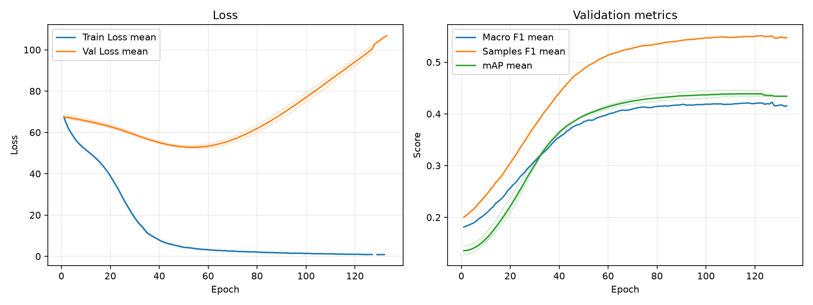

# 個人ベースライン実験レポート: kazusa-baseline

作成日: 2026-07-04

## 技術サマリ

この実験の目的は、グループ共通のベースラインを更新することではなく、今後の自分の実験で比較基準として使う**個人ベースライン**を確立することである。他のメンバーと結果を共有できるよう、グループ共通ベースラインである [`experiments/baseline`](../baseline/) を主比較に用いた。

モデルと学習方法は、[Asymmetric Loss for Multi-Label Classification](https://arxiv.org/abs/2009.14119) と[著者の公式実装](https://github.com/Alibaba-MIIL/ASL)を参考にした。具体的には、ImageNet-21K 事前学習済み TResNet 系モデル、ASL、640 px 入力、データ拡張、OneCycleLR、EMA を組み合わせている。

- **主指標の validation mAP は 0.4392 ± 0.0058 だった。** グループ共通ベースラインの 0.2876 ± 0.0005 より **+0.1516**、相対値で **+52.7%** 高い。改善幅は今回の3 seed間のばらつきより十分大きく、個人ベースラインとして再利用できる結果である。
- **0.5固定しきい値でも F1 は大幅に改善した。** Macro F1 は 0.1515 から 0.4220、Samples F1 は 0.3237 から 0.5504へ上昇した。ジャンル平均 Recall も 0.1324 から 0.4776へ上昇し、グループ共通ベースラインの強い見逃し傾向を緩和した。
- **改善はほぼ全ジャンルに広がっている。** 19ジャンル中18ジャンルでAPが改善し、特に `Sports`（+0.5257）、`Mecha`（+0.4083）、`Music`（+0.3462）の伸びが大きい。`Thriller` だけは AP 0.0332で、比較対象より -0.0036だった。
- **ただし、改善をASL単独の効果とは解釈できない。** 比較対象からは損失関数だけでなく、backbone、事前学習、入力解像度、データ拡張、optimizer、scheduler、EMA、実効batch sizeなども同時に変更している。本結果が示すのは「この学習構成全体が高性能だった」ことであり、各要因の寄与は未分離である。
- **0.5固定しきい値では陽性をやや多く出している。** 正解は平均 2.411ジャンル/作品だが、予測は平均 3.183ジャンル/作品である。このため Hamming Loss は 0.1209 から 0.1374へ悪化した。mAP改善と矛盾する結果ではなく、順位付け性能の向上とラベル決定・確率校正の問題を分けて扱う必要がある。

**判断:** この構成を今後の**個人ベースラインとして採用**する。一方、グループ共通ベースラインの置き換えやASLの有効性の証明には用いない。次の実験では、この構成を固定して一要因ずつ変更する。

## 1. 目的と比較の位置づけ

### 1.1 実験目的

グループ共通ベースラインは、ImageNet事前学習なしの ResNet18 と重みなし `BCEWithLogitsLoss` からなる、最小構成の比較基準である。この実験では、論文・公開実装で実績のあるマルチラベル分類用の学習レシピを現在のアニメジャンル分類へ移植し、自分が今後の改善実験で使う、より強い出発点を作ることを目的とした。

したがって、`baseline` との比較には次の役割がある。

- グループ内で共有されている既知の基準に対し、個人ベースラインの性能水準を示す。
- 実装変更後も、同じ validation split と評価指標で結果を比較できることを確認する。
- 個人ベースラインをグループ全体の標準手法として提案することや、個々の変更の効果を測定することは目的に含めない。

### 1.2 評価条件

| 項目 | 定義 |
| --- | --- |
| 予測対象 | 1作品につき19ジャンルの有無 |
| 主評価 split | validation、1,121作品 |
| 主評価指標 | クラス別 Average Precision の単純平均である mAP |
| 補助指標 | Macro F1、Samples F1、Hamming Loss、ジャンル別 AP / Precision / Recall / F1 |
| ラベル決定 | sigmoid確率 0.5以上を陽性 |
| seed | 42、43、44 |
| 主比較 | グループ共通の `baseline` |
| 参考比較 | 画像を使わない `simple-baseline` |
| testの扱い | モデル構成を確定するまで未使用 |

mAPは各ジャンル内で正例を上位に並べる能力を測り、0.5というしきい値には依存しない。F1とHamming Lossは0.5で二値化した結果である。このため、本レポートではmAPをモデル比較の主指標とし、F1とHamming Lossはラベル決定の性質を確認する補助指標として扱う。

## 2. 実装した個人ベースライン

### 2.1 モデルと学習設定

| 項目 | 設定 |
| --- | --- |
| backbone | `timm` の `tresnet_v2_l.miil_in21k` |
| 事前学習 | ImageNet-21K |
| 出力層 | biasなし19次元線形層 |
| 入力解像度 | 640 × 640 |
| train augmentation | RandomErasing (`p=0.25`) + RandAugment |
| validation前処理 | 640 × 640へのresize |
| 損失 | ASL (`gamma_neg=4`, `gamma_pos=0`, `clip=0.05`) |
| optimizer | AdamW、learning rate `1e-4` |
| scheduler | OneCycleLR、`pct_start=0.2` |
| batch size | 32、4 step勾配蓄積により実効batch size 128 |
| EMA | decay `0.9997` |
| 最大epoch | 200 |
| early stopping | validation mAP、patience 10、`min_delta=1e-4` |
| mixed precision | CUDA実行時に有効 |

ASLは、正例と負例に異なるfocusing parameterを適用する **asymmetric focusing** と、非常に容易な負例を損失から除外する **probability shifting** を組み合わせた損失である。今回の設定では `gamma_pos=0` として正例を減衰させず、`gamma_neg=4` で容易な負例の寄与を小さくし、`clip=0.05` で確率をshiftする。論文が対象とする「各画像には少数の正例と多数の負例がある」というマルチラベル分類の不均衡は、本データの19ジャンルに対して平均2.411個が正例という条件にも当てはまる。

### 2.2 グループ共通ベースラインからの変更

| 項目 | グループ共通 `baseline` | `kazusa-baseline` |
| --- | --- | --- |
| backbone | ResNet18 | TResNet-v2-L |
| 事前学習 | なし | ImageNet-21K |
| 損失 | BCEWithLogitsLoss | ASL |
| optimizer | Adam | AdamW |
| learning rate | 1e-3 | 1e-4 |
| scheduler | なし | OneCycleLR |
| 入力解像度 | 224 | 640 |
| augmentation | なし | RandomErasing + RandAugment |
| 実効batch size | 64 | 128 |
| EMA | なし | あり |
| 最大epoch | 100 | 200 |

変更が複数あるため、`baseline` との比較は個人ベースライン全体の性能確認には使えるが、ASLや特定の変更のablationにはなっていない。

### 2.3 論文・著者実装との対応と相違点

ASLの損失本体は、公式リポジトリの [`AsymmetricLossOptimized`](https://github.com/Alibaba-MIIL/ASL/blob/main/src/loss_functions/losses.py) を基にしている。論文の推奨設定である `gamma_neg=4`、`gamma_pos=0`、margin 0.05と一致する。また、論文の高性能構成を参考に、TResNet-L系backbone、ImageNet-21K事前学習、640 px入力を採用した。learning rate `1e-4`、OneCycleLR、augmentation、EMA、mixed precisionは[公開train code](https://github.com/Alibaba-MIIL/ASL/blob/main/train.py)と共通する。論文でも、ImageNet-21K事前学習と448 pxから640 pxへの高解像度化がmAPを押し上げることが報告されている。

一方、**optimizer以外にも相違点がある**。したがって、本実装は公式実装の完全な再現ではなく、現在のデータと実験基盤に合わせた移植と位置づけるのが正確である。

| 項目 | 論文 / 公開train code | 本実装 | 解釈上の注意 |
| --- | --- | --- | --- |
| backbone | 論文推奨はTResNet-L、公開codeのdefaultはTResNet-M | `tresnet_v2_l.miil_in21k` | 論文と同じTResNet-L系だが、v2実装であり完全に同一ではない |
| optimizer / weight decay | Adam、bias/BNを除外したweight decay `1e-4` | AdamWの既定weight decay `1e-2`を全parameterへ適用 | optimizer名だけでなく、weight decayの値と適用方法も異なる |
| focal weightの勾配 | 論文の式(8)は勾配あり、公開train codeは `disable_torch_grad_focal_loss=True` | `False`（勾配あり） | 本実装は論文の勾配解析に対応するが、公開train codeの学習設定とは異なる |
| ASLクラス | 公開train codeは `AsymmetricLoss` | `AsymmetricLossOptimized` | 公式READMEではforward値はbit-accurateとされる。勾配は上記flagにも依存する |
| augmentation | CutoutPIL + RandAugment | RandomErasing + RandAugment | cutout相当処理の実装と強度が異なる |
| epoch制御 | 論文は原則60 epoch、公開train codeは80 epoch設定・40 epoch後停止 | 最大200 epoch + mAP early stopping | OneCycleLRの全cycleを完走せず停止する可能性がある |
| batch処理 | batch size 128 | 32 × 4 step勾配蓄積 | 実効batch sizeは同じだが、BatchNormが見るmini-batchは異なる |
| データ・クラス数 | MS-COCOなど | アニメカバー画像、19ジャンル | 論文値との数値比較はできない |

特にAdamWは既定で `weight_decay=0.01` であり、公式train codeの `1e-4` より100倍大きい。AdamとAdamWの違いだけを調べたい場合は、weight decayの値とbias/normalization parameterの除外条件も揃えた比較が必要である。

## 3. 全体結果

### 3.1 グループ共通ベースラインとの比較

| 実験 | validation mAP | Macro F1 | Samples F1 | Hamming Loss | 予測ジャンル数/作品 |
| --- | ---: | ---: | ---: | ---: | ---: |
| `kazusa-baseline` | **0.4392 ± 0.0058** | **0.4220 ± 0.0093** | **0.5504 ± 0.0038** | 0.1374 ± 0.0017 | 3.183 ± 0.105 |
| グループ共通 `baseline` | 0.2876 ± 0.0005 | 0.1515 ± 0.0209 | 0.3237 ± 0.0212 | **0.1209 ± 0.0001** | 0.990 ± 0.128 |
| 差 | **+0.1516** | **+0.2705** | **+0.2267** | +0.0165 | +2.192 |

`kazusa-baseline` のmAPは比較対象の約1.53倍である。改善幅0.1516は `kazusa-baseline` のseed標準偏差0.0058の約26倍で、3 seedすべてが比較対象を大きく上回った。これは母平均の信頼区間や統計的有意差を意味しないが、少なくとも今回の初期値差では改善を説明できない。

Hamming Lossだけは悪化した。`baseline` は平均0.990ジャンルしか予測せず、正解の平均2.411ジャンルに対して非常に保守的だった。これに対して `kazusa-baseline` は平均3.183ジャンルを予測するため見逃しが減る一方、偽陽性も増える。陰性ラベルが多数を占める本タスクでは、何も予測しないモデルでもHamming Lossが低くなりやすいため、この指標だけでモデルを選ぶべきではない。

### 3.2 seed間の再現性

| seed | best epoch | 実行epoch数 | validation mAP | Macro F1 | Samples F1 | Hamming Loss | 予測ジャンル数/作品 |
| ---: | ---: | ---: | ---: | ---: | ---: | ---: | ---: |
| 42 | 113 | 123 | 0.4456 | 0.4277 | 0.5523 | 0.1367 | 3.208 |
| 43 | 123 | 133 | 0.4340 | 0.4113 | 0.5460 | 0.1362 | 3.067 |
| 44 | 117 | 127 | 0.4380 | 0.4272 | 0.5530 | 0.1393 | 3.273 |

mAPの範囲は0.4340–0.4456で、全seedが同じ性能帯に収まった。seed 43は他の2 seedより mAPとMacro F1が低いが、差は最大0.0115であり、個人ベースラインとしての大まかな再現性は確保できている。今後の小さな改善を評価するときは、単一seedの差ではなく、同じ3 seedで平均と分散を比較する必要がある。

## 4. 学習曲線: mAPは改善し続ける一方、validation lossはepoch 50前後から悪化

3 seedの個別曲線を薄線、同じepochまで到達したseedの平均を濃線で示す。seedごとにearly stoppingの終了epochが異なるため、後半の平均に含まれるseed数は一定ではない。



train lossは学習終了まで低下し続ける一方、validation lossはepoch 52–56付近で最小となった後に増加した。それでもmAPはepoch 113–123付近まで緩やかに改善している。この乖離には二つの解釈がある。

1. **目的関数と評価指標が異なる。** ASLは各ラベルの損失を最適化する一方、mAPはスコアの順位だけを評価する。正例・負例の順位が改善しても、誤った予測に対するlogitの絶対値が大きくなればvalidation lossは増えうる。
2. **確率校正または過学習が進んでいる可能性がある。** 0.5固定時の予測数が正解数を上回りHamming Lossも悪化していることから、順位付けは改善しても確率の絶対値は適切でない可能性がある。

ただし、現在のASL実装は全sample・全classのlossを `sum` し、ログ集計でもbatch sizeを乗じているため、表示されるlossの絶対値は「1作品あたりloss」として解釈できない。epoch間の相対的な形は参考になるが、BCEを使う `baseline` のloss値との直接比較はできない。今後は `sum` / `mean` の定義とログ集計を揃えるべきである。

early stoppingをmAPで行い、EMAモデルのbest checkpointを保存する方針は主目的と整合している。一方、OneCycleLRは200 epochを前提に構成されているのに、実際には123–133 epochで停止している。schedulerのcycleを完走しないことが性能へ与える影響は未確認である。

## 5. ジャンル別分析

### 5.1 APは19ジャンル中18ジャンルで改善

| ジャンル | support | `baseline` AP | 現AP | AP差 | 現F1 | 現Precision | 現Recall |
| --- | ---: | ---: | ---: | ---: | ---: | ---: | ---: |
| Sports | 61 | 0.1920 | **0.7177** | **+0.5257** | 0.7105 | 0.7846 | 0.6503 |
| Mecha | 49 | 0.2793 | **0.6876** | **+0.4083** | 0.5806 | 0.4697 | 0.7619 |
| Music | 58 | 0.1729 | **0.5191** | **+0.3462** | 0.5087 | 0.5459 | 0.4770 |
| Sci-Fi | 157 | 0.2914 | 0.4962 | +0.2048 | 0.4882 | 0.4619 | 0.5180 |
| Fantasy | 274 | 0.4174 | 0.6126 | +0.1952 | 0.5649 | 0.4945 | 0.6606 |
| Romance | 167 | 0.2726 | 0.4558 | +0.1832 | 0.4377 | 0.3511 | 0.5908 |
| Ecchi | 80 | 0.1732 | 0.3184 | +0.1452 | 0.3190 | 0.3866 | 0.2750 |
| Action | 305 | 0.5237 | 0.6504 | +0.1267 | 0.6306 | 0.5315 | 0.7760 |
| Adventure | 175 | 0.3206 | 0.4430 | +0.1225 | 0.4657 | 0.3812 | 0.6076 |
| Hentai | 137 | 0.8246 | **0.9353** | +0.1107 | **0.8151** | 0.7093 | **0.9586** |
| Supernatural | 133 | 0.1609 | 0.2632 | +0.1023 | 0.2937 | 0.3033 | 0.2857 |
| Slice of Life | 195 | 0.3495 | 0.4516 | +0.1021 | 0.4516 | 0.4125 | 0.5060 |
| Drama | 222 | 0.3132 | 0.3974 | +0.0841 | 0.4235 | 0.3596 | 0.5315 |
| Comedy | 487 | 0.6652 | 0.7479 | +0.0827 | 0.6959 | 0.5755 | 0.8802 |
| Mahou Shoujo | 22 | 0.0694 | 0.1406 | +0.0712 | 0.1682 | 0.1452 | 0.2121 |
| Horror | 39 | 0.1250 | 0.1659 | +0.0408 | 0.1563 | 0.2749 | 0.1111 |
| Mystery | 70 | 0.1428 | 0.1651 | +0.0223 | 0.1845 | 0.1839 | 0.1857 |
| Psychological | 54 | 0.1349 | 0.1440 | +0.0091 | 0.1241 | 0.2307 | 0.0864 |
| Thriller | 18 | 0.0368 | **0.0332** | **-0.0036** | 0.0000 | 0.0000 | 0.0000 |

最大の改善が `Sports`、`Mecha`、`Music` に現れている点は重要である。いずれもsupport 61以下であり、頻出ジャンルだけが改善したわけではない。validation supportとAPの相関は Pearson 0.523、Spearman 0.528で、正の関係は残るものの、グループ共通ベースラインでの Pearson 0.723、Spearman 0.854より弱い。高性能な事前学習特徴、ASL、解像度、augmentationなどの組み合わせが、少数ジャンルにも有効だった可能性がある。ただし、どの要因が寄与したかはこの比較から決められない。

`Thriller` はsupportが18件しかなく、全seed平均でも陽性予測は4.33件、正解は0件だった。少数の予測変化で指標が大きく動くため、単一validation splitでの値は不確実である。一方、`Psychological`、`Horror`、`Mystery` もAP 0.14–0.17に留まり、カバー画像だけでは識別しにくい抽象的ジャンル、データ不足、ラベル境界の曖昧さが残っている可能性がある。

### 5.2 Recall改善と引き換えに一部ジャンルでPrecisionが低下

`baseline` と比較してRecallは18ジャンルで改善し、残る `Thriller` は同値だった。ジャンル平均Recallは0.1324から0.4776へ上昇した。F1も18ジャンルで改善し、`Thriller` のみ同値である。これは、個人ベースラインがグループ共通ベースラインの「陽性をほとんど出さない」問題を大きく改善したことを示す。

一方、Precisionは10ジャンルで改善したが8ジャンルで低下した。特に `Mecha`（-0.1449）、`Drama`（-0.0999）、`Fantasy`（-0.0989）、`Comedy`（-0.0769）では低下が大きい。これらはRecallの上昇がF1改善を上回るため全体としては有用だが、0.5固定しきい値が用途に対して最適とは限らない。

しきい値最適化はモデル本体のmAP評価とは別実験にする。同じvalidationデータでジャンル別しきい値を選び、その同じデータでF1を報告すると過大評価になるため、validation内のtuning/evaluation分割または交差検証が必要である。

## 6. この結果から言えること・言えないこと

### 言えること

- シリーズ単位で分割した同一validation split上で、この個人ベースラインはグループ共通ベースラインより高いmAPを3 seedすべてで示した。
- 改善は一部の頻出ジャンルだけでなく、19ジャンル中18ジャンルのAPに広がった。
- 0.5固定時の見逃しは大幅に減り、Macro F1とSamples F1も改善した。
- 今回の構成と評価手順は、自分の後続実験を比較するための強い基準として利用できる。

### 言えないこと

- ASLだけでmAPが+0.1516改善したとは言えない。backbone、事前学習、解像度、augmentationなどが交絡している。
- AdamよりAdamWが優れているとは言えない。optimizer以外の条件が揃っておらず、weight decay条件も公式実装と異なる。
- 論文のMS-COCO結果と本データのmAPを直接比較することはできない。データ、クラス数、ラベル品質、分割が異なる。
- test splitを評価していないため、最終的な汎化性能は確定していない。
- 3 seedは学習初期値の変動を測るが、validation split自体を変えたときの不確実性は測っていない。

## 7. 制約と再現上の注意

- seedはPythonとPyTorchへ設定しているが、完全な決定論は強制していない。GPU、CUDA、PyTorch、`timm` のバージョンが変わると厳密一致しない可能性がある。
- backbone名には事前学習元が含まれるが、実際に取得されたweightのバージョンも再現情報として固定する必要がある。
- AdamWの `weight_decay` はconfigに明記されておらず、PyTorch既定値に依存する。比較実験では明示するべきである。
- `disable_torch_grad_focal_loss=False` は、論文の式(8)で導出された勾配に対応する。式(8)には focusing factorを微分して生じる項が含まれるためである。一方、公開train codeは `True` としてこのfactorを計算グラフから切り離している。したがって「論文の数式を再現するか」「公開train codeの学習条件を再現するか」で設定が異なる。両者はlossのforward値が同じでもparameter gradientが異なる。
- `RandomErasing` は `ToDtype(torch.float32)` より前に適用している。現在のtorchvisionでの動作は確認できているとしても、変換順序とvalueの意味を実装依存にしないため、型と値域を明示したテストが望ましい。
- 640 pxのTResNet-v2-Lは計算・メモリコストが大きい。個人ベースラインとしての性能だけでなく、後続実験の反復速度も記録すべきである。
- early stopping後のepoch平均曲線は、終了済みseedが除外されるため、後半ほど同一cohortの平均ではなくなる。
- `make_report.py` を既定出力で実行すると本READMEを自動生成テンプレートで上書きする可能性がある。再生成する場合は出力先を `report_auto.md` などへ分ける。

## 8. 次に行う実験

優先順位は、個人ベースラインの各要因を切り分け、その後にラベル決定を改善する順とする。

1. **ASLの寄与をablationする。** backbone、事前学習、640 px、augmentation、optimizer、scheduler、EMAを固定し、ASLとBCEWithLogitsLossを同じ3 seedで比較する。これがASL単独の効果を測る最小比較になる。
2. **論文と公開train codeの勾配設定を比較する。** 論文の式(8)に対応する `disable_torch_grad_focal_loss=False` と、公開train codeが用いる `True` を比較し、mAP、少数ジャンルAP、学習安定性を確認する。
3. **AdamとAdamWを公平に比較する。** learning rate、weight decay、bias/normalization parameterの除外条件を明示し、他の設定を固定する。現在のAdamW既定 `1e-2` と公式実装相当 `1e-4` の差も切り分ける。
4. **計算コストとのtrade-offを測る。** 448 pxと640 px、TResNet-v2-M/Lなどを比較し、mAPだけでなく学習時間、peak GPU memory、推論速度を記録する。
5. **schedulerと停止条件を整合させる。** 実際の停止epochを踏まえてOneCycleLRのepoch数を設定し、cycle完走の有無を比較する。
6. **しきい値設計を独立に評価する。** モデル構成を固定した後、0.5固定、ジャンル別しきい値、top-kを、しきい値調整に使っていないデータで比較する。
7. **採用候補を確定してからtestを一度だけ評価する。** validationでモデルとラベル決定方針を固定した後に、最終的な汎化性能を報告する。

## 9. 追加で確認すべき問い

- `Sports`、`Mecha`、`Music` の大幅改善は、ImageNet-21K事前学習、640 px、ASLのどの要因によるものか。
- `Thriller` の失敗はデータ数不足、視覚的特徴の弱さ、ラベル曖昧性のどれが支配的か。
- `Hentai` のAP 0.9353は本質的な視覚特徴によるものか、画像ソースや前処理に由来するshortcutを含むか。
- validation lossの増加は確率校正の悪化を示すか。ECE、Brier score、ジャンル別reliability diagramで確認できるか。
- 画像だけでは難しい `Drama`、`Psychological`、`Mystery` などに、タイトルやあらすじを加える価値があるか。

## 10. 再現方法と成果物

```bash
uv run python experiments/kazusa-baseline/run_exp.py
uv run python experiments/kazusa-baseline/analyze.py
```

| ファイル | 内容 |
| --- | --- |
| `experiments/kazusa-baseline/config.yaml` | seed、学習設定、比較対象 |
| `experiments/kazusa-baseline/model.py` | TResNet-v2-Lモデル定義 |
| `experiments/kazusa-baseline/criterion.py` | ASL実装とparameter |
| `experiments/kazusa-baseline/optimizer.py` | AdamW定義 |
| `experiments/kazusa-baseline/scheduler.py` | OneCycleLR定義 |
| `experiments/kazusa-baseline/transform.py` | train / validation前処理 |
| `experiments/kazusa-baseline/outputs/seed_*/metrics.csv` | epochごとの学習ログ |
| `experiments/kazusa-baseline/analysis/analysis_summary.json` | 評価条件と集計結果 |
| `experiments/kazusa-baseline/analysis/overall_model_metrics.csv` | 3 seedの全体指標 |
| `experiments/kazusa-baseline/analysis/seed_overall_model_metrics.csv` | seed別の全体指標 |
| `experiments/kazusa-baseline/analysis/genre_metrics_validation_threshold_0.5.csv` | ジャンル別3 seed集計 |
| `experiments/kazusa-baseline/analysis/learning_curves.png` | 3 seedの学習曲線 |

レポート中の `±` は3 seed間の標本標準偏差であり、母平均の信頼区間ではない。追加集計として、ジャンル別の比較差、validation supportとAPのPearson・Spearman相関、平均正解ラベル数を保存済みCSVから算出した。

## 参考資料

- Emanuel Ben-Baruch et al., [Asymmetric Loss For Multi-Label Classification](https://arxiv.org/abs/2009.14119), ICCV 2021.
- Alibaba-MIIL, [ASL: Official PyTorch Implementation](https://github.com/Alibaba-MIIL/ASL).
