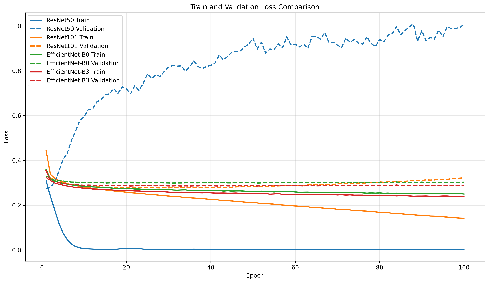
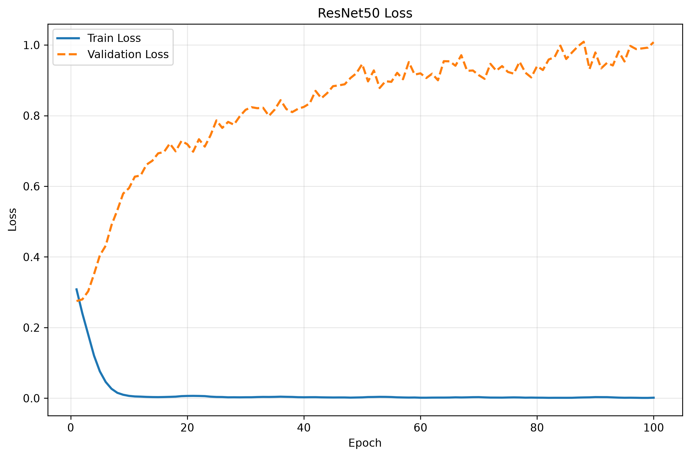
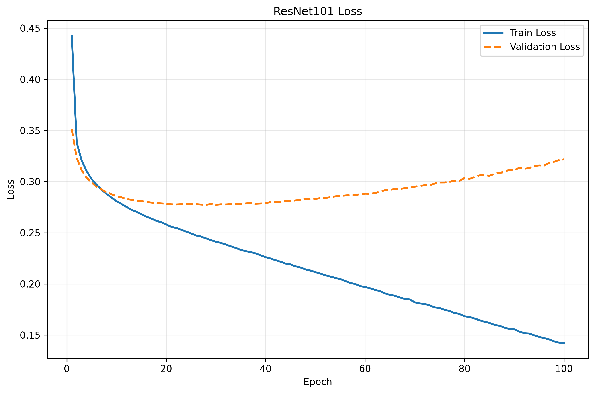
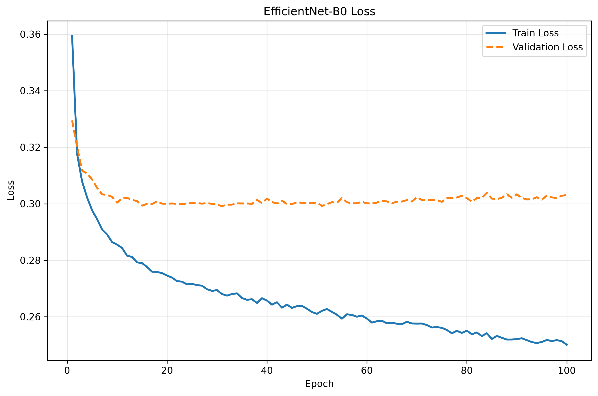
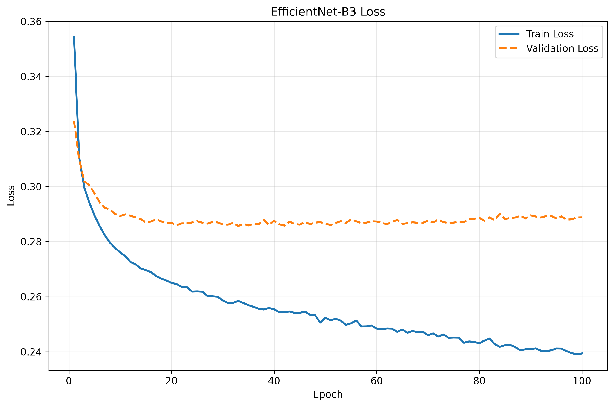
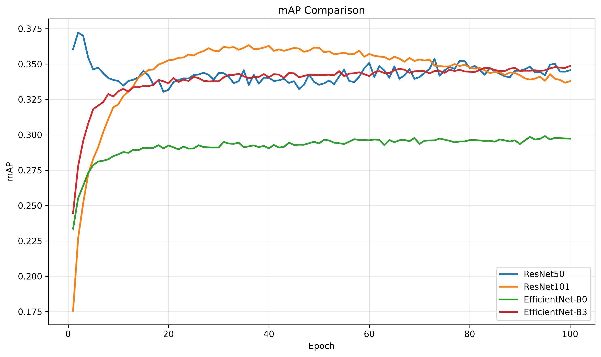
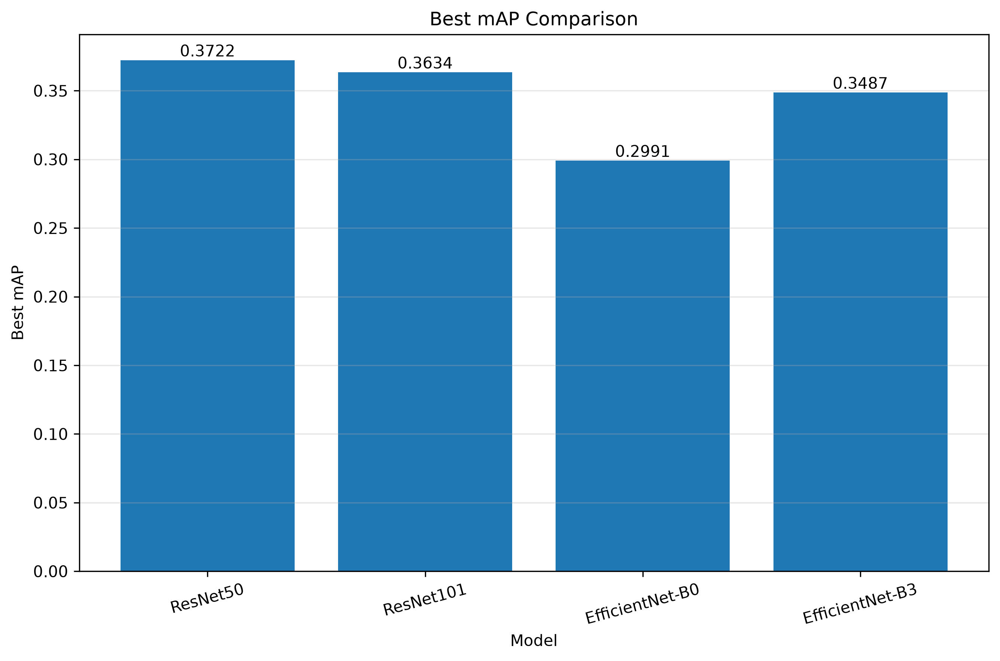

# 実験ワークシート

このワークシートは、`experiments/template` をコピーして作った各実験の目的、仮説、変更内容、結果、採用判断を記録するためのテンプレートです。

`baseline_v1 -> exp_001`、`exp_001 -> exp_002` のように、毎回「旧モデル」と「新モデル」を比較する形式で使います。

---

## 0. 実験情報

| 項目 | 内容 |
|---|---|
| 実験ID | exp_001 |
| 日付 | 7/14 |
| 担当者 | 玉城俐空 |
| タスク | アニメのキービジュアルからジャンルを推定するマルチラベル分類 |
| 旧モデル | baseline_v1 |
| 新モデル | EfficentNetB3_model |
| 今回の目的 | モデル比較 |
| Git branch | riku-compare-bakbone-models |
| Git commit |  |
| 実験ディレクトリ | `experiments/exp_001` |
| config | `experiments/exp_001/config.yaml` |
| metrics | `experiments/exp_001/outputs/metrics.csv` |
| checkpoint | `experiments/exp_001/outputs/best_model.pth` |
---

## 1. 実行メモ

### 1.1 実行コマンド

```bash
uv run python experiments/exp_001/run_exp.py --config experiments/exp_001/config.yaml
```

### 1.2 主な設定

| 項目 | 値 |
|---|---|
| seed | 42 |
| device | auto |
| epochs | 100 |
| batch size | 64 |
| fc learning rate | 0.0001 |
| backbone learning rate | 0.0001 |
| num workers | 0 |
| image size | 224 |
| torch.compile |  |
| max train samples |  |
| max val samples |  |
| output dir | outputs |

### 1.3 出力ファイル

| 種類 | path | 備考 |
|---|---|---|
| best model | ResNet50_metrics.csv | ResNet50の学習が一番mAPが高い |
| metrics CSV | ResNet50_model.pth |  |
| 追加ログ |  |  |

---

## 2. 旧モデルの状況

### 2.1 旧モデルの構成

| 項目 | 内容 |
|---|---|
| モデル |  |
| 画像エンコーダ |  |
| 事前学習 |  |
| 分類ヘッド |  |
| loss |  |
| optimizer |  |
| scheduler |  |
| batch size |  |
| epoch数 |  |
| learning rate |  |
| threshold |  |
| augmentation |  |
| その他 |  |

### 2.2 旧モデルのスコア

| 指標 | score |
|---|---:|
| train loss |  |
| validation loss |  |
| mAP |  |
| macro F1 |  |
| samples F1 |  |
| Hamming loss |  |

### 2.3 旧モデルで残っている問題

```markdown
例：
- レアラベルの recall が低い
- 「Slice of Life」と「Comedy」の混同が多い
- 高確率の false positive が多い
- 画像だけでは判断しにくいジャンルの AP が低い
```

---

## 3. 今回扱う問題

### 3.1 今回扱う問題

```markdown
- Backboneモデルの変更によってmAPが向上するか。
- モデルごとの過学習の発生しやすさに違いがあるか。
```

### 3.2 今回扱わない問題

```markdown
- Loss関数の変更
- Data Augmentationの変更
- データセットの追加・変更
```

### 3.3 この問題を優先する理由

```markdown
特徴抽出器の性能差を確認することを目的とする。
また、どのBackboneが本研究のデータセットに適しているかを判断するため、
最初にモデル間の性能比較を行う。
```

## 4. 原因仮説

| 仮説ID | 観察された問題 | 原因仮説 | 根拠 | 検証方法 |
|---|---|---|---|---|
| H1 | スコアが伸びない | モデルによって性能が変わるのではないか |  |  |
| H2 | 過学習が起きる | モデルによって性能が変わるのではないか |  |  |
| H3 |  |  |  |  |

### 記入例

| 仮説ID | 観察された問題 | 原因仮説 | 根拠 | 検証方法 |
|---|---|---|---|---|
| H1 | レアラベルの recall が低い | class imbalance の影響が大きい | ラベル頻度が低いほど AP が低い | class weight / focal loss を試す |
| H2 | 似たジャンルを混同する | ラベル間の共起関係を扱えていない | 両ラベルの同時出現が多い | label correlation を考慮する |
| H3 | 一部ジャンルが画像だけで当たらない | 入力情報が不足している | 画像から内容を推測しにくい | タイトル・あらすじを追加する |

---

## 5. 今回の変更

## 比較対象モデル

| モデル | 事前学習 | Fine-tuning | 特徴 |
|---|---|---|---|
| ResNet50 | ImageNet | FCのみ → FC+Layer4 | Baseline |
| ResNet101 | ImageNet | FC+Layer4 | より深いResNet |
| EfficientNet-B0 | ImageNet | FC+Last Block | Compound Scaling |
| EfficientNet-B3 | ImageNet | FC+Last Block | 入力サイズ(300)変更 |

---
### 5.2 具体的な変更内容

```markdown
今回の実験では、ImageNet事前学習済みの複数のCNN Backboneを比較し、
アニメ画像マルチラベル分類における特徴抽出能力の違いを検証した。
比較対象は以下の4種類とした。
- ResNet50（FC + Layer4）
- ResNet101（FC + Layer4）
- EfficientNet-B0（FC + Last Block）
- EfficientNet-B3（FC + Last Block）
ResNet50をベースラインとし、より深いResNet101、
Compound Scalingを採用したEfficientNet-B0、
さらに入力画像サイズとNormalizeを変更したEfficientNet-B3へ段階的に変更し、
Backboneの違いによる性能への影響を評価する。
```

### 5.3 変更しないもの

```markdown
例：
データ分割、画像サイズ、optimizer、learning rate は旧モデルと同じにする。
今回は loss の効果だけを見る。
```

---

## 6. 期待する結果

### 6.1 期待する改善

```markdown
- mAPが向上する
- 過学習が改善する
- Validation Lossが低下する
```

### 6.2 想定される副作用

```markdown
- 学習時間が長くなる
- モデルによっては過学習が起こる可能性がある
```

### 6.3 成功条件

```markdown
- mAPが旧モデル以上になる
- Validation Lossが悪化しない
- 過学習が改善される
```

### 6.4 採用しない条件

```markdown
- mAPが低下した場合
- Validation Lossが大きく悪化した場合
- 過学習が改善されなかった場合
```


## 7. 実験結果

### 7.1 Backbone比較結果

| モデル | 最高mAP | Lossの傾向 | 過学習 |
|---|---:|---|---|
| ResNet50 | **0.3722** | Train Lossはほぼ0まで低下し、Validation Lossは約1.0まで上昇 | 非常に大きい |
| ResNet101 | 0.3634 | Train Lossは低下を続けるが、Validation Lossは途中から上昇 | あり |
| EfficientNet-B0 | 0.2991 | Train Lossは低下し、Validation Lossは約0.30でほぼ横ばい | 小さい |
| EfficientNet-B3 | 0.3487 | Train Lossは低下し、Validation Lossは約0.29でほぼ横ばい | 小さい |
---

### 7.2 結果まとめ

```markdown
- ResNet50 (FC + Layer4) が最も高い mAP を記録した。
- EfficientNet-B0 は Macro F1 が最も高かった。
- ResNet101 は ResNet50 を上回る性能は得られなかった。
- EfficientNet-B3 はEfficientNet-B3よりもスコアが高かった。
```

---

### 7.3 今後の課題

```markdown
- ConvNeXtとの性能比較を行う。
- 前処理や入力画像サイズ変更の影響を検証する。
```

# 実験結果

## 1. Loss比較（全モデル）



---

## 2. ResNet50



---

## 3. ResNet101



---

## 4. EfficientNet-B0



---

## 5. EfficientNet-B3



---

## 6. mAP比較



---

## 7. Best mAP比較

