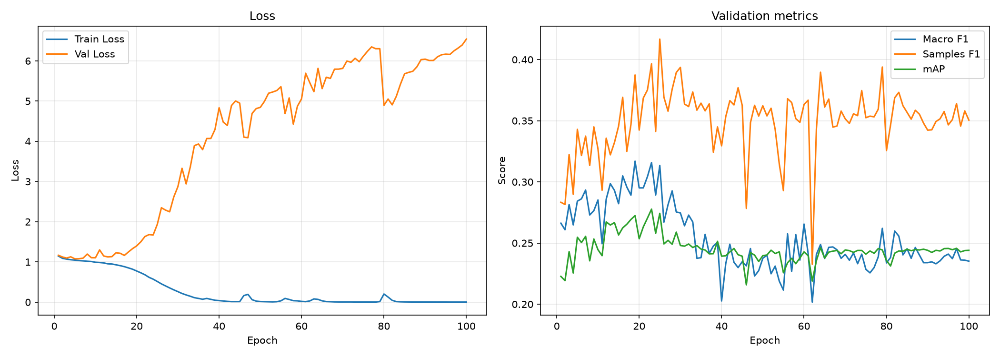
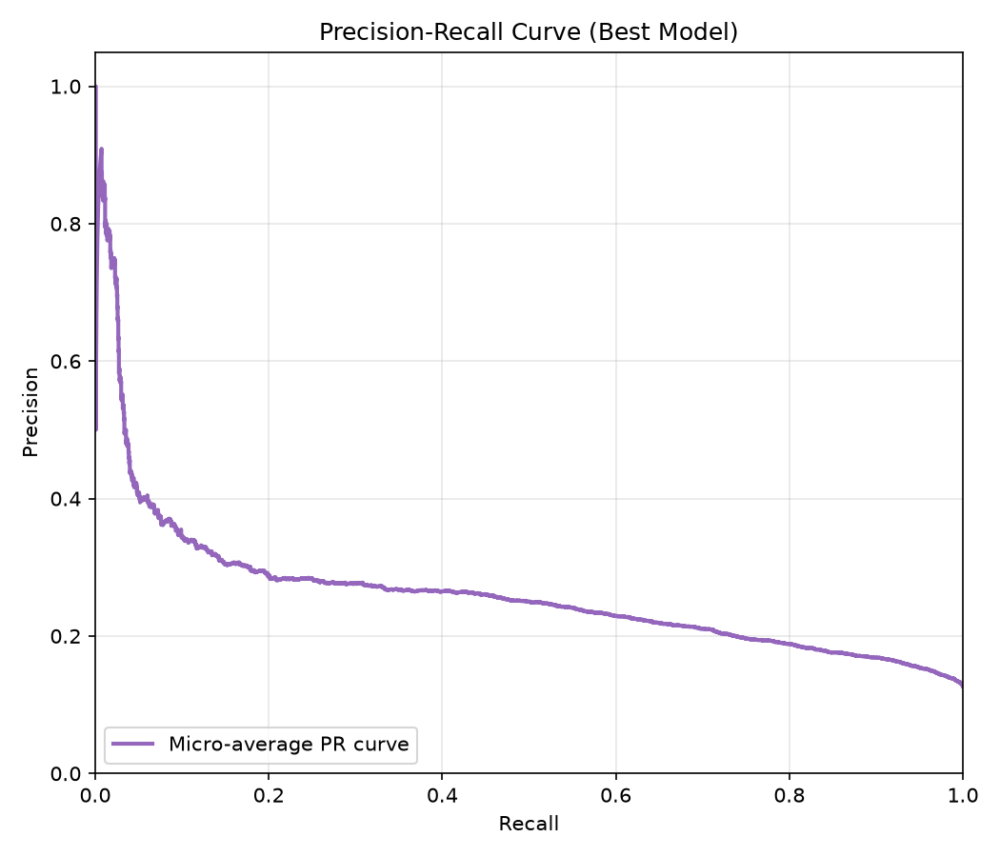

# 実験ワークシート

このワークシートは、`experiments/template` をコピーして作った各実験の目的、仮説、変更内容、結果、採用判断を記録するためのテンプレートです。

`baseline_v1 -> exp_001`、`exp_001 -> exp_002` のように、毎回「旧モデル」と「新モデル」を比較する形式で使います。

---

## 0. 実験情報

| 項目 | 内容 |
|---|---|
| 実験ID | exp_001 |
| 日付 | 2026-06-21 |
| 担当者 | sho |
| タスク | アニメのキービジュアルからジャンルを推定するマルチラベル分類 |
| 旧モデル | baseline_v1 |
| 新モデル | exp_001 |
| 今回の目的 | pos_weight導入による少数派ジャンル（Thriller, Horrorなど）の予測改善 |
| Git branch |  |
| Git commit |  |
| 実験ディレクトリ | `experiments/sho-class-weighted-loss` |
| config | `experiments/sho-class-weighted-loss/config.yaml` |
| metrics | `experiments/exp_001/outputs/metrics.csv` |
| checkpoint | `experiments/exp_001/outputs/best_model.pth` |

---

## 1. 実行メモ

### 1.1 実行コマンド

```bash
uv run python experiments/exp_001/run_exp.py --config experiments/exp_001/config.yaml
```

### 1.2 主な設定

| 項目 | 値 |
|---|---|
| seed | 42 |
| device | auto |
| epochs | 100 |
| batch size | 64 |
| learning rate | 0.001 |
| num workers | 0 |
| image size | 224 |
| torch.compile | true |
| max train samples |  |
| max val samples |  |
| output dir | `experiments/sho-class-weighted-loss/outputs` |

### 1.3 出力ファイル

| 種類 | path | 備考 |
|---|---|---|
| best model |  | validation loss が最良の checkpoint |
| metrics CSV |  | epoch ごとの train/validation 指標 |
| 追加ログ |  |  |

---

## 2. 旧モデルの状況

### 2.1 旧モデルの構成

| 項目 | 内容 |
|---|---|
| モデル | AnimeResNet (ResNet18) |
| 画像エンコーダ | ResNet18 (weights=None) |
| 事前学習 |  |
| 分類ヘッド | nn.Linear(512, 19) |
| loss | BCEWithLogitsLoss (重みなし) |
| optimizer | Adam (lr=0.001) |
| scheduler | なし |
| batch size | 64 |
| epoch数 | 100 |
| learning rate | 0.001 |
| threshold | 0.5 (logit > 0) |
| augmentation | なし (Resize 224x224, Normalizeのみ) |
| その他 | シリーズ単位でのデータ分割を使用 |

### 2.2 旧モデルのスコア
※スコアはテストセットでの評価値（Lossのみ検証用ベストエポックの値）を採用しています。
| 指標 | score |
|---|---:|
| train loss | 0.2932 |
| validation loss | 0.3021 |
| mAP | 0.2875 |
| macro F1 | 0.1133 |
| samples F1 | 0.3240 |
| Hamming loss | 0.1180 |

### 2.3 旧モデルで残っている問題

```markdown
- データ件数が少ない `Thriller` や `Horror` などの少数派ジャンルにおいて、Recallが0、APも極端に低い状態（陽性予測が完全に0件）に陥っている。
```

---

## 3. 今回扱う問題

### 3.1 今回扱う問題

```markdown
- クラス不均衡（Class Imbalance）に起因する、少数派ジャンルの未学習・予測不能問題。

```

### 3.2 今回扱わない問題

```markdown
- モデルアーキテクチャの変更（事前学習モデルの導入など）。
- データ拡張（Data Augmentation）による過学習の抑制。
- しきい値（Threshold）の最適化戦略。

```

### 3.3 この問題を優先する理由

```markdown
- 少数派ジャンルが全く予測されない原因は「すべて0（陰性）と予測した方が、損失関数の総和が小さくなる」というモデルにとって都合の良い局所解に陥っているためである。
- この力学を `pos_weight` で破壊し、少数派ジャンルでも正例の特徴を強制的に学習させることは、モデルが画像から正しく特徴を抽出する基盤を作る上で最も根本的かつ優先度が高いアプローチであるため。

```

---

## 4. 原因仮説

| 仮説ID | 観察された問題 | 原因仮説 | 根拠 | 検証方法 |
|---|---|---|---|---|
| H1 | 少数ジャンル（Thriller等）のAPが極端に低く、陽性予測が出ない | 通常のBCE Lossでは、圧倒的多数を占める「負例（そのジャンルではない）」を当てるだけでLossが下がりきってしまうため | baseline_complete_analysis_report.md のジャンル別評価において、頻度の低いラベルほどF1とAPが低い明確な相関がある | BCEWithLogitsLossに、(負例数/正例数)の比率を計算した `pos_weight` を適用する |

### 記入例

| 仮説ID | 観察された問題 | 原因仮説 | 根拠 | 検証方法 |
|---|---|---|---|---|
| H1 | レアラベルの recall が低い | class imbalance の影響が大きい | ラベル頻度が低いほど AP が低い | class weight / focal loss を試す |
| H2 | 似たジャンルを混同する | ラベル間の共起関係を扱えていない | 両ラベルの同時出現が多い | label correlation を考慮する |
| H3 | 一部ジャンルが画像だけで当たらない | 入力情報が不足している | 画像から内容を推測しにくい | タイトル・あらすじを追加する |

---

## 5. 今回の変更

### 5.1 変更するもの

- [ ] データ
- [ ] split
- [ ] 前処理
- [ ] augmentation
- [ ] モデル
- [x] loss （BCEWithLogitsLoss に pos_weight 引数を追加）
- [ ] optimizer
- [ ] scheduler
- [ ] threshold
- [x] **評価指標**: PR曲線の生成処理を追加（utility.py）
- [ ] 入力情報
- [x] その他 （`run_exp.py` に `metrics.csv` から学習曲線を自動生成するプロット機能を追加）

### 5.2 具体的な変更内容

```markdown
- `run_exp.py` の学習開始前に、`train_df` から各ジャンルの出現数をカウントし、重み `pos_weight` を計算。
- `criterion.py` を改修し、計算したテンソルを損失関数に適用。
```

### 5.3 変更しないもの

```markdown
データ分割、画像サイズ、optimizer、learning rate、エポック数（100）などは旧モデルと完全に同一にする。今回は「不均衡対策のLoss」の効果だけを純粋に比較検証する。
```

---

## 6. 期待する結果

### 6.1 期待する改善

```markdown
- 少数派ジャンル（Thriller, Horror, Sports等）の mAP および Recall（F1）が0から有意な数値へ上昇する。
- それに伴い、全体の Macro F1 も底上げされる。
- **PR曲線全体が右上に膨らむこと（特にRecallが低い領域でのPrecision改善）。**
```

### 6.2 想定される副作用

```markdown
- 少数派ジャンルに対して陽性と予測しやすくなる（ペナルティが大きくなる）ため、False Positive（誤検知）が増加し、Hamming Loss が旧モデル（0.1180）より悪化する可能性がある。
```

### 6.3 成功条件

```markdown
- 全体の mAP が旧モデル（0.2875）から低下しないこと。
- 陽性予測0件だった少数派ジャンルのうち、複数のジャンルでAPが向上していること。
```

### 6.4 採用しない条件

```markdown
例：
- 主指標は上がっても、重要ラベルの recall が大きく下がる場合は採用しない
- validation だけに強く、test で再現しない場合は採用しない
```

---

## 7. 実験結果

### 7.1 全体スコア比較

| モデル | mAP | macro F1 | samples F1 | Hamming loss |
|---|---:|---:|---:|---:|
| 旧モデル(ベースライン) | 0.2875 | 0.1133 | 0.3240 | 0.1180 |
| 新モデル(重み付けあり) | 0.2547 | 0.2842 | 0.3429 | 0.3265 |

### 7.2 train / validation の差

| 観点 | 結果 | 解釈 |
|---|---|---|
| train は良いが validation が悪い | あり / なし | 過学習の可能性 |
| train も validation も悪い | あり | 未学習・モデル不足・データ困難の可能性 |
| 特定ラベルだけ悪い | あり / なし | 不均衡・曖昧ラベル・ラベルノイズの可能性 |
| validation のばらつきが大きい | あり / なし | データ数不足・split 不安定の可能性 |

### 7.3 metrics.csv の最良 epoch

Lossが上がり始める直前で、かつ精度が一定の水準にある地点
| 項目 | 値 |
|---|---:|
| best epoch | 5 |
| train loss | 1.0454 |
| val loss | 1.0769 |
| mAP | 0.2547 |
| macro F1 | 0.2842 |
| samples F1 | 0.3429 |
| Hamming loss | 0.3265 |

mAPを最大化することを基準
| 項目 | 値 |
|---|---:|
| best epoch | 23 |
| train loss | 0.6170 |
| val loss | 1.6800 |
| mAP | 0.2777 |
| macro F1 | 0.3158 |
| samples F1 | 0.3965 |
| Hamming loss | 0.2669 |


### 7.4 PR曲線と学習曲線分析
| 項目 | 内容 |
|---|---|
| 画像 | <br> |
| 考察 | ・**学習曲線**: Train Lossはほぼ0に収束する一方、Val Lossは早期に底を打ち、最終的に6.5付近まで異常に上昇した。完全な過学習（暗記）状態である。<br>・**Metrics曲線**: mAPやF1が心電図のように激しく振動（ジグザグ）しており、学習が極めて不安定になっている。<br>・**PR曲線**: mAPの数値もベースライン（0.28）から低下（約0.24）しており、右上の膨らみは得られなかった。 |

---

## 14. 次の課題

### 14.1 今回解決したこと
- `pos_weight` による少数派ジャンルへのペナルティ強化を実装し、モデルに対する物理的なプレッシャー（力学）を変化させるパイプラインを構築した。

### 14.2 まだ残っていること
- 過学習の発生と、それに伴う全体性能（mAP）の低下。
- 少数ジャンルを当てようと乱れ撃ちした結果生じる、False Positive（誤検知）の増加。

### 14.3 次に試す候補
- **実験B（高解像度化）**: 純粋にモデルへの入力情報量（視力）を 384x384 等に引き上げた場合、過学習がさらに加速するのか、それとも特徴を掴む助けになるのかを、重み付けなし（標準BCE）の状態で検証する。
- **根本解決（転移学習）**: スクラッチ学習の表現力不足がすべての原因であるため、他メンバーと協力し、ImageNetの事前学習済みモデル（ResNet18_Weights.DEFAULT）をベースにした検証への移行を強く推奨する。

---

## 16. レポート・発表用まとめ
（※チーム共有や最終発表の際に、この実験の意義を簡潔に伝えるための要約）

### 16.1 目的
少数派ジャンル（Thriller, Horror等）が全く予測されない問題を解決するため、損失関数にクラスごとの不均衡補正（重み付け）を導入し、Recallおよび全体のmAP向上を目指した。

### 16.2 アプローチ
BCEWithLogitsLoss に対して、訓練データ内の各ラベルの出現頻度の逆数に基づいた `pos_weight` を適用し、少数派ラベルを見逃した際のペナルティを物理的に強めた。

### 16.3 結果
- 旧ベースライン（mAP: 0.2875）を上回ることはできず、全体の指標は低下した。
- Train Lossが消失する一方で、Val Lossが極端に増大する「完全な過学習」に陥った。
- 学習曲線（Metrics）が激しく振動し、安定した学習が成立しなかった。

### 16.4 新たな知見（Insight）
モデルに「基礎的な表現力（事前学習による眼）」が備わっていない状態で、損失関数のペナルティだけを厳しくすると、モデルはジャンルの本質を学ぶことを諦め、**「学習データ特有の画素パターンの丸暗記」に逃げ込む**ことが明確に証明された。

### 16.5 考察
本実験により、スクラッチ学習（事前学習なし）のResNet18単体では、`pos_weight` のような力学的なアプローチだけでは「表現力不足の壁」を突破できないことが明らかになった。少数派のRecallを上げる試みは、結果として甚大な誤検知（False Positive）を引き起こし、Precisionを破壊した。

### 16.6 次のアクション
本実験を「スクラッチ学習における性能と過学習の限界点（ネガティブ・ベースライン）」として位置づける。
1. **実験B**: 損失の重み付けを解除し、純粋な入力情報量（解像度）を上げた場合の恩恵と過学習のリスクを分離して検証する。
2. **チームへの提言**: 上記の限界を根本解決するため、ImageNet等による「事前学習済みモデル（転移学習）」の導入をチームの最優先課題として提言する。

---

## 17. 新しい実験の作り方

1. リポジトリルートで `uv run python make_exp.py --user-name <your_name> --exp-name <experiment_name>` を実行します。
2. 作成された `experiments/<your_name>-<experiment_name>/config.yaml` を確認します。
3. `report.md` の `実験ID`、`旧モデル`、`新モデル`、`実験ディレクトリ` を更新します。
4. 必要に応じて `model.py`, `criterion.py`, `optimizer.py`, `metrics.py` を変更します。
5. `uv run python experiments/<your_name>-<experiment_name>/run_exp.py` で実験を実行します。
6. `outputs/metrics.csv` と `outputs/best_model.pth` を確認します。
7. このワークシートに結果、エラー分析、採用判断、次の課題を記録します。

重要なのは、毎回「何を変えたか」と「なぜ変えたか」を明確にすることです。

スコアが上がったかどうかだけでなく、どのラベル・どの失敗パターンで改善したかを記録します。
