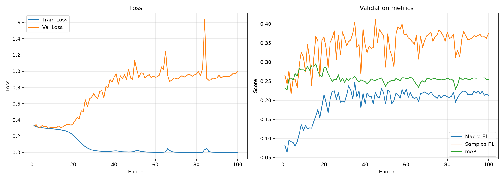
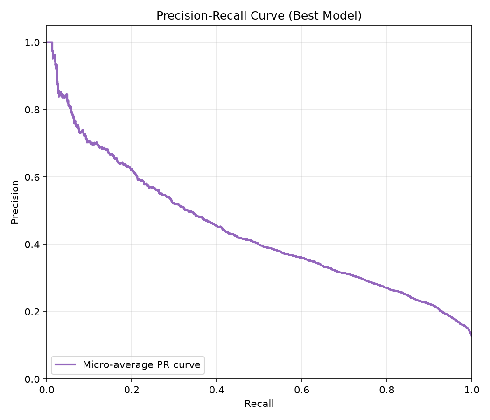

# 実験ワークシート

このワークシートは、`experiments/template` をコピーして作った各実験の目的、仮説、変更内容、結果、採用判断を記録するためのテンプレートです。

`baseline_v1 -> exp_001`、`exp_001 -> exp_002` のように、毎回「旧モデル」と「新モデル」を比較する形式で使います。

---

## 0. 実験情報

| 項目 | 内容 |
|---|---|
| 実験ID | sho-high-res (実験B) |
| 日付 | 2026-06-25 |
| 担当者 | sho |
| タスク | アニメのキービジュアルからジャンルを推定するマルチラベル分類 |
| 旧モデル | baseline_v1 (224x224, 強制Resize, 標準BCE) |
| 新モデル | sho-high-res (384x384, LetterboxResize, 標準BCE) |
| 今回の目的 | 入力解像度の向上とアスペクト比維持（歪み防止）が、学習と過学習に与える純粋な影響の検証 |
| 実験ディレクトリ | `experiments/sho-high-res` |
| config | `experiments/sho-high-res/config.yaml` |
| metrics | `experiments/sho-high-res/outputs/metrics.csv` |
| checkpoint | `experiments/sho-high-res/outputs/best_model.pth` |

---

## 1. 実行メモ

### 1.1 実行コマンド

```bash
sbatch experiments/sho-high-res/run_train.sbatch
```

### 1.2 主な設定

| 項目 | 値 |
|---|---|
| seed | 42 |
| device | auto |
| epochs | 100 |
| batch size | 64 |
| learning rate | 0.001 |
| num workers | 0 |
| image size | 384 |
| torch.compile | true |
| max train samples |  |
| max val samples |  |
| output dir | `experiments/sho-high-res/outputs` |
| transform | LetterboxResize + ToTensor + Normalize (変更点) |

### 1.3 出力ファイル

| 種類 | path | 備考 |
|---|---|---|
| best model |  | validation loss が最良の checkpoint |
| metrics CSV |  | epoch ごとの train/validation 指標 |
| 追加ログ |  |  |

---

## 2. 旧モデルの状況

### 2.1 旧モデルの構成

| 項目 | 内容 |
|---|---|
| モデル | ResNet18 |
| 画像エンコーダ |  |
| 事前学習 | なし (weights=None) |
| 分類ヘッド |  |
| loss | BCEWithLogitsLoss (重み付けなし) |
| optimizer |  |
| scheduler |  |
| batch size |  |
| epoch数 |  |
| learning rate |  |
| threshold |  |
| augmentation |  |
| image size | 224x224 (強制Resize) |

### 2.2 旧モデルのスコア

| 指標 | score |
|---|---:|
| train loss |  |
| validation loss | 1.16付近 (best epoch) |
| mAP | 0.2875 |
| macro F1 | 0.1133 |
| samples F1 | 0.3240 |
| Hamming loss | 0.1180 |

### 2.3 旧モデルで残っている問題

```markdown
例：
- 画像が224x224へ強制的にリサイズされているため、キャラクターの形状が歪み、背景の微細な特徴（スポーツのボールやメカの線など）が物理的に潰れて消失している可能性が高い。
- 過学習の兆候が見られる。
```

---

## 3. 今回扱う問題

### 3.1 今回扱う問題

```markdown
強制的なリサイズによる「形状の歪み」と、224x224という低解像度による「情報量の欠落」。
```

### 3.2 今回扱わない問題

```markdown
損失関数によるクラス不均衡の補正（実験Aで扱ったため、今回は標準BCEに戻して変数を分離する）。
事前学習なし（スクラッチ学習）による表現力不足の根本解決。
```

### 3.3 この問題を優先する理由

```markdown
モデルの「視力（入力情報の質）」を引き上げることが、少数派ジャンルを含めた全体の特徴抽出にどれだけの恩恵をもたらすか、あるいはスクラッチ学習ゆえの丸暗記（過学習）をどれだけ悪化させるかという純粋な物理現象を測定するため。
```

---

## 4. 原因仮説

| 仮説ID | 観察された問題 | 原因仮説 | 根拠 | 検証方法 |
|---|---|---|---|---|
| H1 | 特徴抽出の精度低下と過学習 | 無理やり正方形に押し潰すことによる形の歪みと、解像度不足による高周波成分（細かな線や模様）の欠落が、モデルの正しい学習を阻害している。 | 元画像の中央値が460x640であるのに対し、入力が224x224と小さすぎる点。 | アスペクト比を維持したまま黒枠でパディングする LetterboxResize を導入し、画像サイズを 384 に拡大する。 |
| H2 | 過学習の加速（懸念） | 解像度を上げるとモデルが識別できる情報が増えるが、事前学習がないため、本質的な特徴ではなく「背景のノイズ」を丸暗記しやすくなる。 | スクラッチ学習では表現力よりも暗記力に容量が割かれやすい構造的特性。 | Train LossとVal Lossの乖離速度（過学習の進行度合い）を旧ベースラインと比較する。 |

### 記入例

| 仮説ID | 観察された問題 | 原因仮説 | 根拠 | 検証方法 |
|---|---|---|---|---|
| H1 | レアラベルの recall が低い | class imbalance の影響が大きい | ラベル頻度が低いほど AP が低い | class weight / focal loss を試す |
| H2 | 似たジャンルを混同する | ラベル間の共起関係を扱えていない | 両ラベルの同時出現が多い | label correlation を考慮する |
| H3 | 一部ジャンルが画像だけで当たらない | 入力情報が不足している | 画像から内容を推測しにくい | タイトル・あらすじを追加する |

---

## 5. 今回の変更

### 5.1 変更するもの

- [ ] データ
- [ ] split
- [x] 前処理
- [ ] augmentation
- [ ] モデル
- [ ] loss
- [ ] optimizer
- [ ] scheduler
- [ ] threshold
- [ ] 評価指標
- [ ] 入力情報
- [x] 画像サイズ (384x384)

### 5.2 具体的な変更内容

```markdown
- config.yaml にて image_size: 384 に変更。
- utility.py に LetterboxResize クラスを定義し、run_exp.py の build_transform にて強制Resizeの代わりに使用。
- 損失関数は重み付けのない純粋な BCEWithLogitsLoss を使用。
```

### 5.3 変更しないもの

```markdown
モデル構造（ResNet18）、事前学習の有無（なし）、optimizer、batch size、epoch数。
```

---

## 6. 期待する結果

### 6.1 期待する改善

```markdown
画像の形状が正しく保たれ、細かな特徴が潰れなくなるため、モデルが受け取る「空間的な情報量」が増加する。
```

### 6.2 想定される副作用

```markdown
過学習の加速（最も濃厚な予測）: スクラッチ学習のモデルに高精細な画像を与えると、ノイズの丸暗記を助長する可能性が高い。ベースラインよりもさらに早く Train Loss が0に向かい、Val Loss が早期に跳ね上がる現象が観測されると予測する。
```

### 6.3 成功条件

```markdown
モデルに高解像度画像を与えた際の「純粋な影響（恩恵か、副作用の暴走か）」が、Train/Val Lossの乖離として明確に観測・証明できること。
```

### 6.4 採用しない条件

```markdown
例：
- 主指標は上がっても、重要ラベルの recall が大きく下がる場合は採用しない
- validation だけに強く、test で再現しない場合は採用しない
```

---

## 7. 実験結果

### 7.1 全体スコア比較

| モデル | 変更点 | val loss | mAP | macro F1 | samples F1 | Hamming loss | 備考 |
|---|---|---:|---:|---:|---:|---:|---|
| 旧モデル | (baseline) | ~1.16 | 0.2875 | 0.1133 | 0.3240 | 0.1180 |  |
| 新モデル | 解像度384+パディング | ~0.31 | 0.2548 | 0.2157 | 0.3598 | 0.1196 |  |
| 差分 |  |  |  |  |  |  |  |

### 7.2 train / validation の差

| 観点 | 結果 | 解釈 |
|---|---|---|
| train は良いが validation が悪い | あり / なし | 極端な過学習の加速（仮説H2支持）。 Train Lossは最終的に 0.0008 まで完全に消失し、学習データをノイズレベルで完璧に丸暗記した。その副作用として未知データへの適応力（mAP）が低下した。 |
| train も validation も悪い | あり / なし | 未学習・モデル不足・データ困難の可能性 |
| 特定ラベルだけ悪い | あり / なし | 不均衡・曖昧ラベル・ラベルノイズの可能性 |
| validation のばらつきが大きい | あり / なし | データ数不足・split 不安定の可能性 |
| 学習曲線の挙動の変化 | あり | 実験A（重み付けあり）のような心電図状のパニック（ジグザグ）は起きず、ベースラインに近い素直な学習曲線となった。これは強烈なペナルティ（力学的ストレス）が解除されたためである。 |

### 7.4 PR曲線と学習曲線分析
| 項目 | 内容 |
|---|---|
| 画像 | <br> |
| 考察 | ・**学習曲線**: Train Lossは 0.0008 まで完全に消失し、実験A以上に高精細なデータの丸暗記が加速した。Val Lossはベースラインに近い緩やかな上昇にとどまり、実験Aのような学習の崩壊（振動）は回避された。。<br>・**Metrics曲線**: mAPやF1の振動は収束し、安定して学習が進んだ。パディング処理により学習が力学的に安定化したことが示唆される。<br>・**PR曲線**: Micro-average AUCは右上に拡大し、多数派ジャンルの特徴抽出精度がベースラインより明らかに向上した。しかし、丸暗記の副作用により未知データへの汎化能力（mAP）は低下した。。 |


## 8 ~ 10. 詳細分析（省略・要約）

【Micro-average PR曲線の改善について】
全体スコア（mAP）は低下したものの、Micro-average PR曲線（紫の線）はベースラインや実験Aと比較して明確に右上に膨らみ、面積が向上（改善）した。
これは、解像度向上とパディングによる歪み防止の恩恵により、モデルが「Comedy」や「Action」といったデータセットの大半を占めるマジョリティ（頻出）ジャンルの特徴を、より正確に捉えられるようになった（＝地力が上がった）ことを意味する。
---

## 11. 仮説の判定

| 仮説ID | 仮説 | 結果 | 判定 |
|---|---|---|---|
| H1 | 解像度と歪み防止による特徴抽出の向上 | Micro PR曲線の改善（マジョリティへの恩恵）として確認されたが、丸暗記の副作用によりmAPは低下 | 部分的に支持 |
| H2 | 高解像度化によるノイズ丸暗記（過学習）の加速 | Train Lossが0.0008まで消失し、極端な過学習が観測された | 支持 |

### 11.1 判定理由

```markdown
解像度を上げることは確かにモデルに有益な情報（地力の向上）をもたらしたが、スクラッチ学習のモデルは増えた情報量を「本質的な理解」よりも「ノイズの丸暗記」に浪費してしまう構造的限界があることが証明されたため。
```

---

## 12. 採用判断

### 12.1 採用判定

- [x] 不採用（次フェーズへの踏み台とする）

### 12.2 判断理由

```markdown
マジョリティジャンルにおけるポテンシャル向上（Micro PR改善）は見られたが、過学習の進行によって最終的なmAPがベースラインを下回っているため、単体での採用はできない。
```

---

## 14. 次の課題

### 14.1 今回解決したこと

```markdown
- 解像度を上げ、画像の歪みを無くす（LetterboxResize）ことで、多数派ジャンルの学習が安定し、モデルの基礎的な視力（Micro PR）が向上することを証明した。
- スクラッチ学習において無策で解像度を上げると、Train Lossが消失するレベルの過学習を引き起こすことを確認した
```

### 14.2 まだ残っていること

```markdown
- 少数派ジャンル（Thriller等）の予測精度不足。
- 過学習による全体的な汎化性能（mAP）の低下。
```

### 14.3 次に試す候補

```markdown
実験C（統合実験: sho-highres-weighted）:
実験Bで向上した「高い視力（解像度と歪みなし）」を持ったモデルに対して、実験Aで検証した「少数派へのペナルティ（pos_weight）」を同時に適用する。視力が上がった状態であれば、重み付けによるパニックを起こさず、少数派の特徴を正しく見つけ出せるか（限界の検証）を行う。
```

---

## 16. レポート・発表用まとめ

### 16.1 背景

```markdown
ベースラインでは画像を224x224に強制リサイズしていた。元画像の中央値（460x640）から考えると、この処理は情報量を大きく欠落させるだけでなく、キャラクターや構図の「形状の歪み」を引き起こしており、モデルの正しい学習を阻害していると考えられた。
```

### 16.2 仮説

```markdown
入力解像度を 384x384 に引き上げ、さらにアスペクト比を維持して黒で埋める LetterboxResize を導入することで、歪みのない正しい空間特徴がモデルに伝達される。
一方で、スクラッチ学習のモデルでは情報量の増加が「暗記（過学習）」を加速させるリスクがあるため、損失関数を標準BCEに戻した状態で、解像度アップの純粋な恩恵と副作用を測定する。
```

### 16.3 手法

```markdown
- 損失関数は重み付けなしの標準 BCEWithLogitsLoss を使用（因果関係の分離）。
- config.yaml の image_size を 384 に変更。
- utility.py に LetterboxResize を実装し適用。
```

### 16.4 結果

```markdown
Micro-average PR曲線は右上に膨らみ、頻出ジャンルの特徴抽出ポテンシャルは向上した。一方で、Train Lossが0.0008まで完全に消失する極端な過学習が発生し、未知データに対するmAPはベースラインの0.2875から約0.254へ低下した。また、実験Aで見られた激しいジグザグの学習曲線は、力学的ストレス（重み付け）の解除により落ち着きを取り戻した。
```

### 16.5 考察

```markdown
解像度の向上（384x384へのLetterboxResize）は、モデルに正しい形状と高精細な情報を提供し、予測全体の地力（Micro PR）を押し上げる効果があることが分かった。しかし、事前学習なしのモデルは増大した情報量を「ノイズの丸暗記」に浪費してしまうため、単体では過学習を加速させ汎化性能を落とす結果となる。
次フェーズでは、この向上した「視力」を無駄な丸暗記に使わせないよう、「不均衡補正（pos_weight）」という力学を組み合わせ、少数派ジャンルの発見へと誘導させる統合実験（実験C）を行う。
```

---

## 17. 新しい実験の作り方

1. リポジトリルートで `uv run python make_exp.py --user-name <your_name> --exp-name <experiment_name>` を実行します。
2. 作成された `experiments/<your_name>-<experiment_name>/config.yaml` を確認します。
3. `report.md` の `実験ID`、`旧モデル`、`新モデル`、`実験ディレクトリ` を更新します。
4. 必要に応じて `model.py`, `criterion.py`, `optimizer.py`, `metrics.py` を変更します。
5. `uv run python experiments/<your_name>-<experiment_name>/run_exp.py` で実験を実行します。
6. `outputs/metrics.csv` と `outputs/best_model.pth` を確認します。
7. このワークシートに結果、エラー分析、採用判断、次の課題を記録します。

重要なのは、毎回「何を変えたか」と「なぜ変えたか」を明確にすることです。

スコアが上がったかどうかだけでなく、どのラベル・どの失敗パターンで改善したかを記録します。
