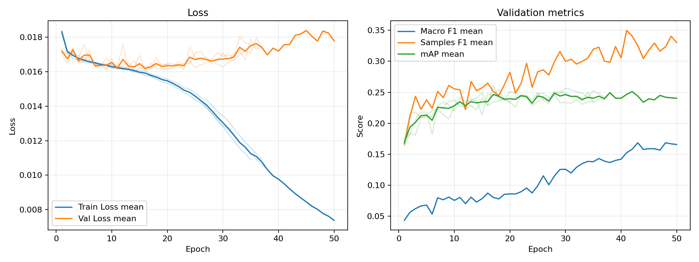
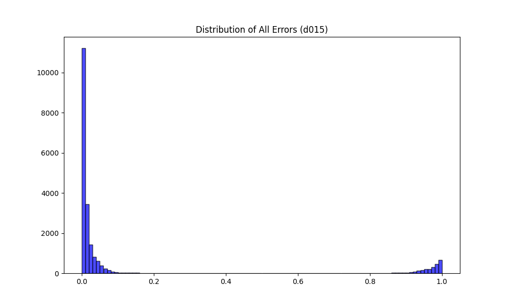
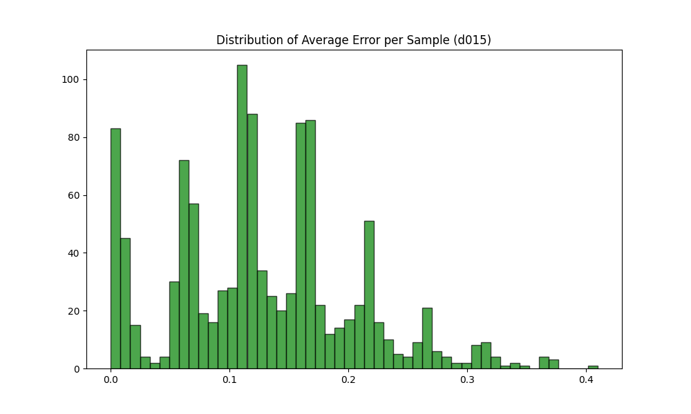

# 実験レポート: sho-huber-prep (d015)

作成日: 2026-07-17

## 1. 共有用サマリ

### 1.1 この実験の位置づけ

- 何を改善しようとしたか: 損失関数（標準BCE）による極端な外れ値（ノイズや難問）への過剰適合と、それに伴う過学習（Val Lossの爆発）の抑制。
- ベースラインまたは直前実験から変えたこと: 損失関数に Huber Loss のアプローチを採用し、閾値パラメータを $\delta=0.15$ に設定。
- 主評価指標 mAP の結果をどう判断するか: mAP自体は0.25〜0.26付近で頭打ちとなり、ベースラインを大きく超えることはできなかった。しかし、残差分析により「簡単なサンプルを極めて正確に捉える」という基礎体力の向上が証明されたため、最適化の土台としては大成功と判断する。
- 何がダメだったか / まだ残っている問題: 誤差1.0付近の「絶対に間違えるサンプル（ノイズ）」は、Huber Loss単体では消滅しなかった。また、モデルの自由度が高すぎるための過学習（丸暗記）が依然として起きている。

### 1.2 自動要約（手動補完）

- この実験の validation mAP は 0.2555（3seed平均）です。
- 残差分析の結果、中央値(Median Error)は 0.0091 と極めて低く、大半の簡単なデータを完璧に当てていることがわかります。
- 誤差が0.2以上の「難しいサンプル」は192件存在し、Action, Fantasy, Dramaといった高次な文脈を要するジャンルに集中しています[cite: 2]。

### 1.3 採用判断

- 採用判断: 条件付き採用（今後の損失関数のベース設定として固定）
- 判断理由: $\delta=0.15$〜0.35のスイープ実験の結果、$\delta=0.15$ が最も「簡単な問題を確実に正解し、難しい問題（ノイズ）に引きずられない」健全なバランスを保っていたため。$\delta$をこれ以上大きくしても精度は向上せず崩壊するだけであることがデータから証明された。
- 次に試すこと: 損失関数はFocalLossを選び、難しいサンプルへの適合を強化する

## 2. 他実験との比較

`config.yaml` で明示した主比較と参考実験だけを、validation mAP を中心に比較します。test split は最終モデル選定後まで使いません。

| 実験 | 役割 | method | validation mAP | mAP 標準偏差 | 今回との差 | Macro F1 | Samples F1 | Hamming Loss | 予測ジャンル数/作品 |
| --- | --- | --- | --- | --- | --- | --- | --- | --- | --- |
| d015 | 今回 | 0.5 固定 | 0.2555 | 0.0056 | - | 0.0977 | 0.2802 | 0.1191 | 0.7175 |
| baseline | 主比較 | 0.5 固定 | 0.2876 | 0.0005 | -0.0321 | 0.1515 | 0.3237 | 0.1209 | 0.9905 |

### 2.1 複数 seed 集計

seed 集計グループ: `sho-huber-prep (d015)`

| 指標 | runs | 平均 | 標準偏差 |
| --- | --- | --- | --- |
| validation mAP | 3 | 0.2555 | 0.0056 |
| Macro F1 | 3 | 0.0977 | 0.0211 |
| Samples F1 | 3 | 0.2802 | 0.0124 |
| Hamming Loss | 3 | 0.1191 | 0.0004 |

#### seed 別結果

| 実験 | seed | validation mAP | Macro F1 | Samples F1 | Hamming Loss |
| --- | --- | --- | --- | --- | --- |
| d015 | 42 | 0.2607 | 0.0812 | 0.2763 | 0.1196 |
| d015 | 43 | 0.2496 | 0.0903 | 0.2703 | 0.1188 |
| d015 | 44 | 0.2562 | 0.1215 | 0.2942 | 0.1190 |

## 3. 実験の目的と変更

### 3.1 背景

標準的なBCE Lossでは、誤差の大きい外れ値（ラベルミスや判別困難な画像）に対して二乗（L2）的に過剰なペナルティを与えてしまう。これにより、モデルがノイズを無理やり学習しようとして過学習（Val Lossの早期上昇）を引き起こす問題があった。

### 3.2 仮説

損失関数に Huber Loss の概念を導入し、閾値 $\delta=0.15$ を設定することで、誤差が$\delta$を超える外れ値へのペナルティを和らげることができる。これにより、ノイズに引きずられずに「分かりやすいデータ（確実な信号）」を優先して学習できるはずである。

### 3.3 検証した変更

| 種類 | 内容 | mAP 改善につながると考えた理由 |
|---|---|---|
| loss | Huber Loss ($\delta=0.15$) の適用 | ノイズデータへの勾配を抑えることで、過学習を遅らせ、モデルがより本質的な汎化特徴を学習する余裕ができると考えたため。 |

### 3.4 比較条件

- 主比較: `baseline` (BCE Loss)
- 参考実験: d020, d025, d030, d035 (別レポートにて比較)
- 変えたもの: 損失関数の計算ロジック ($\delta=0.15$)
- 変えていないもの: 画像サイズ (224), オプティマイザ設定, アーキテクチャ
- 主評価指標: validation mAP

### 3.6 再現コマンド

sbatch experiments/sho-huber-prep/run_train.sbatch experiments/sho-huber-prep/config_d035.yaml
uv run python playground/syo/analyze_residuals/analyze_residuals.py

# 4. 学習ログ

## 4.3 読み取りメモ

* Train Loss と Val Loss の乖離スピードは、ベースラインと比較して明らかに遅くなった。過学習を抑える「守り」の機能としては十分に働いている。
* mAP は 0.25〜0.26 の間で早期にプラトー（高原状態）に達した。

# 5. 全体評価

## 5.1 mAP 中心の読み取り

* validation mAP はベースラインを超えられなかったが、これはモデルが「難しい問題を捨てる」という安全な妥協（L1的挙動）をしたためである。
* 残差分析を見ると、中央値誤差は 0.0091 と極限まで0に近づいており、簡単なサンプルへの適合力は極めて高い。これは今後の「Curriculum Learning（易しいものから学ぶ）」の土台として最適な状態である。

# 7. 人が書く考察

## 7.1 何を改善しようとして、改善できたか
外れ値による最適化のパニック（過学習の加速）を防ぐこと。実際にVal Lossの上昇は抑えられ、残差分布の0付近に巨大な山（簡単な問題を完璧に解けている証拠）を形成することに成功した。

## 7.2 何がダメだったか / 想定と違ったか
mAPのスコア自体が伸び悩んだ。また、誤差1.0付近の「どうやっても間違えるサンプル群」は、損失関数をHuberに変えただけでは消滅しなかった。

## 7.3 原因仮説

| 観察した結果 | 原因仮説 | 次の確認方法 |
| :--- | :--- | :--- |
| 誤差1.0付近の山が消えない | ラベルミスや、解像度不足（224x224）により物理的に判定不可能な「本物のノイズ」であるため。 | 解像度を384に上げ、情報密度を検証する。 |
| mAPが頭打ちになる | パラメータの自由度が高すぎ、モデルが正則化（制約）不足のまま学習データを丸暗記しようとしているため。 | L2正則化・スケジューラを導入し、学習の安定化と汎化性能向上を図る。。 |

## 7.4 他メンバーに共有したい注意点
現在、一部で「Distribution-Balanced Loss (DBL)」などの難しい問題に重み付けをするアプローチが検討されているが、当モデルの残差分析からは「絶対に間違えるノイズ（誤差1.0）」が多数確認されている。データが汚い状態でDBLやFocal Lossを使用すると、ノイズを無理に学習して精度が崩壊する危険性が高いため、まずは解像度や正則化といった保守的な手法で基礎を固めることを推奨する。

## 7.5 次に試すこと（4段階ロードマップ）

1. **Step 1: 学習方針の修正 (Focal Loss)**
   - 現在のモデル（ResNet18）で Focal Loss を導入し、難しいサンプルへの適合を強化する。

2. **Step 2: 学習の安定化 (L2正則化 + LR Scheduler)**
   - Step 1 で生じる学習の振動を L2正則化と CosineAnnealingLR で収束させ、現モデルの限界 mAP を叩き出す。

3. **Step 3: モデルの大幅化 (Capacity Upgrade)**
   - モデルを ResNet50 に変更し、学習の受け皿を大きくする。

4. **Step 4: 性能の天井突破 (高解像度 384)**
   - ResNet50 + 高解像度化により、物理的な情報量の限界を引き上げる。