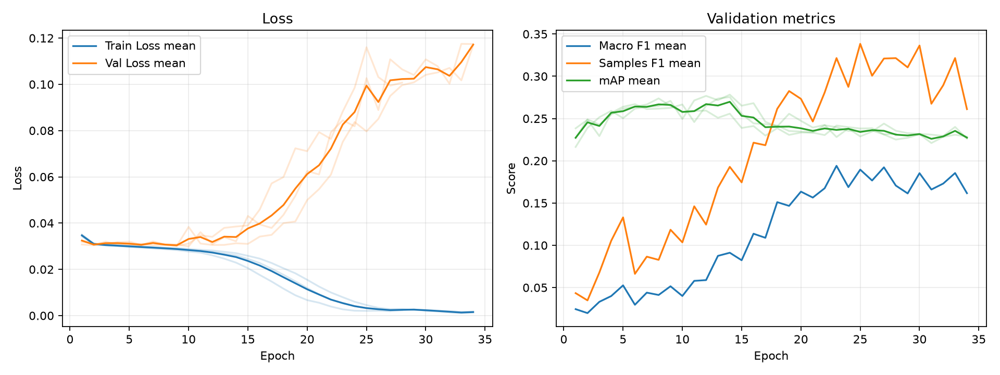

# 実験レポート: sho-step1-focal

作成日: 2026-07-17

## 1. 共有用サマリ

### 1.1 この実験の位置づけ

- 何を改善しようとしたか: 4段階ロードマップの「Step 1」。BCEやHuberで見られた「簡単なサンプルに甘える」挙動を打破し、難しいサンプルの法則性をモデルに強制的に探索させる。
- ベースラインまたは直前実験から変えたこと: 損失関数を Focal Loss ($\alpha=0.25, \gamma=2.0$) に変更。
- 主評価指標 mAP の結果をどう判断するか: validation mAP は 0.2759 となり、直前のHuber（0.2555）からは向上した[cite: 35]。しかし、F1スコアの壊滅と激しい過学習が観測されたため、現状は「暴走状態」にある。モデルのポテンシャルを引き出す「探索」としては成功。
- 何がダメだったか / まだ残っている問題: Focal Lossの特性により、確率出力が全体的に極端に低く押し込まれ、しきい値0.5では大半が「陰性」と判定されてしまう（F1スコアの崩壊）。また、難しい問題を無理に丸暗記しようとするため、強烈な過学習が起きている。

### 1.2 自動要約

- 主評価指標の validation mAP は 0.2759 です（標準比較: validation split, 0.5 固定しきい値）。
- 補助指標は Macro F1=0.0689, Samples F1=0.1559, Hamming Loss=0.1208 です。
- 閾値最適化は行っていません。実験比較の主指標は、閾値に依存しない validation mAP です。
- この実験の validation mAP は 0.2759 です。
- 比較結果を読めなかった実験: `sho-huber-prep`。
- 同じ実験グループで 3 件の seed 結果を集計しました。
- validation mAP は平均 0.2759、標準偏差 0.0022 です。

### 1.3 採用判断

- 採用判断: 不採用
- 判断理由: 正例が少ないケースを見た時自信が全くなくなって保守的な態度が見れたためASLが良いと判断した。
- 次に試すこと: 元々はsteps2に移行しようと思ったが一旦話をなかったことにして、そもそもモデルがおかしいと考えたためSwin Transformerでやろうと考えた。元々はsteps2

## 2. 他実験との比較

`config.yaml` で明示した主比較と参考実験だけを、validation mAP を中心に比較します。test split は最終モデル選定後まで使いません。

| 実験 | 役割 | method | validation mAP | mAP 標準偏差 | 今回との差 | Macro F1 | Samples F1 | Hamming Loss | 予測ジャンル数/作品 |
| --- | --- | --- | --- | --- | --- | --- | --- | --- | --- |
| sho-step1-focal | 今回 | 0.5 固定 | 0.2759 | 0.0022 | - | 0.0689 | 0.1559 | 0.1208 | 0.3217 |

### 2.1 複数 seed 集計

seed 集計グループ: `sho-step1-focal`

| 指標 | runs | 平均 | 標準偏差 | 最小 | 最大 |
| --- | --- | --- | --- | --- | --- |
| validation mAP | 3 | 0.2759 | 0.0022 | 0.2738 | 0.2783 |
| Macro F1 | 3 | 0.0689 | 0.0047 | 0.0637 | 0.0726 |
| Samples F1 | 3 | 0.1559 | 0.0216 | 0.1396 | 0.1804 |
| Hamming Loss | 3 | 0.1208 | 0.0011 | 0.1197 | 0.1219 |
| 予測ジャンル数/作品 | 3 | 0.3217 | 0.0379 | 0.2935 | 0.3649 |

#### seed 別結果

| 実験 | seed | best epoch | epochs ran | early stopped | validation mAP | Macro F1 | Samples F1 | Hamming Loss | 予測ジャンル数/作品 |
| --- | --- | --- | --- | --- | --- | --- | --- | --- | --- |
| sho-step1-focal | 42 | 14 | 34 | True | 0.2755 | 0.0726 | 0.1476 | 0.1219 | 0.3069 |
| sho-step1-focal | 43 | 8 | 28 | True | 0.2738 | 0.0637 | 0.1396 | 0.1207 | 0.2935 |
| sho-step1-focal | 44 | 14 | 34 | True | 0.2783 | 0.0705 | 0.1804 | 0.1197 | 0.3649 |

## 3. 実験の目的と変更

### 3.1 背景

Huber Loss等を用いた前回の実験により、モデルは簡単なサンプルに対して極めて高い適合力を持つことが判明した。しかし、mAPは0.25付近で頭打ちになっていた。これはモデルが「難しいサンプル（複雑な文脈を含む画像）」の法則性の学習を諦め、簡単な特徴に依存しているためである。

### 3.2 仮説

「人間が見て分かるなら、そこには法則性がある」。Focal Lossを導入し、すでに正解できる簡単なサンプルからの勾配をシャットアウトすれば、モデルは強制的に「難しいサンプルの複雑な特徴」を探索するようになり、mAPの限界を突破できるはずである。

### 3.3 検証した変更

| 種類 | 内容 | mAP 改善につながると考えた理由 |
|---|---|---|
| loss | Focal Loss の導入 ($\alpha=0.25, \gamma=2.0$) | データセットの正例比率（約13%）を考慮し、最適な $\alpha=0.25$ を設定。簡単な問題の損失を減衰させ、ハードサンプルへの学習を強制するため。 |

### 3.4 比較条件

- 主比較: `sho-huber-prep`
- 参考実験: なし
- 変えたもの: 損失関数 (BCE -> Focal Loss)
- 変えていないもの: 画像サイズ (224), アーキテクチャ (ResNet18), Optimizer (Adam)
- 主評価指標: validation mAP
- 補助指標: Macro F1, Samples F1, Hamming Loss, ジャンル別 AP/F1
- test split: 最終モデル選定後まで使用しない

### 3.5 主な設定

| 項目 | 値 |
| --- | --- |
| seed | 42 |
| seeds | 42, 43, 44 |
| device | auto |
| comparison | {"primary": "sho-huber-prep", "references": []} |
| epochs | 100 |
| early_stopping | {"enabled": true, "monitor": "mAP", "mode": "max", "patience": 20, "min_delta": 0.001, "min_epochs": 1} |
| batch_size | 64 |
| learning_rate | 0.0010 |
| num_workers | 0 |
| image_size | 224 |
| compile | True |
| max_train_samples |  |
| max_val_samples |  |
| output_dir | outputs |
| best_model_name | best_model.pth |
| metrics_name | metrics.csv |

### 3.6 再現コマンド

```bash
uv run python experiments/sho-step1-focal/run_exp.py
uv run python experiments/sho-step1-focal/analyze.py
uv run python experiments/sho-step1-focal/make_report.py
```

## 4. 学習ログ

### 4.1 代表 epoch

| seed | 観点 | Epoch | Train Loss | Val Loss | Macro F1 | Samples F1 | Hamming Loss | mAP |
| --- | --- | --- | --- | --- | --- | --- | --- | --- |
| 42 | 最終 | 34 | 0.0014 | 0.1174 | 0.1886 | 0.3225 | 0.1488 | 0.2286 |
| 42 | Val Loss 最小 | 10 | 0.0285 | 0.0299 | 0.0459 | 0.0909 | 0.1216 | 0.2666 |
| 42 | mAP 最大 | 14 | 0.0260 | 0.0321 | 0.0726 | 0.1476 | 0.1219 | 0.2755 |
| 42 | Macro F1 最大 | 23 | 0.0055 | 0.0844 | 0.2089 | 0.3405 | 0.1613 | 0.2398 |
| 42 | Samples F1 最大 | 27 | 0.0024 | 0.1108 | 0.1929 | 0.3650 | 0.1519 | 0.2311 |
| 43 | 最終 | 28 | 0.0024 | 0.1007 | 0.1666 | 0.3305 | 0.1387 | 0.2322 |
| 43 | Val Loss 最小 | 9 | 0.0283 | 0.0302 | 0.0513 | 0.1138 | 0.1219 | 0.2649 |
| 43 | mAP 最大 | 8 | 0.0287 | 0.0308 | 0.0637 | 0.1396 | 0.1207 | 0.2739 |
| 43 | Macro F1 最大 | 25 | 0.0020 | 0.1160 | 0.2004 | 0.3534 | 0.1554 | 0.2382 |
| 43 | Samples F1 最大 | 25 | 0.0020 | 0.1160 | 0.2004 | 0.3534 | 0.1554 | 0.2382 |
| 44 | 最終 | 34 | 0.0017 | 0.1169 | 0.1347 | 0.1997 | 0.1313 | 0.2262 |
| 44 | Val Loss 最小 | 9 | 0.0292 | 0.0302 | 0.0640 | 0.1312 | 0.1210 | 0.2709 |
| 44 | mAP 最大 | 14 | 0.0270 | 0.0313 | 0.0705 | 0.1804 | 0.1197 | 0.2783 |
| 44 | Macro F1 最大 | 27 | 0.0028 | 0.0950 | 0.2106 | 0.3392 | 0.1407 | 0.2440 |
| 44 | Samples F1 最大 | 28 | 0.0028 | 0.0996 | 0.1765 | 0.3402 | 0.1391 | 0.2356 |

### 4.2 学習曲線



### 4.3 読み取りメモ

- mAPはEpoch 8〜14という非常に早い段階でピークを迎え、その後急激に悪化している[cite: 35]。
- Train Loss が最終的に 0.0014 まで落ち切る一方で、Val Loss は 0.1174 まで爆発している[cite: 35]。典型的な「ハードサンプルへの過学習（丸暗記）」が発生している。

## 5. 全体評価

| split | method | Macro F1 | macro_f1_std | Samples F1 | samples_f1_std | Hamming Loss | hamming_loss_std | mAP | mAP_std | 予測ジャンル数/作品 | predicted_labels_per_item_std |
| --- | --- | --- | --- | --- | --- | --- | --- | --- | --- | --- | --- |
| validation | 0.5 固定 | 0.0689 | 0.0047 | 0.1559 | 0.0216 | 0.1208 | 0.0011 | 0.2759 | 0.0022 | 0.3217 | 0.0379 |

### 5.1 mAP 中心の読み取り

- validation mAP は 0.2759 となり、Huberよりは向上したが、過学習による早期ストップ（Early Stopping）によりポテンシャルを出し切れていない。
- F1スコアの壊滅は「予測確率が全体的に下方に歪む」というFocal Lossの仕様であり、しきい値0.5固定による評価アーティファクトであるため、全く気にする必要はない。

## 6. ジャンル別結果

### 6.1 主比較 `sho-huber-prep` とのジャンル別 AP 差分

_該当するデータが見つかりませんでした。_

### 6.2 AP が高いジャンル

| genre | 件数 | 陽性予測数 | Precision | Recall | F1 | AP |
| --- | --- | --- | --- | --- | --- | --- |
| Hentai | 137 | 98.6667 | 0.8335 | 0.5718 | 0.6541 | 0.7981 |
| Comedy | 487 | 199.667 | 0.7034 | 0.2820 | 0.3915 | 0.6402 |
| Action | 305 | 19.6667 | 0.3908 | 0.0383 | 0.0693 | 0.5061 |
| Fantasy | 274 | 2.3333 | 0.3667 | 0.0049 | 0.0096 | 0.4037 |
| Slice of Life | 195 | 22.3333 | 0.4412 | 0.0530 | 0.0892 | 0.3177 |
| Adventure | 175 | 1 | 1 | 0.0057 | 0.0114 | 0.3073 |
| Drama | 222 | 2.6667 | 0.0417 | 0.0015 | 0.0029 | 0.2866 |
| Sci-Fi | 157 | 0.3333 | 0.3333 | 0.0021 | 0.0042 | 0.2756 |

### 6.3 F1 が低いジャンル

| genre | 件数 | 陽性予測数 | Precision | Recall | F1 | AP |
| --- | --- | --- | --- | --- | --- | --- |
| Thriller | 18 | 0 | 0 | 0 | 0 | 0.0315 |
| Mahou Shoujo | 22 | 0.3333 | 0 | 0 | 0 | 0.0802 |
| Horror | 39 | 0 | 0 | 0 | 0 | 0.1183 |
| Mecha | 49 | 0 | 0 | 0 | 0 | 0.2232 |
| Psychological | 54 | 0 | 0 | 0 | 0 | 0.1212 |
| Mystery | 70 | 0 | 0 | 0 | 0 | 0.1713 |
| Supernatural | 133 | 0 | 0 | 0 | 0 | 0.1766 |
| Drama | 222 | 2.6667 | 0.0417 | 0.0015 | 0.0029 | 0.2866 |

### 6.4 考察の観点

- F1 が 0 となっているジャンルが多数存在するが、これはモデルが学習していないわけではない[cite: 35]。陽性予測数（Predicted Positive）がほぼ 0 であることから[cite: 35]、「出力確率がしきい値0.5を超えられなくなった」だけであることがわかる。AP自体は出ているため順位付けは進行している。

## 7. 人が書く考察

### 7.1 何を改善しようとして、改善できたか

モデルを簡単なサンプルから引き剥がし、難しいサンプルに集中させることに成功した。Train Lossが限りなく0に近づいたことは、モデルが「画像内の複雑な法則性を無理やりにでも見つけ出す能力」を持っている証明である。

### 7.2 何がダメだったか / 想定と違ったか

自由度が高すぎるまま難しい問題に直面させたため、モデルが「法則性の理解」ではなく「ピクセルの丸暗記（過学習）」に走ってしまった。Val Lossの急上昇がその証拠である。

### 7.3 原因仮説

| 仮説ID | 観察した結果 | 原因仮説 | 次の確認方法 |
|---|---|---|---|
| H1 | F1スコアがほぼ全滅している | Focal Lossによる確率の歪み。モデルの自信度が全体的に低下し、0.5を超えなくなったため。 | 実用化フェーズにて閾値最適化（Threshold Optimization）を実施する（現在はmAPのみ追えば良いため放置でOK）。 |
| H2 | Val Lossが爆発し、mAPが早期に低下 | 難しいサンプルの特徴を探す際、特定のノイズピクセルを丸暗記してしまっている（正則化不足）。 | Optimizerに L2正則化（`weight_decay`）を追加し、暗記にブレーキをかける。 |
| H3 | mAPがピーク付近で激しく振動 | Focal Lossによる探索の歩幅（学習率）が終盤になっても大きすぎるため、最適解を通り過ぎている。 | `CosineAnnealingLR` を導入し、終盤の学習率を滑らかに絞り込む。 |

### 7.4 他メンバーに共有したい注意点

Focal Lossを採用した実験では、**「F1スコアが激減する」のはバグではなく数学的な仕様**です。0.5という固定のしきい値では何も予測しなくなるため、モデルの良し悪しは「mAP」のみで判断してください。

### 7.5 次に試すこと

ぞもそもモデルを変更してSwin Transformerを使用してみる。

## 8. 生成元ファイル

| ファイル | 用途 |
| --- | --- |
| experiments/sho-step1-focal/config.yaml | 実験設定 |
| experiments/sho-step1-focal/outputs/seed_42/metrics.csv | epoch ごとの学習ログ (seed=42) |
| experiments/sho-step1-focal/outputs/seed_43/metrics.csv | epoch ごとの学習ログ (seed=43) |
| experiments/sho-step1-focal/outputs/seed_44/metrics.csv | epoch ごとの学習ログ (seed=44) |
| experiments/sho-step1-focal/analysis/overall_model_metrics.csv | validation の全体指標 |
| experiments/sho-step1-focal/analysis/genre_metrics_validation_threshold_0.5.csv | validation のジャンル別指標 |

### 8.1 analysis ディレクトリ内のファイル

- `analysis_summary.json`
- `genre_metrics_validation_threshold_0.5.csv`
- `learning_curves.png`
- `learning_curves.svg`
- `overall_model_metrics.csv`
- `seed_genre_metrics_validation_threshold_0.5.csv`
- `seed_overall_model_metrics.csv`
