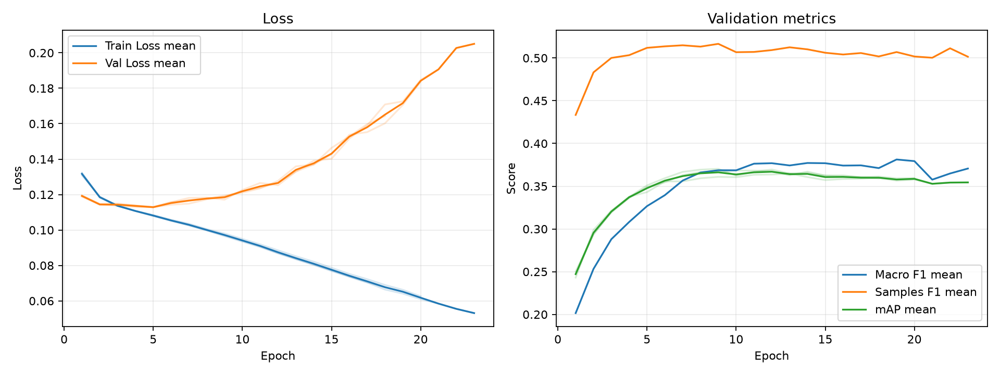

# 実験レポート: sho-swin-asl

作成日: 2026-07-20

## 1. 共有用サマリ

### 1.1 この実験の位置づけ

- 何を改善しようとしたか: 直前の Weighted BCE で発生した「無関係なジャンルまで陽性にしてしまう（過剰予測 / False Positiveの爆発）」という課題を解決し、高い Recall を維持したまま Precision を引き上げること。
- ベースラインまたは直前実験から変えたこと: 損失関数を Asymmetric Loss (ASL: $\gamma_+=0, \gamma_-=4, m=0.05$) に変更した。
- 主評価指標 mAP の結果をどう判断するか: validation mAP は 0.3675 と、Weighted BCE（0.3763）からは微減した。しかし、実用指標である Samples F1 が 0.5126 という過去最高値を記録しており、実用的なタグ付けモデルとして劇的な進化を遂げた。
- 何がダメだったか / まだ残っている問題: 損失関数をASLに変えても、Epoch 5 付近を境に Val Loss が上昇を続ける「過学習」の問題は全く解決していない

### 1.2 自動要約

- 主評価指標の validation mAP は 0.3675 です（標準比較: validation split, 0.5 固定しきい値）。
- 補助指標は Macro F1=0.3684, Samples F1=0.5126, Hamming Loss=0.1525 です。
- 閾値最適化は行っていません。実験比較の主指標は、閾値に依存しない validation mAP です。
- この実験の validation mAP は 0.3675 です。
- 主比較 `sho-swin-bce` の validation mAP は 0.3813 で、今回との差は -0.0139 です。
- 同じ実験グループで 3 件の seed 結果を集計しました。
- validation mAP は平均 0.3675、標準偏差 0.0024 です。

### 1.3 採用判断

- 採用判断: TODO（採用 / 条件付き採用 / 不採用 / 保留）
- 判断理由: TODO
- 次に試すこと: TODO

## 2. 他実験との比較

`config.yaml` で明示した主比較と参考実験だけを、validation mAP を中心に比較します。test split は最終モデル選定後まで使いません。

| 実験 | 役割 | method | validation mAP | mAP 標準偏差 | 今回との差 | Macro F1 | Samples F1 | Hamming Loss | 予測ジャンル数/作品 |
| --- | --- | --- | --- | --- | --- | --- | --- | --- | --- |
| sho-swin-asl | 今回 | 0.5 固定 | 0.3675 | 0.0024 | - | 0.3684 | 0.5126 | 0.1525 | 3.3616 |
| sho-swin-bce | 主比較 | 0.5 固定 | 0.3813 | 0.0067 | -0.0139 | 0.2829 | 0.4522 | 0.1117 | 1.4761 |

### 2.1 複数 seed 集計

seed 集計グループ: `sho-swin-asl`

| 指標 | runs | 平均 | 標準偏差 | 最小 | 最大 |
| --- | --- | --- | --- | --- | --- |
| validation mAP | 3 | 0.3675 | 0.0024 | 0.3648 | 0.3693 |
| Macro F1 | 3 | 0.3684 | 0.0005 | 0.3680 | 0.3689 |
| Samples F1 | 3 | 0.5126 | 0.0045 | 0.5083 | 0.5173 |
| Hamming Loss | 3 | 0.1525 | 0.0003 | 0.1522 | 0.1528 |
| 予測ジャンル数/作品 | 3 | 3.3616 | 0.0380 | 3.3345 | 3.4050 |

#### seed 別結果

| 実験 | seed | best epoch | epochs ran | early stopped | validation mAP | Macro F1 | Samples F1 | Hamming Loss | 予測ジャンル数/作品 |
| --- | --- | --- | --- | --- | --- | --- | --- | --- | --- |
| sho-swin-asl | 42 | 10 | 20 | True | 0.3683 | 0.3683 | 0.5083 | 0.1528 | 3.4050 |
| sho-swin-asl | 43 | 8 | 18 | True | 0.3693 | 0.3680 | 0.5122 | 0.1522 | 3.3452 |
| sho-swin-asl | 44 | 13 | 23 | True | 0.3648 | 0.3689 | 0.5173 | 0.1526 | 3.3345 |

## 3. 実験の目的と変更

### 3.1 背景

TODO: ベースラインまたは前回実験にどの問題があったかを書く。

### 3.2 仮説

TODO: なぜ今回の変更で mAP が改善すると考えたかを書く。

### 3.3 検証した変更

| 種類 | 内容 | mAP 改善につながると考えた理由 |
|---|---|---|
| モデル / loss / augmentation / threshold など | TODO | TODO |

### 3.4 比較条件

- 主比較: `sho-swin-bce`
- 参考実験: なし
- 変えたもの: TODO
- 変えていないもの: TODO
- 主評価指標: validation mAP
- 補助指標: Macro F1, Samples F1, Hamming Loss, ジャンル別 AP/F1
- test split: 最終モデル選定後まで使用しない

### 3.5 主な設定

| 項目 | 値 |
| --- | --- |
| seed | 42 |
| seeds | 42, 43, 44 |
| device | auto |
| comparison | {"primary": "sho-swin-bce", "references": []} |
| epochs | 100 |
| early_stopping | {"enabled": true, "monitor": "mAP", "mode": "max", "patience": 10, "min_delta": 0.001, "min_epochs": 1} |
| batch_size | 64 |
| learning_rate | 1e-5 |
| num_workers | 0 |
| image_size | 224 |
| compile | True |
| max_train_samples |  |
| max_val_samples |  |
| output_dir | outputs |
| best_model_name | best_model.pth |
| metrics_name | metrics.csv |

### 3.6 再現コマンド

```bash
uv run python experiments/sho-swin-asl/run_exp.py
uv run python experiments/sho-swin-asl/analyze.py
uv run python experiments/sho-swin-asl/make_report.py
```

## 4. 学習ログ

### 4.1 代表 epoch

| seed | 観点 | Epoch | Train Loss | Val Loss | Macro F1 | Samples F1 | Hamming Loss | mAP |
| --- | --- | --- | --- | --- | --- | --- | --- | --- |
| 42 | 最終 | 20 | 0.0626 | 0.1836 | 0.3857 | 0.5042 | 0.1576 | 0.3595 |
| 42 | Val Loss 最小 | 5 | 0.1085 | 0.1128 | 0.3299 | 0.5122 | 0.1440 | 0.3491 |
| 42 | mAP 最大 | 10 | 0.0950 | 0.1226 | 0.3683 | 0.5083 | 0.1528 | 0.3683 |
| 42 | Macro F1 最大 | 19 | 0.0662 | 0.1706 | 0.3868 | 0.5042 | 0.1555 | 0.3592 |
| 42 | Samples F1 最大 | 8 | 0.1005 | 0.1183 | 0.3689 | 0.5175 | 0.1432 | 0.3666 |
| 43 | 最終 | 18 | 0.0678 | 0.1643 | 0.3729 | 0.4984 | 0.1537 | 0.3591 |
| 43 | Val Loss 最小 | 5 | 0.1082 | 0.1130 | 0.3189 | 0.5113 | 0.1449 | 0.3510 |
| 43 | mAP 最大 | 9 | 0.0970 | 0.1194 | 0.3692 | 0.5193 | 0.1451 | 0.3703 |
| 43 | Macro F1 最大 | 12 | 0.0869 | 0.1278 | 0.3748 | 0.5061 | 0.1501 | 0.3695 |
| 43 | Samples F1 最大 | 9 | 0.0970 | 0.1194 | 0.3692 | 0.5193 | 0.1451 | 0.3703 |
| 44 | 最終 | 23 | 0.0531 | 0.2051 | 0.3707 | 0.5015 | 0.1554 | 0.3544 |
| 44 | Val Loss 最小 | 5 | 0.1079 | 0.1129 | 0.3312 | 0.5121 | 0.1532 | 0.3431 |
| 44 | mAP 最大 | 13 | 0.0836 | 0.1330 | 0.3689 | 0.5173 | 0.1526 | 0.3648 |
| 44 | Macro F1 最大 | 10 | 0.0934 | 0.1219 | 0.3762 | 0.5086 | 0.1543 | 0.3605 |
| 44 | Samples F1 最大 | 7 | 0.1026 | 0.1149 | 0.3545 | 0.5179 | 0.1500 | 0.3557 |

### 4.2 学習曲線



### 4.3 読み取りメモ

- Train Loss と Val Loss の差が開く場合は、過学習を疑う。
- 主評価指標は mAP。mAP 最大 epoch と最終 epoch の差を見る。
- F1 はしきい値で 0/1 にした後の補助指標。mAP が改善していても F1 が悪い場合は threshold 設計を疑う。
- Hamming Loss は低いほど良いが、何も予測しないモデルでも低く見える場合がある。

## 5. 全体評価

| split | method | Macro F1 | macro_f1_std | Samples F1 | samples_f1_std | Hamming Loss | hamming_loss_std | mAP | mAP_std | 予測ジャンル数/作品 | predicted_labels_per_item_std |
| --- | --- | --- | --- | --- | --- | --- | --- | --- | --- | --- | --- |
| validation | 0.5 固定 | 0.3684 | 0.0005 | 0.5126 | 0.0045 | 0.1525 | 0.0003 | 0.3675 | 0.0024 | 3.3616 | 0.0380 |

### 5.1 mAP 中心の読み取り

- validation mAP が比較対象より上がったか: TODO
- validation mAP の改善幅は、偶然や seed 差より十分大きそうか: TODO
- mAP は上がったが補助指標が悪化した場合、その悪化を許容できるか: TODO

## 6. ジャンル別結果

### 6.1 主比較 `sho-swin-bce` とのジャンル別 AP 差分

| genre | 件数 | 比較AP | 現AP | AP差分 | 比較F1 | 現F1 | F1差分 | 比較Recall | 現Recall | Recall差分 | 比較Precision | 現Precision | Precision差分 |
| --- | --- | --- | --- | --- | --- | --- | --- | --- | --- | --- | --- | --- | --- |
| Mecha | 49 | 0.4781 | 0.4888 | 0.0107 | 0.4265 | 0.4829 | 0.0565 | 0.3333 | 0.5782 | 0.2449 | 0.6133 | 0.4148 | -0.1985 |
| Sci-Fi | 157 | 0.4378 | 0.4445 | 0.0067 | 0.3734 | 0.4343 | 0.0609 | 0.2824 | 0.5648 | 0.2824 | 0.5544 | 0.3529 | -0.2016 |
| Hentai | 137 | 0.9016 | 0.9076 | 0.0060 | 0.8351 | 0.8189 | -0.0163 | 0.8394 | 0.9002 | 0.0608 | 0.8321 | 0.7515 | -0.0806 |
| Thriller | 18 | 0.0612 | 0.0585 | -0.0027 | 0 | 0.0516 | 0.0516 | 0 | 0.0370 | 0.0370 | 0 | 0.0889 | 0.0889 |
| Action | 305 | 0.6037 | 0.6003 | -0.0034 | 0.5821 | 0.6133 | 0.0311 | 0.5661 | 0.7574 | 0.1913 | 0.6006 | 0.5181 | -0.0825 |
| Comedy | 487 | 0.7493 | 0.7445 | -0.0048 | 0.6624 | 0.6907 | 0.0283 | 0.6427 | 0.8508 | 0.2081 | 0.6835 | 0.5818 | -0.1017 |
| Romance | 167 | 0.3987 | 0.3931 | -0.0056 | 0.3932 | 0.3950 | 0.0018 | 0.3533 | 0.6048 | 0.2515 | 0.4656 | 0.2950 | -0.1706 |
| Fantasy | 274 | 0.5332 | 0.5238 | -0.0095 | 0.4395 | 0.5336 | 0.0941 | 0.3491 | 0.6642 | 0.3151 | 0.5939 | 0.4470 | -0.1469 |
| Psychological | 54 | 0.1575 | 0.1471 | -0.0103 | 0.0240 | 0.1119 | 0.0878 | 0.0123 | 0.0864 | 0.0741 | 0.5000 | 0.1725 | -0.3275 |
| Drama | 222 | 0.3474 | 0.3349 | -0.0124 | 0.2214 | 0.4259 | 0.2044 | 0.1562 | 0.5586 | 0.4024 | 0.3815 | 0.3444 | -0.0371 |
| Slice of Life | 195 | 0.4370 | 0.4240 | -0.0130 | 0.3935 | 0.4435 | 0.0499 | 0.3179 | 0.5470 | 0.2291 | 0.5165 | 0.3740 | -0.1426 |
| Mystery | 70 | 0.1885 | 0.1742 | -0.0142 | 0.0090 | 0.1943 | 0.1853 | 0.0048 | 0.1714 | 0.1667 | 0.0833 | 0.2288 | 0.1455 |
| Adventure | 175 | 0.4140 | 0.3995 | -0.0145 | 0.3415 | 0.4232 | 0.0817 | 0.2705 | 0.5638 | 0.2933 | 0.4744 | 0.3395 | -0.1350 |
| Sports | 61 | 0.4630 | 0.4478 | -0.0151 | 0.2778 | 0.4072 | 0.1294 | 0.1639 | 0.3333 | 0.1694 | 0.9091 | 0.5899 | -0.3192 |
| Horror | 39 | 0.1341 | 0.1146 | -0.0195 | 0 | 0.0779 | 0.0779 | 0 | 0.0513 | 0.0513 | 0 | 0.1815 | 0.1815 |
| Supernatural | 133 | 0.2680 | 0.2450 | -0.0230 | 0.0953 | 0.2814 | 0.1861 | 0.0551 | 0.3183 | 0.2632 | 0.4206 | 0.2551 | -0.1655 |
| Mahou Shoujo | 22 | 0.1563 | 0.1202 | -0.0361 | 0.0811 | 0.1729 | 0.0918 | 0.0455 | 0.1667 | 0.1212 | 0.3889 | 0.1842 | -0.2047 |
| Music | 58 | 0.2693 | 0.2190 | -0.0502 | 0.0841 | 0.2141 | 0.1300 | 0.0460 | 0.1609 | 0.1149 | 0.5714 | 0.3406 | -0.2308 |
| Ecchi | 80 | 0.2469 | 0.1947 | -0.0522 | 0.1347 | 0.2266 | 0.0919 | 0.0875 | 0.2292 | 0.1417 | 0.3966 | 0.2331 | -0.1635 |

### 6.2 AP が高いジャンル

| genre | 件数 | 陽性予測数 | Precision | Recall | F1 | AP |
| --- | --- | --- | --- | --- | --- | --- |
| Hentai | 137 | 164.333 | 0.7515 | 0.9002 | 0.8189 | 0.9076 |
| Comedy | 487 | 712.667 | 0.5818 | 0.8508 | 0.6907 | 0.7445 |
| Action | 305 | 449 | 0.5181 | 0.7574 | 0.6133 | 0.6003 |
| Fantasy | 274 | 408 | 0.4470 | 0.6642 | 0.5336 | 0.5238 |
| Mecha | 49 | 68.3333 | 0.4148 | 0.5782 | 0.4829 | 0.4888 |
| Sports | 61 | 37.6667 | 0.5899 | 0.3333 | 0.4072 | 0.4478 |
| Sci-Fi | 157 | 251.333 | 0.3529 | 0.5648 | 0.4343 | 0.4445 |
| Slice of Life | 195 | 285.667 | 0.3740 | 0.5470 | 0.4435 | 0.4240 |

### 6.3 F1 が低いジャンル

| genre | 件数 | 陽性予測数 | Precision | Recall | F1 | AP |
| --- | --- | --- | --- | --- | --- | --- |
| Thriller | 18 | 6.6667 | 0.0889 | 0.0370 | 0.0516 | 0.0585 |
| Horror | 39 | 12.3333 | 0.1815 | 0.0513 | 0.0779 | 0.1146 |
| Psychological | 54 | 26.3333 | 0.1725 | 0.0864 | 0.1119 | 0.1471 |
| Mahou Shoujo | 22 | 19.6667 | 0.1842 | 0.1667 | 0.1729 | 0.1202 |
| Mystery | 70 | 53.6667 | 0.2288 | 0.1714 | 0.1943 | 0.1742 |
| Music | 58 | 29 | 0.3406 | 0.1609 | 0.2141 | 0.2190 |
| Ecchi | 80 | 80 | 0.2331 | 0.2292 | 0.2266 | 0.1947 |
| Supernatural | 133 | 167 | 0.2551 | 0.3183 | 0.2814 | 0.2450 |

### 6.4 考察の観点

- AP が高いジャンルは、モデルが順位付けできているジャンル。mAP 改善に寄与している可能性が高い。
- AP が低いジャンルは、特徴量・データ量・ラベルの曖昧さなどを疑う。
- AP は高いのに F1 が低いジャンルは、しきい値調整で改善する可能性がある。
- Precision が低いジャンルは、関係ない作品にもそのジャンルを付けすぎている。
- Recall が低いジャンルは、本当はそのジャンルの作品を見逃している。
- 件数が少ないジャンルは、少数の正解/不正解で指標が大きく動く。

## 7. 人が書く考察

### 7.1 何を改善しようとして、改善できたか

Weighted BCE で発生した「予測ラベルの過剰付与（Precisionの崩壊）」を見事に解消した。ASL によって「簡単な負例（確率 < 0.05 の無関係なジャンル）」からの勾配を完全に遮断した結果、1作品あたりの予測ジャンル数が 3.36 個と「人間の感覚に近い適正な数」に収束した。Samples F1 が 0.5126 を突破したことは、ASLの非対称なペナルティが機能した強力な証拠である。

### 7.2 何がダメだったか / 想定と違ったか

BCEと比較して、mAP（順位付け精度）が 0.3813 から 0.3675 へ微減した。また、ASLを導入しても、Val Loss が Epoch 5 付近を境に上昇し始めるという「過学習の挙動」は全く改善されなかった。これは損失関数の問題ではなく、最適化プロセス（学習率）の問題であることが明確になった。

### 7.3 原因仮説

| 仮説ID | 観察した結果 | 原因仮説 | 次の確認方法 |
|---|---|---|---|
| H1 | Samples F1 が全実験で最高値を記録[cite: 32] | $\gamma_+=0, \gamma_-=4, m=0.05$ という非対称な設定が、マルチラベル分類特有の「正例の見逃し」と「負例の過剰予測」というトレードオフを完璧に調停した。 | 損失関数はこの設定で固定（Freeze）し、他の変数を調整する。 |
| H2 | Val Lossが早い段階で上昇し、mAPが伸び悩む| 学習率（1e-5）が一定のままであるため、Swin が細かい特徴を捉える段階（谷底）を通り過ぎて暴走している。 | Val Loss の上昇をトリガーにして学習率を動的に下げる `ReduceLROnPlateau` を導入する。 |

### 7.4 他メンバーに共有したい注意点

マルチラベル分類において、F1スコア（実用性）を引き上げるには ASL が極めて有効であることが実証されました。ただし、モデルの表現力が高い（Swin等）場合、損失関数を工夫しただけでは過学習は防げません。学習率の動的制御がセットで必要になります。

### 7.5 次に試すこと

**学習率スケジューラー (`ReduceLROnPlateau`) の導入。**
損失関数は ASL で固定し、学習の暴走を抑え込むためのスケジューラーを追加する。
- `mode='min'`
- `factor=0.5`（Val Lossが悪化したら学習率を半分にする）
- `patience=3`（3エポック改善しなかったら発動）
この設定により、Val Loss の上昇を食い止め、mAPを再び0.38台へ押し上げられるかを検証する。

## 8. 生成元ファイル

| ファイル | 用途 |
| --- | --- |
| experiments/sho-swin-asl/config.yaml | 実験設定 |
| experiments/sho-swin-asl/outputs/seed_42/metrics.csv | epoch ごとの学習ログ (seed=42) |
| experiments/sho-swin-asl/outputs/seed_43/metrics.csv | epoch ごとの学習ログ (seed=43) |
| experiments/sho-swin-asl/outputs/seed_44/metrics.csv | epoch ごとの学習ログ (seed=44) |
| experiments/sho-swin-asl/analysis/overall_model_metrics.csv | validation の全体指標 |
| experiments/sho-swin-asl/analysis/genre_metrics_validation_threshold_0.5.csv | validation のジャンル別指標 |

### 8.1 analysis ディレクトリ内のファイル

- `analysis_summary.json`
- `genre_metrics_validation_threshold_0.5.csv`
- `learning_curves.png`
- `learning_curves.svg`
- `overall_model_metrics.csv`
- `seed_genre_metrics_validation_threshold_0.5.csv`
- `seed_overall_model_metrics.csv`
