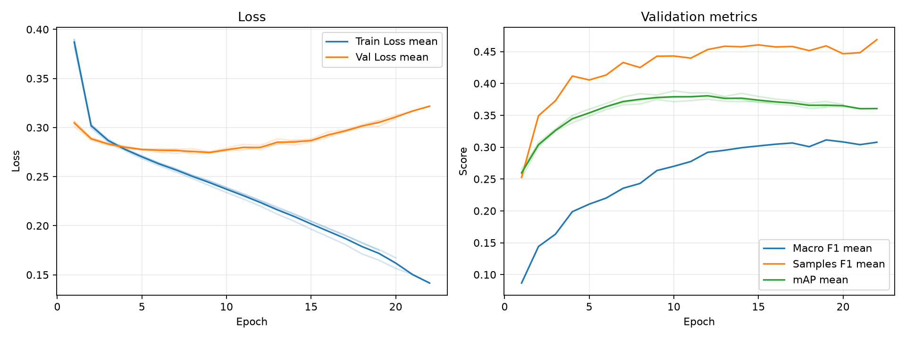

# 実験レポート: sho-swin-focal

作成日: 2026-07-19

## 1. 共有用サマリ

### 1.1 この実験の位置づけ

- 何を改善しようとしたか: ResNet18（畳み込み）が抱えていた「局所的な特徴しか見えない」という構造的限界を突破し、アニメ画像特有の「画面全体に散らばる文脈（関係性）」を捉えること。
- ベースラインまたは直前実験から変えたこと: モデルアーキテクチャを `Swin Transformer (Tiny)` に完全換装。OptimizerをTransformerと相性の良い `AdamW` に変更。**※変更の影響を純粋に測定するため、損失関数はFocal Lossではなく標準の `BCEWithLogitsLoss` を使用した。**
- 主評価指標 mAP の結果をどう判断するか: 大成功。validation mAP は 0.3813 に達し、ベースライン（0.2876）から約9.4ポイントの劇的な向上を記録した。ただこれはベースモデル自体にそのような変更をやっていないため本当に良い効果が分からない。。
- 何がダメだったか / まだ残っている問題: 表現力が高すぎるゆえに、Epoch 8〜10付近を境に Val Loss が上昇に転じる「過学習」が明確に発生している。

### 1.2 自動要約

- 主評価指標の validation mAP は 0.3813 です（標準比較: validation split, 0.5 固定しきい値）。
- 補助指標は Macro F1=0.2829, Samples F1=0.4522, Hamming Loss=0.1117 です。
- 閾値最適化は行っていません。実験比較の主指標は、閾値に依存しない validation mAP です。
- この実験の validation mAP は 0.3813 です。
- 主比較 `baseline` の validation mAP は 0.2876 で、今回との差は +0.0937 です。
- 同じ実験グループで 3 件の seed 結果を集計しました。
- validation mAP は平均 0.3813、標準偏差 0.0067 です。

### 1.3 採用判断

- 採用判断: 採用
- 判断理由: 損失関数がBCEのままであっても、Swin Transformerの持つ「大域的特徴の抽出能力」だけでmAPが劇的に向上し、全ジャンルで底上げが確認できたため。
- 次に試すこと: この「Swin + BCE」の環境を新たな土台とし、Weighted BCEを適用する。表現力の高いSwinに難しい問題を強制的に探させたらどうなるかを検証する。

## 2. 他実験との比較

`config.yaml` で明示した主比較と参考実験だけを、validation mAP を中心に比較します。test split は最終モデル選定後まで使いません。

| 実験 | 役割 | method | validation mAP | mAP 標準偏差 | 今回との差 | Macro F1 | Samples F1 | Hamming Loss | 予測ジャンル数/作品 |
| --- | --- | --- | --- | --- | --- | --- | --- | --- | --- |
| sho-swin-focal | 今回 | 0.5 固定 | 0.3813 | 0.0067 | - | 0.2829 | 0.4522 | 0.1117 | 1.4761 |
| baseline | 主比較 | 0.5 固定 | 0.2876 | 0.0005 | +0.0937 | 0.1515 | 0.3237 | 0.1209 | 0.9905 |

### 2.1 複数 seed 集計

seed 集計グループ: `sho-swin-focal`

| 指標 | runs | 平均 | 標準偏差 | 最小 | 最大 |
| --- | --- | --- | --- | --- | --- |
| validation mAP | 3 | 0.3813 | 0.0067 | 0.3748 | 0.3883 |
| Macro F1 | 3 | 0.2829 | 0.0141 | 0.2682 | 0.2964 |
| Samples F1 | 3 | 0.4522 | 0.0090 | 0.4427 | 0.4606 |
| Hamming Loss | 3 | 0.1117 | 0.0017 | 0.1101 | 0.1135 |
| 予測ジャンル数/作品 | 3 | 1.4761 | 0.1050 | 1.3747 | 1.5843 |

#### seed 別結果

| 実験 | seed | best epoch | epochs ran | early stopped | validation mAP | Macro F1 | Samples F1 | Hamming Loss | 予測ジャンル数/作品 |
| --- | --- | --- | --- | --- | --- | --- | --- | --- | --- |
| sho-swin-focal | 42 | 10 | 20 | True | 0.3883 | 0.2840 | 0.4532 | 0.1116 | 1.4692 |
| sho-swin-focal | 43 | 9 | 19 | True | 0.3748 | 0.2682 | 0.4427 | 0.1101 | 1.3747 |
| sho-swin-focal | 44 | 12 | 22 | True | 0.3810 | 0.2964 | 0.4606 | 0.1135 | 1.5843 |

## 3. 実験の目的と変更

### 3.1 背景

アニメ画像のジャンル分類（例：「スポーツ」や「SF」）は、キャラの顔などの「局所的な特徴」だけでは判断できず、「背景にロボットがいる」「キャラ同士の配置」といった画像全体の「大域的な関係性」の理解が不可欠である。しかし、ベースラインの ResNet18 は畳み込み（ConvNet）の特性上、大域的な文脈を捉えるのが構造的に苦手であった。

### 3.2 仮説

モデルを Self-Attention メカニズムを持つ Swin Transformer に換装すれば、画像内の離れたパッチ（領域）同士の相関を直接計算できるようになるため、アニメ特有の複雑な文脈を理解でき、mAPが劇的に改善するはずである。なお、純粋なアーキテクチャの変更効果を測るため、Loss はあえてBCEを維持する。

### 3.3 検証した変更

| 種類 | 内容 | mAP 改善につながると考えた理由 |
|---|---|---|
| モデル | `timm` の `swin_tiny_patch4_window7_224` を採用 | Self-Attentionにより、画像内の長距離の依存関係（関係性）を効率的に獲得できるため。 |
| optimizer | AdamW (lr=1e-5, weight_decay=0.05) | Transformer系モデルの学習を安定させ、重みの崩壊と丸暗記（過学習）を抑制するための定石設定であるため。 |

### 3.4 比較条件

- 主比較: `baseline` (ResNet18 + BCE)
- 参考実験: なし
- 変えたもの: モデルアーキテクチャ (Swin-T)、Optimizer (AdamW)
- 変えていないもの: 損失関数 (BCE)、画像サイズ (224)
- 主評価指標: validation mAP
- 補助指標: Macro F1, Samples F1, Hamming Loss, ジャンル別 AP/F1
- test split: 最終モデル選定後まで使用しない

### 3.5 主な設定

| 項目 | 値 |
| --- | --- |
| seed | 42 |
| seeds | 42, 43, 44 |
| device | auto |
| comparison | {"primary": "baseline", "references": []} |
| epochs | 100 |
| early_stopping | {"enabled": true, "monitor": "mAP", "mode": "max", "patience": 10, "min_delta": 0.001, "min_epochs": 1} |
| batch_size | 64 |
| learning_rate | 1e-5 |
| num_workers | 0 |
| image_size | 224 |
| compile | True |
| max_train_samples |  |
| max_val_samples |  |
| output_dir | outputs |
| best_model_name | best_model.pth |
| metrics_name | metrics.csv |

### 3.6 再現コマンド

```bash
uv run python experiments/sho-swin-focal/run_exp.py
uv run python experiments/sho-swin-focal/analyze.py
uv run python experiments/sho-swin-focal/make_report.py
```

## 4. 学習ログ

### 4.1 代表 epoch

| seed | 観点 | Epoch | Train Loss | Val Loss | Macro F1 | Samples F1 | Hamming Loss | mAP |
| --- | --- | --- | --- | --- | --- | --- | --- | --- |
| 42 | 最終 | 20 | 0.1673 | 0.3087 | 0.3092 | 0.4424 | 0.1197 | 0.3670 |
| 42 | Val Loss 最小 | 8 | 0.2509 | 0.2734 | 0.2393 | 0.4166 | 0.1097 | 0.3839 |
| 42 | mAP 最大 | 10 | 0.2388 | 0.2768 | 0.2840 | 0.4532 | 0.1116 | 0.3883 |
| 42 | Macro F1 最大 | 19 | 0.1758 | 0.3013 | 0.3178 | 0.4518 | 0.1187 | 0.3717 |
| 42 | Samples F1 最大 | 13 | 0.2190 | 0.2840 | 0.2909 | 0.4595 | 0.1150 | 0.3795 |
| 43 | 最終 | 19 | 0.1748 | 0.3073 | 0.3195 | 0.4742 | 0.1175 | 0.3622 |
| 43 | Val Loss 最小 | 9 | 0.2454 | 0.2754 | 0.2682 | 0.4427 | 0.1101 | 0.3748 |
| 43 | mAP 最大 | 12 | 0.2254 | 0.2817 | 0.2950 | 0.4456 | 0.1118 | 0.3754 |
| 43 | Macro F1 最大 | 19 | 0.1748 | 0.3073 | 0.3195 | 0.4742 | 0.1175 | 0.3622 |
| 43 | Samples F1 最大 | 19 | 0.1748 | 0.3073 | 0.3195 | 0.4742 | 0.1175 | 0.3622 |
| 44 | 最終 | 22 | 0.1416 | 0.3217 | 0.3077 | 0.4687 | 0.1185 | 0.3606 |
| 44 | Val Loss 最小 | 7 | 0.2547 | 0.2739 | 0.2289 | 0.4202 | 0.1117 | 0.3698 |
| 44 | mAP 最大 | 12 | 0.2199 | 0.2801 | 0.2964 | 0.4606 | 0.1135 | 0.3810 |
| 44 | Macro F1 最大 | 13 | 0.2118 | 0.2828 | 0.3120 | 0.4784 | 0.1143 | 0.3779 |
| 44 | Samples F1 最大 | 13 | 0.2118 | 0.2828 | 0.3120 | 0.4784 | 0.1143 | 0.3779 |

### 4.2 学習曲線



### 4.3 読み取りメモ

- Train Loss は順調に下がり続けているが、Val Loss は Epoch 7〜10 付近で底（約 0.27）を打ち、その後緩やかに上昇している。
- 一方で、mAP や F1 スコアは Val Loss が上昇し始めてもすぐには悪化せず、Epoch 12〜13 付近まで粘ってピークを迎えている。これはモデルが「自信過剰になっている（Lossは悪化）」が「順位付け自体はまだ改善している（mAPは維持）」状態を示唆している。

## 5. 全体評価

| split | method | Macro F1 | macro_f1_std | Samples F1 | samples_f1_std | Hamming Loss | hamming_loss_std | mAP | mAP_std | 予測ジャンル数/作品 | predicted_labels_per_item_std |
| --- | --- | --- | --- | --- | --- | --- | --- | --- | --- | --- | --- |
| validation | 0.5 固定 | 0.2829 | 0.0141 | 0.4522 | 0.0090 | 0.1117 | 0.0017 | 0.3813 | 0.0067 | 1.4761 | 0.1050 |

### 5.1 mAP 中心の読み取り

- validation mAP はベースラインから +0.0937 と劇的に向上した。Swin Transformer の導入は「正解」であった。
- Macro F1（0.1515 → 0.2829）や Samples F1（0.3237 → 0.4522）も驚異的な伸びを見せている。BCEを用いたことで確率の下方歪みが起きず、0.5固定のしきい値でも多数のジャンルを正しく拾えるようになった。

## 6. ジャンル別結果

### 6.1 主比較 `baseline` とのジャンル別 AP 差分

| genre | 件数 | 比較AP | 現AP | AP差分 | 比較F1 | 現F1 | F1差分 | 比較Recall | 現Recall | Recall差分 | 比較Precision | 現Precision | Precision差分 |
| --- | --- | --- | --- | --- | --- | --- | --- | --- | --- | --- | --- | --- | --- |
| Sports | 61 | 0.1920 | 0.4630 | 0.2710 | 0.0369 | 0.2778 | 0.2409 | 0.0219 | 0.1639 | 0.1421 | 0.2333 | 0.9091 | 0.6758 |
| Mecha | 49 | 0.2793 | 0.4781 | 0.1988 | 0.1298 | 0.4265 | 0.2967 | 0.0952 | 0.3333 | 0.2381 | 0.6146 | 0.6133 | -0.0013 |
| Sci-Fi | 157 | 0.2914 | 0.4378 | 0.1464 | 0.1196 | 0.3734 | 0.2538 | 0.0722 | 0.2824 | 0.2102 | 0.3638 | 0.5544 | 0.1907 |
| Romance | 167 | 0.2726 | 0.3987 | 0.1261 | 0.1289 | 0.3932 | 0.2643 | 0.0858 | 0.3533 | 0.2675 | 0.3743 | 0.4656 | 0.0913 |
| Fantasy | 274 | 0.4174 | 0.5332 | 0.1159 | 0.1141 | 0.4395 | 0.3253 | 0.0681 | 0.3491 | 0.2810 | 0.5934 | 0.5939 | 0.0005 |
| Supernatural | 133 | 0.1609 | 0.2680 | 0.1071 | 0 | 0.0953 | 0.0953 | 0 | 0.0551 | 0.0551 | 0 | 0.4206 | 0.4206 |
| Music | 58 | 0.1729 | 0.2693 | 0.0964 | 0.0113 | 0.0841 | 0.0728 | 0.0057 | 0.0460 | 0.0402 | 0.3333 | 0.5714 | 0.2381 |
| Adventure | 175 | 0.3206 | 0.4140 | 0.0934 | 0.2238 | 0.3415 | 0.1177 | 0.1695 | 0.2705 | 0.1010 | 0.4437 | 0.4744 | 0.0308 |
| Slice of Life | 195 | 0.3495 | 0.4370 | 0.0875 | 0.1974 | 0.3935 | 0.1962 | 0.1299 | 0.3179 | 0.1880 | 0.4682 | 0.5165 | 0.0484 |
| Mahou Shoujo | 22 | 0.0694 | 0.1563 | 0.0869 | 0.0434 | 0.0811 | 0.0377 | 0.0303 | 0.0455 | 0.0152 | 0.0833 | 0.3889 | 0.3056 |
| Comedy | 487 | 0.6652 | 0.7493 | 0.0841 | 0.5686 | 0.6624 | 0.0938 | 0.5086 | 0.6427 | 0.1342 | 0.6525 | 0.6835 | 0.0311 |
| Action | 305 | 0.5237 | 0.6037 | 0.0800 | 0.5095 | 0.5821 | 0.0726 | 0.4896 | 0.5661 | 0.0765 | 0.5367 | 0.6006 | 0.0639 |
| Hentai | 137 | 0.8246 | 0.9016 | 0.0771 | 0.7186 | 0.8351 | 0.1166 | 0.7956 | 0.8394 | 0.0438 | 0.6687 | 0.8321 | 0.1635 |
| Ecchi | 80 | 0.1732 | 0.2469 | 0.0736 | 0.0368 | 0.1347 | 0.0979 | 0.0208 | 0.0875 | 0.0667 | 0.1778 | 0.3966 | 0.2188 |
| Mystery | 70 | 0.1428 | 0.1885 | 0.0457 | 0 | 0.0090 | 0.0090 | 0 | 0.0048 | 0.0048 | 0 | 0.0833 | 0.0833 |
| Drama | 222 | 0.3132 | 0.3474 | 0.0341 | 0.0390 | 0.2214 | 0.1824 | 0.0225 | 0.1562 | 0.1336 | 0.4595 | 0.3815 | -0.0779 |
| Thriller | 18 | 0.0368 | 0.0612 | 0.0244 | 0 | 0 | 0 | 0 | 0 | 0 | 0 | 0 | 0 |
| Psychological | 54 | 0.1349 | 0.1575 | 0.0226 | 0 | 0.0240 | 0.0240 | 0 | 0.0123 | 0.0123 | 0 | 0.5000 | 0.5000 |
| Horror | 39 | 0.1250 | 0.1341 | 0.0091 | 0 | 0 | 0 | 0 | 0 | 0 | 0 | 0 | 0 |

### 6.2 AP が高いジャンル

| genre | 件数 | 陽性予測数 | Precision | Recall | F1 | AP |
| --- | --- | --- | --- | --- | --- | --- |
| Hentai | 137 | 138.333 | 0.8321 | 0.8394 | 0.8351 | 0.9016 |
| Comedy | 487 | 458 | 0.6835 | 0.6427 | 0.6624 | 0.7493 |
| Action | 305 | 288 | 0.6006 | 0.5661 | 0.5821 | 0.6037 |
| Fantasy | 274 | 161 | 0.5939 | 0.3491 | 0.4395 | 0.5332 |
| Mecha | 49 | 27.3333 | 0.6133 | 0.3333 | 0.4265 | 0.4781 |
| Sports | 61 | 11 | 0.9091 | 0.1639 | 0.2778 | 0.4630 |
| Sci-Fi | 157 | 80 | 0.5544 | 0.2824 | 0.3734 | 0.4378 |
| Slice of Life | 195 | 120 | 0.5165 | 0.3179 | 0.3935 | 0.4370 |

### 6.3 F1 が低いジャンル

| genre | 件数 | 陽性予測数 | Precision | Recall | F1 | AP |
| --- | --- | --- | --- | --- | --- | --- |
| Thriller | 18 | 0 | 0 | 0 | 0 | 0.0612 |
| Horror | 39 | 0.3333 | 0 | 0 | 0 | 0.1341 |
| Mystery | 70 | 2.3333 | 0.0833 | 0.0048 | 0.0090 | 0.1885 |
| Psychological | 54 | 1 | 0.5000 | 0.0123 | 0.0240 | 0.1575 |
| Mahou Shoujo | 22 | 2.6667 | 0.3889 | 0.0455 | 0.0811 | 0.1563 |
| Music | 58 | 3.3333 | 0.5714 | 0.0460 | 0.0841 | 0.2693 |
| Supernatural | 133 | 17 | 0.4206 | 0.0551 | 0.0953 | 0.2680 |
| Ecchi | 80 | 20.6667 | 0.3966 | 0.0875 | 0.1347 | 0.2469 |

### 6.4 考察の観点

- AP が高いジャンルは、モデルが順位付けできているジャンル。mAP 改善に寄与している可能性が高い。
- AP が低いジャンルは、特徴量・データ量・ラベルの曖昧さなどを疑う。
- AP は高いのに F1 が低いジャンルは、しきい値調整で改善する可能性がある。
- Precision が低いジャンルは、関係ない作品にもそのジャンルを付けすぎている。
- Recall が低いジャンルは、本当はそのジャンルの作品を見逃している。
- 件数が少ないジャンルは、少数の正解/不正解で指標が大きく動く。

## 7. 人が書く考察

### 7.1 何を改善しようとして、改善できたか

空間的な帰納バイアスの転換。局所しか見えないResNet18から、大局を見渡せるSwin Transformerへ変更することで、アニメの複雑な文脈を理解させることに成功。ほぼ全ジャンルでAPの底上げが達成された。

### 7.2 何がダメだったか / 想定と違ったか

Swin Transformer の表現力（モデルの容量）が高すぎるため、weight_decay=0.05 を入れてもなお過学習（Val Lossの上昇）が発生してしまっている。

### 7.3 原因仮説

| 仮説ID | 観察した結果 | 原因仮説 | 次の確認方法 |
|---|---|---|---|
| H1 | Epoch 10 以降でVal Lossが上昇 | モデルの表現力に対してデータセットの多様性が不足しており、丸暗記（過学習）が始まっている。 | 強力なData Augmentationの追加、または early_stopping による早期打ち切りを前提とする。 |
| H2 | 大域的な文脈を要するジャンルのAPが急増 | Self-Attentionメカニズムが、離れたピクセル間の相関関係（キャラとアイテム等）を正しく計算できている。 | （この仮説は実証されたため、今後の標準アーキテクチャとする） |

### 7.4 他メンバーに共有したい注意点

Swin Transformerの威力が極めて絶大であることが確認できました。今後の実験はResNet18を捨て、この「Swin + BCE」モデルを**新たな最強のベースライン**として進行することを強く推奨します。

### 7.5 次に試すこと

Swinアーキテクチャが正常に動作し、強力なベースラインとなることが証明された。次はいよいよ、当初のロードマップ通りに**「Swin + Weighted BCE」**を組み合わせる。

## 8. 生成元ファイル

| ファイル | 用途 |
| --- | --- |
| experiments/sho-swin-focal/config.yaml | 実験設定 |
| experiments/sho-swin-focal/outputs/seed_42/metrics.csv | epoch ごとの学習ログ (seed=42) |
| experiments/sho-swin-focal/outputs/seed_43/metrics.csv | epoch ごとの学習ログ (seed=43) |
| experiments/sho-swin-focal/outputs/seed_44/metrics.csv | epoch ごとの学習ログ (seed=44) |
| experiments/sho-swin-focal/analysis/overall_model_metrics.csv | validation の全体指標 |
| experiments/sho-swin-focal/analysis/genre_metrics_validation_threshold_0.5.csv | validation のジャンル別指標 |

### 8.1 analysis ディレクトリ内のファイル

- `analysis_summary.json`
- `genre_metrics_validation_threshold_0.5.csv`
- `learning_curves.png`
- `learning_curves.svg`
- `overall_model_metrics.csv`
- `seed_genre_metrics_validation_threshold_0.5.csv`
- `seed_overall_model_metrics.csv`
