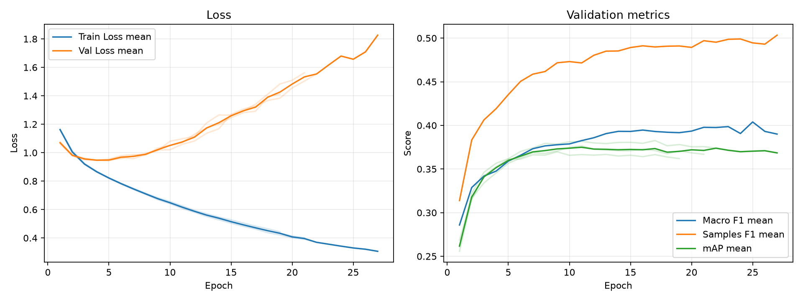

# 実験レポート: sho-swin-weighted-bce

作成日: 2026-07-20

## 1. 共有用サマリ

### 1.1 この実験の位置づけ

- 何を改善しようとしたか: 直前の「Swin + BCE」モデルが抱えていた、「出現頻度の低いジャンル（正例）を見逃してしまう」というクラス不均衡問題を是正するため。
- ベースラインまたは直前実験から変えたこと: 損失関数を `BCEWithLogitsLoss` から、正例の重みを各epochごとの不例 / 正例の割合に強調した `Weighted BCE` に変更。
- 主評価指標 mAP の結果をどう判断するか: validation mAP は 0.3763 となり、直前の純粋なBCE（0.3813）から微減した。重み付けによって順位付けのスケールがわずかに歪んだためである。
- 何がダメだったか / まだ残っている問題: 陽性予測数が激増し、1作品あたり平均 4.61 個のジャンルを付与する「トリガーハッピー（過剰予測）」なモデルになってしまった。これにより Recall と F1 は激増したが、Precision が崩壊し、Hamming Loss が悪化（0.2004）している

### 1.2 自動要約

- 主評価指標の validation mAP は 0.3763 です（標準比較: validation split, 0.5 固定しきい値）。
- 補助指標は Macro F1=0.3859, Samples F1=0.4812, Hamming Loss=0.2004 です。
- 閾値最適化は行っていません。実験比較の主指標は、閾値に依存しない validation mAP です。
- この実験の validation mAP は 0.3763 です。
- 主比較 `baseline` の validation mAP は 0.2876 で、今回との差は +0.0886 です。
- 同じ実験グループで 3 件の seed 結果を集計しました。
- validation mAP は平均 0.3763、標準偏差 0.0065 です。

### 1.3 採用判断

- 採用判断: 不採用
- 判断理由: F1（バランス）を引き上げることはできたが、固定の重み（6.67倍）を全体にかけるWeighted BCEは「乱暴すぎた」ため。関係ないジャンルまで強引に陽性にしてしまい、実用性（Precision）を大きく損なっている。
- 次に試すこと: 正例・負例の勾配を動的かつ非対称にコントロールする「ASL (Asymmetric Loss)」の導入。これによって、mAP（順位付け精度）を落とさずに、RecallとPrecisionのバランスを最適化する。

## 2. 他実験との比較

`config.yaml` で明示した主比較と参考実験だけを、validation mAP を中心に比較します。test split は最終モデル選定後まで使いません。

| 実験 | 役割 | method | validation mAP | mAP 標準偏差 | 今回との差 | Macro F1 | Samples F1 | Hamming Loss | 予測ジャンル数/作品 |
| --- | --- | --- | --- | --- | --- | --- | --- | --- | --- |
| sho-swin-weighted-bce | 今回 | 0.5 固定 | 0.3763 | 0.0065 | - | 0.3859 | 0.4812 | 0.2004 | 4.6108 |
| baseline | 主比較 | 0.5 固定 | 0.2876 | 0.0005 | +0.0886 | 0.1515 | 0.3237 | 0.1209 | 0.9905 |

### 2.1 複数 seed 集計

seed 集計グループ: `sho-swin-weighted-bce`

| 指標 | runs | 平均 | 標準偏差 | 最小 | 最大 |
| --- | --- | --- | --- | --- | --- |
| validation mAP | 3 | 0.3763 | 0.0065 | 0.3697 | 0.3826 |
| Macro F1 | 3 | 0.3859 | 0.0136 | 0.3750 | 0.4012 |
| Samples F1 | 3 | 0.4812 | 0.0141 | 0.4690 | 0.4967 |
| Hamming Loss | 3 | 0.2004 | 0.0233 | 0.1757 | 0.2220 |
| 予測ジャンル数/作品 | 3 | 4.6108 | 0.5881 | 3.9991 | 5.1722 |

#### seed 別結果

| 実験 | seed | best epoch | epochs ran | early stopped | validation mAP | Macro F1 | Samples F1 | Hamming Loss | 予測ジャンル数/作品 |
| --- | --- | --- | --- | --- | --- | --- | --- | --- | --- |
| sho-swin-weighted-bce | 42 | 11 | 21 | True | 0.3765 | 0.3816 | 0.4780 | 0.2036 | 4.6610 |
| sho-swin-weighted-bce | 43 | 9 | 19 | True | 0.3697 | 0.3750 | 0.4690 | 0.2220 | 5.1722 |
| sho-swin-weighted-bce | 44 | 17 | 27 | True | 0.3826 | 0.4012 | 0.4967 | 0.1757 | 3.9991 |

## 3. 実験の目的と変更

### 3.1 背景

TODO: ベースラインまたは前回実験にどの問題があったかを書く。

### 3.2 仮説

TODO: なぜ今回の変更で mAP が改善すると考えたかを書く。

### 3.3 検証した変更

| 種類 | 内容 | mAP 改善につながると考えた理由 |
|---|---|---|
| モデル / loss / augmentation / threshold など | TODO | TODO |

### 3.4 比較条件

- 主比較: `baseline`
- 参考実験: なし
- 変えたもの: TODO
- 変えていないもの: TODO
- 主評価指標: validation mAP
- 補助指標: Macro F1, Samples F1, Hamming Loss, ジャンル別 AP/F1
- test split: 最終モデル選定後まで使用しない

### 3.5 主な設定

| 項目 | 値 |
| --- | --- |
| seed | 42 |
| seeds | 42, 43, 44 |
| device | auto |
| comparison | {"primary": "baseline", "references": []} |
| epochs | 100 |
| early_stopping | {"enabled": true, "monitor": "mAP", "mode": "max", "patience": 10, "min_delta": 0.001, "min_epochs": 1} |
| batch_size | 64 |
| learning_rate | 1e-5 |
| num_workers | 0 |
| image_size | 224 |
| compile | True |
| max_train_samples |  |
| max_val_samples |  |
| output_dir | outputs |
| best_model_name | best_model.pth |
| metrics_name | metrics.csv |

### 3.6 再現コマンド

```bash
uv run python experiments/sho-swin-weighted-bce/run_exp.py
uv run python experiments/sho-swin-weighted-bce/analyze.py
uv run python experiments/sho-swin-weighted-bce/make_report.py
```

## 4. 学習ログ

### 4.1 代表 epoch

| seed | 観点 | Epoch | Train Loss | Val Loss | Macro F1 | Samples F1 | Hamming Loss | mAP |
| --- | --- | --- | --- | --- | --- | --- | --- | --- |
| 42 | 最終 | 21 | 0.4012 | 1.5623 | 0.3933 | 0.4944 | 0.1721 | 0.3669 |
| 42 | Val Loss 最小 | 5 | 0.8214 | 0.9469 | 0.3581 | 0.4385 | 0.2533 | 0.3566 |
| 42 | mAP 最大 | 11 | 0.6166 | 1.0973 | 0.3816 | 0.4780 | 0.2036 | 0.3765 |
| 42 | Macro F1 最大 | 15 | 0.5133 | 1.2626 | 0.3967 | 0.4879 | 0.1898 | 0.3710 |
| 42 | Samples F1 最大 | 19 | 0.4337 | 1.4833 | 0.3922 | 0.4944 | 0.1766 | 0.3707 |
| 43 | 最終 | 19 | 0.4433 | 1.4118 | 0.3859 | 0.4872 | 0.1825 | 0.3620 |
| 43 | Val Loss 最小 | 4 | 0.8689 | 0.9458 | 0.3428 | 0.4153 | 0.2793 | 0.3527 |
| 43 | mAP 最大 | 9 | 0.6831 | 1.0324 | 0.3750 | 0.4690 | 0.2220 | 0.3697 |
| 43 | Macro F1 最大 | 16 | 0.5047 | 1.2817 | 0.3859 | 0.4883 | 0.1874 | 0.3642 |
| 43 | Samples F1 最大 | 18 | 0.4643 | 1.3922 | 0.3841 | 0.4891 | 0.1782 | 0.3638 |
| 44 | 最終 | 27 | 0.3062 | 1.8263 | 0.3900 | 0.5034 | 0.1561 | 0.3685 |
| 44 | Val Loss 最小 | 5 | 0.8192 | 0.9434 | 0.3559 | 0.4300 | 0.2646 | 0.3618 |
| 44 | mAP 最大 | 17 | 0.4625 | 1.3276 | 0.4012 | 0.4967 | 0.1757 | 0.3826 |
| 44 | Macro F1 最大 | 16 | 0.4820 | 1.3066 | 0.4048 | 0.4965 | 0.1728 | 0.3795 |
| 44 | Samples F1 最大 | 27 | 0.3062 | 1.8263 | 0.3900 | 0.5034 | 0.1561 | 0.3685 |

### 4.2 学習曲線



### 4.3 読み取りメモ

- Train Loss と Val Loss の差が開く場合は、過学習を疑う。
- 主評価指標は mAP。mAP 最大 epoch と最終 epoch の差を見る。
- F1 はしきい値で 0/1 にした後の補助指標。mAP が改善していても F1 が悪い場合は threshold 設計を疑う。
- Hamming Loss は低いほど良いが、何も予測しないモデルでも低く見える場合がある。

## 5. 全体評価

| split | method | Macro F1 | macro_f1_std | Samples F1 | samples_f1_std | Hamming Loss | hamming_loss_std | mAP | mAP_std | 予測ジャンル数/作品 | predicted_labels_per_item_std |
| --- | --- | --- | --- | --- | --- | --- | --- | --- | --- | --- | --- |
| validation | 0.5 固定 | 0.3859 | 0.0136 | 0.4812 | 0.0141 | 0.2004 | 0.0233 | 0.3763 | 0.0065 | 4.6108 | 0.5881 |

### 5.1 mAP 中心の読み取り

- validation mAP が比較対象より上がったか: TODO
- validation mAP の改善幅は、偶然や seed 差より十分大きそうか: TODO
- mAP は上がったが補助指標が悪化した場合、その悪化を許容できるか: TODO

## 6. ジャンル別結果

### 6.1 主比較 `baseline` とのジャンル別 AP 差分

| genre | 件数 | 比較AP | 現AP | AP差分 | 比較F1 | 現F1 | F1差分 | 比較Recall | 現Recall | Recall差分 | 比較Precision | 現Precision | Precision差分 |
| --- | --- | --- | --- | --- | --- | --- | --- | --- | --- | --- | --- | --- | --- |
| Sports | 61 | 0.1920 | 0.4744 | 0.2824 | 0.0369 | 0.4158 | 0.3789 | 0.0219 | 0.6612 | 0.6393 | 0.2333 | 0.3116 | 0.0783 |
| Mecha | 49 | 0.2793 | 0.4797 | 0.2003 | 0.1298 | 0.4146 | 0.2848 | 0.0952 | 0.8435 | 0.7483 | 0.6146 | 0.2864 | -0.3282 |
| Romance | 167 | 0.2726 | 0.4110 | 0.1384 | 0.1289 | 0.3882 | 0.2594 | 0.0858 | 0.6906 | 0.6048 | 0.3743 | 0.2700 | -0.1042 |
| Sci-Fi | 157 | 0.2914 | 0.4285 | 0.1370 | 0.1196 | 0.4186 | 0.2990 | 0.0722 | 0.6221 | 0.5499 | 0.3638 | 0.3210 | -0.0428 |
| Mahou Shoujo | 22 | 0.0694 | 0.2023 | 0.1329 | 0.0434 | 0.1824 | 0.1389 | 0.0303 | 0.3636 | 0.3333 | 0.0833 | 0.1236 | 0.0403 |
| Supernatural | 133 | 0.1609 | 0.2630 | 0.1021 | 0 | 0.3268 | 0.3268 | 0 | 0.6090 | 0.6090 | 0 | 0.2245 | 0.2245 |
| Fantasy | 274 | 0.4174 | 0.5176 | 0.1002 | 0.1141 | 0.5354 | 0.4213 | 0.0681 | 0.6642 | 0.5961 | 0.5934 | 0.4500 | -0.1434 |
| Music | 58 | 0.1729 | 0.2614 | 0.0885 | 0.0113 | 0.2559 | 0.2446 | 0.0057 | 0.4368 | 0.4310 | 0.3333 | 0.1857 | -0.1476 |
| Comedy | 487 | 0.6652 | 0.7446 | 0.0794 | 0.5686 | 0.6850 | 0.1164 | 0.5086 | 0.7426 | 0.2341 | 0.6525 | 0.6365 | -0.0159 |
| Action | 305 | 0.5237 | 0.6027 | 0.0790 | 0.5095 | 0.6093 | 0.0998 | 0.4896 | 0.7049 | 0.2153 | 0.5367 | 0.5395 | 0.0028 |
| Slice of Life | 195 | 0.3495 | 0.4168 | 0.0673 | 0.1974 | 0.4528 | 0.2555 | 0.1299 | 0.6735 | 0.5436 | 0.4682 | 0.3413 | -0.1269 |
| Adventure | 175 | 0.3206 | 0.3853 | 0.0648 | 0.2238 | 0.4316 | 0.2078 | 0.1695 | 0.6362 | 0.4667 | 0.4437 | 0.3275 | -0.1162 |
| Hentai | 137 | 0.8246 | 0.8867 | 0.0621 | 0.7186 | 0.7896 | 0.0711 | 0.7956 | 0.9075 | 0.1119 | 0.6687 | 0.7007 | 0.0320 |
| Ecchi | 80 | 0.1732 | 0.2265 | 0.0532 | 0.0368 | 0.2516 | 0.2147 | 0.0208 | 0.5625 | 0.5417 | 0.1778 | 0.1635 | -0.0143 |
| Drama | 222 | 0.3132 | 0.3476 | 0.0344 | 0.0390 | 0.4416 | 0.4026 | 0.0225 | 0.6471 | 0.6246 | 0.4595 | 0.3371 | -0.1223 |
| Thriller | 18 | 0.0368 | 0.0694 | 0.0326 | 0 | 0.0847 | 0.0847 | 0 | 0.2037 | 0.2037 | 0 | 0.0551 | 0.0551 |
| Mystery | 70 | 0.1428 | 0.1734 | 0.0307 | 0 | 0.2429 | 0.2429 | 0 | 0.5476 | 0.5476 | 0 | 0.1578 | 0.1578 |
| Psychological | 54 | 0.1349 | 0.1472 | 0.0123 | 0 | 0.2343 | 0.2343 | 0 | 0.4198 | 0.4198 | 0 | 0.1673 | 0.1673 |
| Horror | 39 | 0.1250 | 0.1117 | -0.0133 | 0 | 0.1713 | 0.1713 | 0 | 0.3419 | 0.3419 | 0 | 0.1171 | 0.1171 |

### 6.2 AP が高いジャンル

| genre | 件数 | 陽性予測数 | Precision | Recall | F1 | AP |
| --- | --- | --- | --- | --- | --- | --- |
| Hentai | 137 | 178.333 | 0.7007 | 0.9075 | 0.7896 | 0.8867 |
| Comedy | 487 | 568.667 | 0.6365 | 0.7426 | 0.6850 | 0.7446 |
| Action | 305 | 401 | 0.5395 | 0.7049 | 0.6093 | 0.6027 |
| Fantasy | 274 | 405.667 | 0.4500 | 0.6642 | 0.5354 | 0.5176 |
| Mecha | 49 | 159.667 | 0.2864 | 0.8435 | 0.4146 | 0.4797 |
| Sports | 61 | 138 | 0.3116 | 0.6612 | 0.4158 | 0.4744 |
| Sci-Fi | 157 | 307.333 | 0.3210 | 0.6221 | 0.4186 | 0.4285 |
| Slice of Life | 195 | 385 | 0.3413 | 0.6735 | 0.4528 | 0.4168 |

### 6.3 F1 が低いジャンル

| genre | 件数 | 陽性予測数 | Precision | Recall | F1 | AP |
| --- | --- | --- | --- | --- | --- | --- |
| Thriller | 18 | 71.6667 | 0.0551 | 0.2037 | 0.0847 | 0.0694 |
| Horror | 39 | 119 | 0.1171 | 0.3419 | 0.1713 | 0.1117 |
| Mahou Shoujo | 22 | 66.3333 | 0.1236 | 0.3636 | 0.1824 | 0.2023 |
| Psychological | 54 | 140.333 | 0.1673 | 0.4198 | 0.2343 | 0.1472 |
| Mystery | 70 | 245 | 0.1578 | 0.5476 | 0.2429 | 0.1734 |
| Ecchi | 80 | 282.667 | 0.1635 | 0.5625 | 0.2516 | 0.2265 |
| Music | 58 | 140.333 | 0.1857 | 0.4368 | 0.2559 | 0.2614 |
| Supernatural | 133 | 363.667 | 0.2245 | 0.6090 | 0.3268 | 0.2630 |

### 6.4 考察の観点

- AP が高いジャンルは、モデルが順位付けできているジャンル。mAP 改善に寄与している可能性が高い。
- AP が低いジャンルは、特徴量・データ量・ラベルの曖昧さなどを疑う。
- AP は高いのに F1 が低いジャンルは、しきい値調整で改善する可能性がある。
- Precision が低いジャンルは、関係ない作品にもそのジャンルを付けすぎている。
- Recall が低いジャンルは、本当はそのジャンルの作品を見逃している。
- 件数が少ないジャンルは、少数の正解/不正解で指標が大きく動く。

## 7. 人が書く考察

### 7.1 何を改善しようとして、改善できたか

クラス不均衡による「少数ジャンルの見逃し（低いRecall）」を改善しようとし、実際にほぼ全てのジャンルで Recall と F1 スコアを劇的に向上させることには成功した

### 7.2 何がダメだったか / 想定と違ったか

正例に一律で強い重み（6.67倍）を与えた結果、モデルが「迷ったらとりあえず陽性と予測する」ようになってしまった。1作品あたりの予測ラベル数が 1.47 個から 4.61 個へと異常に増え、本来は付与すべきでないジャンルまで大量に予測する（False Positiveの爆発）事態を引き起こした。

### 7.3 原因仮説

| 仮説ID | 観察した結果 | 原因仮説 | 次の確認方法 |
|---|---|---|---|
| H1 | F1が急増したが、Hamming Lossが 0.2004 に悪化 | Weighted BCE による固定の強い重み付けが、負例（陰性）を学習するインセンティブを弱め、誤検出を誘発している。 | 負例の勾配だけを動的に減衰させる ASL (Asymmetric Loss) を適用し、誤検出を抑制できるか確認する。 |
| H2 | mAP が 0.3813 から 0.3763 へ微減 | 極端な重み付けが、BCE本来が持っていた「綺麗な確率の順位付け」のスケールを歪めてしまっている。 | ASLによって、mAP（順位付け精度）が Weighted BCE よりも回復するかを観察する。 |

### 7.4 他メンバーに共有したい注意点

クラス不均衡に対して「Weighted BCE（固定重み）」を使用すると、Recall は簡単に上がりますが、Precision が崩壊し「とりあえずたくさんタグを付けるだけの使い物にならないモデル」になるリスクが高いことが実証されました。マルチラベル分類における固定重みの使用は非推奨とします。

### 7.5 次に試すこと

**Swin Transformer + ASL (Asymmetric Loss) の実行。**
Focal Lossの進化系であり、マルチラベル分類のSOTAとも言える ASL を導入する。正例には標準的なBCEを適用しつつ、圧倒的多数を占める「簡単な負例（Easy Negatives）」の勾配だけを非対称に捨てることで、mAPを高く保ったままF1スコアを最適化できるかを検証する。

## 8. 生成元ファイル

| ファイル | 用途 |
| --- | --- |
| experiments/sho-swin-weighted-bce/config.yaml | 実験設定 |
| experiments/sho-swin-weighted-bce/outputs/seed_42/metrics.csv | epoch ごとの学習ログ (seed=42) |
| experiments/sho-swin-weighted-bce/outputs/seed_43/metrics.csv | epoch ごとの学習ログ (seed=43) |
| experiments/sho-swin-weighted-bce/outputs/seed_44/metrics.csv | epoch ごとの学習ログ (seed=44) |
| experiments/sho-swin-weighted-bce/analysis/overall_model_metrics.csv | validation の全体指標 |
| experiments/sho-swin-weighted-bce/analysis/genre_metrics_validation_threshold_0.5.csv | validation のジャンル別指標 |

### 8.1 analysis ディレクトリ内のファイル

- `analysis_summary.json`
- `genre_metrics_validation_threshold_0.5.csv`
- `learning_curves.png`
- `learning_curves.svg`
- `overall_model_metrics.csv`
- `seed_genre_metrics_validation_threshold_0.5.csv`
- `seed_overall_model_metrics.csv`
