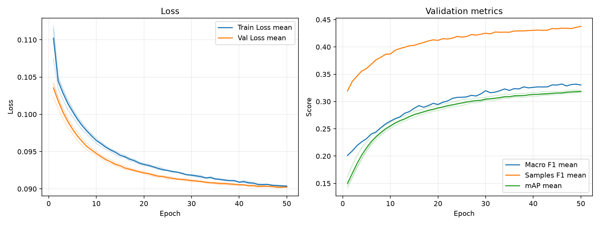

# 実験レポート: takuma-asl_gradual_unfreeze

作成日: 2026-07-07

## 1. 共有用サマリ

### 1.1 この実験の位置づけ

- 何を改善しようとしたか: TODO
- ベースラインまたは直前実験から変えたこと: TODO
- 主評価指標 mAP の結果をどう判断するか: TODO
- 何がダメだったか / まだ残っている問題: TODO

### 1.2 自動要約

- 主評価指標の validation mAP は 0.3184 です（標準比較: validation split, 0.5 固定しきい値）。
- 補助指標は Macro F1=0.3320, Samples F1=0.4388, Hamming Loss=0.2467 です。
- 閾値最適化は行っていません。実験比較の主指標は、閾値に依存しない validation mAP です。
- この実験の validation mAP は 0.3184 です。
- 主比較 `exp_resnet101_weighted_bce` の validation mAP は 0.3938 で、今回との差は -0.0754 です。
- 同じ実験グループで 3 件の seed 結果を集計しました。
- validation mAP は平均 0.3184、標準偏差 0.0014 です。

### 1.3 採用判断

- 採用判断: TODO（採用 / 条件付き採用 / 不採用 / 保留）
- 判断理由: TODO
- 次に試すこと: TODO

## 2. 他実験との比較

`config.yaml` で明示した主比較と参考実験だけを、validation mAP を中心に比較します。test split は最終モデル選定後まで使いません。

| 実験 | 役割 | method | validation mAP | mAP 標準偏差 | 今回との差 | Macro F1 | Samples F1 | Hamming Loss | 予測ジャンル数/作品 |
| --- | --- | --- | --- | --- | --- | --- | --- | --- | --- |
| takuma-asl_gradual_unfreeze | 今回 | 0.5 固定 | 0.3184 | 0.0014 | - | 0.3320 | 0.4388 | 0.2467 | 5.9349 |
| exp_resnet101_weighted_bce | 主比較 | 0.5 固定 | 0.3938 | 0.0073 | -0.0754 | 0.3981 | 0.5067 | 0.1329 | 2.6001 |
| exp_resnet101_bce | 参考 | 0.5 固定 | 0.3895 | 0.0071 | -0.0711 | 0.2734 | 0.4355 | 0.1110 | 1.3610 |
| exp_resnet101_dbl | 参考 | 0.5 固定 | 0.3611 | 0.0059 | -0.0427 | 0.1878 | 0.3736 | 0.1111 | 0.9762 |
| baseline | 参考 | 0.5 固定 | 0.2876 | 0.0005 | +0.0308 | 0.1515 | 0.3237 | 0.1209 | 0.9905 |

### 2.1 複数 seed 集計

seed 集計グループ: `takuma-asl_gradual_unfreeze`

| 指標 | runs | 平均 | 標準偏差 | 最小 | 最大 |
| --- | --- | --- | --- | --- | --- |
| validation mAP | 3 | 0.3184 | 0.0014 | 0.3172 | 0.3200 |
| Macro F1 | 3 | 0.3320 | 0.0042 | 0.3271 | 0.3348 |
| Samples F1 | 3 | 0.4388 | 0.0009 | 0.4382 | 0.4398 |
| Hamming Loss | 3 | 0.2467 | 0.0035 | 0.2431 | 0.2500 |
| 予測ジャンル数/作品 | 3 | 5.9349 | 0.0988 | 5.8287 | 6.0241 |

#### seed 別結果

| 実験 | seed | best epoch | epochs ran | early stopped | validation mAP | Macro F1 | Samples F1 | Hamming Loss | 予測ジャンル数/作品 |
| --- | --- | --- | --- | --- | --- | --- | --- | --- | --- |
| takuma-asl_gradual_unfreeze | 42 | 50 | 50 | False | 0.3172 | 0.3271 | 0.4382 | 0.2470 | 5.9518 |
| takuma-asl_gradual_unfreeze | 43 | 47 | 50 | False | 0.3200 | 0.3348 | 0.4385 | 0.2431 | 5.8287 |
| takuma-asl_gradual_unfreeze | 44 | 50 | 50 | False | 0.3181 | 0.3340 | 0.4398 | 0.2500 | 6.0241 |

## 3. 実験の目的と変更

### 3.1 背景

TODO: ベースラインまたは前回実験にどの問題があったかを書く。

### 3.2 仮説

TODO: なぜ今回の変更で mAP が改善すると考えたかを書く。

### 3.3 検証した変更

| 種類 | 内容 | mAP 改善につながると考えた理由 |
|---|---|---|
| モデル / loss / augmentation / threshold など | TODO | TODO |

### 3.4 比較条件

- 主比較: `exp_resnet101_weighted_bce`
- 参考実験: `exp_resnet101_bce`, `exp_resnet101_dbl`, `baseline`
- 変えたもの: TODO
- 変えていないもの: TODO
- 主評価指標: validation mAP
- 補助指標: Macro F1, Samples F1, Hamming Loss, ジャンル別 AP/F1
- test split: 最終モデル選定後まで使用しない

### 3.5 主な設定

| 項目 | 値 |
| --- | --- |
| seed | 42 |
| seeds | 42, 43, 44 |
| device | auto |
| comparison | {"primary": "exp_resnet101_weighted_bce", "references": ["exp_resnet101_bce", "exp_resnet101_dbl", "baseline"]} |
| epochs | 50 |
| early_stopping | {"enabled": true, "monitor": "mAP", "mode": "max", "patience": 10, "min_delta": 0.001, "min_epochs": 20} |
| batch_size | 64 |
| learning_rate | 1e-5 |
| num_workers | 2 |
| image_size | 224 |
| compile | True |
| max_train_samples |  |
| max_val_samples |  |
| output_dir | outputs |
| best_model_name | best_model.pth |
| metrics_name | metrics.csv |

### 3.6 再現コマンド

```bash
uv run python experiments/takuma-asl_gradual_unfreeze/run_exp.py
uv run python experiments/takuma-asl_gradual_unfreeze/analyze.py
uv run python experiments/takuma-asl_gradual_unfreeze/make_report.py
```

## 4. 学習ログ

### 4.1 代表 epoch

| seed | 観点 | Epoch | Train Loss | Val Loss | Macro F1 | Samples F1 | Hamming Loss | mAP |
| --- | --- | --- | --- | --- | --- | --- | --- | --- |
| 42 | 最終 | 50 | 0.0903 | 0.0903 | 0.3271 | 0.4382 | 0.2470 | 0.3172 |
| 42 | Val Loss 最小 | 48 | 0.0904 | 0.0901 | 0.3281 | 0.4328 | 0.2561 | 0.3152 |
| 42 | mAP 最大 | 50 | 0.0903 | 0.0903 | 0.3271 | 0.4382 | 0.2470 | 0.3172 |
| 42 | Macro F1 最大 | 49 | 0.0904 | 0.0902 | 0.3295 | 0.4395 | 0.2460 | 0.3160 |
| 42 | Samples F1 最大 | 49 | 0.0904 | 0.0902 | 0.3295 | 0.4395 | 0.2460 | 0.3160 |
| 43 | 最終 | 50 | 0.0903 | 0.0903 | 0.3295 | 0.4354 | 0.2457 | 0.3198 |
| 43 | Val Loss 最小 | 49 | 0.0904 | 0.0901 | 0.3374 | 0.4361 | 0.2480 | 0.3208 |
| 43 | mAP 最大 | 48 | 0.0904 | 0.0902 | 0.3373 | 0.4340 | 0.2512 | 0.3209 |
| 43 | Macro F1 最大 | 43 | 0.0908 | 0.0902 | 0.3380 | 0.4350 | 0.2488 | 0.3180 |
| 43 | Samples F1 最大 | 47 | 0.0905 | 0.0902 | 0.3348 | 0.4385 | 0.2431 | 0.3200 |
| 44 | 最終 | 50 | 0.0904 | 0.0902 | 0.3340 | 0.4398 | 0.2500 | 0.3181 |
| 44 | Val Loss 最小 | 50 | 0.0904 | 0.0902 | 0.3340 | 0.4398 | 0.2500 | 0.3181 |
| 44 | mAP 最大 | 50 | 0.0904 | 0.0902 | 0.3340 | 0.4398 | 0.2500 | 0.3181 |
| 44 | Macro F1 最大 | 46 | 0.0906 | 0.0904 | 0.3351 | 0.4379 | 0.2481 | 0.3153 |
| 44 | Samples F1 最大 | 50 | 0.0904 | 0.0902 | 0.3340 | 0.4398 | 0.2500 | 0.3181 |

### 4.2 学習曲線



### 4.3 読み取りメモ

- Train Loss と Val Loss の差が開く場合は、過学習を疑う。
- 主評価指標は mAP。mAP 最大 epoch と最終 epoch の差を見る。
- F1 はしきい値で 0/1 にした後の補助指標。mAP が改善していても F1 が悪い場合は threshold 設計を疑う。
- Hamming Loss は低いほど良いが、何も予測しないモデルでも低く見える場合がある。

## 5. 全体評価

| split | method | Macro F1 | macro_f1_std | Samples F1 | samples_f1_std | Hamming Loss | hamming_loss_std | mAP | mAP_std | 予測ジャンル数/作品 | predicted_labels_per_item_std |
| --- | --- | --- | --- | --- | --- | --- | --- | --- | --- | --- | --- |
| validation | 0.5 固定 | 0.3320 | 0.0042 | 0.4388 | 0.0009 | 0.2467 | 0.0035 | 0.3184 | 0.0014 | 5.9349 | 0.0988 |

### 5.1 mAP 中心の読み取り

- validation mAP が比較対象より上がったか: TODO
- validation mAP の改善幅は、偶然や seed 差より十分大きそうか: TODO
- mAP は上がったが補助指標が悪化した場合、その悪化を許容できるか: TODO

## 6. ジャンル別結果

### 6.1 主比較 `exp_resnet101_weighted_bce` とのジャンル別 AP 差分

| genre | 件数 | 比較AP | 現AP | AP差分 | 比較F1 | 現F1 | F1差分 | 比較Recall | 現Recall | Recall差分 | 比較Precision | 現Precision | Precision差分 |
| --- | --- | --- | --- | --- | --- | --- | --- | --- | --- | --- | --- | --- | --- |
| Psychological | 54 | 0.1293 | 0.1168 | -0.0125 | 0.1502 | 0.1610 | 0.0109 | 0.1420 | 0.1481 | 0.0062 | 0.1619 | 0.1779 | 0.0160 |
| Drama | 222 | 0.3713 | 0.3496 | -0.0217 | 0.4335 | 0.4211 | -0.0123 | 0.5210 | 0.7928 | 0.2718 | 0.3717 | 0.2868 | -0.0849 |
| Thriller | 18 | 0.0906 | 0.0553 | -0.0353 | 0.1374 | 0.0247 | -0.1128 | 0.1481 | 0.0185 | -0.1296 | 0.1299 | 0.0370 | -0.0929 |
| Sci-Fi | 157 | 0.4147 | 0.3790 | -0.0357 | 0.3949 | 0.3523 | -0.0425 | 0.3864 | 0.8132 | 0.4268 | 0.4286 | 0.2249 | -0.2037 |
| Ecchi | 80 | 0.2542 | 0.2073 | -0.0469 | 0.2545 | 0.2366 | -0.0179 | 0.2458 | 0.4500 | 0.2042 | 0.2658 | 0.1609 | -0.1049 |
| Romance | 167 | 0.4259 | 0.3784 | -0.0475 | 0.4349 | 0.3415 | -0.0935 | 0.5170 | 0.7445 | 0.2275 | 0.3798 | 0.2217 | -0.1581 |
| Fantasy | 274 | 0.5259 | 0.4750 | -0.0510 | 0.5082 | 0.4685 | -0.0397 | 0.4757 | 0.8589 | 0.3832 | 0.5607 | 0.3221 | -0.2386 |
| Mystery | 70 | 0.2034 | 0.1504 | -0.0530 | 0.2496 | 0.2143 | -0.0353 | 0.2857 | 0.2571 | -0.0286 | 0.2262 | 0.1842 | -0.0420 |
| Slice of Life | 195 | 0.4422 | 0.3881 | -0.0541 | 0.4495 | 0.4192 | -0.0303 | 0.4530 | 0.7863 | 0.3333 | 0.4494 | 0.2858 | -0.1636 |
| Comedy | 487 | 0.7538 | 0.6996 | -0.0542 | 0.6785 | 0.6360 | -0.0425 | 0.6872 | 0.9877 | 0.3005 | 0.6709 | 0.4690 | -0.2019 |
| Action | 305 | 0.6287 | 0.5736 | -0.0552 | 0.6075 | 0.5530 | -0.0545 | 0.6634 | 0.8787 | 0.2153 | 0.5615 | 0.4036 | -0.1580 |
| Horror | 39 | 0.1912 | 0.1275 | -0.0636 | 0.2418 | 0.1673 | -0.0745 | 0.2222 | 0.1709 | -0.0513 | 0.2660 | 0.1673 | -0.0987 |
| Supernatural | 133 | 0.2648 | 0.1821 | -0.0828 | 0.2548 | 0.2798 | 0.0250 | 0.2356 | 0.4612 | 0.2256 | 0.2843 | 0.2009 | -0.0833 |
| Adventure | 175 | 0.3984 | 0.3011 | -0.0973 | 0.4159 | 0.3867 | -0.0292 | 0.4762 | 0.7962 | 0.3200 | 0.3861 | 0.2556 | -0.1305 |
| Hentai | 137 | 0.9134 | 0.8052 | -0.1082 | 0.8590 | 0.6088 | -0.2502 | 0.8978 | 0.9611 | 0.0633 | 0.8236 | 0.4455 | -0.3781 |
| Mahou Shoujo | 22 | 0.1935 | 0.0677 | -0.1258 | 0.2279 | 0.1486 | -0.0793 | 0.2424 | 0.2424 | 0 | 0.2203 | 0.1072 | -0.1132 |
| Music | 58 | 0.2962 | 0.1511 | -0.1451 | 0.3160 | 0.2060 | -0.1100 | 0.2644 | 0.2011 | -0.0632 | 0.4079 | 0.2126 | -0.1953 |
| Sports | 61 | 0.4847 | 0.3268 | -0.1579 | 0.4793 | 0.3619 | -0.1175 | 0.5191 | 0.4645 | -0.0546 | 0.4613 | 0.2978 | -0.1635 |
| Mecha | 49 | 0.5005 | 0.3158 | -0.1847 | 0.4699 | 0.3201 | -0.1498 | 0.5374 | 0.7891 | 0.2517 | 0.4527 | 0.2008 | -0.2519 |

### 6.2 AP が高いジャンル

| genre | 件数 | 陽性予測数 | Precision | Recall | F1 | AP |
| --- | --- | --- | --- | --- | --- | --- |
| Hentai | 137 | 295.667 | 0.4455 | 0.9611 | 0.6088 | 0.8052 |
| Comedy | 487 | 1025.667 | 0.4690 | 0.9877 | 0.6360 | 0.6996 |
| Action | 305 | 664.333 | 0.4036 | 0.8787 | 0.5530 | 0.5736 |
| Fantasy | 274 | 730.667 | 0.3221 | 0.8589 | 0.4685 | 0.4750 |
| Slice of Life | 195 | 536.667 | 0.2858 | 0.7863 | 0.4192 | 0.3881 |
| Sci-Fi | 157 | 567.667 | 0.2249 | 0.8132 | 0.3523 | 0.3790 |
| Romance | 167 | 561 | 0.2217 | 0.7445 | 0.3415 | 0.3784 |
| Drama | 222 | 614 | 0.2868 | 0.7928 | 0.4211 | 0.3496 |

### 6.3 F1 が低いジャンル

| genre | 件数 | 陽性予測数 | Precision | Recall | F1 | AP |
| --- | --- | --- | --- | --- | --- | --- |
| Thriller | 18 | 6.3333 | 0.0370 | 0.0185 | 0.0247 | 0.0553 |
| Mahou Shoujo | 22 | 49.3333 | 0.1072 | 0.2424 | 0.1486 | 0.0677 |
| Psychological | 54 | 45.6667 | 0.1779 | 0.1481 | 0.1610 | 0.1168 |
| Horror | 39 | 40.3333 | 0.1673 | 0.1709 | 0.1673 | 0.1275 |
| Music | 58 | 55 | 0.2126 | 0.2011 | 0.2060 | 0.1511 |
| Mystery | 70 | 97 | 0.1842 | 0.2571 | 0.2143 | 0.1504 |
| Ecchi | 80 | 224.667 | 0.1609 | 0.4500 | 0.2366 | 0.2073 |
| Supernatural | 133 | 305 | 0.2009 | 0.4612 | 0.2798 | 0.1821 |

### 6.4 考察の観点

- AP が高いジャンルは、モデルが順位付けできているジャンル。mAP 改善に寄与している可能性が高い。
- AP が低いジャンルは、特徴量・データ量・ラベルの曖昧さなどを疑う。
- AP は高いのに F1 が低いジャンルは、しきい値調整で改善する可能性がある。
- Precision が低いジャンルは、関係ない作品にもそのジャンルを付けすぎている。
- Recall が低いジャンルは、本当はそのジャンルの作品を見逃している。
- 件数が少ないジャンルは、少数の正解/不正解で指標が大きく動く。

## 7. 人が書く考察

### 7.1 何を改善しようとして、改善できたか

TODO

### 7.2 何がダメだったか / 想定と違ったか

TODO

### 7.3 原因仮説

| 仮説ID | 観察した結果 | 原因仮説 | 次の確認方法 |
|---|---|---|---|
| H1 | TODO | TODO | TODO |
| H2 | TODO | TODO | TODO |

### 7.4 他メンバーに共有したい注意点

TODO

### 7.5 次に試すこと

TODO

## 8. 生成元ファイル

| ファイル | 用途 |
| --- | --- |
| experiments/takuma-asl_gradual_unfreeze/config.yaml | 実験設定 |
| experiments/takuma-asl_gradual_unfreeze/outputs/seed_42/metrics.csv | epoch ごとの学習ログ (seed=42) |
| experiments/takuma-asl_gradual_unfreeze/outputs/seed_43/metrics.csv | epoch ごとの学習ログ (seed=43) |
| experiments/takuma-asl_gradual_unfreeze/outputs/seed_44/metrics.csv | epoch ごとの学習ログ (seed=44) |
| experiments/takuma-asl_gradual_unfreeze/analysis/overall_model_metrics.csv | validation の全体指標 |
| experiments/takuma-asl_gradual_unfreeze/analysis/genre_metrics_validation_threshold_0.5.csv | validation のジャンル別指標 |

### 8.1 analysis ディレクトリ内のファイル

- `analysis_summary.json`
- `genre_metrics_validation_threshold_0.5.csv`
- `learning_curves.png`
- `learning_curves.svg`
- `overall_model_metrics.csv`
- `seed_genre_metrics_validation_threshold_0.5.csv`
- `seed_overall_model_metrics.csv`
