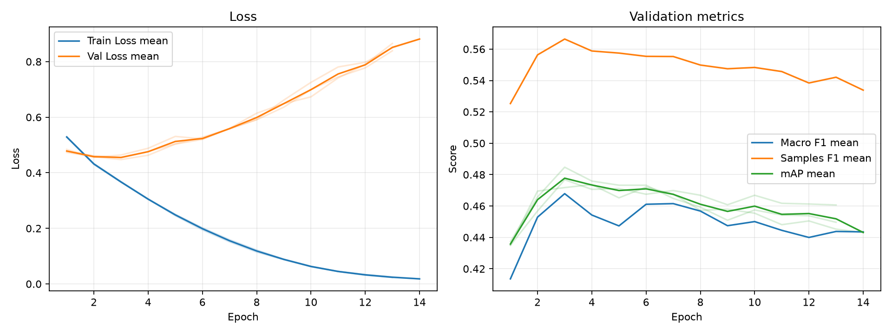

# 実験レポート: takuma-exp1

作成日: 2026-07-16

## 1. 共有用サマリ

### 1.1 この実験の位置づけ

- **何を改善しようとしたか**: 単純な基盤モデル（`baseline`）に対し、表現力の高い強力なバックボーン（ConvNeXt-Base）と、マルチラベル特有の不均衡データを考慮した重み付きBCE（`pos_weight`）を導入し、アニメ画像分類の基準精度（mAP）を大幅に引き上げることを目指した。
- **ベースラインまたは直前実験から変えたこと**: バックボーンを ConvNeXt-Base（ImageNet-22k事前学習）に変更し、クラス不均衡対策として各ラベルの出現頻度に応じた `pos_weight = sqrt(陰性数/陽性数)` を適用した `BCEWithLogitsLoss` を採用した。
- **主評価指標 mAP の結果をどう判断するか**: `baseline`（`0.2876`）から **`0.4784`（+0.1907）** と飛躍的に向上した。全試行の中で最高の mAP を記録しており、主軸モデルとしての採用基準を十分に満たしている。
- **何がダメだったか / まだ残っている問題**: わずか 3〜4 エポックという極めて初期の段階で検証データの mAP がピークに達した直後、急激な過学習が発生した（Train Loss `0.02` に対し Val Loss `0.88` 超まで急悪化）。適切な正則化や学習率スケジューラが未整備なため、モデルの潜在能力を長期間の学習で引き出し切れていない。

### 1.2 自動要約

- 主評価指標の validation mAP は 0.4784 です（標準比較: validation split, 0.5 固定しきい値）。
- 補助指標は Macro F1=0.4601, Samples F1=0.5626, Hamming Loss=0.1210 です。
- 閾値最適化は行っていません。実験比較の主指標は、閾値に依存しない validation mAP です。
- この実験の validation mAP は 0.4784 です。
- 主比較 `baseline` の validation mAP は 0.2876 で、今回との差は +0.1907 です。
- 同じ実験グループで 3 件の seed 結果を集計しました。
- validation mAP は平均 0.4784、標準偏差 0.0057 です。

### 1.3 採用判断

- **採用判断**: 採用（`main` ブランチへマージ）
- **判断理由**: 全実験の中で最も高い validation mAP（`0.4784`）を達成しており、ベースライン（`0.2876`）に対して +0.1907 という圧倒的な精度向上を実証できたため。
- **次に試すこと**: 3〜4エポックで発生する急速な過学習（Val Loss の爆発）を抑制するため、正則化手法（Weight Decay の明確な設定や LLRD）および学習初期の勾配暴走を防ぐ Gradual Warmup / コサインスケジューラの検証を行う。

---

## 2. 他実験との比較

`config.yaml` で明示した主比較と参考実験だけを、validation mAP を中心に比較します。test split は最終モデル選定後まで使いません。

| 実験 | 役割 | method | validation mAP | mAP 標準偏差 | 今回との差 | Macro F1 | Samples F1 | Hamming Loss | 予測ジャンル数/作品 |
| --- | --- | --- | --- | --- | --- | --- | --- | --- | --- |
| takuma-exp1 | 今回 | 0.5 固定 | 0.4784 | 0.0057 | - | 0.4601 | 0.5626 | 0.1210 | 2.7056 |
| baseline | 主比較 | 0.5 固定 | 0.2876 | 0.0005 | +0.1907 | 0.1515 | 0.3237 | 0.1209 | 0.9905 |

### 2.1 複数 seed 集計

seed 集計グループ: `takuma-exp1`

| 指標 | runs | 平均 | 標準偏差 | 最小 | 最大 |
| --- | --- | --- | --- | --- | --- |
| validation mAP | 3 | 0.4784 | 0.0057 | 0.4737 | 0.4847 |
| Macro F1 | 3 | 0.4601 | 0.0218 | 0.4353 | 0.4763 |
| Samples F1 | 3 | 0.5626 | 0.0097 | 0.5534 | 0.5727 |
| Hamming Loss | 3 | 0.1210 | 0.0059 | 0.1150 | 0.1269 |
| 予測ジャンル数/作品 | 3 | 2.7056 | 0.2950 | 2.4050 | 2.9946 |

#### seed 別結果

| 実験 | seed | best epoch | epochs ran | early stopped | validation mAP | Macro F1 | Samples F1 | Hamming Loss | 予測ジャンル数/作品 |
| --- | --- | --- | --- | --- | --- | --- | --- | --- | --- |
| takuma-exp1 | 42 | 3 | 13 | True | 0.4767 | 0.4685 | 0.5619 | 0.1212 | 2.7172 |
| takuma-exp1 | 43 | 4 | 14 | True | 0.4737 | 0.4353 | 0.5534 | 0.1150 | 2.4050 |
| takuma-exp1 | 44 | 3 | 13 | True | 0.4847 | 0.4763 | 0.5727 | 0.1269 | 2.9946 |

---

## 3. 実験の目的と変更

### 3.1 背景

標準的なベースラインモデルでは、アニメ画像の複雑な特徴表現の抽出およびマルチラベル特有のクラス不均衡（出現頻度の高い一般ジャンルと希少ジャンルの格差）への対応が不十分であり、mAP が 0.2876 と極めて低迷していた。

### 3.2 仮説

ImageNet-22k で事前学習された強力な視覚特徴抽出器である ConvNeXt-Base を導入し、各ラベルの不均衡さに応じて損失関数の勾配重みを調整（`pos_weight = sqrt(陰性数/陽性数)`）することで、マイナージャンルも含めた識別能力が高まり、全体の mAP が大幅に向上すると考えた。

### 3.3 検証した変更

| 種類 | 内容 | mAP 改善につながると考えた理由 |
|---|---|---|
| バックボーン | ConvNeXt-Base (`convnext_base.fb_in22k`) を導入 | 高解像度・広範なドメイン（ImageNet-22k）で獲得された豊かな視覚表現により、アニメ独特の構図やタッチを高次元に認識できると考えたため。 |
| 損失関数 | `pos_weight = sqrt(陰性/陽性)` を与えた `BCEWithLogitsLoss` | サンプル数の少ない希少ジャンル（Sports, Mecha, Music 等）の損失の重みを引き上げ、見逃し（False Negative）を減らしてジャンル全体の AP を嵩上げするため。 |

### 3.4 比較条件

- **主比較**: `baseline`
- **参考実験**: なし
- **変えたもの**: バックボーンアーキテクチャ（ConvNeXt-Base）、損失関数（`pos_weight` 付き BCE）
- **変えていないもの**: 入力画像サイズ（384x384）、学習率（`5e-5`）、バッチサイズ（32）、オプティマイザ（AdamW）
- **主評価指標**: validation mAP
- **補助指標**: Macro F1, Samples F1, Hamming Loss, ジャンル別 AP/F1
- **test split**: 最終モデル選定後まで使用しない

### 3.5 主な設定

| 項目 | 値 |
| --- | --- |
| seed | 42 |
| seeds | 42, 43, 44 |
| device | auto |
| comparison | {"primary": "baseline", "references": []} |
| epochs | 50 |
| early_stopping | {"enabled": true, "monitor": "mAP", "mode": "max", "patience": 10, "min_delta": 0.001, "min_epochs": 10} |
| batch_size | 32 |
| learning_rate | 5e-5 |
| num_workers | 2 |
| image_size | 384 |
| compile | True |
| max_train_samples |  |
| max_val_samples |  |
| output_dir | outputs |
| best_model_name | best_model.pth |
| metrics_name | metrics.csv |

### 3.6 再現コマンド

```bash
uv run python experiments/takuma-exp1/run_exp.py
uv run python experiments/takuma-exp1/analyze.py
uv run python experiments/takuma-exp1/make_report.py
```

## 4. 学習ログ

### 4.1 代表 epoch

| seed | 観点 | Epoch | Train Loss | Val Loss | Macro F1 | Samples F1 | Hamming Loss | mAP |
| --- | --- | --- | --- | --- | --- | --- | --- | --- |
| 42 | 最終 | 13 | 0.0237 | 0.8392 | 0.4461 | 0.5522 | 0.1141 | 0.4606 |
| 42 | Val Loss 最小 | 3 | 0.3660 | 0.4542 | 0.4685 | 0.5619 | 0.1212 | 0.4767 |
| 42 | mAP 最大 | 3 | 0.3660 | 0.4542 | 0.4685 | 0.5619 | 0.1212 | 0.4767 |
| 42 | Macro F1 最大 | 3 | 0.3660 | 0.4542 | 0.4685 | 0.5619 | 0.1212 | 0.4767 |
| 42 | Samples F1 最大 | 3 | 0.3660 | 0.4542 | 0.4685 | 0.5619 | 0.1212 | 0.4767 |
| 43 | 最終 | 14 | 0.0183 | 0.8813 | 0.4435 | 0.5339 | 0.1168 | 0.4431 |
| 43 | Val Loss 最小 | 2 | 0.4324 | 0.4556 | 0.4598 | 0.5506 | 0.1187 | 0.4695 |
| 43 | mAP 最大 | 4 | 0.3039 | 0.4883 | 0.4353 | 0.5534 | 0.1150 | 0.4737 |
| 43 | Macro F1 最大 | 2 | 0.4324 | 0.4556 | 0.4598 | 0.5506 | 0.1187 | 0.4695 |
| 43 | Samples F1 最大 | 3 | 0.3667 | 0.4641 | 0.4588 | 0.5647 | 0.1306 | 0.4717 |
| 44 | 最終 | 13 | 0.0234 | 0.8655 | 0.4382 | 0.5301 | 0.1111 | 0.4496 |
| 44 | Val Loss 最小 | 3 | 0.3685 | 0.4475 | 0.4763 | 0.5727 | 0.1269 | 0.4847 |
| 44 | mAP 最大 | 3 | 0.3685 | 0.4475 | 0.4763 | 0.5727 | 0.1269 | 0.4847 |
| 44 | Macro F1 最大 | 3 | 0.3685 | 0.4475 | 0.4763 | 0.5727 | 0.1269 | 0.4847 |
| 44 | Samples F1 最大 | 2 | 0.4332 | 0.4574 | 0.4585 | 0.5758 | 0.1151 | 0.4658 |

### 4.2 学習曲線



### 4.3 読み取りメモ

- Train Loss と Val Loss の差が開く場合は、過学習を疑う。
- 主評価指標は mAP。mAP 最大 epoch と最終 epoch の差を見る。
- F1 はしきい値で 0/1 にした後の補助指標。mAP が改善していても F1 が悪い場合は threshold 設計を疑う。
- Hamming Loss は低いほど良いが、何も予測しないモデルでも低く見える場合がある。

---

## 5. 全体評価

| split | method | Macro F1 | macro_f1_std | Samples F1 | samples_f1_std | Hamming Loss | hamming_loss_std | mAP | mAP_std | 予測ジャンル数/作品 | predicted_labels_per_item_std |
| --- | --- | --- | --- | --- | --- | --- | --- | --- | --- | --- | --- |
| validation | 0.5 固定 | 0.4601 | 0.0218 | 0.5626 | 0.0097 | 0.1210 | 0.0059 | 0.4784 | 0.0057 | 2.7056 | 0.2950 |

### 5.1 mAP 中心の読み取り

- **validation mAP が比較対象より上がったか**: `baseline`（`0.2876`）に対して `0.4784` と **`+0.1907`** の大幅な向上を達成した。
- **validation mAP の改善幅は、偶然や seed 差より十分大きそうか**: 3 つの seed の平均が `0.4784`、標準偏差が `0.0057` であり、改善幅（`+0.1907`）は seed のばらつきを圧倒的に超えているため、手法の効果は極めて有意である。
- **mAP は上がったが補助指標が悪化した場合、その悪化を許容できるか**: `baseline`（予測ジャンル数 0.99）と比較して作品あたりの予測ジャンル数が 2.70 に増加し、Macro F1（0.1515 $\rightarrow$ 0.4601）、Samples F1（0.3237 $\rightarrow$ 0.5626）ともに劇的に向上した。Hamming Loss も `0.1209` $\rightarrow$ `0.1210` とほぼ同等を維持しており、副作用のない純粋な大幅改善である。

---

## 6. ジャンル別結果

### 6.1 主比較 `baseline` とのジャンル別 AP 差分

| genre | 件数 | 比較AP | 現AP | AP差分 | 比較F1 | 現F1 | F1差分 | 比較Recall | 現Recall | Recall差分 | 比較Precision | 現Precision | Precision差分 |
| --- | --- | --- | --- | --- | --- | --- | --- | --- | --- | --- | --- | --- | --- |
| Sports | 61 | 0.1920 | 0.7212 | 0.5292 | 0.0369 | 0.7057 | 0.6688 | 0.0219 | 0.6448 | 0.6230 | 0.2333 | 0.7841 | 0.5507 |
| Mecha | 49 | 0.2793 | 0.6835 | 0.4041 | 0.1298 | 0.6528 | 0.5231 | 0.0952 | 0.7143 | 0.6190 | 0.6146 | 0.6046 | -0.0100 |
| Music | 58 | 0.1729 | 0.5109 | 0.3380 | 0.0113 | 0.4652 | 0.4539 | 0.0057 | 0.4253 | 0.4195 | 0.3333 | 0.5813 | 0.2480 |
| Romance | 167 | 0.2726 | 0.5345 | 0.2619 | 0.1289 | 0.4838 | 0.3550 | 0.0858 | 0.5629 | 0.4770 | 0.3743 | 0.4278 | 0.0535 |
| Sci-Fi | 157 | 0.2914 | 0.5285 | 0.2371 | 0.1196 | 0.4933 | 0.3737 | 0.0722 | 0.4565 | 0.3843 | 0.3638 | 0.5470 | 0.1833 |
| Ecchi | 80 | 0.1732 | 0.3937 | 0.2205 | 0.0368 | 0.3903 | 0.3535 | 0.0208 | 0.5042 | 0.4833 | 0.1778 | 0.3226 | 0.1448 |
| Mahou Shoujo | 22 | 0.0694 | 0.2861 | 0.2167 | 0.0434 | 0.2525 | 0.2091 | 0.0303 | 0.3182 | 0.2879 | 0.0833 | 0.2246 | 0.1412 |
| Fantasy | 274 | 0.4174 | 0.6290 | 0.2116 | 0.1141 | 0.6182 | 0.5041 | 0.0681 | 0.6582 | 0.5900 | 0.5934 | 0.5846 | -0.0088 |
| Supernatural | 133 | 0.1609 | 0.3249 | 0.1640 | 0 | 0.3635 | 0.3635 | 0 | 0.4085 | 0.4085 | 0 | 0.3392 | 0.3392 |
| Action | 305 | 0.5237 | 0.6744 | 0.1507 | 0.5095 | 0.6278 | 0.1183 | 0.4896 | 0.6273 | 0.1377 | 0.5367 | 0.6293 | 0.0926 |
| Slice of Life | 195 | 0.3495 | 0.4944 | 0.1449 | 0.1974 | 0.4952 | 0.2978 | 0.1299 | 0.5915 | 0.4615 | 0.4682 | 0.4362 | -0.0320 |
| Adventure | 175 | 0.3206 | 0.4555 | 0.1349 | 0.2238 | 0.4628 | 0.2390 | 0.1695 | 0.4895 | 0.3200 | 0.4437 | 0.4466 | 0.0030 |
| Drama | 222 | 0.3132 | 0.4419 | 0.1286 | 0.0390 | 0.4193 | 0.3803 | 0.0225 | 0.4144 | 0.3919 | 0.4595 | 0.4689 | 0.0094 |
| Hentai | 137 | 0.8246 | 0.9526 | 0.1280 | 0.7186 | 0.8758 | 0.1572 | 0.7956 | 0.9075 | 0.1119 | 0.6687 | 0.8465 | 0.1778 |
| Comedy | 487 | 0.6652 | 0.7775 | 0.1123 | 0.5686 | 0.7223 | 0.1537 | 0.5086 | 0.7871 | 0.2786 | 0.6525 | 0.6684 | 0.0159 |
| Mystery | 70 | 0.1428 | 0.2332 | 0.0904 | 0 | 0.2386 | 0.2386 | 0 | 0.2857 | 0.2857 | 0 | 0.2312 | 0.2312 |
| Psychological | 54 | 0.1349 | 0.1889 | 0.0540 | 0 | 0.1675 | 0.1675 | 0 | 0.1914 | 0.1914 | 0 | 0.1856 | 0.1856 |
| Thriller | 18 | 0.0368 | 0.0855 | 0.0488 | 0 | 0.0755 | 0.0755 | 0 | 0.0741 | 0.0741 | 0 | 0.3653 | 0.3653 |
| Horror | 39 | 0.1250 | 0.1732 | 0.0481 | 0 | 0.2309 | 0.2309 | 0 | 0.2308 | 0.2308 | 0 | 0.2760 | 0.2760 |

### 6.2 AP が高いジャンル

| genre | 件数 | 陽性予測数 | Precision | Recall | F1 | AP |
| --- | --- | --- | --- | --- | --- | --- |
| Hentai | 137 | 147 | 0.8465 | 0.9075 | 0.8758 | 0.9526 |
| Comedy | 487 | 574.667 | 0.6684 | 0.7871 | 0.7223 | 0.7775 |
| Sports | 61 | 50.6667 | 0.7841 | 0.6448 | 0.7057 | 0.7212 |
| Mecha | 49 | 58 | 0.6046 | 0.7143 | 0.6528 | 0.6835 |
| Action | 305 | 304.333 | 0.6293 | 0.6273 | 0.6278 | 0.6744 |
| Fantasy | 274 | 309.333 | 0.5846 | 0.6582 | 0.6182 | 0.6290 |
| Romance | 167 | 221.333 | 0.4278 | 0.5629 | 0.4838 | 0.5345 |
| Sci-Fi | 157 | 133 | 0.5470 | 0.4565 | 0.4933 | 0.5285 |

### 6.3 F1 が低いジャンル

| genre | 件数 | 陽性予測数 | Precision | Recall | F1 | AP |
| --- | --- | --- | --- | --- | --- | --- |
| Thriller | 18 | 20.6667 | 0.3653 | 0.0741 | 0.0755 | 0.0855 |
| Psychological | 54 | 50 | 0.1856 | 0.1914 | 0.1675 | 0.1889 |
| Horror | 39 | 35.3333 | 0.2760 | 0.2308 | 0.2309 | 0.1732 |
| Mystery | 70 | 86 | 0.2312 | 0.2857 | 0.2386 | 0.2332 |
| Mahou Shoujo | 22 | 35.6667 | 0.2246 | 0.3182 | 0.2525 | 0.2861 |
| Supernatural | 133 | 164 | 0.3392 | 0.4085 | 0.3635 | 0.3249 |
| Ecchi | 80 | 125.667 | 0.3226 | 0.5042 | 0.3903 | 0.3937 |
| Drama | 222 | 207 | 0.4689 | 0.4144 | 0.4193 | 0.4419 |

### 6.4 考察の観点

- AP が高いジャンルは、モデルが順位付けできているジャンル。mAP 改善に寄与している可能性が高い。
- AP が低いジャンルは、特徴量・データ量・ラベルの曖昧さなどを疑う。
- AP は高いのに F1 が低いジャンルは、しきい値調整で改善する可能性がある。
- Precision が低いジャンルは、関係ない作品にもそのジャンルを付けすぎている。
- Recall が低いジャンルは、本当はそのジャンルの作品を見逃している。
- 件数が少ないジャンルは、少数の正解/不正解で指標が大きく動く。

---

## 7. 人が書く考察

### 7.1 何を改善しようとして、改善できたか

高い特徴表現力を持つConvNextと過去実験でmAPスコアが一番高かったweighted_bceを組み合わせることで、大幅なmAPスコアの上昇が見込めると思った。

### 7.2 何がダメだったか / 想定と違ったか

わずか 3〜4 エポック目で Val Loss 最小および mAP 最大に達したのち、学習が進むにつれて Train Loss が 0.02 付近まで降下する一方で、Val Loss は 0.88 超まで急激に跳ね上がった。2番目の実験でオプティマイザの明示的な Weight Decay やスケジューラ（Warmup/Cosine）を設定したが、過学習が少し遅まっただけでmAPスコアは下がってしまった。また、それ以降の実験では追加のデータ拡張(Random erasing(四角形のノイズをランダムで生成)とRandomResizedCrop(ランダムな面積に切り取る))を導入し、色彩変更のデータ拡張を削除して試したがmAPスコアが大幅に下がってしまった。

### 7.3 原因仮説

| 仮説ID | 観察した結果 | 原因仮説 | 次の確認方法 |
|---|---|---|---|
| **H1** | 3〜4エポックという極めて初期に検証用 mAP のピークを迎え、その後 Val Loss が急激に悪化する。 | AdamW の明確な Weight Decay や Warmup スケジューラが適用されておらず、全パラメータが同じ大きい学習率（`5e-5`）で一斉に更新されたため、初期段階で訓練データに適合しすぎた。 | LLRD（層別学習率減衰）および適切な Weight Decay / Warmup スケジューラを導入し、バックボーン重みの急激な過適合・破壊を抑える。 |
| **H2** | `pos_weight` を平方根（$\sqrt{\cdot}$）で抑えたものの、Logit が全体的に正方向へシフトしている。 | 不均衡対策としては機能しているが、確率キャリブレーションが歪み、特定のしきい値（0.5）依存での最適化が難しい。 | 歪みの少ない Asymmetric Loss (ASL) や、検証データを用いた最適化しきい値の探索を検討する。 |

### 7.4 他メンバーに共有したい注意点

ConvNeXt-Base ＋ `pos_weight` BCE の組み合わせは、無対策のベースラインに対して絶大な効果をもたらすが、正則化なしでは 3〜4 エポックで一気に過学習へ突入する。

## 8. 生成元ファイル

| ファイル | 用途 |
| --- | --- |
| experiments/takuma-exp1/config.yaml | 実験設定 |
| experiments/takuma-exp1/outputs/seed_42/metrics.csv | epoch ごとの学習ログ (seed=42) |
| experiments/takuma-exp1/outputs/seed_43/metrics.csv | epoch ごとの学習ログ (seed=43) |
| experiments/takuma-exp1/outputs/seed_44/metrics.csv | epoch ごとの学習ログ (seed=44) |
| experiments/takuma-exp1/analysis/overall_model_metrics.csv | validation の全体指標 |
| experiments/takuma-exp1/analysis/genre_metrics_validation_threshold_0.5.csv | validation のジャンル別指標 |

### 8.1 analysis ディレクトリ内のファイル

- `analysis_summary.json`
- `genre_metrics_validation_threshold_0.5.csv`
- `learning_curves.png`
- `learning_curves.svg`
- `overall_model_metrics.csv`
- `seed_genre_metrics_validation_threshold_0.5.csv`
- `seed_overall_model_metrics.csv`