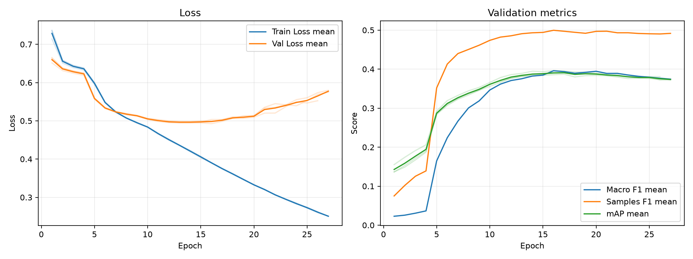

# 実験レポート: takuma-weighted-bce_gradual-unfreeze

作成日: 2026-07-14

## 1. 共有用サマリ

### 1.1 この実験の位置づけ

- 何を改善しようとしたか: TODO
- ベースラインまたは直前実験から変えたこと: TODO
- 主評価指標 mAP の結果をどう判断するか: TODO
- 何がダメだったか / まだ残っている問題: TODO

### 1.2 自動要約

- 主評価指標の validation mAP は 0.3912 です（標準比較: validation split, 0.5 固定しきい値）。
- 補助指標は Macro F1=0.3942, Samples F1=0.4959, Hamming Loss=0.1299 です。
- 閾値最適化は行っていません。実験比較の主指標は、閾値に依存しない validation mAP です。
- この実験の validation mAP は 0.3912 です。
- 主比較 `takuma-asl_gradual_unfreeze` の validation mAP は 0.3184 で、今回との差は +0.0728 です。
- 同じ実験グループで 3 件の seed 結果を集計しました。
- validation mAP は平均 0.3912、標準偏差 0.0047 です。

### 1.3 採用判断

- 採用判断: TODO（採用 / 条件付き採用 / 不採用 / 保留）
- 判断理由: TODO
- 次に試すこと: TODO

## 2. 他実験との比較

`config.yaml` で明示した主比較と参考実験だけを、validation mAP を中心に比較します。test split は最終モデル選定後まで使いません。

| 実験 | 役割 | method | validation mAP | mAP 標準偏差 | 今回との差 | Macro F1 | Samples F1 | Hamming Loss | 予測ジャンル数/作品 |
| --- | --- | --- | --- | --- | --- | --- | --- | --- | --- |
| takuma-weighted-bce_gradual-unfreeze | 今回 | 0.5 固定 | 0.3912 | 0.0047 | - | 0.3942 | 0.4959 | 0.1299 | 2.4398 |
| takuma-asl_gradual_unfreeze | 主比較 | 0.5 固定 | 0.3184 | 0.0014 | +0.0728 | 0.3320 | 0.4388 | 0.2467 | 5.9349 |
| exp_resnet101_weighted_bce | 参考 | 0.5 固定 | 0.3938 | 0.0073 | -0.0026 | 0.3981 | 0.5067 | 0.1329 | 2.6001 |
| exp_gradual-unfreeze_resnet101 | 参考 | 0.5 固定 | 0.3927 | 0.0016 | -0.0015 | 0.2644 | 0.4315 | 0.1085 | 1.2804 |

### 2.1 複数 seed 集計

seed 集計グループ: `takuma-weighted-bce_gradual-unfreeze`

| 指標 | runs | 平均 | 標準偏差 | 最小 | 最大 |
| --- | --- | --- | --- | --- | --- |
| validation mAP | 3 | 0.3912 | 0.0047 | 0.3870 | 0.3963 |
| Macro F1 | 3 | 0.3942 | 0.0083 | 0.3847 | 0.3998 |
| Samples F1 | 3 | 0.4959 | 0.0020 | 0.4941 | 0.4980 |
| Hamming Loss | 3 | 0.1299 | 0.0011 | 0.1290 | 0.1311 |
| 予測ジャンル数/作品 | 3 | 2.4398 | 0.0250 | 2.4148 | 2.4648 |

#### seed 別結果

| 実験 | seed | best epoch | epochs ran | early stopped | validation mAP | Macro F1 | Samples F1 | Hamming Loss | 予測ジャンル数/作品 |
| --- | --- | --- | --- | --- | --- | --- | --- | --- | --- |
| takuma-weighted-bce_gradual-unfreeze | 42 | 17 | 27 | True | 0.3870 | 0.3847 | 0.4941 | 0.1311 | 2.4398 |
| takuma-weighted-bce_gradual-unfreeze | 43 | 16 | 26 | True | 0.3963 | 0.3998 | 0.4954 | 0.1290 | 2.4148 |
| takuma-weighted-bce_gradual-unfreeze | 44 | 17 | 27 | True | 0.3904 | 0.3982 | 0.4980 | 0.1295 | 2.4648 |

## 3. 実験の目的と変更

### 3.1 背景

TODO: ベースラインまたは前回実験にどの問題があったかを書く。

### 3.2 仮説

TODO: なぜ今回の変更で mAP が改善すると考えたかを書く。

### 3.3 検証した変更

| 種類 | 内容 | mAP 改善につながると考えた理由 |
|---|---|---|
| モデル / loss / augmentation / threshold など | TODO | TODO |

### 3.4 比較条件

- 主比較: `takuma-asl_gradual_unfreeze`
- 参考実験: `exp_resnet101_weighted_bce`, `exp_gradual-unfreeze_resnet101`
- 変えたもの: TODO
- 変えていないもの: TODO
- 主評価指標: validation mAP
- 補助指標: Macro F1, Samples F1, Hamming Loss, ジャンル別 AP/F1
- test split: 最終モデル選定後まで使用しない

### 3.5 主な設定

| 項目 | 値 |
| --- | --- |
| seed | 42 |
| seeds | 42, 43, 44 |
| device | auto |
| comparison | {"primary": "takuma-asl_gradual_unfreeze", "references": ["exp_resnet101_weighted_bce", "exp_gradual-unfreeze_resnet101"]} |
| epochs | 50 |
| early_stopping | {"enabled": true, "monitor": "mAP", "mode": "max", "patience": 10, "min_delta": 0.001, "min_epochs": 20} |
| batch_size | 64 |
| learning_rate | 1e-5 |
| num_workers | 2 |
| image_size | 224 |
| compile | True |
| max_train_samples |  |
| max_val_samples |  |
| output_dir | outputs |
| best_model_name | best_model.pth |
| metrics_name | metrics.csv |

### 3.6 再現コマンド

```bash
uv run python experiments/takuma-weighted-bce_gradual-unfreeze/run_exp.py
uv run python experiments/takuma-weighted-bce_gradual-unfreeze/analyze.py
uv run python experiments/takuma-weighted-bce_gradual-unfreeze/make_report.py
```

## 4. 学習ログ

### 4.1 代表 epoch

| seed | 観点 | Epoch | Train Loss | Val Loss | Macro F1 | Samples F1 | Hamming Loss | mAP |
| --- | --- | --- | --- | --- | --- | --- | --- | --- |
| 42 | 最終 | 27 | 0.2506 | 0.5800 | 0.3776 | 0.4906 | 0.1324 | 0.3741 |
| 42 | Val Loss 最小 | 14 | 0.4227 | 0.4983 | 0.3700 | 0.4876 | 0.1305 | 0.3824 |
| 42 | mAP 最大 | 17 | 0.3758 | 0.5023 | 0.3847 | 0.4941 | 0.1311 | 0.3870 |
| 42 | Macro F1 最大 | 19 | 0.3475 | 0.5133 | 0.3938 | 0.4960 | 0.1308 | 0.3833 |
| 42 | Samples F1 最大 | 16 | 0.3904 | 0.4988 | 0.3910 | 0.5006 | 0.1293 | 0.3858 |
| 43 | 最終 | 26 | 0.2617 | 0.5526 | 0.3766 | 0.4867 | 0.1335 | 0.3809 |
| 43 | Val Loss 最小 | 16 | 0.3898 | 0.4926 | 0.3998 | 0.4954 | 0.1290 | 0.3963 |
| 43 | mAP 最大 | 16 | 0.3898 | 0.4926 | 0.3998 | 0.4954 | 0.1290 | 0.3963 |
| 43 | Macro F1 最大 | 16 | 0.3898 | 0.4926 | 0.3998 | 0.4954 | 0.1290 | 0.3963 |
| 43 | Samples F1 最大 | 17 | 0.3743 | 0.4986 | 0.3980 | 0.4992 | 0.1281 | 0.3951 |
| 44 | 最終 | 27 | 0.2507 | 0.5749 | 0.3711 | 0.4929 | 0.1305 | 0.3727 |
| 44 | Val Loss 最小 | 13 | 0.4362 | 0.4966 | 0.3794 | 0.4956 | 0.1280 | 0.3817 |
| 44 | mAP 最大 | 17 | 0.3755 | 0.5035 | 0.3982 | 0.4980 | 0.1295 | 0.3904 |
| 44 | Macro F1 最大 | 20 | 0.3330 | 0.5129 | 0.4013 | 0.5009 | 0.1293 | 0.3900 |
| 44 | Samples F1 最大 | 16 | 0.3907 | 0.5034 | 0.3968 | 0.5029 | 0.1274 | 0.3892 |

### 4.2 学習曲線



### 4.3 読み取りメモ

- Train Loss と Val Loss の差が開く場合は、過学習を疑う。
- 主評価指標は mAP。mAP 最大 epoch と最終 epoch の差を見る。
- F1 はしきい値で 0/1 にした後の補助指標。mAP が改善していても F1 が悪い場合は threshold 設計を疑う。
- Hamming Loss は低いほど良いが、何も予測しないモデルでも低く見える場合がある。

## 5. 全体評価

| split | method | Macro F1 | macro_f1_std | Samples F1 | samples_f1_std | Hamming Loss | hamming_loss_std | mAP | mAP_std | 予測ジャンル数/作品 | predicted_labels_per_item_std |
| --- | --- | --- | --- | --- | --- | --- | --- | --- | --- | --- | --- |
| validation | 0.5 固定 | 0.3942 | 0.0083 | 0.4959 | 0.0020 | 0.1299 | 0.0011 | 0.3912 | 0.0047 | 2.4398 | 0.0250 |

### 5.1 mAP 中心の読み取り

- validation mAP が比較対象より上がったか: TODO
- validation mAP の改善幅は、偶然や seed 差より十分大きそうか: TODO
- mAP は上がったが補助指標が悪化した場合、その悪化を許容できるか: TODO

## 6. ジャンル別結果

### 6.1 主比較 `takuma-asl_gradual_unfreeze` とのジャンル別 AP 差分

| genre | 件数 | 比較AP | 現AP | AP差分 | 比較F1 | 現F1 | F1差分 | 比較Recall | 現Recall | Recall差分 | 比較Precision | 現Precision | Precision差分 |
| --- | --- | --- | --- | --- | --- | --- | --- | --- | --- | --- | --- | --- | --- |
| Mecha | 49 | 0.3158 | 0.5102 | 0.1945 | 0.3201 | 0.5324 | 0.2123 | 0.7891 | 0.6395 | -0.1497 | 0.2008 | 0.4562 | 0.2553 |
| Music | 58 | 0.1511 | 0.2864 | 0.1353 | 0.2060 | 0.3037 | 0.0977 | 0.2011 | 0.2471 | 0.0460 | 0.2126 | 0.3963 | 0.1836 |
| Sports | 61 | 0.3268 | 0.4540 | 0.1272 | 0.3619 | 0.4617 | 0.0998 | 0.4645 | 0.4590 | -0.0055 | 0.2978 | 0.4674 | 0.1697 |
| Hentai | 137 | 0.8052 | 0.9180 | 0.1128 | 0.6088 | 0.8476 | 0.2388 | 0.9611 | 0.8662 | -0.0949 | 0.4455 | 0.8298 | 0.3843 |
| Adventure | 175 | 0.3011 | 0.3942 | 0.0930 | 0.3867 | 0.3947 | 0.0080 | 0.7962 | 0.3905 | -0.4057 | 0.2556 | 0.3993 | 0.1437 |
| Thriller | 18 | 0.0553 | 0.1404 | 0.0851 | 0.0247 | 0.1271 | 0.1024 | 0.0185 | 0.1111 | 0.0926 | 0.0370 | 0.1511 | 0.1141 |
| Romance | 167 | 0.3784 | 0.4541 | 0.0757 | 0.3415 | 0.4484 | 0.1069 | 0.7445 | 0.5070 | -0.2375 | 0.2217 | 0.4021 | 0.1804 |
| Mahou Shoujo | 22 | 0.0677 | 0.1430 | 0.0753 | 0.1486 | 0.2390 | 0.0904 | 0.2424 | 0.2727 | 0.0303 | 0.1072 | 0.2129 | 0.1057 |
| Ecchi | 80 | 0.2073 | 0.2791 | 0.0718 | 0.2366 | 0.3221 | 0.0855 | 0.4500 | 0.3500 | -0.1000 | 0.1609 | 0.2994 | 0.1385 |
| Fantasy | 274 | 0.4750 | 0.5400 | 0.0650 | 0.4685 | 0.4982 | 0.0297 | 0.8589 | 0.4355 | -0.4234 | 0.3221 | 0.5828 | 0.2607 |
| Mystery | 70 | 0.1504 | 0.2064 | 0.0560 | 0.2143 | 0.2509 | 0.0366 | 0.2571 | 0.2619 | 0.0048 | 0.1842 | 0.2411 | 0.0569 |
| Slice of Life | 195 | 0.3881 | 0.4425 | 0.0544 | 0.4192 | 0.4620 | 0.0428 | 0.7863 | 0.4786 | -0.3077 | 0.2858 | 0.4465 | 0.1608 |
| Action | 305 | 0.5736 | 0.6273 | 0.0537 | 0.5530 | 0.5919 | 0.0389 | 0.8787 | 0.6120 | -0.2667 | 0.4036 | 0.5731 | 0.1695 |
| Supernatural | 133 | 0.1821 | 0.2306 | 0.0485 | 0.2798 | 0.2459 | -0.0339 | 0.4612 | 0.2306 | -0.2306 | 0.2009 | 0.2638 | 0.0629 |
| Drama | 222 | 0.3496 | 0.3945 | 0.0450 | 0.4211 | 0.4248 | 0.0036 | 0.7928 | 0.4535 | -0.3393 | 0.2868 | 0.3995 | 0.1128 |
| Comedy | 487 | 0.6996 | 0.7400 | 0.0404 | 0.6360 | 0.6734 | 0.0374 | 0.9877 | 0.6797 | -0.3080 | 0.4690 | 0.6677 | 0.1987 |
| Psychological | 54 | 0.1168 | 0.1414 | 0.0246 | 0.1610 | 0.0861 | -0.0749 | 0.1481 | 0.0741 | -0.0741 | 0.1779 | 0.1029 | -0.0750 |
| Sci-Fi | 157 | 0.3790 | 0.3980 | 0.0191 | 0.3523 | 0.4129 | 0.0606 | 0.8132 | 0.4098 | -0.4034 | 0.2249 | 0.4163 | 0.1914 |
| Horror | 39 | 0.1275 | 0.1336 | 0.0060 | 0.1673 | 0.1675 | 0.0002 | 0.1709 | 0.1624 | -0.0085 | 0.1673 | 0.1731 | 0.0058 |

### 6.2 AP が高いジャンル

| genre | 件数 | 陽性予測数 | Precision | Recall | F1 | AP |
| --- | --- | --- | --- | --- | --- | --- |
| Hentai | 137 | 143 | 0.8298 | 0.8662 | 0.8476 | 0.9180 |
| Comedy | 487 | 496 | 0.6677 | 0.6797 | 0.6734 | 0.7400 |
| Action | 305 | 325.667 | 0.5731 | 0.6120 | 0.5919 | 0.6273 |
| Fantasy | 274 | 205 | 0.5828 | 0.4355 | 0.4982 | 0.5400 |
| Mecha | 49 | 68.6667 | 0.4562 | 0.6395 | 0.5324 | 0.5102 |
| Romance | 167 | 210.667 | 0.4021 | 0.5070 | 0.4484 | 0.4541 |
| Sports | 61 | 60.3333 | 0.4674 | 0.4590 | 0.4617 | 0.4540 |
| Slice of Life | 195 | 209 | 0.4465 | 0.4786 | 0.4620 | 0.4425 |

### 6.3 F1 が低いジャンル

| genre | 件数 | 陽性予測数 | Precision | Recall | F1 | AP |
| --- | --- | --- | --- | --- | --- | --- |
| Psychological | 54 | 38.6667 | 0.1029 | 0.0741 | 0.0861 | 0.1414 |
| Thriller | 18 | 13.6667 | 0.1511 | 0.1111 | 0.1271 | 0.1404 |
| Horror | 39 | 36.3333 | 0.1731 | 0.1624 | 0.1675 | 0.1336 |
| Mahou Shoujo | 22 | 28.3333 | 0.2129 | 0.2727 | 0.2390 | 0.1430 |
| Supernatural | 133 | 116.333 | 0.2638 | 0.2306 | 0.2459 | 0.2306 |
| Mystery | 70 | 75.3333 | 0.2411 | 0.2619 | 0.2509 | 0.2064 |
| Music | 58 | 36.3333 | 0.3963 | 0.2471 | 0.3037 | 0.2864 |
| Ecchi | 80 | 94 | 0.2994 | 0.3500 | 0.3221 | 0.2791 |

### 6.4 考察の観点

- AP が高いジャンルは、モデルが順位付けできているジャンル。mAP 改善に寄与している可能性が高い。
- AP が低いジャンルは、特徴量・データ量・ラベルの曖昧さなどを疑う。
- AP は高いのに F1 が低いジャンルは、しきい値調整で改善する可能性がある。
- Precision が低いジャンルは、関係ない作品にもそのジャンルを付けすぎている。
- Recall が低いジャンルは、本当はそのジャンルの作品を見逃している。
- 件数が少ないジャンルは、少数の正解/不正解で指標が大きく動く。

## 7. 人が書く考察

### 7.1 何を改善しようとして、改善できたか

TODO

### 7.2 何がダメだったか / 想定と違ったか

TODO

### 7.3 原因仮説

| 仮説ID | 観察した結果 | 原因仮説 | 次の確認方法 |
|---|---|---|---|
| H1 | TODO | TODO | TODO |
| H2 | TODO | TODO | TODO |

### 7.4 他メンバーに共有したい注意点

TODO

### 7.5 次に試すこと

TODO

## 8. 生成元ファイル

| ファイル | 用途 |
| --- | --- |
| experiments/takuma-weighted-bce_gradual-unfreeze/config.yaml | 実験設定 |
| experiments/takuma-weighted-bce_gradual-unfreeze/outputs/seed_42/metrics.csv | epoch ごとの学習ログ (seed=42) |
| experiments/takuma-weighted-bce_gradual-unfreeze/outputs/seed_43/metrics.csv | epoch ごとの学習ログ (seed=43) |
| experiments/takuma-weighted-bce_gradual-unfreeze/outputs/seed_44/metrics.csv | epoch ごとの学習ログ (seed=44) |
| experiments/takuma-weighted-bce_gradual-unfreeze/analysis/overall_model_metrics.csv | validation の全体指標 |
| experiments/takuma-weighted-bce_gradual-unfreeze/analysis/genre_metrics_validation_threshold_0.5.csv | validation のジャンル別指標 |

### 8.1 analysis ディレクトリ内のファイル

- `analysis_summary.json`
- `genre_metrics_validation_threshold_0.5.csv`
- `learning_curves.png`
- `learning_curves.svg`
- `overall_model_metrics.csv`
- `seed_genre_metrics_validation_threshold_0.5.csv`
- `seed_overall_model_metrics.csv`
