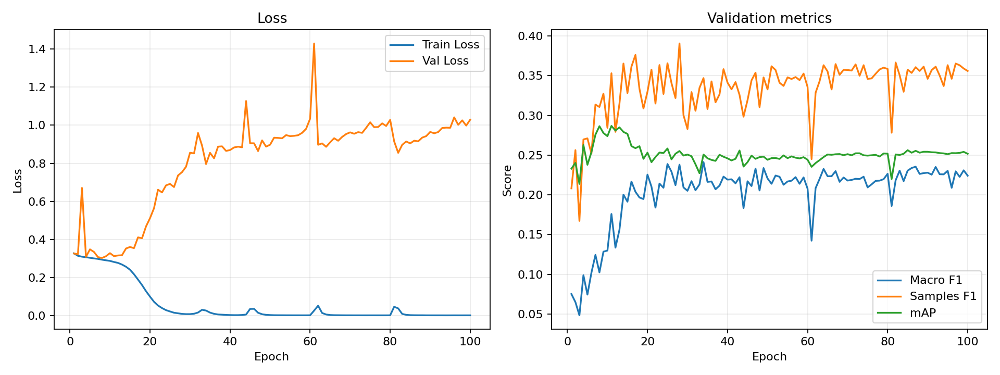

# ベースラインレポート

作成日: 2026-06-13

## 概要

本ベースラインは、AniList から取得したアニメ作品のカバー画像を入力として、19 種類のジャンルを同時に予測するマルチラベル画像分類モデルである。モデルは ResNet18 をベースにし、事前学習済み重みを使わず `weights=None` でスクラッチ学習している。

現行コードでは、`src/preprocessing/dataset_utils.py` が `data/series_split_outputs/` 以下のシリーズ単位分割済み CSV を読み込む。これにより、同一シリーズの作品が train / validation / test にまたがるリークを避ける設計になっている。

## データセット

対象ジャンルは次の 19 クラスである。

`Action`, `Adventure`, `Comedy`, `Drama`, `Ecchi`, `Fantasy`, `Hentai`, `Horror`, `Mahou Shoujo`, `Mecha`, `Music`, `Mystery`, `Psychological`, `Romance`, `Sci-Fi`, `Slice of Life`, `Sports`, `Supernatural`, `Thriller`

シリーズ単位分割の概要は次の通り。

| 項目 | 値 |
| --- | ---: |
| 入力データ数 | 11,199 |
| シリーズグループ数 | 6,447 |
| 複数作品を含むシリーズグループ数 | 1,748 |
| train | 8,957 |
| validation | 1,121 |
| test | 1,121 |
| リーク検査 | passed |

各 split の 1 作品あたり平均ジャンル数は次の通り。

| split | 平均ジャンル数 | 中央値 |
| --- | ---: | ---: |
| train | 2.478 | 2 |
| validation | 2.411 | 2 |
| test | 2.459 | 2 |

ジャンル頻度は大きく偏っている。全体では `Comedy` が 4,820 件で最も多く、`Action` が 3,083 件、`Fantasy` が 2,652 件と続く。一方で `Thriller` は 189 件、`Mahou Shoujo` は 328 件、`Horror` は 334 件にとどまる。この不均衡は Macro F1 が伸びにくい主要因の一つと考えられる。

## モデルと学習条件

実装の入口は `src/baseline_resnet/run_baseline.py` である。

| 項目 | 内容 |
| --- | --- |
| モデル | ResNet18 |
| 初期重み | 事前学習なし、`weights=None` |
| 出力 | 19 次元 logits |
| 入力画像 | 224 x 224 |
| 正規化 | ImageNet mean / std |
| 損失関数 | `BCEWithLogitsLoss` |
| optimizer | Adam |
| learning rate | 1e-3 |
| batch size | 64 |
| epoch 数 | 100 |
| checkpoint | validation loss が改善するたびに `resnet18_best.pth` を上書き保存 |

評価では logits が 0 より大きいかどうかを 0/1 予測に変換している。これは sigmoid 後に 0.5 をしきい値にすることと同値である。mAP はしきい値化せず、logit の順位情報から計算されている。

なお、`train.py` には `calculate_pos_weights` が定義されているが、現行の `run_baseline.py` では `BCEWithLogitsLoss` に `pos_weight` を渡していない。そのため、この学習結果はクラス不均衡を損失関数側では補正していない結果である。

## 検証結果

保存済みの `src/baseline_resnet/model/baseline_full_metrics.csv` には 100 epoch 分の validation 指標が記録されている。代表点は次の通り。

| 観点 | Epoch | Train Loss | Val Loss | Macro F1 | Samples F1 | Hamming Loss | mAP |
| --- | ---: | ---: | ---: | ---: | ---: | ---: | ---: |
| 初回 | 1 | 0.3264 | 0.3257 | 0.0751 | 0.2081 | 0.1240 | 0.2330 |
| Val Loss 最小 | 8 | 0.2932 | 0.3021 | 0.1024 | 0.3106 | 0.1193 | 0.2864 |
| mAP 最大 | 11 | 0.2812 | 0.3118 | 0.1759 | 0.3531 | 0.1237 | 0.2868 |
| Samples F1 最大 | 28 | 0.0082 | 0.7534 | 0.2379 | 0.3906 | 0.1484 | 0.2552 |
| Macro F1 最大 | 34 | 0.0258 | 0.7961 | 0.2413 | 0.3470 | 0.1513 | 0.2507 |
| 最終 | 100 | 0.0007 | 1.0294 | 0.2241 | 0.3559 | 0.1373 | 0.2516 |

`run_baseline.py` では、各 epoch の validation loss がそれまでの最小値を下回った場合に checkpoint を上書き保存する。そのため、学習終了後の `resnet18_best.pth` は、ログ上で validation loss が最小だった epoch 8 のモデルである。Macro F1 と Samples F1 はより後半の epoch で最大になるが、後半では train loss がほぼ 0 まで低下し、validation loss は大きく悪化しているため、汎化性能という観点では過学習が強い。

## 追加調査

追加調査は `playground/kazusa/baseline/analyze_baseline.py` で実施した。保存済み checkpoint `src/baseline_resnet/model/resnet18_best.pth`、つまり validation loss 最小 epoch 8 のモデルを読み込み、validation / test split に対して推論し、全体指標、ジャンル別指標、validation で最適化したクラス別しきい値、単純ベースライン比較、学習曲線を出力した。

出力先は `playground/kazusa/baseline/analysis/` である。

| ファイル | 内容 |
| --- | --- |
| `overall_model_metrics.csv` | validation / test の全体指標 |
| `genre_metrics_test_threshold_0.5.csv` | test におけるジャンル別指標、しきい値 0.5 |
| `genre_metrics_test_validation_optimized_thresholds.csv` | validation 最適しきい値を test に適用したジャンル別指標 |
| `optimized_thresholds_by_genre.csv` | validation F1 最大化で選んだジャンル別しきい値 |
| `simple_baseline_comparison_test.csv` | test 上の単純ベースライン比較 |
| `learning_curves.png` / `learning_curves.svg` | 100 epoch の学習曲線 |
| `analysis_summary.json` | 主要結果の JSON 要約 |

## Test 評価

best checkpoint を test split で評価した結果は次の通り。validation の値は、保存済みログと推論スクリプトの再計算が一致している。

| split | しきい値 | Macro F1 | Samples F1 | Hamming Loss | mAP | 予測ジャンル数/作品 |
| --- | --- | ---: | ---: | ---: | ---: | ---: |
| validation | 0.5 固定 | 0.1024 | 0.3106 | 0.1193 | 0.2864 | 0.847 |
| test | 0.5 固定 | 0.1133 | 0.3240 | 0.1180 | 0.2875 | 0.857 |

test の mAP は 0.2875 で、validation の 0.2864 とほぼ同じである。したがって、順位指標としては validation と test の差は小さい。一方で、0.5 固定しきい値では 1 作品あたり平均 0.857 ジャンルしか予測しておらず、実データの平均ジャンル数である約 2.46 よりかなり少ない。このため、Recall が不足しやすい設定になっている。

## ジャンル別指標

test split、しきい値 0.5 で F1 が高かったジャンルは次の通り。

| genre | support | predicted positive | Precision | Recall | F1 | AP |
| --- | ---: | ---: | ---: | ---: | ---: | ---: |
| Hentai | 144 | 84 | 0.9048 | 0.5278 | 0.6667 | 0.8066 |
| Comedy | 485 | 586 | 0.6075 | 0.7340 | 0.6648 | 0.6872 |
| Action | 326 | 221 | 0.6063 | 0.4110 | 0.4899 | 0.5933 |
| Slice of Life | 219 | 48 | 0.5417 | 0.1187 | 0.1948 | 0.4043 |

`Hentai`, `Comedy`, `Action` は比較的よく識別できている。特に `Hentai` は Precision 0.9048、AP 0.8066 と高く、画像特徴が他ジャンルより分離しやすい可能性がある。

一方で、しきい値 0.5 では 19 ジャンル中 10 ジャンルで陽性予測が 0 件だった。該当ジャンルは `Drama`, `Ecchi`, `Horror`, `Mecha`, `Music`, `Mystery`, `Psychological`, `Sports`, `Supernatural`, `Thriller` である。

| genre | support | predicted positive | F1 | AP |
| --- | ---: | ---: | ---: | ---: |
| Thriller | 15 | 0 | 0.0000 | 0.0549 |
| Horror | 25 | 0 | 0.0000 | 0.0972 |
| Music | 45 | 0 | 0.0000 | 0.0898 |
| Psychological | 48 | 0 | 0.0000 | 0.1196 |
| Mecha | 65 | 0 | 0.0000 | 0.2371 |
| Ecchi | 81 | 0 | 0.0000 | 0.2228 |
| Supernatural | 122 | 0 | 0.0000 | 0.2117 |

AP が 0 ではないジャンルでも、しきい値 0.5 を超えるサンプルがないため F1 が 0 になっている。この結果から、モデルのスコア順位には一部の情報があるが、出力確率の校正としきい値設定が不十分であることが分かる。

## 学習曲線



学習曲線では、train loss が一貫して下がり続ける一方、validation loss は epoch 8 で最小になった後に悪化している。mAP は epoch 11 で最大になり、その後はほぼ改善しない。Macro F1 は後半で上がるが、これは validation loss の悪化と同時に起きており、汎化性能の素直な改善とは見なしにくい。

この推移から、現行の 100 epoch 学習は長すぎる。validation loss または mAP を監視した early stopping を入れるなら、停止候補は epoch 8 から 11 付近になる。

## しきい値最適化

validation split 上で各ジャンルの F1 が最大になるしきい値を 0.05 から 0.95 の範囲で探索し、そのしきい値を test に適用した。結果は次の通り。

| split | しきい値 | Macro F1 | Samples F1 | Hamming Loss | mAP | 予測ジャンル数/作品 |
| --- | --- | ---: | ---: | ---: | ---: | ---: |
| validation | 0.5 固定 | 0.1024 | 0.3106 | 0.1193 | 0.2864 | 0.847 |
| validation | validation 最適 | 0.3473 | 0.4352 | 0.2147 | 0.2864 | 4.725 |
| test | 0.5 固定 | 0.1133 | 0.3240 | 0.1180 | 0.2875 | 0.857 |
| test | validation 最適 | 0.3252 | 0.4318 | 0.2178 | 0.2875 | 4.685 |

クラス別しきい値は低めに寄っており、中央値は 0.19、最小は 0.05、最大でも `Comedy` の 0.40 だった。しきい値を下げると test Macro F1 は 0.1133 から 0.3252、Samples F1 は 0.3240 から 0.4318 に上がる。しかし予測ジャンル数は 0.857 から 4.685 に増え、Hamming Loss も 0.1180 から 0.2178 に悪化する。

つまり、0.5 固定は conservative すぎて Recall 不足、validation 最適しきい値は aggressive すぎて陽性を出しすぎる。最終モデルでは、目的指標を先に決めた上で、クラス別しきい値または top-k 制約を設計する必要がある。

## 単純ベースライン比較

test split 上で、学習済みモデルと単純ベースラインを比較した。`always_top_2_train_genres` と `always_top_3_train_genres` は、train で頻度が高いジャンルを全作品に固定で付与する方法である。train の上位ジャンルは `Comedy`, `Action`, `Fantasy`, `Drama`, `Slice of Life` だった。

| method | Macro F1 | Samples F1 | Hamming Loss | mAP | 予測ジャンル数/作品 |
| --- | ---: | ---: | ---: | ---: | ---: |
| model, threshold 0.5 | 0.1133 | 0.3240 | 0.1180 | 0.2875 | 0.857 |
| always none | 0.0000 | 0.0000 | 0.1294 | 0.1294 | 0.000 |
| always top 2 train genres | 0.0555 | 0.3151 | 0.1585 | 0.1294 | 2.000 |
| always top 3 train genres | 0.0760 | 0.3341 | 0.1857 | 0.1294 | 3.000 |
| Bernoulli by train prevalence | 0.1292 | 0.1876 | 0.2045 | 0.1301 | 2.478 |

モデルは mAP と Hamming Loss では単純ベースラインを明確に上回る。Samples F1 は top 3 固定が 0.3341 でモデルの 0.3240 を少し上回るが、これは頻出ジャンルを広めに出すことで部分一致が増えているためであり、Hamming Loss と mAP は悪い。Bernoulli baseline は Macro F1 だけモデルを上回るが、ランダムに少数ジャンルも出すため Macro F1 が上がっているだけで、Samples F1、Hamming Loss、mAP は大きく劣る。

この比較から、モデルはランダムや頻度固定より有意な順位情報を持っているが、0.5 しきい値でのラベル選択が弱い、という結論になる。

## 考察

このベースラインは、画像からジャンルを直接推定する処理系が一通り動くことを確認する目的には十分である。シリーズ単位分割を使っているため、同一シリーズの画像特徴を検証・テストに漏らしにくい点も妥当である。

一方で、現状のスコアは実用的な分類器としてはまだ弱い。test Macro F1 は 0.1133、test mAP は 0.2875 であり、少数ジャンルを安定して拾えていない。validation での mAP も epoch 11 の 0.2868 が最大で、その後は改善していない。train loss が 0.001 未満まで下がる一方で validation loss が 1.0 前後まで悪化しているため、モデル容量に対して正則化・データ拡張・早期終了が不足している。

また、評価の 0.5 固定しきい値はクラスごとの出現率差を考慮していない。ランキング指標である mAP が序盤で最大になり、F1 系指標が後半で最大になる動きから、スコアの順位品質としきい値後の 0/1 判定が一致していない可能性がある。

## 現状の限界

- 現行の学習スクリプト本体は validation 指標のみを記録する。test 評価とジャンル別分析は追加スクリプトで後処理として実施している。
- ResNet18 をスクラッチ学習しているため、データ量に対して表現学習の負荷が高い。
- `pos_weight`、focal loss、class-balanced loss などの不均衡対策は現行学習では使われていない。
- データ拡張、weight decay、learning rate scheduler、early stopping が入っていない。
- 0.5 固定しきい値は Recall 不足を招き、validation F1 最適しきい値は陽性を出しすぎる。最終的なラベル選択戦略は未確定である。

## 次に行うべき改善

1. ImageNet 事前学習済み ResNet18 または ResNet50 を使い、スクラッチ学習との差分を比較する。
2. `pos_weight` または class-balanced loss を有効化し、少数ジャンルの Recall と Macro F1 を確認する。
3. RandomResizedCrop、HorizontalFlip、ColorJitter などの軽い画像拡張を追加する。
4. validation loss または mAP による early stopping を導入し、過学習が始まる前に学習を止める。
5. クラス別しきい値だけでなく、1 作品あたりの予測数を制御する top-k または dynamic threshold を検討する。
6. ジャンル別 AP / F1 を継続して出力し、改善対象を `Thriller`, `Horror`, `Music`, `Psychological`, `Sports`, `Mystery` などに絞って確認する。

## 再現コマンド

```bash
# ベースライン学習
uv run python src/baseline_resnet/run_baseline.py

# メトリクス確認
cat src/baseline_resnet/model/baseline_full_metrics.csv

# 追加調査
.venv/bin/python playground/kazusa/baseline/analyze_baseline.py
```

主な成果物は次の通り。

| ファイル | 内容 |
| --- | --- |
| `src/baseline_resnet/model/resnet18_best.pth` | validation loss が改善するたびに保存され、最終的に epoch 8 の重みが残った checkpoint |
| `src/baseline_resnet/model/baseline_full_metrics.csv` | 100 epoch 分の train / validation 指標 |
| `data/series_split_outputs/*.csv` | 現行ベースラインが読み込むシリーズ単位分割データ |
| `playground/kazusa/baseline/analyze_baseline.py` | 追加調査用スクリプト |
| `playground/kazusa/baseline/analysis/` | 追加調査の CSV、JSON、学習曲線 |
