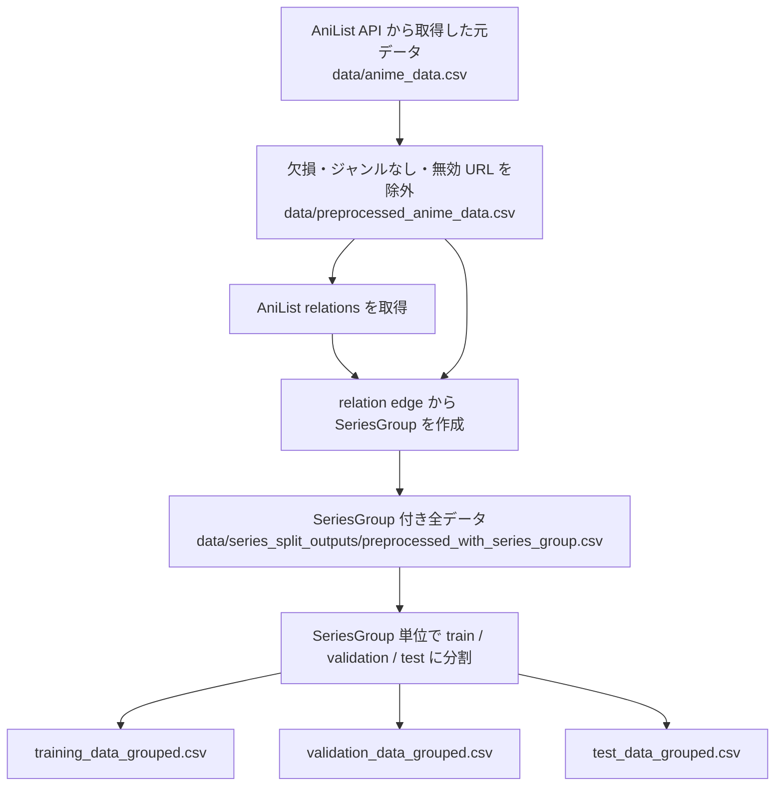
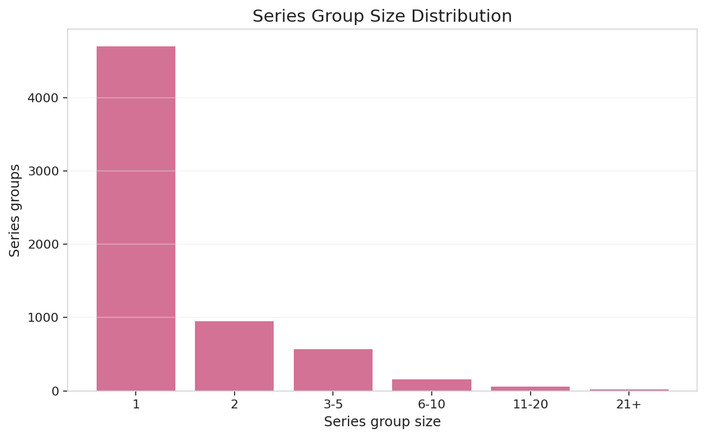
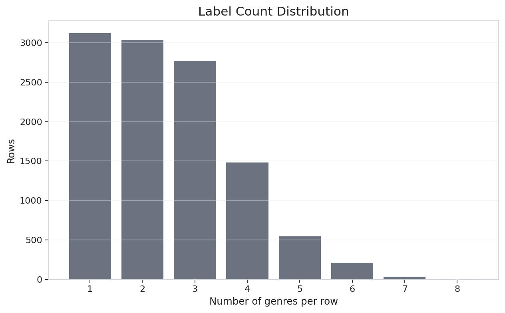
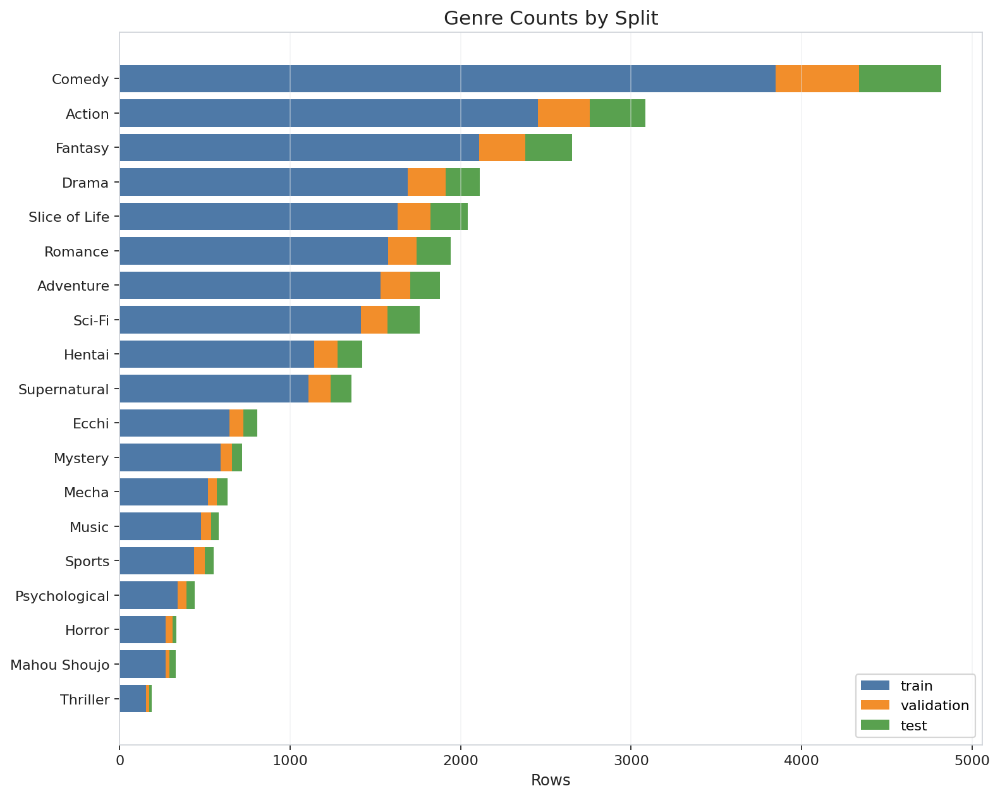
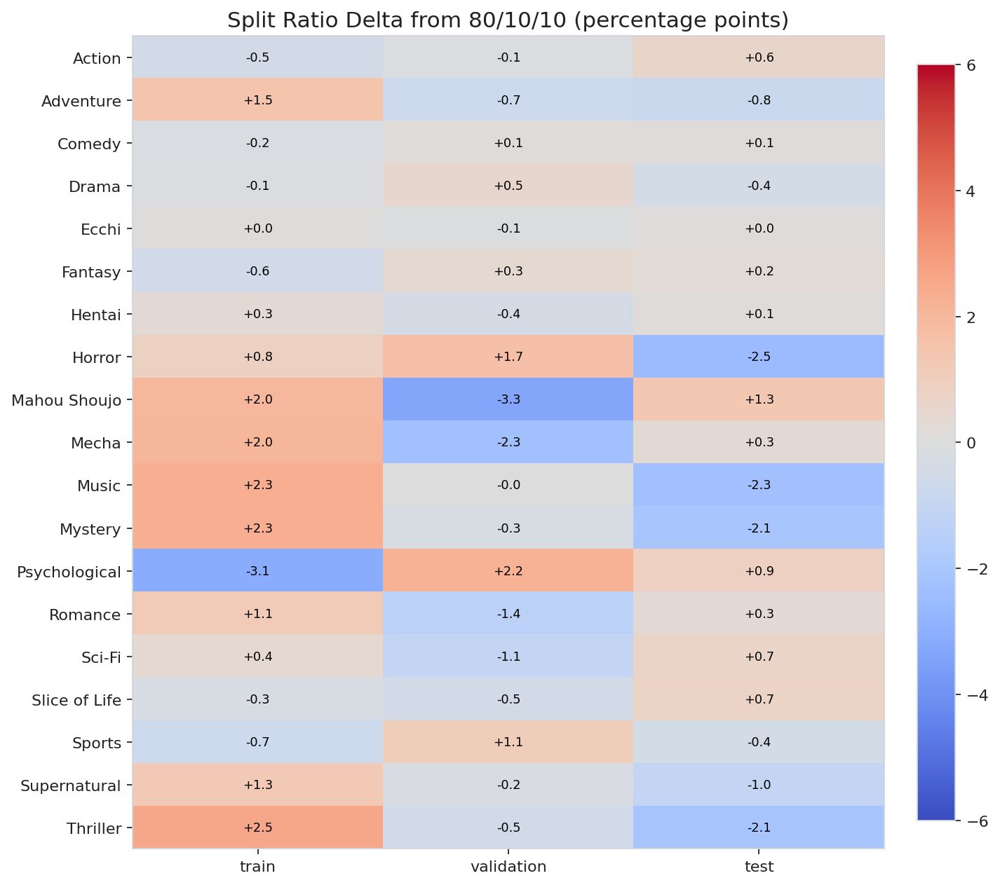
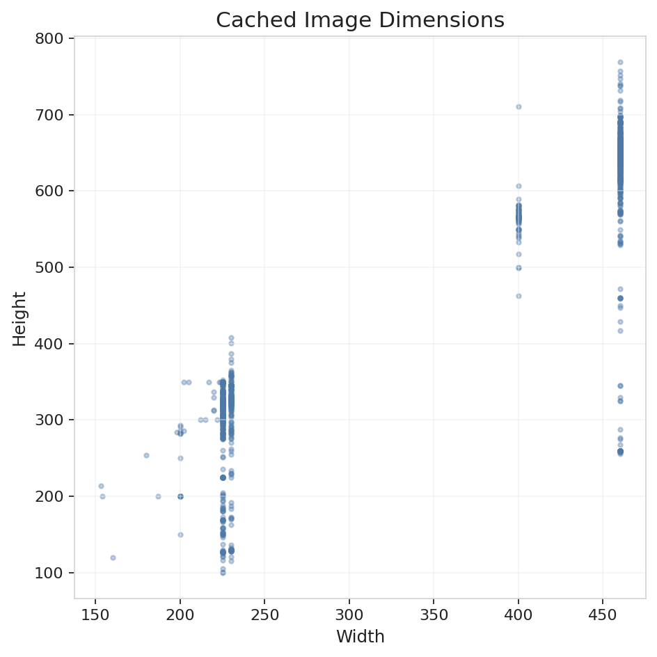

# シリーズ単位分割データセットレポート

作成日: 2026-06-13

このレポートは、`data/series_split_outputs/` に入っている成果物を対象にしたデータセット報告である。`playground/kazusa/series_split/outputs/` にも作業用の出力があるが、このレポートでは扱わない。

現行のベースライン学習コード `src/preprocessing/dataset_utils.py` は、`data/series_split_outputs/training_data_grouped.csv`、`validation_data_grouped.csv`、`test_data_grouped.csv` を読み込む。そのため、モデル評価で使われる正式な分割は `data/series_split_outputs/` 側である。

## 要約

このデータセットは、AniList 由来のアニメ作品データに対して、同一シリーズが train / validation / test にまたがらないように分割したものである。全体では 11,199 件の作品があり、6,447 個のシリーズグループにまとまっている。

| 項目 | 値 |
| --- | ---: |
| 作品数 | 11,199 |
| ユニーク ID 数 | 11,199 |
| ジャンル数 | 19 |
| シリーズグループ数 | 6,447 |
| 複数作品を含むシリーズグループ数 | 1,748 |
| 最大シリーズグループの作品数 | 67 |
| relation edges total | 14,804 |
| relation edges inside dataset | 12,539 |
| relation edges used for grouping | 10,502 |
| リーク検査 | passed |

ID の重複はなく、`Title` と `ImageUrl` の欠損も 0 件である。各作品には少なくとも 1 つのジャンルが付いている。

## 成果物

`data/series_split_outputs/` には次のファイルがある。

| ファイル | 内容 |
| --- | --- |
| `preprocessed_with_series_group.csv` | 分割前の全作品に `SeriesGroup` 列を追加した CSV |
| `training_data_grouped.csv` | 学習用データ |
| `validation_data_grouped.csv` | 検証用データ |
| `test_data_grouped.csv` | テスト用データ |
| `anilist_relation_edges.csv` | AniList relations から得た作品間 edge の一覧 |
| `anilist_relations_cache.json` | AniList relations の取得結果キャッシュ |
| `split_summary.md` | 分割結果の要約 |
| `split_summary.json` | 分割結果の機械可読な要約 |

各 CSV は、`ID`, `Title`, `ImageUrl`, 19 個のジャンル列、`SeriesGroup` を持つ。ジャンル列は one-hot 形式で、該当ジャンルなら 1、そうでなければ 0 である。

## 追加分析の成果物

このレポートの追加分析は `playground/kazusa/series_split/analyze_dataset.py` で生成した。出力先は `playground/kazusa/series_split/analysis/` である。

| ファイル | 内容 |
| --- | --- |
| `dataset_analysis_summary.json` | 追加分析の主要結果 |
| `genre_distribution_from_data_outputs.csv` | `data/series_split_outputs` から再集計したジャンル分布 |
| `label_count_distribution.csv` | 1作品あたりジャンル数の分布 |
| `series_group_size_distribution.csv` | SeriesGroup サイズ分布 |
| `relation_type_distribution.csv` | relation type ごとの edge 数 |
| `legacy_split_pair_leakage.csv` | 旧 split CSV の SeriesGroup 重複比較 |
| `legacy_split_leakage_examples.csv` | 旧 split で複数 split にまたがるシリーズ例 |
| `image_file_check.csv` | `data/images` の画像存在・読み込み確認 |
| `*.png` / `*.svg` | レポート用の可視化 |

再生成コマンドは次の通りである。

```bash
.venv/bin/python playground/kazusa/series_split/analyze_dataset.py
```

## データ作成フロー

データ作成の流れは次の通りである。



重要なのは、分割の単位が行ではなく `SeriesGroup` である点である。同じ `SeriesGroup` に属する作品は、必ず同じ split に入る。

## 分割比率

目標比率は train / validation / test = 80% / 10% / 10% である。実際の行数はほぼ目標通りになっている。

| split | rows | row ratio | series groups | 平均ジャンル数 | ジャンル数中央値 |
| --- | ---: | ---: | ---: | ---: | ---: |
| train | 8,957 | 0.7998 | 5,153 | 2.478 | 2 |
| validation | 1,121 | 0.1001 | 617 | 2.411 | 2 |
| test | 1,121 | 0.1001 | 677 | 2.459 | 2 |

train / validation / test の `SeriesGroup` の重複はすべて 0 件である。

| 比較 | 重複 SeriesGroup 数 |
| --- | ---: |
| train vs validation | 0 |
| train vs test | 0 |
| validation vs test | 0 |

このため、同じシリーズが複数 split にまたがるシリーズリークは検出されていない。

## なぜシリーズ単位で分割するのか

通常のランダム分割では、同じシリーズの作品が train と test に分かれる可能性がある。例えば、あるシリーズの第 1 期が train、第 2 期が test に入ると、キャラクター、構図、ロゴ、画風などが似ているため、モデルが本当にジャンルを理解していなくても test で良いスコアが出る可能性がある。

この問題を避けるために、AniList の relations を使って作品同士をつなぎ、同じ系列と判断された作品を同じ `SeriesGroup` にまとめている。そのうえで、`SeriesGroup` 単位で train / validation / test に割り当てている。

## SeriesGroup 作成アルゴリズム

SeriesGroup は、作品をノード、AniList relation を edge とするグラフとして考えると分かりやすい。例えば、A が B の `SEQUEL`、B が C の `SIDE_STORY` なら、A, B, C は同じつながりの中にあるため、同じシリーズグループとして扱う。

実装では Union-Find を使っている。Union-Find は、「2 つの要素を同じグループにまとめる」「ある要素がどのグループに属しているか調べる」処理を効率よく行うデータ構造である。

処理の流れは次の通りである。

1. 各作品 ID を最初は 1 作品だけのグループとして初期化する。
2. AniList relations から relation edge を取得する。
3. グループ化対象の relation type なら、source と target を union する。
4. 最終的に同じ連結成分に入った作品へ同じ `SeriesGroup` を付ける。
5. `SeriesGroup` 単位で train / validation / test に割り当てる。

この方法により、直接つながっている作品だけでなく、relation をたどって間接的につながる作品も同じグループになる。

## シリーズグループの規模

6,447 個のシリーズグループのうち、4,699 個は 1 作品だけのグループである。一方で、複数作品を含むグループも 1,748 個あり、最大グループは 67 作品を含む。

| group size | groups | rows |
| --- | ---: | ---: |
| 1 | 4,699 | 4,699 |
| 2 | 949 | 1,898 |
| 3-5 | 566 | 2,034 |
| 6-10 | 155 | 1,167 |
| 11-20 | 60 | 834 |
| 21+ | 18 | 567 |

大きいシリーズグループは分割比率やジャンル分布に影響しやすい。例えば、1 つの大きいシリーズが test に入ると、そのシリーズが持つジャンルも test に多く寄る。このため、シリーズリークを防ぐ分割では、完全なジャンル比率の一致よりもリーク防止を優先している。



## relation edge の内訳

AniList relations から 14,804 本の edge が得られ、そのうち 10,502 本がグループ化に使われている。

| relation_type | total edges | used for grouping |
| --- | ---: | ---: |
| SEQUEL | 2,885 | 2,687 |
| PREQUEL | 2,853 | 2,684 |
| PARENT | 2,417 | 1,987 |
| ALTERNATIVE | 1,724 | 1,421 |
| CHARACTER | 1,674 | 0 |
| SIDE_STORY | 1,514 | 1,396 |
| OTHER | 1,371 | 0 |
| SPIN_OFF | 193 | 170 |
| SUMMARY | 168 | 157 |
| ADAPTATION | 5 | 0 |

`CHARACTER`, `OTHER`, `ADAPTATION` はグループ化には使われていない。これらを使うと、キャラクターつながりや広い関連作品まで同じグループに入り、グループが過度に大きくなる可能性があるためである。

`SEQUEL`, `PREQUEL`, `PARENT`, `ALTERNATIVE`, `SIDE_STORY`, `SPIN_OFF`, `SUMMARY` は、同一シリーズまたは強い派生関係として扱いやすいためグループ化に使っている。一方で `CHARACTER` や `OTHER` は関係が広すぎることがあり、ジャンル分類の評価で必要以上に大きなグループを作る恐れがある。

## ジャンル数の分布

1 作品に付いているジャンル数は、全体平均で約 2.47 個である。中央値は 2 個であり、多くの作品は 1 から 3 個のジャンルを持つ。

| 1作品あたりのジャンル数 | all | train | validation | test |
| --- | ---: | ---: | ---: | ---: |
| 1 | 3,121 | 2,470 | 321 | 330 |
| 2 | 3,037 | 2,416 | 323 | 298 |
| 3 | 2,770 | 2,232 | 286 | 252 |
| 4 | 1,482 | 1,218 | 107 | 157 |
| 5 | 547 | 428 | 59 | 60 |
| 6 | 208 | 165 | 21 | 22 |
| 7 | 32 | 27 | 3 | 2 |
| 8 | 2 | 1 | 1 | 0 |

この分布から、今回のタスクは「ほとんどの作品に 2 から 3 個程度のジャンルが付く」マルチラベル分類であると分かる。



## ジャンル分布

ジャンルごとの件数は大きく偏っている。最多の `Comedy` は 4,820 件、最少の `Thriller` は 189 件であり、件数比は約 25.5 倍である。

| genre | total | 全体割合 | train | validation | test |
| --- | ---: | ---: | ---: | ---: | ---: |
| Action | 3,083 | 27.53% | 2,452 | 305 | 326 |
| Adventure | 1,878 | 16.77% | 1,530 | 175 | 173 |
| Comedy | 4,820 | 43.04% | 3,848 | 487 | 485 |
| Drama | 2,114 | 18.88% | 1,689 | 222 | 203 |
| Ecchi | 806 | 7.20% | 645 | 80 | 81 |
| Fantasy | 2,652 | 23.68% | 2,107 | 274 | 271 |
| Hentai | 1,423 | 12.71% | 1,142 | 137 | 144 |
| Horror | 334 | 2.98% | 270 | 39 | 25 |
| Mahou Shoujo | 328 | 2.93% | 269 | 22 | 37 |
| Mecha | 634 | 5.66% | 520 | 49 | 65 |
| Music | 582 | 5.20% | 479 | 58 | 45 |
| Mystery | 718 | 6.41% | 591 | 70 | 57 |
| Psychological | 441 | 3.94% | 339 | 54 | 48 |
| Romance | 1,940 | 17.32% | 1,574 | 167 | 199 |
| Sci-Fi | 1,759 | 15.71% | 1,414 | 157 | 188 |
| Slice of Life | 2,043 | 18.24% | 1,629 | 195 | 219 |
| Sports | 551 | 4.92% | 437 | 61 | 53 |
| Supernatural | 1,361 | 12.15% | 1,106 | 133 | 122 |
| Thriller | 189 | 1.69% | 156 | 18 | 15 |

特に少ないジャンルは `Thriller`, `Mahou Shoujo`, `Horror`, `Psychological`, `Sports` である。これらは validation / test に入る件数も少ないため、評価指標が不安定になりやすい。



## split 間のジャンル比率

各ジャンルについて、全件数のうち train / validation / test に何割入ったかを見ると、おおむね 80% / 10% / 10% に近い。ただし、少数ジャンルではシリーズ単位分割の影響でずれが出やすい。

| genre | train | validation | test |
| --- | ---: | ---: | ---: |
| Action | 0.7953 | 0.0989 | 0.1057 |
| Adventure | 0.8147 | 0.0932 | 0.0921 |
| Comedy | 0.7983 | 0.1010 | 0.1006 |
| Drama | 0.7990 | 0.1050 | 0.0960 |
| Ecchi | 0.8002 | 0.0993 | 0.1005 |
| Fantasy | 0.7945 | 0.1033 | 0.1022 |
| Hentai | 0.8025 | 0.0963 | 0.1012 |
| Horror | 0.8084 | 0.1168 | 0.0749 |
| Mahou Shoujo | 0.8201 | 0.0671 | 0.1128 |
| Mecha | 0.8202 | 0.0773 | 0.1025 |
| Music | 0.8230 | 0.0997 | 0.0773 |
| Mystery | 0.8231 | 0.0975 | 0.0794 |
| Psychological | 0.7687 | 0.1224 | 0.1088 |
| Romance | 0.8113 | 0.0861 | 0.1026 |
| Sci-Fi | 0.8039 | 0.0893 | 0.1069 |
| Slice of Life | 0.7974 | 0.0954 | 0.1072 |
| Sports | 0.7931 | 0.1107 | 0.0962 |
| Supernatural | 0.8126 | 0.0977 | 0.0896 |
| Thriller | 0.8254 | 0.0952 | 0.0794 |

`Psychological` は train が 76.87% と低めで、validation と test にやや多く入っている。`Mahou Shoujo`, `Mecha`, `Music`, `Mystery`, `Thriller` は validation または test の比率が 10% からやや外れている。これは、対象件数が少ないことと、シリーズ単位でまとめて割り当てていることが主な理由である。

次のヒートマップは、各ジャンルの split 比率が目標の 80% / 10% / 10% から何 percentage points ずれているかを示す。



## 旧ランダム分割との比較

比較のため、旧 split CSV である `data/training_data.csv`, `data/validation_data.csv`, `data/test_data.csv` に対して、現在の `SeriesGroup` を対応付けて重複を調べた。これらはシリーズ単位分割ではないため、同じ `SeriesGroup` が複数 split にまたがる。

| 比較 | 重複 SeriesGroup 数 | 左 split の重複行数 | 右 split の重複行数 | 合計重複行数 |
| --- | ---: | ---: | ---: | ---: |
| train vs validation | 502 | 1,961 | 624 | 2,585 |
| train vs test | 468 | 2,020 | 588 | 2,608 |
| validation vs test | 169 | 252 | 247 | 499 |

旧 split では、各 split のうち次の行数が「他 split にも同じ SeriesGroup が存在するグループ」に属していた。

| split | rows | series groups | rows in any leaked group |
| --- | ---: | ---: | ---: |
| train | 8,924 | 5,456 | 2,872 |
| validation | 1,116 | 986 | 652 |
| test | 1,116 | 979 | 617 |

代表例として、`series_1121` は旧 split では train 53 件、validation 10 件、test 4 件に分かれていた。これはポケモン系列の大きいグループである。同様に、プリキュア、アイドルマスター、Fate、ラブライブ、NARUTO などの大きいシリーズも旧 split では複数 split にまたがっていた。

この比較から、シリーズ単位分割を導入する意義は大きい。旧 split では、test に出てくるシリーズとよく似た作品を train で見ている可能性が高く、評価が楽観的になりやすい。一方、現在の `data/series_split_outputs` では、SeriesGroup 重複が 0 件である。

## 画像ファイルの品質確認

`data/series_split_outputs/preprocessed_with_series_group.csv` に含まれる 11,199 件について、`data/images/{ID}.jpg` の存在と読み込み可否を確認した。

| 項目 | 値 |
| --- | ---: |
| 期待画像数 | 11,199 |
| 存在する画像数 | 11,199 |
| 欠損画像数 | 0 |
| 読み込み可能画像数 | 11,199 |
| 読み込み不可画像数 | 0 |
| 画像フォーマット | JPEG 11,199 件 |
| 画像モード | RGB 11,199 件 |

画像サイズは、幅の中央値が 460 px、高さの中央値が 640 px である。最小幅は 147 px、最大幅は 460 px、最小高さは 99 px、最大高さは 821 px だった。学習時にはこれらを 224 x 224 にリサイズして ResNet18 に入力する。



## ベースライン学習への影響

このデータセットには、モデル学習に影響する特徴がいくつかある。

1. ジャンル不均衡が大きい  
   `Comedy` は 4,820 件ある一方、`Thriller` は 189 件しかない。何も対策しないと、モデルは頻出ジャンルを優先して学習しやすい。

2. 少数ジャンルの validation / test 件数が少ない  
   例えば `Thriller` は validation 18 件、test 15 件である。このようなジャンルでは、数件の予測の違いで Recall や F1 が大きく変わる。

3. 1 作品あたり複数ジャンルが付く  
   平均ジャンル数は約 2.47 個である。したがって、単純な 1 クラス分類ではなく、19 ジャンルを同時に判定するマルチラベル分類として扱う必要がある。

4. シリーズリークは避けられている  
   train / validation / test の `SeriesGroup` 重複は 0 件である。ランダム分割より評価は厳しくなるが、未知シリーズへの汎化性能を見やすい。

5. 完全なジャンル層化ではない  
   シリーズ単位で割り当てるため、全ジャンルを完全に 80% / 10% / 10% にそろえることは難しい。特に少数ジャンルでは多少の偏りが残る。

6. 旧ランダム分割より評価が厳しい  
   旧 split では同じ SeriesGroup が複数 split にまたがっていた。現在の分割ではこれを防いでいるため、モデルは未知シリーズに対して評価されやすい。

7. 画像キャッシュはそろっている  
   対象 11,199 件すべてについて `data/images/{ID}.jpg` が存在し、PIL で読み込めることを確認した。少なくとも現時点では、画像欠損による学習・評価エラーのリスクは低い。

## 注意点

- このレポートの対象は `data/series_split_outputs/` である。`playground/kazusa/series_split/outputs/` は作業用出力であり、件数が異なる可能性がある。
- `anilist_relation_edges.csv` に含まれる relation は AniList から取得できたものに限られる。AniList 側に relation が登録されていない関連作品は同じグループにまとまらない可能性がある。
- `CHARACTER` や `OTHER` をグループ化に使っていないため、広い意味で関連する作品が別グループになる場合がある。一方で、これらを含めるとグループが広がりすぎる可能性がある。
- split は行数比率とジャンル分布の近さを考慮しているが、最優先はシリーズリークを避けることである。

## 参照ファイル

| ファイル | 用途 |
| --- | --- |
| `data/series_split_outputs/split_summary.md` | 分割結果の元サマリ |
| `data/series_split_outputs/preprocessed_with_series_group.csv` | 全作品と `SeriesGroup` の確認 |
| `data/series_split_outputs/training_data_grouped.csv` | ベースライン学習用 train split |
| `data/series_split_outputs/validation_data_grouped.csv` | validation split |
| `data/series_split_outputs/test_data_grouped.csv` | test split |
| `data/series_split_outputs/anilist_relation_edges.csv` | グループ化に使った relation edge の確認 |
| `playground/kazusa/series_split/analyze_dataset.py` | 追加分析スクリプト |
| `playground/kazusa/series_split/analysis/` | 追加分析の CSV、JSON、図 |
